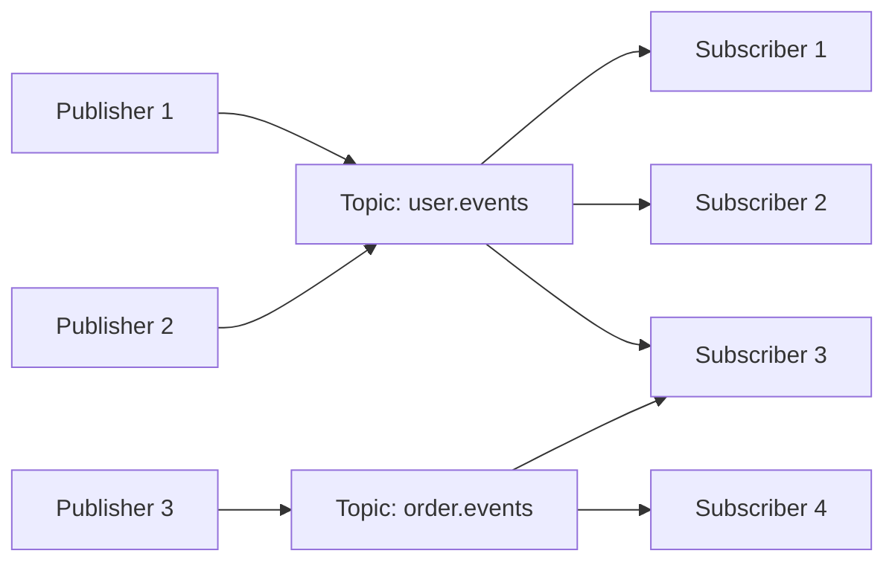

# Publish-Subscribe (Pub/Sub) Pattern

## Overview

The Publish-Subscribe pattern is a messaging paradigm where **publishers** send messages to **topics** without knowing who will receive them, and **subscribers** receive messages from topics they're interested in without knowing who sent them.

**Key Principle:** Decoupling through topics/channels

```
Publisher (doesn't know subscribers)
    ↓
  Topic
    ↓
Subscribers (don't know publisher)
```

---

## Core Concepts

### 1. Publishers
- Produce messages/events
- Send to topics (not directly to subscribers)
- Don't know who will receive messages
- Stateless - fire and forget

### 2. Topics
- Named channels for messages
- Filter/category for events
- Can have multiple publishers
- Can have multiple subscribers

### 3. Subscribers
- Register interest in specific topics
- Receive all messages from subscribed topics
- Can subscribe to multiple topics
- Each subscriber gets own copy of message

---

## How Pub/Sub Works

### Basic Flow



**Example:**
```python
# Publisher
pubsub.publish('user.events', {
    'event': 'user_signup',
    'user_id': '12345',
    'email': 'alice@example.com'
})

# Subscriber 1: Email Service
@subscribe('user.events')
def send_welcome_email(message):
    if message['event'] == 'user_signup':
        send_email(message['email'], 'Welcome!')

# Subscriber 2: Analytics
@subscribe('user.events')
def track_event(message):
    analytics.track(message['event'], message)

# Subscriber 3: CRM
@subscribe('user.events')
def update_crm(message):
    if message['event'] == 'user_signup':
        crm.create_customer(message)
```

---

## Pub/Sub vs Point-to-Point

| Aspect | Pub/Sub | Point-to-Point (Queue) |
|--------|---------|------------------------|
| **Recipients** | Multiple (1-to-many) | Single (1-to-1) |
| **Message copies** | Each subscriber gets copy | Message consumed once |
| **Coupling** | Loose (via topics) | Tighter (direct queue) |
| **Use case** | Broadcasting, events | Task processing |
| **Delivery** | Push to all subscribers | Pull by single consumer |

**Visual Comparison:**

```
Pub/Sub:
Publisher → [Topic] → Subscriber A (gets copy)
                   → Subscriber B (gets copy)
                   → Subscriber C (gets copy)

Point-to-Point:
Producer → [Queue] → Consumer A or B or C (one gets it)
```

---

## Message Filtering

### Topic-Based Filtering

```python
# Hierarchical topics
pubsub.publish('orders.created', {...})
pubsub.publish('orders.shipped', {...})
pubsub.publish('orders.cancelled', {...})

# Subscribe to all order events
@subscribe('orders.*')
def handle_all_orders(message):
    print(f"Order event: {message}")

# Subscribe to only created events
@subscribe('orders.created')
def handle_new_orders(message):
    process_new_order(message)
```

### Content-Based Filtering

```python
# Subscribe with filter
@subscribe('orders', filter={
    'amount': {'$gt': 1000},  # Only high-value orders
    'status': 'pending'
})
def handle_high_value_orders(message):
    print(f"High value order: {message}")

# AWS SNS example
subscription.set_filter_policy({
    'price': [{'numeric': ['>', 100]}],
    'region': ['US', 'EU']
})
```

---

## Common Patterns

### 1. Fan-Out Pattern

Broadcast one message to multiple services.

```
Event Source → [Topic] → Service A
                      → Service B
                      → Service C
                      → Service D
```

**Example: User Signup**
```python
# Publisher (Auth Service)
auth.publish('user.signup', {
    'user_id': '123',
    'email': 'alice@example.com',
    'name': 'Alice'
})

# Subscriber 1: Email Service
@subscribe('user.signup')
def send_welcome_email(event):
    email.send(event['email'], 'Welcome to our platform!')

# Subscriber 2: Analytics
@subscribe('user.signup')
def track_signup(event):
    analytics.track('user_signup', event)

# Subscriber 3: CRM
@subscribe('user.signup')
def create_customer(event):
    crm.create_customer(event)

# Subscriber 4: Notifications
@subscribe('user.signup')
def notify_sales_team(event):
    slack.send(f"New user: {event['name']}")
```

### 2. Event Notification

Notify interested parties of state changes.

```python
# Order state machine
class OrderService:
    def create_order(self, order_data):
        order = Order.create(order_data)
        pubsub.publish('order.created', order.to_dict())

    def ship_order(self, order_id):
        order = Order.find(order_id)
        order.status = 'shipped'
        order.save()
        pubsub.publish('order.shipped', {
            'order_id': order.id,
            'tracking_number': order.tracking_number
        })

# Subscribers
@subscribe('order.shipped')
def send_shipping_notification(event):
    user = User.find_by_order(event['order_id'])
    email.send(user.email, f"Your order has shipped! Tracking: {event['tracking_number']}")

@subscribe('order.shipped')
def update_inventory(event):
    # Mark items as shipped in inventory
    inventory.mark_shipped(event['order_id'])
```

### 3. Event Streaming

Continuous flow of events for real-time processing.

```python
# Stream of user activity events
activity_stream.publish('user.activity', {
    'user_id': '123',
    'action': 'page_view',
    'page': '/products/laptop',
    'timestamp': now()
})

# Real-time analytics
@subscribe('user.activity')
def update_realtime_dashboard(event):
    redis.incr(f"page_views:{event['page']}")
    redis.sadd(f"active_users:{today()}", event['user_id'])

# Recommendation engine
@subscribe('user.activity')
def update_recommendations(event):
    if event['action'] == 'page_view':
        recommendation_engine.record_interest(
            event['user_id'],
            event['page']
        )
```

### 4. Work Queue Distribution

Distribute work across multiple workers (hybrid with queue).

```python
# Publisher publishes tasks
for task in tasks:
    pubsub.publish('tasks.image_resize', {
        'image_url': task.url,
        'sizes': [100, 200, 500]
    })

# Multiple workers subscribe
# Worker 1, 2, 3, ... all receive copy
@subscribe('tasks.image_resize')
def resize_image(task):
    # Each worker processes all tasks (not ideal!)
    # Better to use queue for this use case
    pass
```

**Note:** For work distribution, use **queues** (point-to-point) instead of pub/sub.

---

## Implementation Examples

### Google Cloud Pub/Sub

```python
from google.cloud import pubsub_v1
import json

# Publisher
publisher = pubsub_v1.PublisherClient()
topic_path = publisher.topic_path('my-project', 'user-events')

# Publish message
message_data = json.dumps({
    'user_id': '123',
    'event': 'signup'
}).encode('utf-8')

future = publisher.publish(topic_path, message_data, origin='web')
print(f"Published message ID: {future.result()}")

# Subscriber
subscriber = pubsub_v1.SubscriberClient()
subscription_path = subscriber.subscription_path('my-project', 'email-service-sub')

def callback(message):
    data = json.loads(message.data.decode('utf-8'))
    print(f"Received: {data}")

    # Process message
    send_welcome_email(data)

    # Acknowledge
    message.ack()

# Subscribe
streaming_pull_future = subscriber.subscribe(subscription_path, callback=callback)
print(f"Listening for messages on {subscription_path}")

try:
    streaming_pull_future.result()
except KeyboardInterrupt:
    streaming_pull_future.cancel()
```

### AWS SNS + SQS

```python
import boto3
import json

sns = boto3.client('sns')
sqs = boto3.client('sqs')

# Create topic
topic_response = sns.create_topic(Name='user-events')
topic_arn = topic_response['TopicArn']

# Create SQS queues for different services
email_queue = sqs.create_queue(QueueName='email-service-queue')
analytics_queue = sqs.create_queue(QueueName='analytics-queue')

# Subscribe queues to topic
sns.subscribe(
    TopicArn=topic_arn,
    Protocol='sqs',
    Endpoint=email_queue['QueueArn']
)

sns.subscribe(
    TopicArn=topic_arn,
    Protocol='sqs',
    Endpoint=analytics_queue['QueueArn']
)

# Publish event
sns.publish(
    TopicArn=topic_arn,
    Message=json.dumps({
        'user_id': '123',
        'event': 'signup',
        'email': 'alice@example.com'
    }),
    Subject='User Signup Event'
)

# Email Service (subscriber)
while True:
    messages = sqs.receive_message(
        QueueUrl=email_queue['QueueUrl'],
        MaxNumberOfMessages=10
    )

    for message in messages.get('Messages', []):
        body = json.loads(message['Body'])
        sns_message = json.loads(body['Message'])

        # Process
        send_welcome_email(sns_message)

        # Delete
        sqs.delete_message(
            QueueUrl=email_queue['QueueUrl'],
            ReceiptHandle=message['ReceiptHandle']
        )
```

### Redis Pub/Sub

```python
import redis
import json
import threading

r = redis.Redis(host='localhost', port=6379)

# Publisher
def publish_events():
    for i in range(10):
        event = {
            'user_id': f'user_{i}',
            'event': 'signup',
            'timestamp': time.time()
        }
        r.publish('user-events', json.dumps(event))
        time.sleep(1)

# Subscriber
def subscribe_to_events():
    pubsub = r.pubsub()
    pubsub.subscribe('user-events')

    for message in pubsub.listen():
        if message['type'] == 'message':
            data = json.loads(message['data'])
            print(f"Received: {data}")

# Run
publisher_thread = threading.Thread(target=publish_events)
subscriber_thread = threading.Thread(target=subscribe_to_events)

subscriber_thread.start()
time.sleep(0.5)
publisher_thread.start()

publisher_thread.join()
subscriber_thread.join()
```

### Apache Kafka (Topic-Based)

```python
from kafka import KafkaProducer, KafkaConsumer
import json

# Producer
producer = KafkaProducer(
    bootstrap_servers=['localhost:9092'],
    value_serializer=lambda v: json.dumps(v).encode('utf-8')
)

producer.send('user-events', {
    'user_id': '123',
    'event': 'signup'
})
producer.flush()

# Consumer 1: Email Service
email_consumer = KafkaConsumer(
    'user-events',
    bootstrap_servers=['localhost:9092'],
    group_id='email-service',
    value_deserializer=lambda m: json.loads(m.decode('utf-8'))
)

for message in email_consumer:
    send_welcome_email(message.value)

# Consumer 2: Analytics (same topic, different group)
analytics_consumer = KafkaConsumer(
    'user-events',
    bootstrap_servers=['localhost:9092'],
    group_id='analytics',
    value_deserializer=lambda m: json.loads(m.decode('utf-8'))
)

for message in analytics_consumer:
    track_event(message.value)
```

---

## Message Ordering

### Unordered (Default)
```python
# Messages may arrive in any order
pubsub.publish('events', {'id': 1, 'data': 'A'})
pubsub.publish('events', {'id': 2, 'data': 'B'})
pubsub.publish('events', {'id': 3, 'data': 'C'})

# Subscriber might receive: C, A, B (out of order)
```

### Ordered (By Partition/Key)
```python
# Kafka example: Same key goes to same partition (ordered)
producer.send('events', key='user-123', value={'action': 'login'})
producer.send('events', key='user-123', value={'action': 'purchase'})
producer.send('events', key='user-123', value={'action': 'logout'})

# All events for 'user-123' are ordered
# Events for different users may be out of order relative to each other
```

---

## Delivery Guarantees

### At-Most-Once
- Message delivered 0 or 1 times
- May lose messages
- Fastest
- **Use case:** Metrics, non-critical logs

```python
# Fire and forget
pubsub.publish('metrics', data)
# No acknowledgment
```

### At-Least-Once (Most Common)
- Message delivered 1 or more times
- May duplicate
- Reliable
- **Use case:** Most applications

```python
@subscribe('orders')
def process_order(message):
    # Make idempotent (can handle duplicates)
    if not order_exists(message['order_id']):
        create_order(message)
    message.ack()
```

### Exactly-Once
- Message delivered exactly once
- Hardest to achieve
- Slowest
- **Use case:** Financial transactions

```python
# Requires deduplication + transactions
@subscribe('payments')
def process_payment(message):
    with transaction():
        if not payment_processed(message['payment_id']):
            process(message)
            mark_as_processed(message['payment_id'])
    message.ack()
```

---

## Best Practices

### 1. Design Topics Carefully

**Good Topic Design:**
```python
# Hierarchical, specific
'users.signup'
'users.login'
'users.logout'
'orders.created'
'orders.shipped'
'orders.delivered'
```

**Poor Topic Design:**
```python
# Too generic
'events'
'data'
'messages'
```

### 2. Make Subscribers Idempotent

```python
# Bad: Not idempotent (creates duplicate orders)
@subscribe('order.created')
def process_order(event):
    create_order(event)  # Duplicate if message received twice

# Good: Idempotent (safe to receive multiple times)
@subscribe('order.created')
def process_order(event):
    if not order_exists(event['order_id']):
        create_order(event)
```

### 3. Handle Failures Gracefully

```python
@subscribe('payments')
def process_payment(event):
    max_retries = 3
    retry_count = event.get('retry_count', 0)

    try:
        charge_card(event)
        message.ack()
    except TemporaryError as e:
        if retry_count < max_retries:
            # Retry with backoff
            pubsub.publish('payments', {
                **event,
                'retry_count': retry_count + 1
            }, delay=2**retry_count)
        else:
            # Move to dead letter queue
            pubsub.publish('payments.failed', event)
        message.ack()
    except PermanentError as e:
        # Don't retry, move to DLQ immediately
        pubsub.publish('payments.failed', event)
        message.ack()
```

### 4. Monitor and Alert

```python
# Track metrics
metrics.increment('pubsub.messages.published', tags=['topic:orders'])
metrics.increment('pubsub.messages.consumed', tags=['topic:orders', 'service:email'])

# Alert on lag
if get_subscription_lag('email-service') > 10000:
    alert("Email service is lagging behind")

# Alert on DLQ growth
if get_dlq_size() > 100:
    alert("Dead letter queue is growing")
```

### 5. Version Your Messages

```python
# Include version in message
pubsub.publish('orders', {
    'version': '2.0',
    'order_id': '123',
    'items': [...],
    'new_field': 'value'  # Added in v2.0
})

# Subscriber handles multiple versions
@subscribe('orders')
def process_order(event):
    version = event.get('version', '1.0')

    if version == '1.0':
        process_v1(event)
    elif version == '2.0':
        process_v2(event)
    else:
        raise UnknownVersionError(f"Unknown version: {version}")
```

---

## Common Pitfalls

### 1. Message Explosion
```python
# Anti-pattern: Infinite loop
@subscribe('user.events')
def handle_event(event):
    # Process event
    process(event)

    # Publishes another event, which triggers this handler again!
    pubsub.publish('user.events', new_event)  # ❌ Infinite loop
```

**Solution:** Use different topics
```python
@subscribe('user.events')
def handle_event(event):
    process(event)
    pubsub.publish('user.processed', result)  # ✅ Different topic
```

### 2. Tight Coupling via Message Format
```python
# Anti-pattern: Subscribers depend on publisher's internal structure
@subscribe('orders')
def handle_order(event):
    # Tightly coupled to publisher's database schema
    user = event['user']['profile']['personal_info']['email']  # ❌
```

**Solution:** Use well-defined contracts
```python
@subscribe('orders')
def handle_order(event):
    # Clear, versioned schema
    order_id = event['order_id']  # ✅
    user_email = event['user_email']  # ✅
```

### 3. No Error Handling
```python
# Anti-pattern: Crash on error
@subscribe('tasks')
def process_task(message):
    result = risky_operation(message)  # ❌ May crash
    message.ack()
```

**Solution:** Try-catch with DLQ
```python
@subscribe('tasks')
def process_task(message):
    try:
        result = risky_operation(message)
        message.ack()
    except Exception as e:
        log_error(e, message)
        send_to_dlq(message)
        message.ack()  # Don't reprocess
```

---

## Use Cases

### 1. Microservices Communication
```python
# Order Service publishes
order_service.publish('order.placed', order)

# Multiple services react
payment_service.subscribe('order.placed')  # Charge card
inventory_service.subscribe('order.placed')  # Reserve items
notification_service.subscribe('order.placed')  # Email customer
analytics_service.subscribe('order.placed')  # Track metrics
```

### 2. Real-Time Notifications
```python
# Comment added
pubsub.publish('comments.new', {
    'post_id': '123',
    'user_id': '456',
    'comment': 'Great post!'
})

# Notify post author
@subscribe('comments.new')
def notify_author(event):
    post = Post.find(event['post_id'])
    send_notification(post.author, f"New comment on your post")

# Update real-time feed
@subscribe('comments.new')
def update_feed(event):
    websocket.broadcast(f"post:{event['post_id']}", event)
```

### 3. Data Pipeline
```python
# Ingest data
data_source → pubsub.publish('raw.data', event)

# Transform (Stage 1)
@subscribe('raw.data')
def clean_data(event):
    cleaned = clean(event)
    pubsub.publish('cleaned.data', cleaned)

# Transform (Stage 2)
@subscribe('cleaned.data')
def enrich_data(event):
    enriched = enrich(event)
    pubsub.publish('enriched.data', enriched)

# Load to destinations
@subscribe('enriched.data')
def save_to_db(event):
    database.insert(event)

@subscribe('enriched.data')
def save_to_warehouse(event):
    warehouse.insert(event)
```

---

## Summary

**Pub/Sub Pattern:**
- Decouples publishers and subscribers via topics
- One message → multiple subscribers
- Each subscriber gets own copy
- Ideal for event-driven architectures

**When to Use:**
- ✅ Broadcasting events to multiple services
- ✅ Event-driven microservices
- ✅ Real-time notifications
- ✅ Data pipelines

**When Not to Use:**
- ❌ Task queues (use point-to-point instead)
- ❌ Request-response (use RPC instead)
- ❌ Guaranteed single processing (use queues)

**Key Takeaways:**
- Design topics hierarchically (`domain.action`)
- Make subscribers idempotent
- Handle errors with retries + DLQ
- Monitor lag and failures
- Version your messages

---

**Next:** Learn about [Event-Driven Architecture](event-driven.md) which builds on pub/sub concepts.
