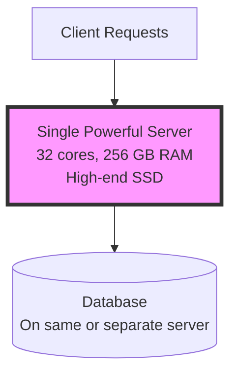
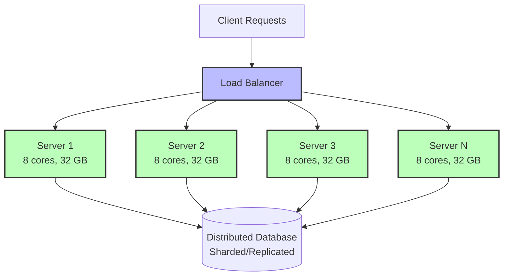

# Horizontal vs Vertical Scaling

## Overview

Scaling is the ability of a system to handle increased load. There are two primary approaches:
- **Vertical Scaling (Scale Up):** Adding more power to existing machines
- **Horizontal Scaling (Scale Out):** Adding more machines to your pool of resources

## Vertical Scaling (Scale Up)

### Definition
Upgrading the existing server with more powerful hardware (CPU, RAM, disk, network).

### Example
Upgrading from:
- 8 GB RAM → 32 GB RAM
- 4 CPU cores → 16 CPU cores
- 500 GB SSD → 2 TB NVMe SSD

### Advantages
- **Simple Implementation** - No code changes required
- **No Data Distribution** - No complexity of distributed systems
- **Inter-Process Communication** - Fast communication (shared memory)
- **Consistent Data** - No data synchronization issues
- **Easier to Maintain** - Single machine to manage

### Disadvantages
- **Single Point of Failure** - If the server goes down, entire system fails
- **Hard Limit** - Physical hardware limitations (can't infinitely scale)
- **Expensive** - High-end servers cost exponentially more
- **Downtime** - Usually requires downtime for upgrades
- **No Redundancy** - No failover mechanism

### When to Use
- Early stage applications with limited traffic
- Applications with tight consistency requirements
- Databases that need ACID guarantees (traditional RDBMS)
- Applications requiring complex queries or joins
- When cost-effective (small to medium scale)

### Real-World Example
```
Initial Server: 4 cores, 16 GB RAM → handles 1,000 QPS
Upgraded Server: 16 cores, 128 GB RAM → handles 5,000 QPS

Cost: $500/month → $2,000/month
Effort: Low (mostly automated)
Downtime: 5-10 minutes
```

## Horizontal Scaling (Scale Out)

### Definition
Adding more servers to distribute the load across multiple machines.

### Example
- 1 server handling 1,000 QPS
- 10 servers each handling 100 QPS
- Load balancer distributes traffic

### Advantages
- **High Availability** - If one server fails, others continue serving
- **Unlimited Scaling** - Add as many servers as needed
- **Cost-Effective** - Use commodity hardware
- **No Downtime** - Add/remove servers without affecting system
- **Geographic Distribution** - Servers in multiple regions

### Disadvantages
- **Complexity** - Distributed systems are harder to design and debug
- **Data Consistency** - Need to handle eventual consistency
- **Network Latency** - Communication between servers takes time
- **Data Partitioning** - Need sharding/partitioning strategies
- **Load Balancing** - Need infrastructure to distribute load

### When to Use
- High traffic applications (millions of users)
- Applications requiring high availability (99.99%+)
- Global applications (multiple regions)
- Systems with unpredictable/spiky traffic
- Modern web applications and microservices

### Real-World Example
```
Initial: 1 server → 1,000 QPS
Scaled: 20 servers → 20,000 QPS total

Cost per server: $100/month × 20 = $2,000/month
Effort: High (need load balancer, orchestration)
Downtime: None (rolling deployment)
```

## Architecture Comparison

### Vertical Scaling Architecture



### Horizontal Scaling Architecture



## Hybrid Approach

In practice, most large-scale systems use **both**:

1. **Scale vertically first** - Upgrade to reasonable limits
2. **Scale horizontally** - Add more servers as traffic grows
3. **Scale vertically again** - Upgrade each server in the cluster

### Example: Modern Web Application
```
Load Balancer (horizontal)
  ├── Application Server 1 (16 cores, 64 GB) ← vertical
  ├── Application Server 2 (16 cores, 64 GB) ← vertical
  └── Application Server N (16 cores, 64 GB) ← vertical

Database Cluster (horizontal)
  ├── Master (32 cores, 128 GB) ← vertical
  ├── Slave 1 (32 cores, 128 GB) ← vertical
  └── Slave 2 (32 cores, 128 GB) ← vertical
```

## Cost Comparison

### Scenario: Handling 10,000 QPS

| Approach | Configuration | Monthly Cost | Complexity | Availability |
|----------|--------------|--------------|------------|--------------|
| **Vertical** | 1 server (32 cores, 256 GB) | $4,000 | Low | 99.9% |
| **Horizontal** | 20 servers (4 cores, 16 GB each) | $2,000 | High | 99.99% |
| **Hybrid** | 5 servers (8 cores, 32 GB each) | $2,500 | Medium | 99.99% |

## Real-World Examples

### Companies Using Vertical Scaling
- **Stack Overflow** - Long relied on powerful SQL servers
- **Traditional Enterprises** - Oracle databases on high-end hardware

### Companies Using Horizontal Scaling
- **Netflix** - Thousands of microservices
- **Google** - Millions of commodity servers
- **Amazon** - Distributed across global regions
- **Facebook** - Massive server farms

## Decision Matrix

| Factor | Vertical | Horizontal |
|--------|----------|------------|
| **Initial Cost** | ✅ Lower | ❌ Higher |
| **Complexity** | ✅ Simpler | ❌ Complex |
| **Scalability Limit** | ❌ Limited | ✅ Unlimited |
| **High Availability** | ❌ Poor | ✅ Excellent |
| **Maintenance** | ✅ Easier | ❌ Harder |
| **Long-term Cost** | ❌ Expensive | ✅ Cost-effective |
| **Deployment Speed** | ❌ Slower | ✅ Faster |
| **Global Reach** | ❌ Difficult | ✅ Easy |

## Interview Tips

### Common Questions
1. **"How would you scale this system?"**
   - Start with traffic estimates
   - Consider current bottlenecks
   - Suggest vertical scaling for quick wins
   - Plan horizontal scaling for long-term growth

2. **"Why choose horizontal over vertical?"**
   - Emphasize availability and fault tolerance
   - Mention unlimited scaling potential
   - Discuss cost-effectiveness at scale

3. **"What are the challenges of horizontal scaling?"**
   - Data consistency (CAP theorem)
   - Load balancing complexity
   - Stateless application design
   - Data partitioning/sharding

### How to Answer
```
"Initially, I'd scale vertically to buy time and simplify implementation.
As we approach hardware limits or need high availability, I'd transition
to horizontal scaling with a load balancer and multiple application servers.
For the database, I'd start with replication for read scaling, then
consider sharding if write traffic becomes a bottleneck."
```

## Key Takeaways

1. **Vertical scaling is simpler** but has hard limits
2. **Horizontal scaling is complex** but offers unlimited growth
3. **Most systems use both** - hybrid approach
4. **Choose based on:**
   - Current scale and growth trajectory
   - Availability requirements
   - Budget constraints
   - Team expertise

## Next Steps

- Learn about [Load Balancing](load-balancing.md) - Essential for horizontal scaling
- Study [Database Replication](../databases/database-replication.md) - Scaling reads
- Understand [Database Sharding](../databases/database-sharding.md) - Scaling writes

---

**Remember:** Scale vertically until you can't, then scale horizontally. In interviews, always discuss both options and explain your choice based on the specific requirements.
