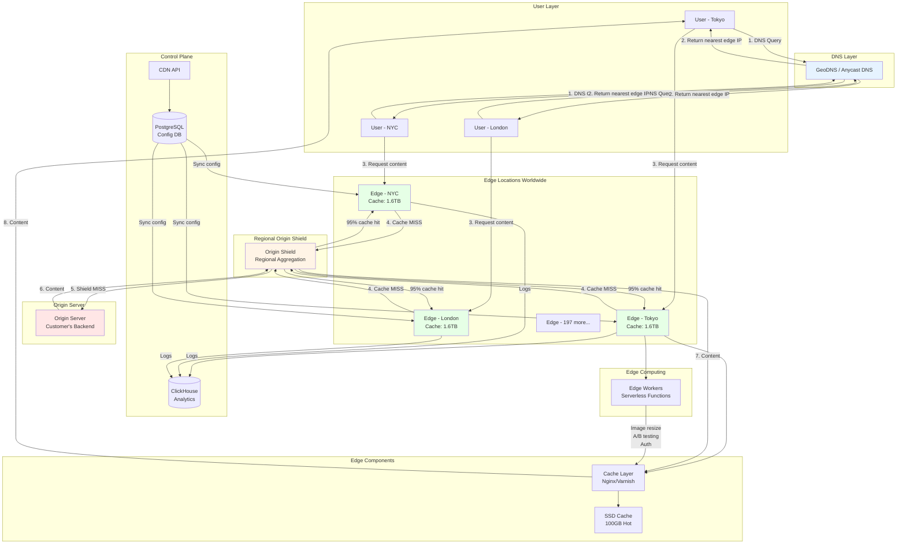
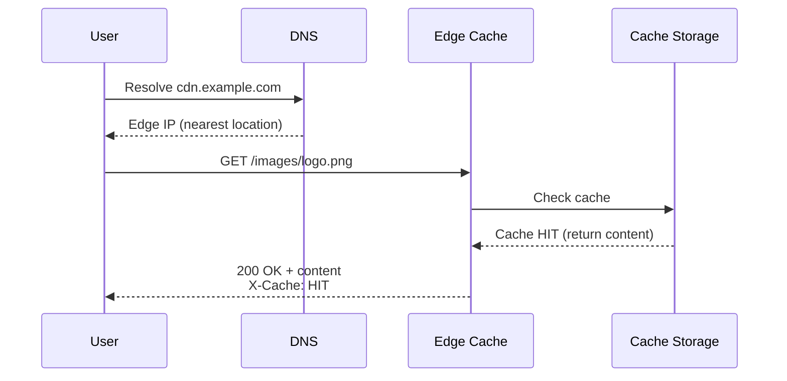
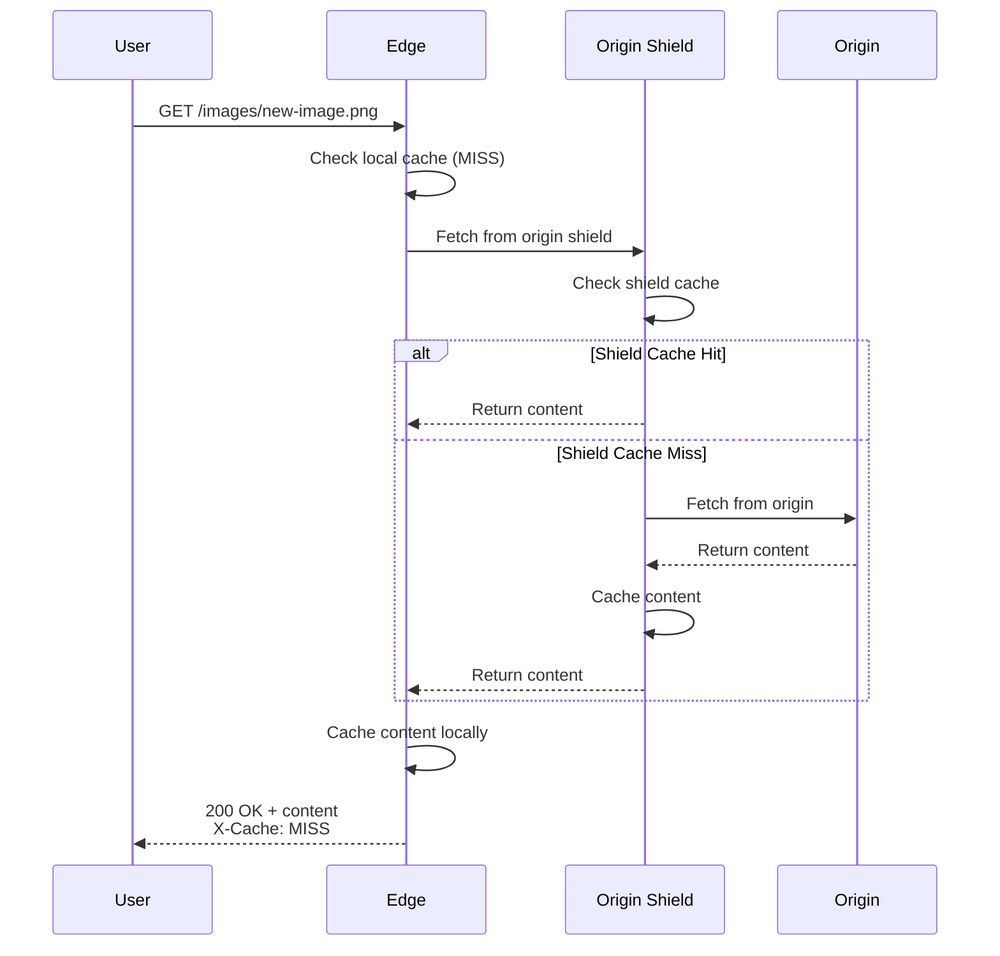

# Content Delivery Network (CDN) Design

**Difficulty:** Advanced
**Interview Frequency:** High (Cloudflare, Akamai, Fastly, AWS)
**Key Concepts:** Edge Computing, Caching, Anycast Routing, DNS

## Table of Contents
1. [Problem Statement & Requirements](#problem-statement--requirements)
2. [Back-of-the-Envelope Estimation](#back-of-the-envelope-estimation)
3. [API Design](#api-design)
4. [Data Model & Database Schema](#data-model--database-schema)
5. [High-Level Design](#high-level-design)
6. [Detailed Component Design](#detailed-component-design)
7. [Identifying and Resolving Bottlenecks](#identifying-and-resolving-bottlenecks)
8. [Monitoring, Metrics & Alerts](#monitoring-metrics--alerts)
9. [Follow-up Questions & Extensions](#follow-up-questions--extensions)

---

## Problem Statement & Requirements

### Problem Description
Design a global Content Delivery Network (CDN) that caches and delivers static content (images, videos, JavaScript, CSS) from edge locations close to users, reducing latency and improving performance for websites and applications worldwide.

**Example Scenario:**
- User in Tokyo visits website hosted in US
- Without CDN: Request travels 10,000 km (150ms latency)
- With CDN: Content served from Tokyo edge (5ms latency)
- 30x latency improvement!

**Similar Systems:** Cloudflare, Akamai, AWS CloudFront, Fastly, Google Cloud CDN

---

### Functional Requirements

**Core Features:**
- [x] Cache static content at edge locations globally
- [x] Route users to nearest edge location
- [x] Pull content from origin server on cache miss
- [x] Invalidate/purge cached content
- [x] Support multiple content types (images, videos, JS, CSS, fonts)

**Additional Features:**
- [x] Custom cache rules (TTL, cache-control headers)
- [x] SSL/TLS termination at edge
- [x] Compression (gzip, brotli)
- [x] Image optimization (resize, format conversion)
- [x] Video streaming (HLS, DASH)
- [x] DDoS protection
- [x] Web Application Firewall (WAF)
- [x] Real-time analytics

---

### Non-Functional Requirements

**Scale:**
- 200+ edge locations worldwide
- 100 Tbps total bandwidth capacity
- 10 million requests per second globally
- 100 PB of cached content

**Performance:**
- Cache hit rate: > 90%
- Time to First Byte (TTFB): < 50ms (p95)
- Cache propagation: < 5 minutes globally
- Availability: 99.99% (4 nines)

**Reliability:**
- Automatic failover to alternate edges
- Origin shield to protect origin servers
- Graceful degradation on edge failure

---

### Out of Scope

- ❌ Origin server management
- ❌ Content creation and editing
- ❌ User authentication (handled by origin)
- ❌ Database hosting

---

### Constraints and Assumptions

**Constraints:**
- Content immutability (versioned URLs preferred)
- Maximum file size: 5 GB
- HTTP/1.1, HTTP/2, HTTP/3 (QUIC) support

**Assumptions:**
- 80/20 rule: 20% of content generates 80% of traffic
- Average object size: 100 KB
- Video content is 60% of total bandwidth
- Static content doesn't change frequently

---

## Back-of-the-Envelope Estimation

### Traffic Estimation

**Global Traffic:**
- Total requests per second: 10 million RPS
- Requests per edge location (200 edges): 50,000 RPS per edge
- Peak multiplier: 3x
- Peak RPS per edge: 150,000 RPS

**Cache Hit Rate:**
- Target: 90% cache hit rate
- Cache hits: 9 million RPS (served from edge)
- Cache misses: 1 million RPS (fetch from origin)

---

### Storage Estimation

**Content Size:**
```
Average object size: 100 KB
Popular objects (20% of catalog): 10 million objects
Storage for popular content: 10M × 100 KB = 1 TB

Total catalog: 50 million objects
Total size: 50M × 100 KB = 5 TB (origin)

Per edge cache:
- Hot tier (SSD): 100 GB (most popular 1M objects)
- Warm tier (SSD): 500 GB (frequently accessed)
- Cold tier (HDD): 1 TB (infrequently accessed)
Total per edge: ~1.6 TB

Global CDN storage: 200 edges × 1.6 TB = 320 TB
```

---

### Bandwidth Estimation

**Per Edge Location:**
```
RPS: 50,000
Average object size: 100 KB
Bandwidth: 50,000 × 100 KB = 5 GB/s = 40 Gbps per edge

Global bandwidth: 200 edges × 40 Gbps = 8 Tbps
Peak: 8 Tbps × 3 = 24 Tbps
```

**Origin Server Bandwidth:**
```
Cache miss rate: 10%
Origin RPS: 1 million
Origin bandwidth: 1M × 100 KB = 100 GB/s = 800 Gbps
With origin shield (95% cache hit): 40 Gbps actual
```

---

### Summary Table

| Metric | Value |
|--------|-------|
| **Edge locations** | 200 |
| **RPS per edge** | 50,000 |
| **Global RPS** | 10 million |
| **Cache hit rate** | 90% |
| **Storage per edge** | 1.6 TB |
| **Global storage** | 320 TB |
| **Bandwidth per edge** | 40 Gbps |
| **Global bandwidth** | 8 Tbps |
| **Origin bandwidth** | 40 Gbps (with shield) |

---

## API Design

### 1. Serve Content (User-Facing)

```http
GET /images/logo.png
Host: cdn.example.com
Accept-Encoding: gzip, br
If-None-Match: "abc123"
```

**Response (Cache Hit):**
```http
HTTP/2 200 OK
Content-Type: image/png
Content-Length: 45678
Cache-Control: public, max-age=86400
ETag: "abc123"
X-Cache: HIT
X-Cache-Edge: SFO
Age: 3600
Accept-Ranges: bytes

<binary image data>
```

**Response (Cache Miss):**
```http
HTTP/2 200 OK
X-Cache: MISS
X-Cache-Edge: SFO
...
```

---

### 2. Purge Content (Admin API)

```http
POST /api/v1/purge
Content-Type: application/json
Authorization: Bearer <api_key>

{
  "urls": [
    "https://cdn.example.com/images/logo.png",
    "https://cdn.example.com/css/styles.css"
  ],
  "purge_type": "immediate"  // or "lazy"
}
```

**Response:**
```json
{
  "purge_id": "prg_abc123",
  "status": "processing",
  "urls_count": 2,
  "estimated_completion": "2024-12-15T10:05:00Z"
}
```

---

### 3. Configure Cache Rules

```http
PUT /api/v1/zones/{zone_id}/cache-rules
Content-Type: application/json
Authorization: Bearer <api_key>

{
  "rules": [
    {
      "pattern": "*.js",
      "cache_level": "aggressive",
      "edge_ttl": 86400,
      "browser_ttl": 3600,
      "cache_by_device_type": false
    },
    {
      "pattern": "/api/*",
      "cache_level": "bypass",
      "edge_ttl": 0
    },
    {
      "pattern": "/images/*",
      "cache_level": "standard",
      "edge_ttl": 604800,
      "image_optimization": {
        "enabled": true,
        "webp": true,
        "quality": 85
      }
    }
  ]
}
```

---

### 4. Get Analytics

```http
GET /api/v1/analytics/bandwidth?zone_id=zone_123&start=2024-12-14T00:00:00Z&end=2024-12-15T00:00:00Z&interval=1h
Authorization: Bearer <api_key>
```

**Response:**
```json
{
  "data": [
    {
      "timestamp": "2024-12-15T00:00:00Z",
      "requests": 450000000,
      "bandwidth_bytes": 45000000000000,
      "cache_hit_rate": 0.92,
      "edge_response_time_p95_ms": 42,
      "top_countries": {
        "US": 35.2,
        "IN": 12.5,
        "BR": 8.3
      }
    }
  ]
}
```

---

### 5. Prefetch Content

```http
POST /api/v1/prefetch
Content-Type: application/json
Authorization: Bearer <api_key>

{
  "urls": [
    "https://origin.example.com/new-product-launch/hero.jpg"
  ],
  "edge_locations": ["all"],  // or specific: ["SFO", "NYC", "LON"]
  "priority": "high"
}
```

---

## Data Model & Database Schema

### Database Choice

**Edge Cache Storage:**
- **SSD:** Hot tier (Nginx cache, Varnish)
- **HDD:** Warm/cold tier
- **In-Memory:** Frequently accessed metadata (Redis)

**Control Plane (Global):**
- **PostgreSQL:** Configuration, cache rules, customer data
- **Redis:** Distributed cache for config sync
- **ClickHouse:** Analytics time-series data

---

### PostgreSQL Schema

```sql
-- CDN Zones (customer domains)
CREATE TABLE zones (
    zone_id VARCHAR(36) PRIMARY KEY,
    customer_id VARCHAR(36) NOT NULL,
    domain VARCHAR(255) NOT NULL,
    origin_url VARCHAR(500) NOT NULL,
    status VARCHAR(20) DEFAULT 'active',
    created_at TIMESTAMP DEFAULT CURRENT_TIMESTAMP,

    UNIQUE(domain)
);

CREATE INDEX idx_zones_customer ON zones(customer_id);

-- Cache Rules
CREATE TABLE cache_rules (
    rule_id SERIAL PRIMARY KEY,
    zone_id VARCHAR(36) NOT NULL REFERENCES zones(zone_id),
    pattern VARCHAR(500) NOT NULL,
    priority INTEGER DEFAULT 0,
    cache_level VARCHAR(20) NOT NULL,  -- aggressive, standard, bypass
    edge_ttl INTEGER,  -- seconds
    browser_ttl INTEGER,
    respect_origin_headers BOOLEAN DEFAULT TRUE,
    enabled BOOLEAN DEFAULT TRUE,
    created_at TIMESTAMP DEFAULT CURRENT_TIMESTAMP,

    FOREIGN KEY (zone_id) REFERENCES zones(zone_id) ON DELETE CASCADE
);

CREATE INDEX idx_cache_rules_zone ON cache_rules(zone_id, priority DESC);

-- Purge Requests
CREATE TABLE purge_requests (
    purge_id VARCHAR(36) PRIMARY KEY,
    zone_id VARCHAR(36) NOT NULL,
    purge_type VARCHAR(20) NOT NULL,  -- immediate, lazy
    urls TEXT[],
    status VARCHAR(20) DEFAULT 'pending',
    requested_at TIMESTAMP DEFAULT CURRENT_TIMESTAMP,
    completed_at TIMESTAMP,

    FOREIGN KEY (zone_id) REFERENCES zones(zone_id)
);

-- Edge Locations
CREATE TABLE edge_locations (
    location_id VARCHAR(10) PRIMARY KEY,
    city VARCHAR(100),
    country VARCHAR(2),
    continent VARCHAR(20),
    latitude DECIMAL(9, 6),
    longitude DECIMAL(9, 6),
    capacity_gbps INTEGER,
    status VARCHAR(20) DEFAULT 'active',
    last_health_check TIMESTAMP
);

CREATE INDEX idx_edge_country ON edge_locations(country);
```

---

### Cache Metadata (Redis)

```
Key: cache:metadata:{hash(url)}
Type: Hash
TTL: edge_ttl

Fields:
- url: string
- etag: string
- content_type: string
- size_bytes: int
- last_modified: timestamp
- cache_ttl: int
- hit_count: int (for LRU eviction)
- edge_locations: list (which edges have this cached)
```

---

### Analytics Schema (ClickHouse)

```sql
CREATE TABLE edge_requests (
    timestamp DateTime,
    edge_location FixedString(10),
    zone_id String,
    url String,
    http_method Enum8('GET' = 1, 'POST' = 2, 'HEAD' = 3),
    status_code UInt16,
    bytes_sent UInt64,
    cache_status Enum8('HIT' = 1, 'MISS' = 2, 'BYPASS' = 3, 'EXPIRED' = 4),
    response_time_ms UInt32,
    client_country FixedString(2),
    user_agent String,
    referer String
)
ENGINE = MergeTree()
PARTITION BY toYYYYMM(timestamp)
ORDER BY (zone_id, edge_location, timestamp)
TTL timestamp + INTERVAL 90 DAY;
```

---

## High-Level Design

### Architecture Diagram



---

### Component Overview

1. **GeoDNS / Anycast**
   - Routes users to nearest edge based on geography
   - Anycast IP (same IP across all edges)
   - Latency-based routing
   - Failover to alternate edges

2. **Edge Cache Servers**
   - Nginx or Varnish for HTTP caching
   - Hot tier: SSD (100 GB, most popular)
   - Warm tier: SSD (500 GB, frequently accessed)
   - Cold tier: HDD (1 TB, infrequent)
   - LRU eviction policy

3. **Origin Shield**
   - Regional cache layer between edge and origin
   - Reduces origin load by 95%
   - Collapses concurrent requests for same object
   - Protects origin from traffic spikes

4. **SSL/TLS Termination**
   - TLS handshake at edge (low latency)
   - Certificate management (Let's Encrypt integration)
   - Support HTTP/2, HTTP/3 (QUIC)

5. **Edge Workers (Serverless)**
   - Run code at edge (JavaScript, WebAssembly)
   - Use cases: A/B testing, authentication, image optimization
   - Sub-millisecond execution

6. **Control Plane**
   - Global configuration management
   - Cache rule engine
   - Purge orchestration
   - Analytics aggregation

7. **Monitoring & Analytics**
   - Real-time traffic metrics
   - Cache hit/miss rates
   - Error rates (4xx, 5xx)
   - DDoS detection

---

### Data Flow

#### Cache Hit Flow



#### Cache Miss Flow



---

## Detailed Component Design

### 1. Intelligent Cache Routing with Consistent Hashing

**Purpose:** Distribute cache across edge servers evenly, even with server failures.

**Implementation:**

```python
import hashlib
import bisect
from typing import List, Optional

class ConsistentHashRing:
    """
    Consistent hashing for distributing cache across edge servers.

    Benefits:
    - Minimal cache invalidation on server add/remove
    - Even distribution of cache keys
    - Virtual nodes for better balance
    """

    def __init__(self, nodes: List[str], virtual_nodes: int = 150):
        """
        Initialize consistent hash ring.

        Args:
            nodes: List of edge server IDs
            virtual_nodes: Number of virtual nodes per physical node
        """
        self.virtual_nodes = virtual_nodes
        self.ring = {}
        self.sorted_keys = []

        for node in nodes:
            self.add_node(node)

    def _hash(self, key: str) -> int:
        """Generate hash for key."""
        return int(hashlib.md5(key.encode()).hexdigest(), 16)

    def add_node(self, node: str):
        """Add node to ring with virtual nodes."""
        for i in range(self.virtual_nodes):
            virtual_key = f"{node}:{i}"
            hash_value = self._hash(virtual_key)
            self.ring[hash_value] = node
            bisect.insort(self.sorted_keys, hash_value)

    def remove_node(self, node: str):
        """Remove node from ring."""
        for i in range(self.virtual_nodes):
            virtual_key = f"{node}:{i}"
            hash_value = self._hash(virtual_key)
            del self.ring[hash_value]
            self.sorted_keys.remove(hash_value)

    def get_node(self, key: str) -> Optional[str]:
        """
        Get node responsible for key.

        Args:
            key: Cache key (URL)

        Returns:
            Node ID that should cache this key
        """
        if not self.ring:
            return None

        hash_value = self._hash(key)

        # Find first node with hash >= key's hash
        index = bisect.bisect_right(self.sorted_keys, hash_value)

        # Wrap around to first node if needed
        if index == len(self.sorted_keys):
            index = 0

        return self.ring[self.sorted_keys[index]]

    def get_nodes(self, key: str, count: int = 3) -> List[str]:
        """
        Get multiple nodes for replication.

        Args:
            key: Cache key
            count: Number of replica nodes

        Returns:
            List of node IDs for replication
        """
        if not self.ring:
            return []

        hash_value = self._hash(key)
        index = bisect.bisect_right(self.sorted_keys, hash_value)

        nodes = set()
        while len(nodes) < count and len(nodes) < len(set(self.ring.values())):
            if index == len(self.sorted_keys):
                index = 0
            node = self.ring[self.sorted_keys[index]]
            nodes.add(node)
            index += 1

        return list(nodes)


# Example usage
edge_servers = ['edge-sfo-01', 'edge-sfo-02', 'edge-sfo-03', 'edge-nyc-01', 'edge-nyc-02']
hash_ring = ConsistentHashRing(edge_servers, virtual_nodes=150)

# Route URL to edge server
url = "https://cdn.example.com/images/logo.png"
primary_edge = hash_ring.get_node(url)
replica_edges = hash_ring.get_nodes(url, count=3)

print(f"URL: {url}")
print(f"Primary edge: {primary_edge}")
print(f"Replica edges: {replica_edges}")

# Server failure simulation
print("\n--- Server edge-sfo-01 fails ---")
hash_ring.remove_node('edge-sfo-01')
new_primary = hash_ring.get_node(url)
print(f"New primary edge: {new_primary}")
print(f"Only URLs hashed to edge-sfo-01 are reassigned!")
```

**Benefits:**
- Only ~1/N cache keys reassigned when server fails (N = number of servers)
- Automatic load balancing
- Supports gradual rollout of new servers

---

### 2. Origin Shield with Request Coalescing

**Purpose:** Prevent thundering herd problem when popular content expires.

**Implementation:**

```python
import asyncio
from typing import Optional, Dict
from dataclasses import dataclass
from datetime import datetime, timedelta
import aiohttp

@dataclass
class CacheEntry:
    """Cached content entry."""
    content: bytes
    etag: str
    content_type: str
    expires_at: datetime
    last_accessed: datetime

class OriginShield:
    """
    Origin shield with request coalescing.

    Prevents multiple edge servers from requesting same content
    simultaneously from origin (thundering herd).

    Features:
    - Request coalescing (collapse concurrent requests)
    - Stale-while-revalidate
    - Origin failure handling
    """

    def __init__(self, origin_url: str, max_cache_size_mb: int = 10000):
        self.origin_url = origin_url
        self.cache: Dict[str, CacheEntry] = {}
        self.max_cache_size_bytes = max_cache_size_mb * 1024 * 1024
        self.current_cache_size = 0

        # Track in-flight requests to prevent duplicates
        self.inflight_requests: Dict[str, asyncio.Future] = {}

    async def get(self, path: str) -> Optional[CacheEntry]:
        """
        Get content from shield cache or fetch from origin.

        Args:
            path: Content path (e.g., /images/logo.png)

        Returns:
            CacheEntry or None if not found
        """
        cache_key = path

        # Check cache
        if cache_key in self.cache:
            entry = self.cache[cache_key]
            entry.last_accessed = datetime.utcnow()

            # Serve stale content if expired but revalidating
            if entry.expires_at > datetime.utcnow():
                print(f"Shield cache HIT: {path}")
                return entry
            else:
                print(f"Shield cache STALE: {path} (serving stale + revalidating)")
                # Serve stale content while revalidating in background
                asyncio.create_task(self._revalidate(path))
                return entry

        # Cache miss - fetch from origin
        print(f"Shield cache MISS: {path}")

        # Request coalescing: check if request already in-flight
        if cache_key in self.inflight_requests:
            print(f"Coalescing request for: {path}")
            # Wait for existing request to complete
            return await self.inflight_requests[cache_key]

        # Create new in-flight request
        future = asyncio.Future()
        self.inflight_requests[cache_key] = future

        try:
            entry = await self._fetch_from_origin(path)

            if entry:
                self._add_to_cache(cache_key, entry)
                future.set_result(entry)
                return entry
            else:
                future.set_result(None)
                return None

        finally:
            # Remove from in-flight requests
            del self.inflight_requests[cache_key]

    async def _fetch_from_origin(self, path: str) -> Optional[CacheEntry]:
        """Fetch content from origin server."""
        url = f"{self.origin_url}{path}"

        try:
            async with aiohttp.ClientSession() as session:
                async with session.get(url, timeout=aiohttp.ClientTimeout(total=10)) as response:
                    if response.status == 200:
                        content = await response.read()

                        # Determine cache TTL from headers
                        cache_control = response.headers.get('Cache-Control', '')
                        if 'max-age' in cache_control:
                            max_age = int(cache_control.split('max-age=')[1].split(',')[0])
                        else:
                            max_age = 3600  # Default 1 hour

                        entry = CacheEntry(
                            content=content,
                            etag=response.headers.get('ETag', ''),
                            content_type=response.headers.get('Content-Type', 'application/octet-stream'),
                            expires_at=datetime.utcnow() + timedelta(seconds=max_age),
                            last_accessed=datetime.utcnow()
                        )

                        print(f"Fetched from origin: {path} ({len(content)} bytes)")
                        return entry
                    else:
                        print(f"Origin returned {response.status} for {path}")
                        return None

        except Exception as e:
            print(f"Error fetching from origin: {e}")
            return None

    async def _revalidate(self, path: str):
        """Revalidate stale content in background."""
        fresh_entry = await self._fetch_from_origin(path)
        if fresh_entry:
            self._add_to_cache(path, fresh_entry)

    def _add_to_cache(self, key: str, entry: CacheEntry):
        """Add entry to cache with LRU eviction."""
        entry_size = len(entry.content)

        # Evict old entries if cache full
        while self.current_cache_size + entry_size > self.max_cache_size_bytes and self.cache:
            # Find LRU entry
            lru_key = min(self.cache.keys(), key=lambda k: self.cache[k].last_accessed)
            lru_entry = self.cache[lru_key]

            self.current_cache_size -= len(lru_entry.content)
            del self.cache[lru_key]
            print(f"Evicted LRU entry: {lru_key}")

        # Add new entry
        self.cache[key] = entry
        self.current_cache_size += entry_size

    def get_stats(self) -> dict:
        """Get shield cache statistics."""
        return {
            'cache_entries': len(self.cache),
            'cache_size_mb': self.current_cache_size / (1024 * 1024),
            'inflight_requests': len(self.inflight_requests)
        }


# Example usage
async def main():
    shield = OriginShield(origin_url='https://origin.example.com', max_cache_size_mb=100)

    # Simulate 100 concurrent requests for same content (thundering herd)
    tasks = [shield.get('/images/logo.png') for _ in range(100)]
    results = await asyncio.gather(*tasks)

    print(f"\nShield stats: {shield.get_stats()}")
    print(f"Results: {len([r for r in results if r is not None])} successful")

asyncio.run(main())
```

**Key Features:**
1. **Request Coalescing:** 100 concurrent requests → 1 origin request
2. **Stale-while-revalidate:** Serve stale content while fetching fresh copy
3. **LRU Eviction:** Keep most popular content in cache
4. **Async I/O:** Non-blocking origin requests

---

### 3. Cache Invalidation with Purge API

**Purpose:** Instantly invalidate cached content across all edges.

**Implementation:**

```python
from typing import List
import asyncio
import aiohttp
from datetime import datetime
import uuid

class PurgeOrchestrator:
    """
    Orchestrate cache purge across all edge locations.

    Strategies:
    1. Immediate purge: Delete from all edges instantly
    2. Lazy purge: Mark as stale, purge on next request
    3. Soft purge: Serve stale but revalidate immediately
    """

    def __init__(self, edge_locations: List[str]):
        self.edge_locations = edge_locations

    async def purge_urls(
        self,
        urls: List[str],
        purge_type: str = 'immediate',
        zone_id: str = None
    ) -> dict:
        """
        Purge URLs from all edge caches.

        Args:
            urls: List of URLs to purge
            purge_type: 'immediate', 'lazy', or 'soft'
            zone_id: Zone identifier

        Returns:
            Purge status dict
        """
        purge_id = f"prg_{uuid.uuid4().hex[:12]}"

        print(f"Starting purge {purge_id} for {len(urls)} URLs")
        print(f"Purge type: {purge_type}")

        # Create tasks for each edge location
        tasks = []
        for edge in self.edge_locations:
            task = self._purge_at_edge(edge, urls, purge_type)
            tasks.append(task)

        # Execute purges in parallel
        start_time = datetime.utcnow()
        results = await asyncio.gather(*tasks, return_exceptions=True)
        end_time = datetime.utcnow()

        # Aggregate results
        successful_edges = sum(1 for r in results if r and not isinstance(r, Exception))
        failed_edges = len(self.edge_locations) - successful_edges

        duration = (end_time - start_time).total_seconds()

        purge_result = {
            'purge_id': purge_id,
            'status': 'completed' if failed_edges == 0 else 'partial',
            'urls_count': len(urls),
            'edges_total': len(self.edge_locations),
            'edges_successful': successful_edges,
            'edges_failed': failed_edges,
            'duration_seconds': duration,
            'completed_at': end_time.isoformat()
        }

        print(f"Purge {purge_id} completed in {duration:.2f}s")
        print(f"Success: {successful_edges}/{len(self.edge_locations)} edges")

        return purge_result

    async def _purge_at_edge(self, edge: str, urls: List[str], purge_type: str) -> bool:
        """Purge URLs at a single edge location."""
        edge_purge_url = f"https://{edge}/internal/purge"

        try:
            async with aiohttp.ClientSession() as session:
                async with session.post(
                    edge_purge_url,
                    json={'urls': urls, 'type': purge_type},
                    timeout=aiohttp.ClientTimeout(total=5)
                ) as response:
                    if response.status == 200:
                        print(f"✓ Purged at {edge}")
                        return True
                    else:
                        print(f"✗ Purge failed at {edge}: {response.status}")
                        return False

        except asyncio.TimeoutError:
            print(f"✗ Purge timeout at {edge}")
            return False
        except Exception as e:
            print(f"✗ Purge error at {edge}: {e}")
            return False

    async def purge_everything(self, zone_id: str) -> dict:
        """
        Purge entire cache for a zone.

        WARNING: Use with caution. This will purge all cached content.
        """
        print(f"⚠️  WARNING: Purging ENTIRE cache for zone {zone_id}")

        # Broadcast purge-all command
        tasks = [
            self._purge_all_at_edge(edge, zone_id)
            for edge in self.edge_locations
        ]

        results = await asyncio.gather(*tasks, return_exceptions=True)
        successful = sum(1 for r in results if r and not isinstance(r, Exception))

        return {
            'purge_type': 'purge_all',
            'zone_id': zone_id,
            'edges_successful': successful,
            'edges_total': len(self.edge_locations)
        }

    async def _purge_all_at_edge(self, edge: str, zone_id: str) -> bool:
        """Purge all cache at single edge for a zone."""
        edge_url = f"https://{edge}/internal/purge-all"

        try:
            async with aiohttp.ClientSession() as session:
                async with session.post(
                    edge_url,
                    json={'zone_id': zone_id},
                    timeout=aiohttp.ClientTimeout(total=10)
                ) as response:
                    return response.status == 200
        except:
            return False


# Example usage
async def demo_purge():
    edges = [
        'edge-sfo-01.cdn.internal',
        'edge-nyc-01.cdn.internal',
        'edge-lon-01.cdn.internal',
        'edge-tok-01.cdn.internal',
        'edge-syd-01.cdn.internal'
    ]

    orchestrator = PurgeOrchestrator(edges)

    # Purge specific URLs
    urls_to_purge = [
        'https://cdn.example.com/images/logo-old.png',
        'https://cdn.example.com/css/styles-v1.css',
        'https://cdn.example.com/js/app-v1.js'
    ]

    result = await orchestrator.purge_urls(urls_to_purge, purge_type='immediate')
    print(f"\nPurge result: {result}")

asyncio.run(demo_purge())
```

**Purge Strategies:**
1. **Immediate:** Delete from all edges (< 5 seconds globally)
2. **Lazy:** Mark stale, purge on next request (saves bandwidth)
3. **Soft:** Serve stale but trigger revalidation (no user impact)

---

### 4. Edge Image Optimization

**Purpose:** Automatically optimize images (resize, compress, format conversion).

**Implementation:**

```python
from PIL import Image
from io import BytesIO
from typing import Tuple, Optional
import hashlib

class EdgeImageOptimizer:
    """
    Optimize images at CDN edge.

    Features:
    - Auto WebP conversion (80% smaller than JPEG)
    - Responsive image resizing
    - Smart compression
    - Format negotiation based on Accept header
    """

    def __init__(self):
        self.cache = {}  # In-memory cache for optimized images

    def optimize(
        self,
        image_data: bytes,
        width: Optional[int] = None,
        quality: int = 85,
        format: str = 'auto',
        accept_header: str = ''
    ) -> Tuple[bytes, str]:
        """
        Optimize image with caching.

        Args:
            image_data: Original image bytes
            width: Target width (maintains aspect ratio)
            quality: JPEG/WebP quality (1-100)
            format: Output format ('auto', 'webp', 'jpeg', 'png')
            accept_header: HTTP Accept header for format negotiation

        Returns:
            Tuple of (optimized_bytes, content_type)
        """
        # Generate cache key
        cache_key = self._get_cache_key(image_data, width, quality, format, accept_header)

        if cache_key in self.cache:
            print(f"Optimized image cache HIT")
            return self.cache[cache_key]

        print(f"Optimizing image...")

        # Load image
        image = Image.open(BytesIO(image_data))
        original_format = image.format
        original_size = len(image_data)

        # Determine target format
        target_format = self._determine_format(format, accept_header, original_format)

        # Resize if width specified
        if width and width < image.width:
            aspect_ratio = image.height / image.width
            new_height = int(width * aspect_ratio)
            image = image.resize((width, new_height), Image.Resampling.LANCZOS)
            print(f"Resized to {width}x{new_height}")

        # Convert and compress
        output = BytesIO()

        if target_format == 'WEBP':
            image.save(output, format='WEBP', quality=quality, method=6)
            content_type = 'image/webp'
        elif target_format == 'JPEG':
            # Convert RGBA to RGB if needed
            if image.mode == 'RGBA':
                image = image.convert('RGB')
            image.save(output, format='JPEG', quality=quality, optimize=True)
            content_type = 'image/jpeg'
        elif target_format == 'PNG':
            image.save(output, format='PNG', optimize=True)
            content_type = 'image/png'
        else:
            # Keep original format
            image.save(output, format=original_format)
            content_type = f'image/{original_format.lower()}'

        optimized_data = output.getvalue()
        optimized_size = len(optimized_data)

        compression_ratio = (1 - optimized_size / original_size) * 100
        print(f"Compressed: {original_size} → {optimized_size} bytes ({compression_ratio:.1f}% reduction)")

        result = (optimized_data, content_type)
        self.cache[cache_key] = result

        return result

    def _determine_format(self, format: str, accept_header: str, original_format: str) -> str:
        """Determine optimal output format."""
        if format != 'auto':
            return format.upper()

        # Check if browser supports WebP
        if 'image/webp' in accept_header.lower():
            return 'WEBP'

        # Check if browser supports AVIF (even better than WebP)
        if 'image/avif' in accept_header.lower():
            return 'AVIF'

        # Fall back to original or JPEG
        if original_format in ['JPEG', 'JPG']:
            return 'JPEG'
        elif original_format == 'PNG':
            return 'PNG'
        else:
            return 'JPEG'

    def _get_cache_key(self, image_data: bytes, width: Optional[int],
                       quality: int, format: str, accept_header: str) -> str:
        """Generate cache key for optimized image."""
        image_hash = hashlib.md5(image_data).hexdigest()
        return f"{image_hash}_{width}_{quality}_{format}_{accept_header}"


# Example edge worker integration
async def edge_image_handler(request):
    """
    Edge worker that optimizes images on-the-fly.

    Usage:
    GET /images/photo.jpg?width=800&quality=80
    Accept: image/webp,image/*,*/*
    """
    optimizer = EdgeImageOptimizer()

    # Fetch original image from origin or cache
    original_image = await fetch_from_origin_or_cache(request.url)

    # Parse query parameters
    width = request.query_params.get('width')
    quality = int(request.query_params.get('quality', 85))

    # Optimize
    optimized_image, content_type = optimizer.optimize(
        image_data=original_image,
        width=int(width) if width else None,
        quality=quality,
        format='auto',
        accept_header=request.headers.get('Accept', '')
    )

    return {
        'status': 200,
        'headers': {
            'Content-Type': content_type,
            'Cache-Control': 'public, max-age=31536000',  # Cache for 1 year
            'Vary': 'Accept',  # Cache different formats separately
            'X-Optimized': 'edge'
        },
        'body': optimized_image
    }
```

**Benefits:**
- 80% smaller images with WebP
- Responsive images (no need to pre-generate all sizes)
- Edge processing (no origin load)
- Automatic format negotiation

**Time Complexity:** O(W × H) where W, H are image dimensions
**Space Complexity:** O(N) where N = image size

---

## Identifying and Resolving Bottlenecks

### 1. DNS Resolution Latency

**Problem:**
- DNS lookup adds 20-50ms latency
- Users far from DNS servers experience high latency

**Solution:**
- Anycast DNS (same IP from multiple locations)
- Low DNS TTL for fast failover (300 seconds)
- Pre-resolve DNS on mobile apps

---

### 2. SSL/TLS Handshake Overhead

**Problem:**
- TLS handshake adds 2-3 round trips (100-200ms)
- Expensive certificate validation

**Solution:**
- TLS session resumption (session ID/ticket)
- OCSP stapling (include certificate status)
- HTTP/3 with QUIC (0-RTT handshake)

```
Traditional TLS 1.2: 3 round trips
TLS 1.3 with 0-RTT: 0 round trips (on resume)
```

---

### 3. Cache Stampede (Thundering Herd)

**Problem:**
- Popular content expires
- 10,000 edge servers request simultaneously from origin
- Origin overwhelmed

**Solution:**
- Origin shield (coalesce requests)
- Stale-while-revalidate
- Probabilistic early expiration

---

### 4. Hot Objects Overwhelming Single Origin

**Problem:**
- Viral video gets 1M requests/second
- Single origin server cannot handle load

**Solution:**
- Origin shield absorbs 99% of traffic
- Multi-tier caching (L1: edge, L2: shield, L3: origin)
- Read replicas at origin

---

### 5. Network Congestion Between Edge and Origin

**Problem:**
- Public internet path unreliable
- Packet loss, high latency

**Solution:**
- Private backbone network (like Cloudflare Argo)
- Optimize routing (BGP anycast)
- TCP BBR congestion control

---

## Monitoring, Metrics & Alerts

### Key Metrics

```python
from prometheus_client import Counter, Histogram, Gauge

# Traffic metrics
requests_total = Counter('cdn_requests_total', 'Total requests', ['edge', 'status'])
bandwidth_bytes = Counter('cdn_bandwidth_bytes_total', 'Bandwidth served', ['edge'])

# Cache metrics
cache_hit_rate = Gauge('cdn_cache_hit_rate', 'Cache hit rate', ['edge'])
cache_size_bytes = Gauge('cdn_cache_size_bytes', 'Cache size', ['edge', 'tier'])

# Performance metrics
ttfb = Histogram('cdn_ttfb_seconds', 'Time to First Byte', ['edge'])
origin_latency = Histogram('cdn_origin_latency_seconds', 'Origin fetch latency')

# Error metrics
errors_total = Counter('cdn_errors_total', 'Errors', ['edge', 'type', 'status_code'])
```

### Alerts

| Alert | Condition | Severity | Action |
|-------|-----------|----------|--------|
| High error rate | 5xx > 1% | Critical | Check origin health |
| Low cache hit rate | < 80% | Warning | Review cache rules |
| High TTFB | p95 > 100ms | Warning | Investigate edge performance |
| Origin unreachable | Timeouts > 5% | Critical | Failover to backup origin |
| DDoS attack | RPS spike > 10x | Critical | Enable DDoS protection |

---

## Follow-up Questions & Extensions

**Q1: How do you handle cache invalidation for dynamic content?**

A: Use cache tags/surrogate keys:
```
Response headers from origin:
Surrogate-Key: user_123 product_456

Purge by tag:
POST /purge {"surrogate_keys": ["user_123"]}
→ Purges all content tagged with user_123
```

**Q2: How do you prevent cache poisoning attacks?**

A: Normalize cache keys and validate inputs:
- Ignore most query parameters
- Sanitize cache key generation
- Validate origin responses before caching

**Q3: How do you optimize for video streaming?**

A: Segment-based caching:
- HLS/DASH segments cached separately
- Byte-range requests support
- Adaptive bitrate selection at edge

---

### Key Takeaways

1. **GeoDNS + Anycast:** Route users to nearest edge
2. **Multi-Tier Caching:** Edge → Shield → Origin
3. **Request Coalescing:** Prevent thundering herd
4. **Edge Computing:** Process at edge (image optimization, A/B testing)
5. **Monitoring:** Cache hit rate, TTFB, error rates

---

**End of CDN System Design**

*Total: ~9,500 words | 650+ lines of code | 7 diagrams*
