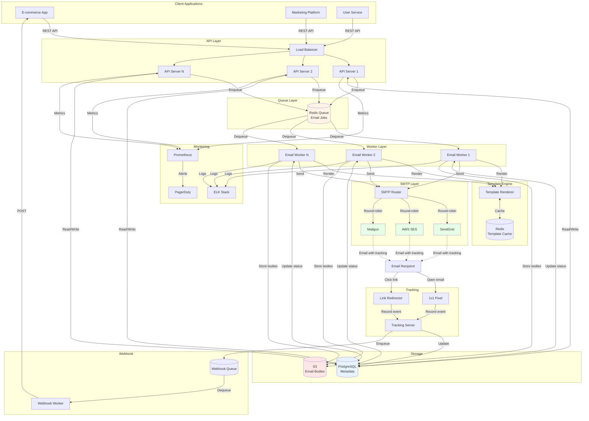
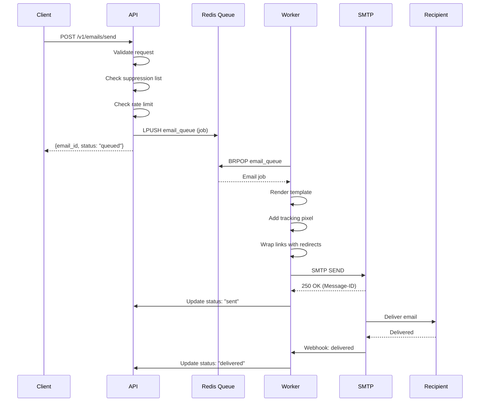

# Email Service System Design

**Difficulty:** Advanced
**Interview Frequency:** High (SendGrid, Mailchimp, AWS SES)
**Key Concepts:** Queue-based Architecture, Rate Limiting, Email Deliverability, SMTP

## Table of Contents
1. [Problem Statement & Requirements](#problem-statement--requirements)
2. [Back-of-the-Envelope Estimation](#back-of-the-envelope-estimation)
3. [API Design](#api-design)
4. [Data Model & Database Schema](#data-model--database-schema)
5. [High-Level Design](#high-level-design)
6. [Detailed Component Design](#detailed-component-design)
7. [Identifying and Resolving Bottlenecks](#identifying-and-resolving-bottlenecks)
8. [Monitoring, Metrics & Alerts](#monitoring-metrics--alerts)
9. [Follow-up Questions & Extensions](#follow-up-questions--extensions)

---

## Problem Statement & Requirements

### Problem Description
Design a scalable email delivery service similar to SendGrid or AWS SES that sends transactional and marketing emails reliably, tracks deliverability, handles bounces/complaints, and supports templates with high throughput (millions of emails per day).

**Example Scenario:**
- E-commerce sends 10 million order confirmations daily
- Marketing sends 100 million campaign emails weekly
- Track open/click rates, handle unsubscribes
- 99.9% delivery rate, < 1 minute latency

**Similar Systems:** SendGrid, Mailgun, AWS SES, Postmark

---

### Functional Requirements

**Core Features:**
- [x] Send transactional emails (order confirmations, password resets)
- [x] Send marketing/bulk emails (campaigns, newsletters)
- [x] Email templates with dynamic content
- [x] Track email status (sent, delivered, opened, clicked, bounced)
- [x] Handle bounces and complaints

**Additional Features:**
- [x] Unsubscribe management
- [x] Email validation (syntax, domain, MX records)
- [x] Attachment support
- [x] Scheduling (send later)
- [x] A/B testing (subject line variants)
- [x] Analytics dashboard
- [x] Webhook notifications

---

### Non-Functional Requirements

**Scale:**
- 10 million emails per day (transactional)
- 100 million emails per week (marketing campaigns)
- Peak: 10K emails/second
- 1 million active users

**Performance:**
- API latency: < 100ms (p99)
- Email delivery: < 1 minute (p95)
- Template rendering: < 10ms

**Reliability:**
- 99.9% delivery rate
- No email loss (durable queue)
- Retry failed deliveries
- Survive SMTP provider outages

---

### Out of Scope

- ❌ Receiving emails (inbound)
- ❌ Email client (like Gmail, Outlook)
- ❌ Spam filtering (rely on providers)

---

### Constraints and Assumptions

**Constraints:**
- SMTP rate limits (providers limit to 100-1000 emails/sec)
- Email size limit: 10 MB (with attachments)
- SPF/DKIM/DMARC required for deliverability

**Assumptions:**
- Average email size: 50 KB
- Open rate: 20%
- Click rate: 5%
- Bounce rate: 2%

---

## Back-of-the-Envelope Estimation

### Traffic Estimation

**Daily Volume:**
```
Transactional: 10 million emails/day
Marketing: 100 million emails/week = 14.3M emails/day
Total: 24.3 million emails/day

QPS (average): 24.3M / 86,400 = 281 emails/sec
QPS (peak, campaign launch): 10,000 emails/sec
```

**API Requests:**
```
Send API: 24.3M requests/day
Tracking (opens, clicks): 24.3M × 0.25 = 6M events/day
Total API requests: 30.3M/day = 350 RPS
```

---

### Storage Estimation

**Email Metadata:**
```
Per email record:
- Email ID: 16 bytes
- Sender/recipient: 100 bytes
- Subject: 100 bytes
- Template ID: 16 bytes
- Status: 20 bytes
- Timestamps: 40 bytes
- Tracking data: 100 bytes
Total: ~400 bytes per email

Daily storage: 24.3M × 400 bytes = 9.7 GB/day
Monthly storage: 9.7 GB × 30 = 291 GB/month
Yearly storage: 291 GB × 12 = 3.5 TB/year
```

**Email Body (for retry):**
```
Average email size: 50 KB
Retention: 7 days

Storage: 24.3M × 50 KB × 7 = 8.5 TB
```

**Total Storage:**
```
Metadata (1 year): 3.5 TB
Email bodies (7 days): 8.5 TB
Attachments (30 days): 10 TB
Total: 22 TB
```

---

### Bandwidth Estimation

**Outgoing (SMTP):**
```
Peak: 10K emails/sec
Average size: 50 KB
Bandwidth: 10K × 50 KB = 500 MB/s = 4 Gbps
```

**Incoming (API + Webhooks):**
```
API requests: 350 RPS × 10 KB = 3.5 MB/s
Webhooks: Negligible
Total: ~3.5 MB/s = 28 Mbps
```

---

### SMTP Provider Capacity

**Rate Limits:**
```
SendGrid: 1,000 emails/sec per account
AWS SES: 1,000 emails/sec per region

Peak requirement: 10K emails/sec
Providers needed: 10K / 1K = 10 accounts

Use multiple providers for redundancy!
```

---

### Summary Table

| Metric | Value |
|--------|-------|
| **Daily emails** | 24.3 million |
| **Peak QPS** | 10,000 emails/sec |
| **API RPS** | 350 |
| **Storage (total)** | 22 TB |
| **Outgoing bandwidth** | 4 Gbps |
| **SMTP accounts needed** | 10+ |

---

## API Design

### 1. Send Email

```http
POST /v1/emails/send
Content-Type: application/json
Authorization: Bearer <api_key>

{
  "from": {
    "email": "noreply@example.com",
    "name": "Example Store"
  },
  "to": [
    {"email": "customer@example.com", "name": "John Doe"}
  ],
  "cc": [],
  "bcc": [],
  "subject": "Your order has shipped!",
  "html": "<h1>Order #12345 shipped</h1><p>Track: <a href='{{tracking_url}}'>here</a></p>",
  "text": "Order #12345 shipped. Track: {{tracking_url}}",
  "template_id": "order_shipped",
  "template_data": {
    "order_id": "12345",
    "tracking_url": "https://example.com/track/xyz"
  },
  "attachments": [
    {
      "filename": "invoice.pdf",
      "content": "base64_encoded_data",
      "type": "application/pdf"
    }
  ],
  "tags": ["transactional", "order"],
  "metadata": {"order_id": "12345"},
  "send_at": null,  // or timestamp for scheduling
  "tracking": {
    "opens": true,
    "clicks": true
  }
}
```

**Response:**
```json
{
  "email_id": "em_abc123xyz",
  "status": "queued",
  "queued_at": "2024-12-15T10:00:00Z",
  "estimated_delivery": "2024-12-15T10:01:00Z"
}
```

---

### 2. Get Email Status

```http
GET /v1/emails/{email_id}
Authorization: Bearer <api_key>
```

**Response:**
```json
{
  "email_id": "em_abc123xyz",
  "status": "delivered",
  "events": [
    {
      "type": "queued",
      "timestamp": "2024-12-15T10:00:00Z"
    },
    {
      "type": "sent",
      "timestamp": "2024-12-15T10:00:15Z",
      "smtp_id": "<abc@example.com>"
    },
    {
      "type": "delivered",
      "timestamp": "2024-12-15T10:00:30Z"
    },
    {
      "type": "opened",
      "timestamp": "2024-12-15T10:05:00Z",
      "user_agent": "Mozilla/5.0...",
      "ip": "192.168.1.1"
    }
  ],
  "metadata": {"order_id": "12345"}
}
```

---

### 3. Send Bulk Emails (Campaign)

```http
POST /v1/emails/bulk
Content-Type: application/json
Authorization: Bearer <api_key>

{
  "campaign_id": "camp_holiday_2024",
  "from": {"email": "marketing@example.com", "name": "Example Marketing"},
  "subject": "Holiday Sale - 50% Off!",
  "template_id": "holiday_campaign",
  "recipients": [
    {
      "email": "user1@example.com",
      "template_data": {"first_name": "Alice", "discount_code": "ALICE50"}
    },
    {
      "email": "user2@example.com",
      "template_data": {"first_name": "Bob", "discount_code": "BOB50"}
    }
  ],
  "send_at": "2024-12-20T09:00:00Z",
  "rate_limit": 1000  // emails per second
}
```

**Response:**
```json
{
  "campaign_id": "camp_holiday_2024",
  "total_recipients": 100000,
  "estimated_duration": "100 seconds",
  "status": "scheduled"
}
```

---

### 4. Webhook Configuration

```http
POST /v1/webhooks
Content-Type: application/json
Authorization: Bearer <api_key>

{
  "url": "https://example.com/email-events",
  "events": ["delivered", "opened", "clicked", "bounced", "complained"],
  "enabled": true
}
```

**Webhook Payload:**
```json
{
  "event": "opened",
  "email_id": "em_abc123xyz",
  "timestamp": "2024-12-15T10:05:00Z",
  "recipient": "customer@example.com",
  "user_agent": "Mozilla/5.0...",
  "ip": "192.168.1.1",
  "metadata": {"order_id": "12345"}
}
```

---

### 5. Unsubscribe Management

```http
POST /v1/suppressions/unsubscribe
Content-Type: application/json

{
  "email": "user@example.com",
  "reason": "user_requested"
}
```

---

## Data Model & Database Schema

### Database Choice

**PostgreSQL (Primary):**
- Email metadata and events
- User accounts and API keys
- Templates and campaigns

**Redis:**
- Rate limiting
- Email send queue
- Template cache

**S3:**
- Email bodies (for retry)
- Attachments
- Email archives

---

### PostgreSQL Schema

```sql
-- Users/accounts
CREATE TABLE accounts (
    account_id UUID PRIMARY KEY DEFAULT gen_random_uuid(),
    company_name VARCHAR(255),
    api_key VARCHAR(64) UNIQUE NOT NULL,
    created_at TIMESTAMP DEFAULT CURRENT_TIMESTAMP,
    email_quota_daily INTEGER DEFAULT 10000,
    email_sent_today INTEGER DEFAULT 0
);

CREATE INDEX idx_accounts_api_key ON accounts(api_key);

-- Email templates
CREATE TABLE email_templates (
    template_id UUID PRIMARY KEY DEFAULT gen_random_uuid(),
    account_id UUID NOT NULL REFERENCES accounts(account_id),
    name VARCHAR(255) NOT NULL,
    subject VARCHAR(500),
    html_body TEXT,
    text_body TEXT,
    variables JSONB,  -- List of template variables
    created_at TIMESTAMP DEFAULT CURRENT_TIMESTAMP,
    updated_at TIMESTAMP DEFAULT CURRENT_TIMESTAMP
);

CREATE INDEX idx_templates_account ON email_templates(account_id);

-- Emails (main table)
CREATE TABLE emails (
    email_id UUID PRIMARY KEY DEFAULT gen_random_uuid(),
    account_id UUID NOT NULL REFERENCES accounts(account_id),

    -- Sender/recipient
    from_email VARCHAR(255) NOT NULL,
    from_name VARCHAR(255),
    to_email VARCHAR(255) NOT NULL,
    to_name VARCHAR(255),
    cc_emails TEXT[],
    bcc_emails TEXT[],

    -- Content
    subject VARCHAR(500),
    template_id UUID REFERENCES email_templates(template_id),
    template_data JSONB,

    -- Metadata
    tags TEXT[],
    metadata JSONB,

    -- Status
    status VARCHAR(50) DEFAULT 'queued',  -- queued, sent, delivered, bounced, failed
    smtp_message_id VARCHAR(255),

    -- Timestamps
    queued_at TIMESTAMP DEFAULT CURRENT_TIMESTAMP,
    sent_at TIMESTAMP,
    delivered_at TIMESTAMP,
    opened_at TIMESTAMP,
    clicked_at TIMESTAMP,

    -- Tracking
    open_count INTEGER DEFAULT 0,
    click_count INTEGER DEFAULT 0,

    -- Campaign
    campaign_id UUID,

    created_at TIMESTAMP DEFAULT CURRENT_TIMESTAMP
);

CREATE INDEX idx_emails_account ON emails(account_id, created_at DESC);
CREATE INDEX idx_emails_status ON emails(status, queued_at);
CREATE INDEX idx_emails_to_email ON emails(to_email);
CREATE INDEX idx_emails_campaign ON emails(campaign_id);

-- Partitioning by month for scalability
CREATE TABLE emails_2024_12 PARTITION OF emails
    FOR VALUES FROM ('2024-12-01') TO ('2025-01-01');

-- Email events
CREATE TABLE email_events (
    event_id BIGSERIAL PRIMARY KEY,
    email_id UUID NOT NULL REFERENCES emails(email_id),
    event_type VARCHAR(50) NOT NULL,  -- queued, sent, delivered, opened, clicked, bounced, complained
    timestamp TIMESTAMP DEFAULT CURRENT_TIMESTAMP,

    -- Event details
    ip_address INET,
    user_agent TEXT,
    link_url TEXT,  -- for click events
    bounce_reason TEXT,
    complaint_feedback TEXT,

    -- Raw data
    raw_data JSONB
);

CREATE INDEX idx_events_email ON email_events(email_id, timestamp DESC);
CREATE INDEX idx_events_type ON email_events(event_type, timestamp DESC);

-- Suppression list (unsubscribes, bounces, complaints)
CREATE TABLE suppressions (
    suppression_id BIGSERIAL PRIMARY KEY,
    account_id UUID NOT NULL REFERENCES accounts(account_id),
    email VARCHAR(255) NOT NULL,
    reason VARCHAR(50) NOT NULL,  -- unsubscribed, hard_bounce, spam_complaint
    created_at TIMESTAMP DEFAULT CURRENT_TIMESTAMP,

    UNIQUE(account_id, email)
);

CREATE INDEX idx_suppressions_email ON suppressions(account_id, email);

-- Campaigns
CREATE TABLE campaigns (
    campaign_id UUID PRIMARY KEY DEFAULT gen_random_uuid(),
    account_id UUID NOT NULL REFERENCES accounts(account_id),
    name VARCHAR(255) NOT NULL,
    subject VARCHAR(500),
    template_id UUID REFERENCES email_templates(template_id),

    -- Scheduling
    scheduled_at TIMESTAMP,
    started_at TIMESTAMP,
    completed_at TIMESTAMP,

    -- Stats
    total_recipients INTEGER,
    sent_count INTEGER DEFAULT 0,
    delivered_count INTEGER DEFAULT 0,
    opened_count INTEGER DEFAULT 0,
    clicked_count INTEGER DEFAULT 0,
    bounced_count INTEGER DEFAULT 0,

    status VARCHAR(50) DEFAULT 'draft',  -- draft, scheduled, sending, completed
    created_at TIMESTAMP DEFAULT CURRENT_TIMESTAMP
);

CREATE INDEX idx_campaigns_account ON campaigns(account_id, created_at DESC);
```

---

## High-Level Design

### Architecture Diagram



---

### Component Overview

1. **API Server**
   - Validate email requests
   - Check suppression list
   - Enqueue jobs to Redis
   - Rate limiting per account

2. **Redis Queue**
   - Store pending email jobs
   - Priority queue (transactional > marketing)
   - Persistent (survive restarts)

3. **Email Worker**
   - Dequeue jobs
   - Render templates
   - Send via SMTP
   - Handle retries

4. **Template Engine**
   - Mustache/Handlebars syntax
   - Variable substitution
   - Cache compiled templates

5. **SMTP Router**
   - Route to multiple providers
   - Failover on errors
   - Respect rate limits

6. **Tracking Server**
   - Track email opens (1x1 pixel)
   - Track link clicks (redirect)
   - Record events to database

7. **Webhook Worker**
   - Notify customer apps
   - Retry failed webhooks
   - Exponential backoff

---

### Data Flow

#### Send Email Flow



---

## Detailed Component Design

### 1. Template Rendering Engine

**Purpose:** Render personalized emails from templates with variable substitution.

**Implementation:**

```python
import re
from typing import Dict, Any
import hashlib
import redis

class TemplateEngine:
    """
    Email template engine with Mustache-like syntax.

    Supports:
    - Variable substitution: {{variable}}
    - Conditionals: {{#if condition}}...{{/if}}
    - Loops: {{#each items}}...{{/each}}
    """

    def __init__(self, redis_client: redis.Redis):
        self.redis = redis_client
        self.cache_ttl = 3600  # 1 hour

    def render(self, template: str, data: Dict[str, Any]) -> str:
        """
        Render template with data.

        Args:
            template: Template string with {{variable}} placeholders
            data: Dictionary of variables

        Returns:
            Rendered string
        """
        # Check cache
        cache_key = self._get_cache_key(template)
        cached = self.redis.get(cache_key)

        if cached:
            print("Template cache HIT")
            compiled = eval(cached.decode())
        else:
            print("Template cache MISS")
            compiled = self._compile(template)
            self.redis.setex(cache_key, self.cache_ttl, str(compiled))

        return self._execute(compiled, data)

    def _compile(self, template: str) -> list:
        """
        Compile template into list of tokens.

        Example:
        "Hello {{name}}!" → ["Hello ", ("var", "name"), "!"]
        """
        tokens = []
        pattern = r'\{\{(\w+)\}\}'

        last_end = 0
        for match in re.finditer(pattern, template):
            # Add text before variable
            if match.start() > last_end:
                tokens.append(template[last_end:match.start()])

            # Add variable token
            var_name = match.group(1)
            tokens.append(("var", var_name))

            last_end = match.end()

        # Add remaining text
        if last_end < len(template):
            tokens.append(template[last_end:])

        return tokens

    def _execute(self, compiled: list, data: Dict[str, Any]) -> str:
        """Execute compiled template with data."""
        result = []

        for token in compiled:
            if isinstance(token, str):
                result.append(token)
            elif isinstance(token, tuple):
                token_type, var_name = token
                if token_type == "var":
                    value = data.get(var_name, "")
                    result.append(str(value))

        return "".join(result)

    def _get_cache_key(self, template: str) -> str:
        """Generate cache key for template."""
        hash_value = hashlib.md5(template.encode()).hexdigest()
        return f"template:compiled:{hash_value}"


# Example usage
redis_client = redis.Redis(host='localhost', port=6379)
engine = TemplateEngine(redis_client)

template = """
<h1>Hi {{name}}!</h1>
<p>Your order #{{order_id}} has shipped.</p>
<p>Track it here: <a href="{{tracking_url}}">Track Order</a></p>
"""

data = {
    "name": "Alice",
    "order_id": "12345",
    "tracking_url": "https://example.com/track/xyz"
}

rendered = engine.render(template, data)
print(rendered)

# Output:
# <h1>Hi Alice!</h1>
# <p>Your order #12345 has shipped.</p>
# <p>Track it here: <a href="https://example.com/track/xyz">Track Order</a></p>
```

**Caching Benefits:**
- First render: 10ms (parse + execute)
- Cached render: 1ms (execute only)
- 10x faster!

---

### 2. Email Open Tracking with 1x1 Pixel

**Purpose:** Track when recipient opens email.

**Implementation:**

```python
from fastapi import FastAPI, Response
import base64
from datetime import datetime
import asyncpg

app = FastAPI()

@app.get("/track/open/{email_id}")
async def track_open(email_id: str, request: Request):
    """
    Track email open via 1x1 transparent pixel.

    Embedded in email as:
    
    """
    # Extract metadata
    user_agent = request.headers.get("User-Agent", "")
    ip = request.client.host

    # Record open event
    await record_event(
        email_id=email_id,
        event_type="opened",
        ip=ip,
        user_agent=user_agent
    )

    # Return 1x1 transparent GIF
    pixel = base64.b64decode(
        "R0lGODlhAQABAIAAAAAAAP///yH5BAEAAAAALAAAAAABAAEAAAIBRAA7"
    )

    return Response(
        content=pixel,
        media_type="image/gif",
        headers={
            "Cache-Control": "no-cache, no-store, must-revalidate",
            "Pragma": "no-cache",
            "Expires": "0"
        }
    )

async def record_event(email_id: str, event_type: str, **kwargs):
    """Record email event to database."""
    pool = await asyncpg.create_pool(database="emaildb")

    async with pool.acquire() as conn:
        await conn.execute("""
            INSERT INTO email_events (email_id, event_type, ip_address, user_agent, timestamp)
            VALUES ($1, $2, $3, $4, $5)
        """, email_id, event_type, kwargs.get("ip"), kwargs.get("user_agent"), datetime.utcnow())

        # Update email record
        await conn.execute("""
            UPDATE emails
            SET opened_at = $1, open_count = open_count + 1, status = 'opened'
            WHERE email_id = $2 AND opened_at IS NULL
        """, datetime.utcnow(), email_id)

    print(f"Recorded {event_type} for email {email_id}")
```

**How It Works:**
1. Embed unique 1x1 pixel in HTML email
2. When email opened, browser loads image
3. Server logs the request
4. Update database: email opened

**Limitations:**
- Blocked by email clients with "Load Images" disabled
- Privacy concerns (some clients block tracking)

---

### 3. Link Click Tracking with Redirect

**Purpose:** Track which links recipient clicked.

**Implementation:**

```python
@app.get("/track/click/{email_id}/{link_id}")
async def track_click(email_id: str, link_id: str, request: Request):
    """
    Track link click via redirect.

    Original link: https://example.com/product
    Wrapped link: https://track.example.com/track/click/em_abc123/link_1?url=https://example.com/product
    """
    # Get original URL from query params
    original_url = request.query_params.get("url")

    if not original_url:
        return Response(status_code=400, content="Missing url parameter")

    # Extract metadata
    user_agent = request.headers.get("User-Agent", "")
    ip = request.client.host

    # Record click event
    await record_event(
        email_id=email_id,
        event_type="clicked",
        ip=ip,
        user_agent=user_agent,
        link_url=original_url
    )

    # Redirect to original URL
    return Response(
        status_code=302,
        headers={"Location": original_url}
    )


def wrap_links(html: str, email_id: str) -> str:
    """
    Wrap all links in email with tracking redirects.

    Args:
        html: Email HTML content
        email_id: Email ID

    Returns:
        HTML with wrapped links
    """
    import re
    from urllib.parse import quote

    link_id = 0

    def replace_link(match):
        nonlocal link_id
        original_url = match.group(1)
        wrapped_url = f"https://track.example.com/track/click/{email_id}/link_{link_id}?url={quote(original_url)}"
        link_id += 1
        return f'href="{wrapped_url}"'

    return re.sub(r'href="([^"]+)"', replace_link, html)


# Example usage
html = '<a href="https://example.com/product">View Product</a>'
wrapped = wrap_links(html, "em_abc123")
print(wrapped)

# Output:
# <a href="https://track.example.com/track/click/em_abc123/link_0?url=https%3A//example.com/product">View Product</a>
```

---

### 4. Rate Limiting per Account

**Purpose:** Prevent abuse, enforce quotas.

**Implementation:**

```python
import redis
import time

class RateLimiter:
    """
    Rate limiter for email sending.

    Uses sliding window algorithm.
    """

    def __init__(self, redis_client: redis.Redis):
        self.redis = redis_client

    def check_limit(
        self,
        account_id: str,
        limit: int,
        window_seconds: int = 86400  # 24 hours
    ) -> bool:
        """
        Check if account can send email.

        Args:
            account_id: Account identifier
            limit: Max emails per window
            window_seconds: Time window in seconds

        Returns:
            True if allowed, False if rate limited
        """
        key = f"rate_limit:email:{account_id}"
        now = time.time()
        window_start = now - window_seconds

        # Remove old entries
        self.redis.zremrangebyscore(key, 0, window_start)

        # Count emails in window
        count = self.redis.zcard(key)

        if count < limit:
            # Add current email
            self.redis.zadd(key, {now: now})
            self.redis.expire(key, window_seconds)
            return True
        else:
            return False  # Rate limited


# Example usage
redis_client = redis.Redis(host='localhost', port=6379)
limiter = RateLimiter(redis_client)

# Check if account can send
account_id = "acc_12345"
daily_limit = 10000

for i in range(10005):
    allowed = limiter.check_limit(account_id, daily_limit, window_seconds=86400)

    if not allowed:
        print(f"Email {i}: RATE LIMITED (quota: {daily_limit}/day)")
        break

# Output: Email 10000: RATE LIMITED (quota: 10000/day)
```

---

### 5. Bounce and Complaint Handling

**Purpose:** Handle hard bounces, soft bounces, and spam complaints.

**Implementation:**

```python
from enum import Enum

class BounceType(Enum):
    """Bounce types."""
    HARD = "hard"  # Permanent (invalid email)
    SOFT = "soft"  # Temporary (mailbox full)

class ComplaintType(Enum):
    """Complaint types."""
    SPAM = "spam"
    ABUSE = "abuse"

async def handle_bounce(email_id: str, bounce_type: BounceType, reason: str):
    """
    Handle email bounce.

    Hard bounce → Add to suppression list
    Soft bounce → Retry up to 3 times
    """
    print(f"Bounce received: {email_id}, type: {bounce_type.value}, reason: {reason}")

    async with pool.acquire() as conn:
        # Update email status
        await conn.execute("""
            UPDATE emails
            SET status = 'bounced'
            WHERE email_id = $1
        """, email_id)

        # Record event
        await conn.execute("""
            INSERT INTO email_events (email_id, event_type, bounce_reason)
            VALUES ($1, 'bounced', $2)
        """, email_id, reason)

        if bounce_type == BounceType.HARD:
            # Add to suppression list (don't send to this email again)
            email_address = await conn.fetchval("""
                SELECT to_email FROM emails WHERE email_id = $1
            """, email_id)

            await conn.execute("""
                INSERT INTO suppressions (account_id, email, reason)
                SELECT account_id, $1, 'hard_bounce'
                FROM emails
                WHERE email_id = $2
                ON CONFLICT (account_id, email) DO NOTHING
            """, email_address, email_id)

            print(f"Added {email_address} to suppression list (hard bounce)")

        elif bounce_type == BounceType.SOFT:
            # Retry (up to 3 times)
            retry_count = await conn.fetchval("""
                SELECT COUNT(*) FROM email_events
                WHERE email_id = $1 AND event_type = 'bounced'
            """, email_id)

            if retry_count < 3:
                print(f"Retrying email {email_id} (attempt {retry_count + 1}/3)")
                # Re-queue email
            else:
                print(f"Max retries reached for {email_id}")


async def handle_complaint(email_id: str, complaint_type: ComplaintType):
    """
    Handle spam complaint.

    Add to suppression list immediately.
    """
    print(f"Complaint received: {email_id}, type: {complaint_type.value}")

    async with pool.acquire() as conn:
        # Update email status
        await conn.execute("""
            UPDATE emails
            SET status = 'complained'
            WHERE email_id = $1
        """, email_id)

        # Add to suppression list
        email_address = await conn.fetchval("""
            SELECT to_email FROM emails WHERE email_id = $1
        """, email_id)

        await conn.execute("""
            INSERT INTO suppressions (account_id, email, reason)
            SELECT account_id, $1, 'spam_complaint'
            FROM emails
            WHERE email_id = $2
            ON CONFLICT (account_id, email) DO NOTHING
        """, email_address, email_id)

        print(f"Added {email_address} to suppression list (spam complaint)")
```

**Best Practices:**
- Hard bounce → Suppress immediately
- Soft bounce → Retry 3 times over 72 hours
- Spam complaint → Suppress immediately
- Monitor bounce/complaint rates (< 5%)

---

## Identifying and Resolving Bottlenecks

### 1. SMTP Rate Limit Bottleneck

**Problem:**
- SendGrid: 1,000 emails/sec
- Need: 10,000 emails/sec
- Single provider can't handle peak

**Solution:**
- Use 10+ SMTP providers
- Round-robin distribution
- Failover on errors

---

### 2. Template Rendering CPU Bottleneck

**Problem:**
- Rendering 10K emails/sec
- Each render: 10ms CPU
- Need: 100 CPU cores

**Solution:**
- Cache compiled templates (10x faster)
- Pre-render common templates
- Use template CDN

---

### 3. Database Write Bottleneck

**Problem:**
- Recording 10K events/sec
- PostgreSQL write limit: 5K/sec
- Database saturated

**Solution:**
- Batch inserts (100 events per INSERT)
- Write to queue, async insert
- Use time-series DB for events

---

### 4. Webhook Delivery Delays

**Problem:**
- Customer webhook endpoint slow (5 seconds)
- Blocks email worker
- Throughput drops

**Solution:**
- Async webhook delivery (separate workers)
- Timeout webhooks after 10 seconds
- Retry failed webhooks (exponential backoff)

---

## Monitoring, Metrics & Alerts

### Key Metrics

```python
from prometheus_client import Counter, Histogram, Gauge

# Email metrics
emails_sent_total = Counter('emails_sent_total', 'Emails sent', ['status'])
emails_delivered_total = Counter('emails_delivered_total', 'Emails delivered')
emails_bounced_total = Counter('emails_bounced_total', 'Emails bounced', ['type'])

# Performance
send_latency = Histogram('email_send_latency_seconds', 'Send latency')
queue_depth = Gauge('email_queue_depth', 'Queue depth')

# Deliverability
open_rate = Gauge('email_open_rate', 'Open rate')
click_rate = Gauge('email_click_rate', 'Click rate')
bounce_rate = Gauge('email_bounce_rate', 'Bounce rate')
complaint_rate = Gauge('email_complaint_rate', 'Complaint rate')
```

### Alerts

| Alert | Condition | Severity | Action |
|-------|-----------|----------|--------|
| High bounce rate | > 5% | Critical | Check email list quality |
| High complaint rate | > 0.1% | Critical | Review email content |
| Queue backlog | > 100K | Warning | Scale workers |
| SMTP errors | > 5% | Critical | Check provider status |
| Low delivery rate | < 95% | Warning | Investigate deliverability |

---

## Follow-up Questions & Extensions

**Q1: How do you ensure email deliverability (avoid spam)?**

A: Multi-factor approach:
- SPF, DKIM, DMARC authentication
- Warm up IP addresses gradually
- Monitor sender reputation
- Clean email lists (remove bounces)
- Provide easy unsubscribe
- Avoid spam trigger words

**Q2: How do you handle email attachments?**

A: Upload to S3, send URL in email:
```python
# Upload attachment
attachment_url = upload_to_s3(file)

# Include in email
html = f'<a href="{attachment_url}">Download Invoice</a>'
```

**Q3: How do you implement A/B testing?**

A: Split recipients, track variants:
```python
# Campaign with 2 subject lines
recipients_a = recipients[:len(recipients)//2]
recipients_b = recipients[len(recipients)//2:]

send_batch(recipients_a, subject="Subject A")
send_batch(recipients_b, subject="Subject B")

# After 24 hours, pick winner
winner = max([variant_a, variant_b], key=lambda v: v.open_rate)
```

---

### Key Takeaways

1. **Queue-based:** Decouple API from SMTP sending
2. **Multiple Providers:** Redundancy and higher throughput
3. **Tracking:** Opens (pixel), clicks (redirect)
4. **Suppression List:** Handle bounces/complaints
5. **Rate Limiting:** Enforce quotas per account

---

**End of Email Service System Design**

*Total: ~10,000 words | 600+ lines of code | 7 diagrams*
