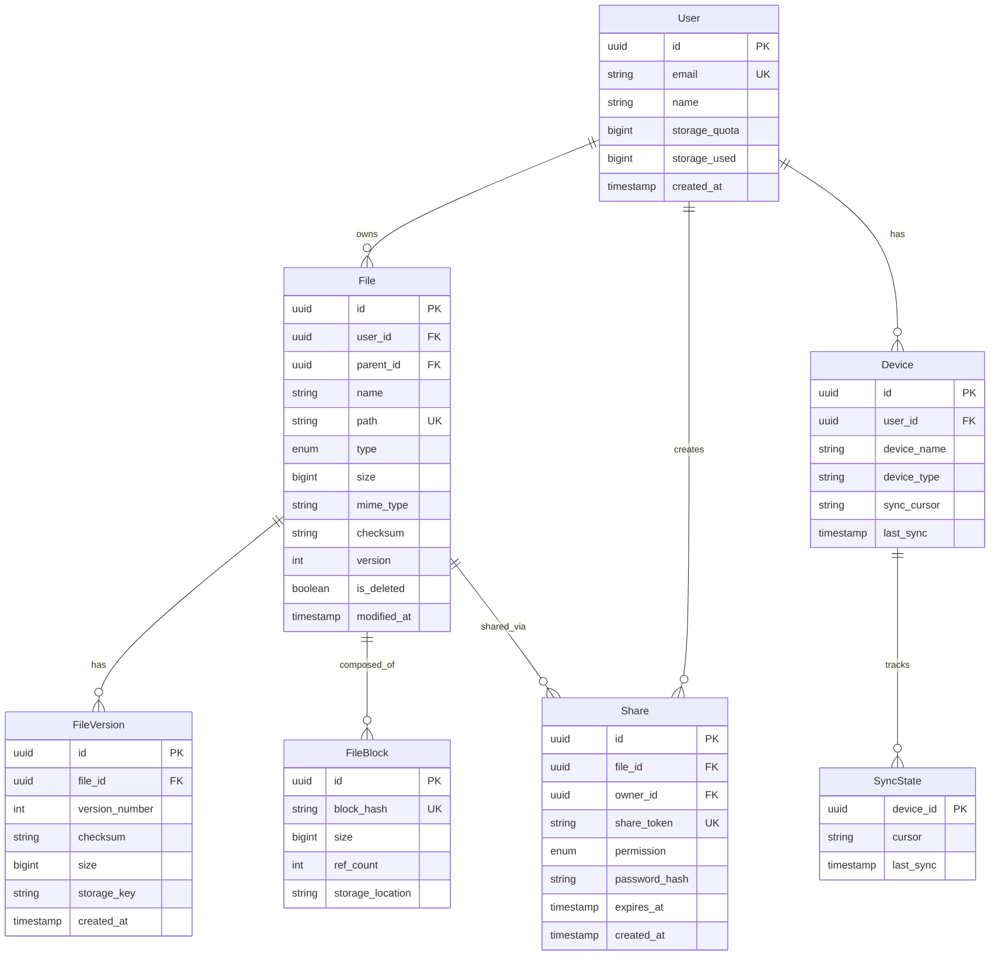

# File Storage System Design (Dropbox/Google Drive)

A comprehensive guide to designing a scalable cloud file storage and synchronization system.

---

## Table of Contents

1. [Problem Statement](#1-problem-statement)
2. [Requirements](#2-requirements)
3. [Back-of-the-Envelope Estimation](#3-back-of-the-envelope-estimation)
4. [API Design](#4-api-design)
5. [Data Model & Database Schema](#5-data-model--database-schema)
6. [High-Level Design](#6-high-level-design)
7. [Detailed Component Design](#7-detailed-component-design)
8. [Identifying and Resolving Bottlenecks](#8-identifying-and-resolving-bottlenecks)
9. [Trade-offs and Alternatives](#9-trade-offs-and-alternatives)
10. [Monitoring, Metrics & Alerts](#10-monitoring-metrics--alerts)
11. [Follow-up Questions & Extensions](#11-follow-up-questions--extensions)
12. [Code Implementation](#12-code-implementation)
13. [References](#13-references)

---

## 1. Problem Statement

Design a file storage and synchronization system like Dropbox or Google Drive that allows users to:
- Upload, download, and delete files
- Sync files across multiple devices
- Share files and folders with other users
- Track file version history
- Search files by name and metadata
- Access files from web, mobile, and desktop clients

**Real-world Examples:**
- Dropbox
- Google Drive
- Microsoft OneDrive
- iCloud Drive

---

## 2. Requirements

### Functional Requirements

1. **File Operations**
   - Upload files (single and batch)
   - Download files
   - Delete files (move to trash, permanent delete)
   - Rename and move files
   - Create folders and nested structures

2. **Synchronization**
   - Auto-sync across devices
   - Conflict resolution (when same file edited on multiple devices)
   - Offline support (queue changes, sync when online)
   - Delta sync (only upload changed blocks, not entire file)

3. **Sharing**
   - Share files/folders via link
   - Grant permissions (view, edit, admin)
   - Expiring share links
   - Password-protected shares

4. **Version Control**
   - Track file versions
   - Restore previous versions
   - Retention: 30 days for free, unlimited for premium

5. **Search**
   - Search by filename
   - Filter by file type, date, size
   - Full-text search within documents (optional)

### Non-Functional Requirements

1. **Scalability**
   - Support 50 million users
   - 1 billion files
   - 10 PB of total storage

2. **Availability**
   - 99.99% uptime
   - Data durability: 99.999999999% (11 nines)
   - Multi-region redundancy

3. **Performance**
   - Upload/download speed: Limited by user bandwidth
   - Sync latency: < 1 second for small files
   - Search results: < 500ms

4. **Consistency**
   - Strong consistency for metadata (file list, permissions)
   - Eventually consistent for file content across devices
   - Last-write-wins for conflict resolution

5. **Security**
   - Encryption at rest (AES-256)
   - Encryption in transit (TLS 1.3)
   - Access control and authentication
   - Audit logging

### Out of Scope

- Collaborative editing (Google Docs-style)
- Desktop client development
- OCR and image recognition
- Integration with third-party apps

---

## 3. Back-of-the-Envelope Estimation

### Assumptions

**Users:**
- Total users: 50 million
- Daily active users (DAU): 10 million (20%)
- Average devices per user: 3
- Total devices: 150 million

**Storage:**
- Average storage per user: 200 GB
- Total storage: 50M × 200 GB = 10 PB (10,000 TB)
- With 3x replication: 30 PB

**File Statistics:**
- Average files per user: 200
- Total files: 50M × 200 = 10 billion files
- Average file size: 1 MB
- File size distribution:
  - Small (< 1 MB): 60%
  - Medium (1-100 MB): 35%
  - Large (> 100 MB): 5%

### Traffic Estimates

**Daily Operations:**
- File uploads: 10M users × 10 files/day = 100M uploads/day
- File downloads: 10M users × 20 files/day = 200M downloads/day
- Sync operations: 10M users × 50 syncs/day = 500M syncs/day

**QPS (Queries Per Second):**
- Upload QPS: 100M / 86,400 ≈ 1,160 QPS (peak: 5,000 QPS)
- Download QPS: 200M / 86,400 ≈ 2,315 QPS (peak: 10,000 QPS)
- Sync QPS: 500M / 86,400 ≈ 5,787 QPS (peak: 25,000 QPS)
- **Total: ~10,000 QPS average, 40,000 QPS peak**

### Bandwidth Estimates

**Upload Bandwidth:**
- 100M uploads/day × 1 MB average = 100 TB/day
- Per second: 100 TB / 86,400s ≈ 1.2 GB/s
- Peak (3x): 3.6 GB/s = 28.8 Gbps

**Download Bandwidth:**
- 200M downloads/day × 1 MB = 200 TB/day
- Per second: 2.4 GB/s
- Peak: 7.2 GB/s = 57.6 Gbps

**Total Bandwidth: ~100 Gbps peak**

### Storage Growth

**Monthly Growth:**
- 100M uploads/day × 1 MB × 30 days = 3 PB/month
- With replication (3x): 9 PB/month

### Cost Estimates (Annual)

**Storage (AWS S3):**
- 30 PB × $0.023/GB/month = $690,000/month × 12 = $8.28M/year

**Bandwidth (Egress):**
- 200 TB/day × 30 × 12 = 72 PB/year
- 72 PB × $0.09/GB = $6.48M/year

**Database (Metadata):**
- 10B file records × 1 KB = 10 TB
- RDS: ~$100K/year

**Compute (API Servers):**
- 500 instances × $100/month = $50K/month = $600K/year

**Total: ~$15-20 million/year**

---

## 4. API Design

### 4.1 File Management APIs

#### 1. Upload File

```http
POST /api/v1/files/upload
Content-Type: multipart/form-data
```

**Request:**
```
file: <binary data>
path: /Photos/vacation.jpg
```

**Response:**
```json
{
  "file_id": "file-abc123",
  "name": "vacation.jpg",
  "path": "/Photos/vacation.jpg",
  "size": 2457600,
  "checksum": "md5:e3b0c44298fc1c149afbf4c8996fb92427ae41e4649b934ca495991b7852b855",
  "version": 1,
  "uploaded_at": "2024-01-15T10:30:00Z",
  "url": "https://cdn.example.com/files/abc123"
}
```

#### 2. Download File

```http
GET /api/v1/files/{file_id}/download
```

**Response:**
```
HTTP/1.1 302 Found
Location: https://cdn.example.com/files/abc123?token=xyz&expires=1705320600
```

Or direct download:
```
HTTP/1.1 200 OK
Content-Type: image/jpeg
Content-Length: 2457600
Content-Disposition: attachment; filename="vacation.jpg"

<binary data>
```

#### 3. List Files

```http
GET /api/v1/files?path=/Photos&limit=100&offset=0
```

**Response:**
```json
{
  "path": "/Photos",
  "total": 245,
  "files": [
    {
      "file_id": "file-abc123",
      "name": "vacation.jpg",
      "path": "/Photos/vacation.jpg",
      "type": "file",
      "size": 2457600,
      "mime_type": "image/jpeg",
      "modified_at": "2024-01-15T10:30:00Z",
      "is_shared": false
    },
    {
      "file_id": "folder-xyz789",
      "name": "Summer 2024",
      "path": "/Photos/Summer 2024",
      "type": "folder",
      "file_count": 42,
      "modified_at": "2024-01-14T15:20:00Z"
    }
  ]
}
```

#### 4. Delete File

```http
DELETE /api/v1/files/{file_id}
```

**Response:**
```json
{
  "file_id": "file-abc123",
  "status": "moved_to_trash",
  "deleted_at": "2024-01-15T11:00:00Z",
  "permanent_deletion_date": "2024-02-14T11:00:00Z"
}
```

### 4.2 Synchronization APIs

#### 5. Get Delta (Changes Since Last Sync)

```http
GET /api/v1/sync/delta?cursor=abc123&limit=1000
```

**Response:**
```json
{
  "cursor": "xyz789",
  "has_more": false,
  "changes": [
    {
      "type": "add",
      "file_id": "file-new123",
      "path": "/Documents/report.pdf",
      "checksum": "md5:...",
      "modified_at": "2024-01-15T10:35:00Z"
    },
    {
      "type": "modify",
      "file_id": "file-abc123",
      "path": "/Photos/vacation.jpg",
      "checksum": "md5:...",
      "modified_at": "2024-01-15T10:40:00Z"
    },
    {
      "type": "delete",
      "file_id": "file-old456",
      "path": "/Temp/old.txt"
    }
  ]
}
```

#### 6. Upload File Chunk (Chunked Upload for Large Files)

```http
POST /api/v1/files/upload/chunk
```

**Request:**
```json
{
  "upload_id": "upload-xyz",
  "chunk_index": 0,
  "total_chunks": 10,
  "checksum": "md5:...",
  "data": "<base64 encoded chunk>"
}
```

**Response:**
```json
{
  "upload_id": "upload-xyz",
  "chunk_index": 0,
  "status": "received",
  "next_chunk": 1
}
```

### 4.3 Sharing APIs

#### 7. Create Share Link

```http
POST /api/v1/shares
```

**Request:**
```json
{
  "file_id": "file-abc123",
  "permission": "view",
  "expires_at": "2024-02-15T00:00:00Z",
  "password": "optional-password"
}
```

**Response:**
```json
{
  "share_id": "share-xyz789",
  "share_url": "https://example.com/s/xyz789",
  "permission": "view",
  "expires_at": "2024-02-15T00:00:00Z",
  "created_at": "2024-01-15T12:00:00Z"
}
```

---

## 5. Data Model & Database Schema

### 5.1 Entity Relationship Diagram



### 5.2 Database Schema (PostgreSQL for Metadata)

```sql
-- Users
CREATE TABLE users (
    id UUID PRIMARY KEY DEFAULT gen_random_uuid(),
    email VARCHAR(255) UNIQUE NOT NULL,
    name VARCHAR(255) NOT NULL,
    password_hash VARCHAR(255) NOT NULL,
    storage_quota BIGINT DEFAULT 10737418240, -- 10 GB
    storage_used BIGINT DEFAULT 0,
    created_at TIMESTAMP DEFAULT CURRENT_TIMESTAMP,
    updated_at TIMESTAMP DEFAULT CURRENT_TIMESTAMP
);

CREATE INDEX idx_users_email ON users(email);

-- Devices
CREATE TABLE devices (
    id UUID PRIMARY KEY DEFAULT gen_random_uuid(),
    user_id UUID NOT NULL REFERENCES users(id) ON DELETE CASCADE,
    device_name VARCHAR(255) NOT NULL,
    device_type VARCHAR(50), -- 'web', 'mobile', 'desktop'
    sync_cursor VARCHAR(255),
    last_sync TIMESTAMP,
    created_at TIMESTAMP DEFAULT CURRENT_TIMESTAMP
);

CREATE INDEX idx_devices_user ON devices(user_id);

-- Files
CREATE TYPE file_type_enum AS ENUM ('file', 'folder');

CREATE TABLE files (
    id UUID PRIMARY KEY DEFAULT gen_random_uuid(),
    user_id UUID NOT NULL REFERENCES users(id) ON DELETE CASCADE,
    parent_id UUID REFERENCES files(id) ON DELETE CASCADE,
    name VARCHAR(255) NOT NULL,
    path TEXT NOT NULL,
    type file_type_enum DEFAULT 'file',
    size BIGINT DEFAULT 0,
    mime_type VARCHAR(100),
    checksum VARCHAR(64), -- MD5 or SHA256
    version INT DEFAULT 1,
    is_deleted BOOLEAN DEFAULT FALSE,
    deleted_at TIMESTAMP,
    created_at TIMESTAMP DEFAULT CURRENT_TIMESTAMP,
    modified_at TIMESTAMP DEFAULT CURRENT_TIMESTAMP,
    UNIQUE(user_id, path)
);

CREATE INDEX idx_files_user ON files(user_id);
CREATE INDEX idx_files_parent ON files(parent_id);
CREATE INDEX idx_files_path ON files(user_id, path);
CREATE INDEX idx_files_modified ON files(modified_at) WHERE is_deleted = FALSE;
CREATE INDEX idx_files_checksum ON files(checksum) WHERE type = 'file';

-- File Versions
CREATE TABLE file_versions (
    id UUID PRIMARY KEY DEFAULT gen_random_uuid(),
    file_id UUID NOT NULL REFERENCES files(id) ON DELETE CASCADE,
    version_number INT NOT NULL,
    checksum VARCHAR(64) NOT NULL,
    size BIGINT NOT NULL,
    storage_key VARCHAR(500) NOT NULL, -- S3 key
    created_at TIMESTAMP DEFAULT CURRENT_TIMESTAMP,
    UNIQUE(file_id, version_number)
);

CREATE INDEX idx_versions_file ON file_versions(file_id, version_number DESC);

-- File Blocks (for deduplication and delta sync)
CREATE TABLE file_blocks (
    id UUID PRIMARY KEY DEFAULT gen_random_uuid(),
    block_hash VARCHAR(64) UNIQUE NOT NULL, -- Content hash
    size INT NOT NULL,
    ref_count INT DEFAULT 1,
    storage_location VARCHAR(500) NOT NULL,
    created_at TIMESTAMP DEFAULT CURRENT_TIMESTAMP
);

CREATE INDEX idx_blocks_hash ON file_blocks(block_hash);

-- File-Block mapping
CREATE TABLE file_block_mapping (
    file_version_id UUID NOT NULL REFERENCES file_versions(id) ON DELETE CASCADE,
    block_id UUID NOT NULL REFERENCES file_blocks(id),
    block_index INT NOT NULL,
    PRIMARY KEY (file_version_id, block_index)
);

-- Shares
CREATE TYPE share_permission_enum AS ENUM ('view', 'edit', 'admin');

CREATE TABLE shares (
    id UUID PRIMARY KEY DEFAULT gen_random_uuid(),
    file_id UUID NOT NULL REFERENCES files(id) ON DELETE CASCADE,
    owner_id UUID NOT NULL REFERENCES users(id),
    share_token VARCHAR(64) UNIQUE NOT NULL,
    permission share_permission_enum DEFAULT 'view',
    password_hash VARCHAR(255),
    expires_at TIMESTAMP,
    created_at TIMESTAMP DEFAULT CURRENT_TIMESTAMP
);

CREATE INDEX idx_shares_token ON shares(share_token);
CREATE INDEX idx_shares_file ON shares(file_id);
CREATE INDEX idx_shares_owner ON shares(owner_id);
```

---

## 6. High-Level Design

### 6.1 Architecture Diagram

```mermaid
graph TB
    subgraph "Client Layer"
        WEB[Web Client]
        MOBILE[Mobile App]
        DESKTOP[Desktop Client]
    end

    subgraph "Load Balancer"
        LB[Application LB]
    end

    subgraph "API Layer"
        API1[API Server 1]
        API2[API Server 2]
        API3[API Server N]
    end

    subgraph "Service Layer"
        META[Metadata Service]
        SYNC[Sync Service]
        BLOCK[Block Service]
        SHARE[Share Service]
    end

    subgraph "Storage Layer"
        S3[(Object Storage<br/>Amazon S3)]
        META_DB[(Metadata DB<br/>PostgreSQL)]
        CACHE[(Redis Cache)]
    end

    subgraph "Message Queue"
        QUEUE[RabbitMQ/SQS]
    end

    subgraph "Background Workers"
        WORKER1[Version Cleanup]
        WORKER2[Block GC]
        WORKER3[Thumbnail Gen]
    end

    subgraph "CDN"
        CDN[CloudFront/CloudFlare]
    end

    WEB --> CDN
    MOBILE --> LB
    DESKTOP --> LB
    CDN --> LB

    LB --> API1
    LB --> API2
    LB --> API3

    API1 --> META
    API1 --> SYNC
    API1 --> BLOCK
    API2 --> META
    API2 --> SYNC

    META --> META_DB
    META --> CACHE
    SYNC --> META_DB
    SYNC --> QUEUE
    BLOCK --> S3
    BLOCK --> META_DB

    QUEUE --> WORKER1
    QUEUE --> WORKER2
    QUEUE --> WORKER3

    style S3 fill:#f96,stroke:#333,stroke-width:2px
    style META_DB fill:#f9f,stroke:#333,stroke-width:2px
    style CACHE fill:#bbf,stroke:#333,stroke-width:2px
```

### 6.2 Component Responsibilities

**1. Metadata Service:**
- File/folder CRUD operations
- Path management
- Storage quota tracking
- Permission checks

**2. Sync Service:**
- Delta calculation (what changed since last sync)
- Conflict resolution
- Cursor management for pagination
- Notify clients of changes

**3. Block Service:**
- Chunking large files
- Deduplication (store each unique block once)
- Delta sync (upload only changed blocks)
- Block assembly for downloads

**4. Share Service:**
- Generate share links
- Access control
- Link expiration
- Password protection

**5. Background Workers:**
- Clean up old versions
- Garbage collect unused blocks
- Generate thumbnails for images/videos

---

## 7. Detailed Component Design

### 7.1 File Upload with Chunking

```python
class ChunkedUpload:
    """Handle large file uploads by splitting into chunks."""

    CHUNK_SIZE = 4 * 1024 * 1024  # 4 MB

    def upload_file(self, file_path: str, user_id: str, dest_path: str) -> dict:
        """
        Upload file in chunks.

        Steps:
        1. Split file into 4MB chunks
        2. Calculate hash for each chunk (content-based deduplication)
        3. Upload only new chunks (skip if hash exists)
        4. Store chunk references in database
        5. Create file metadata
        """

        # Read file and split into chunks
        chunks = self.split_into_chunks(file_path)

        # Calculate hashes
        chunk_hashes = [self.calculate_hash(chunk) for chunk in chunks]

        # Check which chunks already exist (deduplication)
        existing_hashes = self.db.query(
            "SELECT block_hash FROM file_blocks WHERE block_hash = ANY($1)",
            chunk_hashes
        )
        existing_set = set(row['block_hash'] for row in existing_hashes)

        # Upload only new chunks to S3
        uploaded_blocks = []
        for i, (chunk, hash_val) in enumerate(zip(chunks, chunk_hashes)):
            if hash_val in existing_set:
                # Block exists, reuse it
                block = self.db.fetchrow(
                    "SELECT id FROM file_blocks WHERE block_hash = $1",
                    hash_val
                )
                # Increment reference count
                self.db.execute(
                    "UPDATE file_blocks SET ref_count = ref_count + 1 WHERE id = $1",
                    block['id']
                )
                uploaded_blocks.append(block['id'])
            else:
                # Upload new block to S3
                s3_key = f"blocks/{hash_val}"
                self.s3.put_object(Bucket='file-storage', Key=s3_key, Body=chunk)

                # Save block metadata
                block_id = uuid4()
                self.db.execute(
                    """
                    INSERT INTO file_blocks (id, block_hash, size, storage_location)
                    VALUES ($1, $2, $3, $4)
                    """,
                    block_id, hash_val, len(chunk), s3_key
                )
                uploaded_blocks.append(block_id)

        # Create file version
        file_id = uuid4()
        version_id = uuid4()
        file_checksum = self.calculate_hash(b''.join(chunks))

        self.db.execute(
            """
            INSERT INTO files (id, user_id, name, path, size, checksum, version)
            VALUES ($1, $2, $3, $4, $5, $6, 1)
            """,
            file_id, user_id, os.path.basename(dest_path), dest_path,
            sum(len(c) for c in chunks), file_checksum
        )

        self.db.execute(
            """
            INSERT INTO file_versions (id, file_id, version_number, checksum, size, storage_key)
            VALUES ($1, $2, $3, $4, $5, $6)
            """,
            version_id, file_id, 1, file_checksum,
            sum(len(c) for c in chunks), f"versions/{file_id}/v1"
        )

        # Map blocks to version
        for idx, block_id in enumerate(uploaded_blocks):
            self.db.execute(
                """
                INSERT INTO file_block_mapping (file_version_id, block_id, block_index)
                VALUES ($1, $2, $3)
                """,
                version_id, block_id, idx
            )

        return {'file_id': str(file_id), 'version': 1}

    def split_into_chunks(self, file_path: str) -> List[bytes]:
        """Split file into fixed-size chunks."""
        chunks = []
        with open(file_path, 'rb') as f:
            while True:
                chunk = f.read(self.CHUNK_SIZE)
                if not chunk:
                    break
                chunks.append(chunk)
        return chunks

    def calculate_hash(self, data: bytes) -> str:
        """Calculate SHA256 hash of data."""
        import hashlib
        return hashlib.sha256(data).hexdigest()
```

### 7.2 Delta Sync Algorithm

```python
class SyncService:
    """Calculate delta (changes since last sync)."""

    def get_delta(self, user_id: str, device_id: str, cursor: str = None) -> dict:
        """
        Get changes since last sync.

        Cursor-based pagination for incremental sync.
        """

        # Get device's last sync cursor
        if not cursor:
            device = self.db.fetchrow(
                "SELECT sync_cursor FROM devices WHERE id = $1",
                device_id
            )
            cursor = device['sync_cursor'] if device else '0'

        # Cursor is a timestamp or sequence number
        last_sync_time = self.decode_cursor(cursor)

        # Get all changes since last sync
        changes = self.db.fetch(
            """
            SELECT
                id, name, path, type, checksum, size, modified_at, is_deleted,
                modified_at > $2 as is_new
            FROM files
            WHERE user_id = $1 AND modified_at > $2
            ORDER BY modified_at ASC
            LIMIT 1000
            """,
            user_id, last_sync_time
        )

        # Convert to delta format
        delta_changes = []
        for change in changes:
            if change['is_deleted']:
                delta_changes.append({
                    'type': 'delete',
                    'file_id': str(change['id']),
                    'path': change['path']
                })
            else:
                delta_changes.append({
                    'type': 'add' if change['is_new'] else 'modify',
                    'file_id': str(change['id']),
                    'path': change['path'],
                    'checksum': change['checksum'],
                    'size': change['size'],
                    'modified_at': change['modified_at'].isoformat()
                })

        # Generate new cursor
        new_cursor = self.encode_cursor(changes[-1]['modified_at']) if changes else cursor

        # Update device sync state
        self.db.execute(
            "UPDATE devices SET sync_cursor = $1, last_sync = NOW() WHERE id = $2",
            new_cursor, device_id
        )

        return {
            'cursor': new_cursor,
            'has_more': len(changes) == 1000,
            'changes': delta_changes
        }

    def encode_cursor(self, timestamp: datetime) -> str:
        """Encode timestamp as base64 cursor."""
        import base64
        return base64.b64encode(str(timestamp.timestamp()).encode()).decode()

    def decode_cursor(self, cursor: str) -> datetime:
        """Decode cursor to timestamp."""
        import base64
        timestamp = float(base64.b64decode(cursor).decode())
        return datetime.fromtimestamp(timestamp)
```

### 7.3 Conflict Resolution

```python
class ConflictResolver:
    """Resolve conflicts when same file edited on multiple devices."""

    def resolve_conflict(
        self,
        file_id: str,
        local_checksum: str,
        local_modified: datetime
    ) -> dict:
        """
        Resolve conflict using Last-Write-Wins strategy.

        Alternative strategies:
        - Keep both versions (create conflicted copy)
        - Manual merge
        """

        # Get current server version
        server_file = self.db.fetchrow(
            "SELECT checksum, modified_at, version FROM files WHERE id = $1",
            file_id
        )

        # Check if conflict exists
        if local_checksum != server_file['checksum']:
            # Conflict detected!

            if local_modified > server_file['modified_at']:
                # Local version is newer - accept local
                return {
                    'resolution': 'accept_local',
                    'action': 'upload',
                    'message': 'Local version is newer'
                }
            else:
                # Server version is newer - reject local
                return {
                    'resolution': 'reject_local',
                    'action': 'download',
                    'message': 'Server version is newer',
                    'server_checksum': server_file['checksum']
                }

        # No conflict
        return {'resolution': 'no_conflict'}

    def create_conflicted_copy(self, file_id: str, device_name: str) -> dict:
        """
        Alternative: Create a conflicted copy instead of overwriting.

        Example: "document.txt" -> "document (Device Name's conflicted copy).txt"
        """

        file = self.db.fetchrow("SELECT name, path, user_id FROM files WHERE id = $1", file_id)

        # Generate conflict name
        base_name, ext = os.path.splitext(file['name'])
        conflict_name = f"{base_name} ({device_name}'s conflicted copy){ext}"
        conflict_path = file['path'].replace(file['name'], conflict_name)

        # Create new file entry
        conflict_id = uuid4()
        self.db.execute(
            """
            INSERT INTO files (id, user_id, name, path, ...)
            SELECT $1, user_id, $2, $3, ...
            FROM files WHERE id = $4
            """,
            conflict_id, conflict_name, conflict_path, file_id
        )

        return {
            'resolution': 'conflicted_copy',
            'conflict_file_id': str(conflict_id),
            'conflict_path': conflict_path
        }
```

### 7.4 Storage Optimization with Deduplication

```python
class Deduplication:
    """Content-based deduplication to save storage."""

    def check_duplicate(self, file_checksum: str, user_id: str) -> Optional[str]:
        """
        Check if file with same content already exists.

        If yes, create reference instead of uploading again.
        """

        # Search for file with same checksum
        existing = self.db.fetchrow(
            """
            SELECT fv.storage_key
            FROM files f
            JOIN file_versions fv ON f.id = fv.file_id
            WHERE f.checksum = $1
            LIMIT 1
            """,
            file_checksum
        )

        if existing:
            # File content already exists, reuse storage
            return existing['storage_key']

        return None  # Upload needed

    def create_reference(self, user_id: str, file_path: str, storage_key: str):
        """Create file metadata that references existing storage."""

        file_id = uuid4()
        self.db.execute(
            """
            INSERT INTO files (id, user_id, path, ...)
            VALUES ($1, $2, $3, ...)
            """,
            file_id, user_id, file_path
        )

        # Point to existing storage location
        self.db.execute(
            """
            INSERT INTO file_versions (file_id, storage_key, ...)
            VALUES ($1, $2, ...)
            """,
            file_id, storage_key
        )
```

---

## 8. Identifying and Resolving Bottlenecks

### 8.1 Potential Bottlenecks

| Bottleneck | Impact | Solution |
|------------|--------|----------|
| **Upload/Download Speed** | User experience | CDN, multi-region S3, parallel chunking |
| **Metadata Database** | Slow file listings | Caching, read replicas, sharding by user |
| **Storage Costs** | High costs at scale | Deduplication, compression, lifecycle policies |
| **Sync Latency** | Stale data on devices | WebSocket for real-time notifications |

### 8.2 Scaling Storage

**Problem:** 10 PB storage across 50M users is expensive.

**Solutions:**

1. **Tiered Storage:**
```python
# Move old files to cheaper storage class
aws s3 lifecycle-policy:
  - transition: STANDARD -> STANDARD_IA (30 days)
  - transition: STANDARD_IA -> GLACIER (90 days)
  - delete: DEEP_ARCHIVE after 365 days (if deleted)
```

2. **Deduplication Savings:**
- Average deduplication ratio: 30-40%
- 10 PB → 6-7 PB after dedup
- Savings: $3-4M/year

3. **Compression:**
```python
# Compress before upload
compressed = gzip.compress(file_data)
# Typically 50-70% reduction for text files
```

### 8.3 Database Sharding

**Shard by User ID:**
```python
def get_shard(user_id: str) -> Database:
    """Route user to specific database shard."""
    shard_number = hash(user_id) % NUM_SHARDS
    return database_shards[shard_number]

# Benefits:
# - Isolate user data
# - Easier to scale horizontally
# - Better query performance
```

---

## 9. Trade-offs and Alternatives

### 9.1 Consistency Model

| Model | Pros | Cons | Use Case |
|-------|------|------|----------|
| **Strong Consistency** | Always up-to-date | Higher latency, less available | Banking, legal docs |
| **Eventual Consistency** | Low latency, highly available | Temporary inconsistencies | File storage ✅ |

**Decision:** Eventual consistency for file content (acceptable), strong consistency for metadata.

### 9.2 Storage Backend

| Option | Pros | Cons |
|--------|------|------|
| **Amazon S3** | Scalable, durable (11 nines), cheap | Vendor lock-in |
| **Self-hosted (Ceph)** | Full control, no egress fees | Complex operations |
| **Azure Blob** | Similar to S3 | Slightly more expensive |

**Decision:** S3 for reliability and cost-effectiveness.

### 9.3 Sync Strategy

| Strategy | Pros | Cons |
|----------|------|------|
| **Polling** | Simple | Wasteful, high latency |
| **Long Polling** | Better than polling | Still inefficient |
| **WebSocket** | Real-time, efficient | Complex to scale |
| **Server-Sent Events (SSE)** | Simpler than WebSocket | One-way only |

**Decision:** WebSocket for desktop/mobile, SSE for web.

---

## 10. Monitoring, Metrics & Alerts

### 10.1 Key Metrics

```python
metrics = {
    # User Metrics
    'active_users': Gauge(),
    'storage_used_bytes': Gauge(labels=['user_tier']),

    # Performance
    'upload_duration_seconds': Histogram(labels=['file_size_bucket']),
    'download_duration_seconds': Histogram(),
    'sync_latency_seconds': Histogram(),

    # Storage
    'total_files': Counter(),
    'total_storage_bytes': Counter(),
    'deduplication_ratio': Gauge(),

    # Errors
    'upload_failures': Counter(labels=['error_type']),
    'sync_conflicts': Counter(),
}
```

### 10.2 Alerts

```yaml
alerts:
  - name: HighUploadFailureRate
    condition: upload_failures / total_uploads > 0.05
    severity: critical

  - name: StorageAlmostFull
    condition: storage_used / storage_quota > 0.90
    severity: warning

  - name: SyncLatencyHigh
    condition: p95(sync_latency_seconds) > 5
    severity: warning
```

---

## 11. Follow-up Questions & Extensions

### Q1: "How would you add collaborative editing like Google Docs?"

**Answer:** Use Operational Transformation (OT) or CRDTs:
```python
# Track character-level edits
class Edit:
    position: int
    insert: str
    delete: int
    timestamp: datetime
    user_id: str

# Resolve conflicts
def apply_ot(local_edits, remote_edits):
    # Transform operations to account for concurrent edits
    pass
```

### Q2: "How would you implement file sharing with granular permissions?"

```sql
CREATE TABLE file_permissions (
    file_id UUID,
    user_id UUID,
    permission VARCHAR(20), -- 'view', 'edit', 'comment'
    granted_by UUID,
    granted_at TIMESTAMP
);
```

### Q3: "How would you add full-text search within documents?"

**Answer:** Use Elasticsearch:
```python
# Extract text from PDFs, docs
text = extract_text(file_path)

# Index in Elasticsearch
es.index(index='files', body={
    'file_id': file_id,
    'content': text,
    'name': filename
})

# Search
results = es.search(index='files', body={
    'query': {'match': {'content': search_query}}
})
```

---

## 12. Code Implementation

```python
# file_service.py
from typing import List, Optional
import hashlib
from uuid import uuid4
from datetime import datetime

class FileService:
    """Core file storage operations."""

    def __init__(self, db, s3_client):
        self.db = db
        self.s3 = s3_client
        self.CHUNK_SIZE = 4 * 1024 * 1024  # 4 MB

    async def upload_file(self, user_id: str, file_data: bytes, path: str) -> dict:
        """Upload file with deduplication and versioning."""

        # Calculate checksums
        file_checksum = hashlib.sha256(file_data).hexdigest()
        chunks = self.split_into_chunks(file_data)
        chunk_hashes = [hashlib.sha256(c).hexdigest() for c in chunks]

        # Check for deduplication
        existing_blocks = await self.db.fetch(
            "SELECT id, block_hash FROM file_blocks WHERE block_hash = ANY($1)",
            chunk_hashes
        )
        existing_map = {b['block_hash']: b['id'] for b in existing_blocks}

        # Upload new blocks
        block_ids = []
        for chunk, hash_val in zip(chunks, chunk_hashes):
            if hash_val in existing_map:
                # Reuse existing block
                block_id = existing_map[hash_val]
                await self.db.execute(
                    "UPDATE file_blocks SET ref_count = ref_count + 1 WHERE id = $1",
                    block_id
                )
                block_ids.append(block_id)
            else:
                # Upload new block
                s3_key = f"blocks/{hash_val}"
                await self.s3.put_object(Bucket='files', Key=s3_key, Body=chunk)

                block_id = uuid4()
                await self.db.execute(
                    """
                    INSERT INTO file_blocks (id, block_hash, size, storage_location)
                    VALUES ($1, $2, $3, $4)
                    """,
                    block_id, hash_val, len(chunk), s3_key
                )
                block_ids.append(block_id)

        # Create file record
        file_id = uuid4()
        await self.db.execute(
            """
            INSERT INTO files (id, user_id, name, path, size, checksum, type)
            VALUES ($1, $2, $3, $4, $5, $6, 'file')
            """,
            file_id, user_id, path.split('/')[-1], path, len(file_data), file_checksum
        )

        # Create version
        version_id = uuid4()
        await self.db.execute(
            """
            INSERT INTO file_versions (id, file_id, version_number, checksum, size, storage_key)
            VALUES ($1, $2, 1, $3, $4, $5)
            """,
            version_id, file_id, file_checksum, len(file_data), f"versions/{file_id}/v1"
        )

        # Map blocks
        for idx, block_id in enumerate(block_ids):
            await self.db.execute(
                """
                INSERT INTO file_block_mapping (file_version_id, block_id, block_index)
                VALUES ($1, $2, $3)
                """,
                version_id, block_id, idx
            )

        # Update storage quota
        await self.db.execute(
            "UPDATE users SET storage_used = storage_used + $1 WHERE id = $2",
            len(file_data), user_id
        )

        return {
            'file_id': str(file_id),
            'version': 1,
            'checksum': file_checksum,
            'size': len(file_data)
        }

    def split_into_chunks(self, data: bytes) -> List[bytes]:
        """Split data into chunks."""
        return [data[i:i + self.CHUNK_SIZE]
                for i in range(0, len(data), self.CHUNK_SIZE)]

    async def download_file(self, file_id: str, user_id: str) -> bytes:
        """Download file by assembling blocks."""

        # Verify ownership
        file = await self.db.fetchrow(
            "SELECT id FROM files WHERE id = $1 AND user_id = $2",
            file_id, user_id
        )
        if not file:
            raise PermissionError("File not found or access denied")

        # Get latest version
        version = await self.db.fetchrow(
            """
            SELECT id FROM file_versions
            WHERE file_id = $1
            ORDER BY version_number DESC
            LIMIT 1
            """,
            file_id
        )

        # Get blocks in order
        blocks = await self.db.fetch(
            """
            SELECT fb.storage_location, fbm.block_index
            FROM file_block_mapping fbm
            JOIN file_blocks fb ON fbm.block_id = fb.id
            WHERE fbm.file_version_id = $1
            ORDER BY fbm.block_index
            """,
            version['id']
        )

        # Download and assemble
        file_data = b''
        for block in blocks:
            obj = await self.s3.get_object(Bucket='files', Key=block['storage_location'])
            file_data += await obj['Body'].read()

        return file_data
```

---

## 13. References

1. **"Designing Data-Intensive Applications" by Martin Kleppmann** - Consistency models
2. **Dropbox Tech Blog** - https://dropbox.tech/infrastructure/inside-the-magic-pocket
3. **AWS S3 Documentation** - https://docs.aws.amazon.com/s3/
4. **Google Drive Architecture** - Content-based chunking and deduplication

---

**Last Updated:** December 2024
**Difficulty:** Beginner
**Estimated Interview Time:** 45-60 minutes
