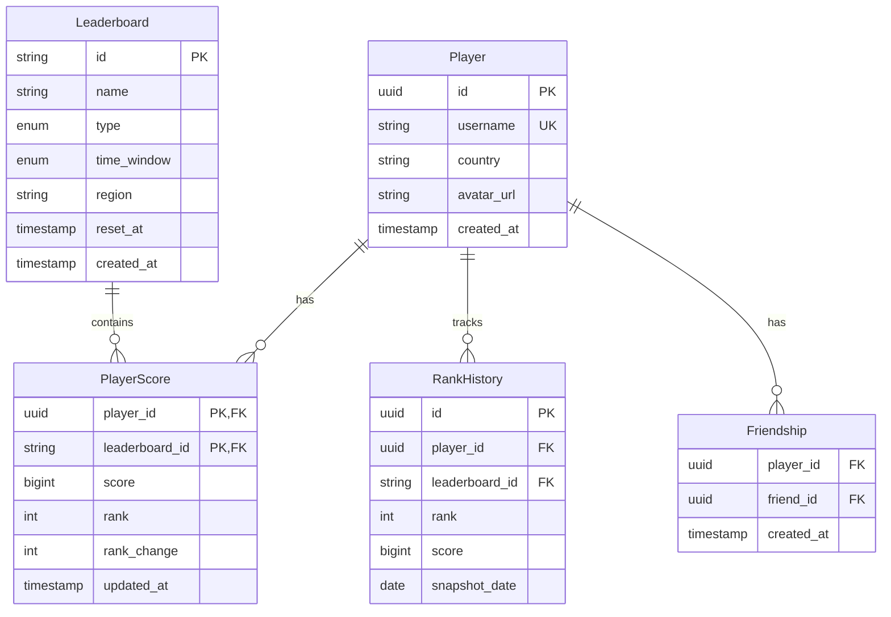
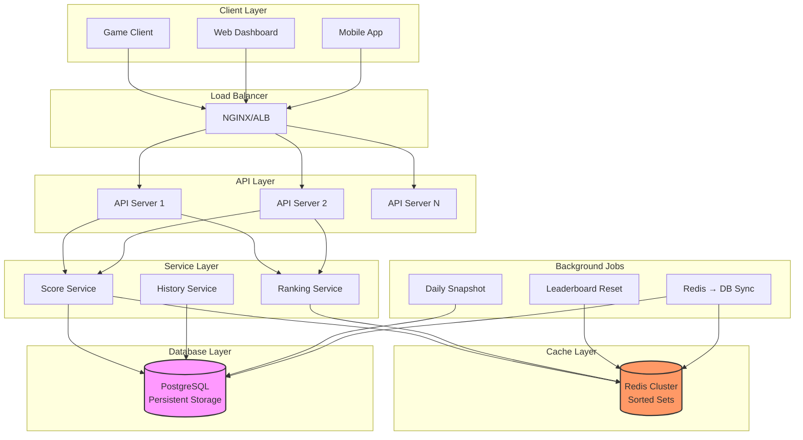

# Leaderboard System Design

A comprehensive guide to designing a scalable, real-time leaderboard system for gaming and competitive applications.

---

## Table of Contents

1. [Problem Statement](#1-problem-statement)
2. [Requirements](#2-requirements)
3. [Back-of-the-Envelope Estimation](#3-back-of-the-envelope-estimation)
4. [API Design](#4-api-design)
5. [Data Model & Database Schema](#5-data-model--database-schema)
6. [High-Level Design](#6-high-level-design)
7. [Detailed Component Design](#7-detailed-component-design)
8. [Identifying and Resolving Bottlenecks](#8-identifying-and-resolving-bottlenecks)
9. [Trade-offs and Alternatives](#9-trade-offs-and-alternatives)
10. [Monitoring, Metrics & Alerts](#10-monitoring-metrics--alerts)
11. [Follow-up Questions & Extensions](#11-follow-up-questions--extensions)
12. [Code Implementation](#12-code-implementation)
13. [References](#13-references)

---

## 1. Problem Statement

Design a leaderboard system that can:
- Track player scores in real-time
- Display top N players (e.g., top 100)
- Show a player's rank efficiently
- Support multiple leaderboard types (global, regional, friends)
- Handle high score update frequency
- Provide historical rankings
- Support different time windows (daily, weekly, monthly, all-time)

**Real-world Examples:**
- Game leaderboards (Candy Crush, Clash of Clans)
- Sports rankings (tennis ATP rankings, Formula 1 standings)
- Competitive platforms (Codeforces, LeetCode)
- Social media metrics (most viewed, trending)

---

## 2. Requirements

### Functional Requirements

1. **Score Updates**
   - Update player scores in real-time
   - Increment score (e.g., +100 points)
   - Set absolute score
   - Batch updates for multiple players

2. **Ranking Queries**
   - Get top N players (e.g., top 100)
   - Get player's current rank
   - Get players around a specific rank (e.g., rank 95-105)
   - Get player's percentile

3. **Leaderboard Types**
   - Global leaderboard (all players)
   - Regional leaderboards (by country, state)
   - Friends leaderboard (social connections)
   - Custom segments (VIP, beginners, etc.)

4. **Time Windows**
   - Real-time (current scores)
   - Daily leaderboard (resets daily)
   - Weekly, monthly leaderboards
   - All-time leaderboard

5. **Historical Data**
   - View previous leaderboards (last week's winners)
   - Track rank changes over time
   - Personal best scores

### Non-Functional Requirements

1. **Scalability**
   - Support 50 million players
   - Handle 100,000 score updates/second
   - Millions of ranking queries/second

2. **Performance**
   - Score update: < 100ms
   - Get top N: < 50ms
   - Get player rank: < 100ms
   - Real-time rank updates (< 1 second staleness)

3. **Availability**
   - 99.9% uptime
   - Eventual consistency acceptable
   - Graceful degradation during peak load

4. **Accuracy**
   - Rankings must be accurate (no duplicate ranks)
   - Score updates must not be lost
   - Handle ties appropriately

### Out of Scope

- Anti-cheat mechanisms
- Matchmaking based on rank
- Reward distribution
- Social features (follow, chat)

---

## 3. Back-of-the-Envelope Estimation

### Assumptions

**Players:**
- Total players: 50 million
- Daily active players (DAU): 5 million (10%)
- Concurrent players (peak): 500,000

**Score Updates:**
- Updates per player per session: 50
- Daily score updates: 5M players × 50 = 250M updates/day
- Updates per second: 250M / 86,400s ≈ 2,900 updates/sec
- Peak (3x): 8,700 updates/sec

**Ranking Queries:**
- Queries per player per session: 10
- Daily ranking queries: 5M × 10 = 50M queries/day
- Queries per second: 50M / 86,400s ≈ 580 QPS
- Peak: 1,740 QPS

**Total QPS: ~10,000 QPS (manageable)**

### Storage Estimates

**Current Scores:**
- Player score entry: 100 bytes (player_id, score, rank, timestamp)
- Total players: 50M × 100 bytes = 5 GB

**Historical Data:**
- Daily snapshots: 5 GB/day
- Monthly retention: 5 GB × 30 = 150 GB
- Yearly: ~1.8 TB

**Total Storage: ~2 TB (very manageable)**

### Memory Estimates (Redis)

**Hot Data (Top Players):**
- Top 10,000 players per leaderboard: 10K × 100 bytes = 1 MB
- 100 leaderboards (different regions, time windows): 100 MB
- With safety margin: 1 GB

**All Active Players (for quick rank lookup):**
- 5M active × 100 bytes = 500 MB
- Multiple leaderboards: ~5 GB total

**Conclusion:** Redis can easily fit all hot data in memory.

---

## 4. API Design

### 4.1 Score Management APIs

#### 1. Update Score

```http
POST /api/v1/leaderboard/{leaderboard_id}/score
```

**Request:**
```json
{
  "player_id": "player-123",
  "score": 1500,
  "operation": "increment"  // or "set"
}
```

**Response:**
```json
{
  "player_id": "player-123",
  "new_score": 2500,
  "rank": 42,
  "rank_change": +5,
  "percentile": 99.5
}
```

#### 2. Batch Update Scores

```http
POST /api/v1/leaderboard/{leaderboard_id}/scores/batch
```

**Request:**
```json
{
  "updates": [
    {"player_id": "player-123", "score": 100},
    {"player_id": "player-456", "score": 200},
    {"player_id": "player-789", "score": 150}
  ]
}
```

**Response:**
```json
{
  "updated_count": 3,
  "failed": []
}
```

### 4.2 Ranking Query APIs

#### 3. Get Top Players

```http
GET /api/v1/leaderboard/{leaderboard_id}/top?limit=100&offset=0
```

**Response:**
```json
{
  "leaderboard_id": "global-alltime",
  "updated_at": "2024-01-15T10:30:00Z",
  "total_players": 50000000,
  "rankings": [
    {
      "rank": 1,
      "player_id": "player-999",
      "player_name": "ProGamer123",
      "score": 999999,
      "country": "US",
      "avatar_url": "/avatars/player-999.jpg"
    },
    {
      "rank": 2,
      "player_id": "player-888",
      "player_name": "ElitePlayer",
      "score": 888888,
      "country": "KR",
      "avatar_url": "/avatars/player-888.jpg"
    }
  ]
}
```

#### 4. Get Player Rank

```http
GET /api/v1/leaderboard/{leaderboard_id}/player/{player_id}/rank
```

**Response:**
```json
{
  "player_id": "player-123",
  "player_name": "JohnDoe",
  "score": 15000,
  "rank": 1542,
  "total_players": 50000000,
  "percentile": 99.997,
  "rank_change_24h": +23,
  "peak_rank": 1234,
  "peak_rank_date": "2024-01-10"
}
```

#### 5. Get Players Around Rank

```http
GET /api/v1/leaderboard/{leaderboard_id}/around/{rank}?range=5
```

**Response:**
```json
{
  "center_rank": 100,
  "range": 5,
  "rankings": [
    {"rank": 95, "player_id": "...", "score": 50000},
    {"rank": 96, "player_id": "...", "score": 49500},
    "...",
    {"rank": 100, "player_id": "...", "score": 48000},
    "...",
    {"rank": 105, "player_id": "...", "score": 46500}
  ]
}
```

#### 6. Get Friends Leaderboard

```http
GET /api/v1/leaderboard/{leaderboard_id}/friends?player_id=player-123
```

**Response:**
```json
{
  "rankings": [
    {"rank": 1, "player_id": "friend-1", "score": 25000},
    {"rank": 2, "player_id": "player-123", "score": 15000},
    {"rank": 3, "player_id": "friend-2", "score": 12000}
  ]
}
```

---

## 5. Data Model & Database Schema

### 5.1 Entity Relationship Diagram



### 5.2 Database Schema

**PostgreSQL (Persistent Storage):**

```sql
-- Players
CREATE TABLE players (
    id UUID PRIMARY KEY DEFAULT gen_random_uuid(),
    username VARCHAR(50) UNIQUE NOT NULL,
    email VARCHAR(255) UNIQUE NOT NULL,
    country CHAR(2),  -- ISO country code
    avatar_url VARCHAR(500),
    created_at TIMESTAMP DEFAULT CURRENT_TIMESTAMP
);

CREATE INDEX idx_players_country ON players(country);

-- Leaderboards
CREATE TYPE leaderboard_type_enum AS ENUM ('global', 'regional', 'friends');
CREATE TYPE time_window_enum AS ENUM ('realtime', 'daily', 'weekly', 'monthly', 'alltime');

CREATE TABLE leaderboards (
    id VARCHAR(100) PRIMARY KEY,  -- e.g., 'global-alltime', 'us-daily'
    name VARCHAR(255) NOT NULL,
    type leaderboard_type_enum NOT NULL,
    time_window time_window_enum NOT NULL,
    region VARCHAR(50),
    reset_at TIMESTAMP,
    created_at TIMESTAMP DEFAULT CURRENT_TIMESTAMP
);

-- Player Scores (main table)
CREATE TABLE player_scores (
    player_id UUID NOT NULL REFERENCES players(id),
    leaderboard_id VARCHAR(100) NOT NULL REFERENCES leaderboards(id),
    score BIGINT NOT NULL DEFAULT 0,
    rank INT,
    rank_change INT DEFAULT 0,
    updated_at TIMESTAMP DEFAULT CURRENT_TIMESTAMP,
    PRIMARY KEY (player_id, leaderboard_id)
);

CREATE INDEX idx_scores_leaderboard ON player_scores(leaderboard_id, score DESC);
CREATE INDEX idx_scores_rank ON player_scores(leaderboard_id, rank);

-- Rank History (snapshots)
CREATE TABLE rank_history (
    id UUID PRIMARY KEY DEFAULT gen_random_uuid(),
    player_id UUID NOT NULL REFERENCES players(id),
    leaderboard_id VARCHAR(100) NOT NULL REFERENCES leaderboards(id),
    rank INT NOT NULL,
    score BIGINT NOT NULL,
    snapshot_date DATE NOT NULL,
    created_at TIMESTAMP DEFAULT CURRENT_TIMESTAMP,
    UNIQUE(player_id, leaderboard_id, snapshot_date)
);

CREATE INDEX idx_history_player ON rank_history(player_id, leaderboard_id, snapshot_date DESC);

-- Friendships
CREATE TABLE friendships (
    player_id UUID NOT NULL REFERENCES players(id),
    friend_id UUID NOT NULL REFERENCES players(id),
    created_at TIMESTAMP DEFAULT CURRENT_TIMESTAMP,
    PRIMARY KEY (player_id, friend_id),
    CHECK (player_id < friend_id)  -- Prevent duplicates
);

CREATE INDEX idx_friendships_player ON friendships(player_id);
```

**Redis (In-Memory Cache):**

```
# Sorted Set for each leaderboard (key = leaderboard_id)
ZADD global-alltime 999999 player-999
ZADD global-alltime 888888 player-888
...

# Player metadata (Hash)
HSET player:player-123 username "JohnDoe" country "US" score 15000

# Rank cache (String with TTL)
SET rank:global-alltime:player-123 1542 EX 60  # Expire in 60s
```

---

## 6. High-Level Design

### 6.1 Architecture Diagram



### 6.2 Data Flow

**Score Update Flow:**
1. Client sends score update to API server
2. API server validates request
3. Score Service updates Redis sorted set (ZINCRBY)
4. Score Service asynchronously updates PostgreSQL
5. Return new rank to client

**Ranking Query Flow:**
1. Client requests top N players
2. Ranking Service queries Redis (ZREVRANGE)
3. Return results (from cache, < 50ms)
4. Optionally enrich with player metadata from PostgreSQL

**Why Redis?**
- O(log N) insert/update with sorted sets
- O(1) rank lookup with ZRANK
- O(log N + M) range queries
- Handles millions of operations/second

---

## 7. Detailed Component Design

### 7.1 Redis Sorted Set Operations

```python
class LeaderboardService:
    """Core leaderboard operations using Redis."""

    def __init__(self, redis_client):
        self.redis = redis_client

    def update_score(self, leaderboard_id: str, player_id: str, score: int) -> dict:
        """
        Update player score in leaderboard.

        Redis Sorted Set:
        - Member: player_id
        - Score: player score (for ranking)
        """

        # Increment score (or use ZADD for absolute set)
        new_score = self.redis.zincrby(leaderboard_id, score, player_id)

        # Get player's new rank (0-indexed, so add 1)
        rank = self.redis.zrevrank(leaderboard_id, player_id) + 1

        # Get total players
        total_players = self.redis.zcard(leaderboard_id)

        # Calculate percentile
        percentile = ((total_players - rank) / total_players) * 100

        return {
            'player_id': player_id,
            'new_score': int(new_score),
            'rank': rank,
            'total_players': total_players,
            'percentile': round(percentile, 2)
        }

    def get_top_n(self, leaderboard_id: str, n: int = 100, offset: int = 0) -> list:
        """
        Get top N players from leaderboard.

        ZREVRANGE returns members in descending order by score.
        """

        # Get top players with scores
        results = self.redis.zrevrange(
            leaderboard_id,
            offset,
            offset + n - 1,
            withscores=True
        )

        # Format response
        rankings = []
        for idx, (player_id, score) in enumerate(results):
            rankings.append({
                'rank': offset + idx + 1,
                'player_id': player_id.decode('utf-8'),
                'score': int(score)
            })

        return rankings

    def get_player_rank(self, leaderboard_id: str, player_id: str) -> dict:
        """
        Get player's rank and score.

        O(log N) complexity.
        """

        # Get rank (0-indexed)
        rank = self.redis.zrevrank(leaderboard_id, player_id)

        if rank is None:
            return {'error': 'Player not found in leaderboard'}

        # Get score
        score = self.redis.zscore(leaderboard_id, player_id)

        # Get total players
        total_players = self.redis.zcard(leaderboard_id)

        return {
            'rank': rank + 1,  # 1-indexed
            'score': int(score),
            'total_players': total_players,
            'percentile': round(((total_players - rank - 1) / total_players) * 100, 2)
        }

    def get_players_around_rank(
        self,
        leaderboard_id: str,
        rank: int,
        range_size: int = 5
    ) -> list:
        """
        Get players around a specific rank.

        Example: rank=100, range=5 → returns ranks 95-105
        """

        start = max(0, rank - range_size - 1)
        end = rank + range_size - 1

        return self.get_top_n(leaderboard_id, n=end - start + 1, offset=start)

    def get_friends_leaderboard(
        self,
        leaderboard_id: str,
        player_id: str,
        friend_ids: List[str]
    ) -> list:
        """
        Get leaderboard filtered to player and their friends.
        """

        # Get scores for player and friends
        all_ids = [player_id] + friend_ids

        # Batch get scores (pipeline for efficiency)
        pipe = self.redis.pipeline()
        for pid in all_ids:
            pipe.zscore(leaderboard_id, pid)
        scores = pipe.execute()

        # Combine and sort
        friends_scores = [
            {'player_id': pid, 'score': int(score or 0)}
            for pid, score in zip(all_ids, scores)
            if score is not None
        ]

        friends_scores.sort(key=lambda x: x['score'], reverse=True)

        # Add ranks
        for idx, item in enumerate(friends_scores):
            item['rank'] = idx + 1

        return friends_scores
```

### 7.2 Handling Ties

**Problem:** Multiple players with same score - how to rank?

**Solutions:**

**Option 1: Dense Ranking (1, 2, 2, 3)**
```python
def get_top_with_dense_ranking(leaderboard_id: str, n: int) -> list:
    """
    Players with same score get same rank.
    Next rank continues sequentially.
    """
    results = redis.zrevrange(leaderboard_id, 0, n-1, withscores=True)

    rankings = []
    current_rank = 1
    prev_score = None

    for player_id, score in results:
        if score != prev_score:
            current_rank = len(rankings) + 1
        rankings.append({
            'rank': current_rank,
            'player_id': player_id,
            'score': score
        })
        prev_score = score

    return rankings
```

**Option 2: Tie-Breaking by Timestamp (who scored first)**
```python
# Store score as composite: score.timestamp
composite_score = score + (timestamp / 1e10)  # Preserve precision
redis.zadd(leaderboard_id, {player_id: composite_score})

# Earlier timestamp gets higher sub-ranking
```

**Option 3: Standard Competition Ranking (1, 2, 2, 4)**
```python
# Skip ranks after ties (most common in sports)
current_rank = 1
for idx, (player_id, score) in enumerate(results):
    if score != prev_score:
        current_rank = idx + 1
    # ...
```

### 7.3 Time-Based Leaderboards

```python
class TimeBasedLeaderboard:
    """Handle daily/weekly/monthly leaderboards with resets."""

    def get_leaderboard_id(self, base: str, time_window: str) -> str:
        """
        Generate time-specific leaderboard ID.

        Examples:
        - global-daily-2024-01-15
        - global-weekly-2024-W03
        - global-monthly-2024-01
        """

        today = date.today()

        if time_window == 'daily':
            return f"{base}-daily-{today.isoformat()}"
        elif time_window == 'weekly':
            week_num = today.isocalendar()[1]
            return f"{base}-weekly-{today.year}-W{week_num:02d}"
        elif time_window == 'monthly':
            return f"{base}-monthly-{today.strftime('%Y-%m')}"
        else:
            return f"{base}-alltime"

    def update_score_all_windows(
        self,
        player_id: str,
        score: int,
        base_leaderboard: str = 'global'
    ):
        """
        Update score across all time windows.

        When player scores, update:
        - All-time leaderboard
        - Monthly leaderboard
        - Weekly leaderboard
        - Daily leaderboard
        """

        windows = ['alltime', 'monthly', 'weekly', 'daily']

        for window in windows:
            leaderboard_id = self.get_leaderboard_id(base_leaderboard, window)
            self.update_score(leaderboard_id, player_id, score)

    def reset_leaderboard(self, leaderboard_id: str):
        """
        Reset leaderboard (for daily/weekly/monthly).

        Called by background job at midnight/week-start/month-start.
        """

        # Snapshot current leaderboard to database
        self.snapshot_to_db(leaderboard_id)

        # Clear Redis sorted set
        self.redis.delete(leaderboard_id)

        print(f"Leaderboard {leaderboard_id} reset")

    def snapshot_to_db(self, leaderboard_id: str):
        """Save current rankings to PostgreSQL for historical record."""

        # Get all players and scores
        all_players = self.redis.zrevrange(leaderboard_id, 0, -1, withscores=True)

        # Batch insert into rank_history
        snapshot_date = date.today()
        records = [
            (player_id, leaderboard_id, rank + 1, int(score), snapshot_date)
            for rank, (player_id, score) in enumerate(all_players)
        ]

        # Bulk insert
        self.db.executemany(
            """
            INSERT INTO rank_history (player_id, leaderboard_id, rank, score, snapshot_date)
            VALUES ($1, $2, $3, $4, $5)
            ON CONFLICT (player_id, leaderboard_id, snapshot_date) DO UPDATE
            SET rank = EXCLUDED.rank, score = EXCLUDED.score
            """,
            records
        )

        print(f"Snapshotted {len(records)} players")
```

### 7.4 Batch Score Updates

```python
def batch_update_scores(leaderboard_id: str, updates: List[dict]):
    """
    Update multiple scores efficiently using Redis pipeline.

    Instead of:
    - 1000 network round trips (slow)

    Use:
    - 1 pipeline with 1000 commands (fast)
    """

    pipe = redis.pipeline()

    for update in updates:
        player_id = update['player_id']
        score = update['score']

        pipe.zincrby(leaderboard_id, score, player_id)

    # Execute all at once
    results = pipe.execute()

    return {'updated_count': len(results)}
```

---

## 8. Identifying and Resolving Bottlenecks

### 8.1 Potential Bottlenecks

| Bottleneck | Impact | Solution |
|------------|--------|----------|
| **Redis Single Instance** | Limited throughput | Redis Cluster (sharding) |
| **Hot Key Problem** | One leaderboard overwhelmed | Partition by region/segment |
| **Rank Calculation** | Slow for large leaderboards | Pre-compute, cache ranks |
| **Database Writes** | PostgreSQL can't keep up | Async writes, batching |

### 8.2 Redis Cluster for Sharding

**Problem:** 50M players in one sorted set → memory and performance issues.

**Solution:** Partition by score ranges or regions.

```python
# Partition by score range
def get_shard(score: int, num_shards: int = 10) -> int:
    """
    Partition players into shards by score.

    High scores (top players) in one shard for fast access.
    """
    if score >= 1000000:
        return 0  # Shard for top players
    else:
        return (score // 100000) % num_shards

# Update score in appropriate shard
shard_id = get_shard(score)
leaderboard_key = f"global-alltime-shard-{shard_id}"
redis_cluster[shard_id].zincrby(leaderboard_key, score, player_id)
```

**Alternative:** Partition by region (simpler)
```python
# US players in one Redis instance, EU in another
leaderboard_key = f"leaderboard-{player_region}"
```

### 8.3 Precomputed Ranks vs. On-Demand

**Trade-off:**

| Approach | Pros | Cons |
|----------|------|------|
| **On-Demand (ZREVRANK)** | Always accurate, no storage | O(log N) per query |
| **Precomputed** | O(1) lookup | Must update on every score change |

**Hybrid Solution:**
```python
# Precompute ranks for top 10,000 players (hot data)
# Use ZREVRANK for others (cold data)

def get_rank_optimized(leaderboard_id: str, player_id: str) -> int:
    # Check cache first
    cached_rank = redis.get(f"rank:{leaderboard_id}:{player_id}")
    if cached_rank:
        return int(cached_rank)

    # Compute and cache (60s TTL)
    rank = redis.zrevrank(leaderboard_id, player_id) + 1
    redis.setex(f"rank:{leaderboard_id}:{player_id}", 60, rank)

    return rank
```

---

## 9. Trade-offs and Alternatives

### 9.1 Storage: Redis vs. Database

| Solution | Pros | Cons | Use Case |
|----------|------|------|----------|
| **Redis Only** | Fast (in-memory), simple | Data loss risk, expensive at scale | Real-time rankings |
| **PostgreSQL Only** | Persistent, cheap | Slow for large datasets | Historical rankings |
| **Hybrid (Redis + PG)** | Fast reads, safe writes | Complexity, sync overhead | Production ✅ |

**Decision:** Hybrid - Redis for hot data, PostgreSQL for persistence.

### 9.2 Ranking Algorithm

| Algorithm | Complexity | Use Case |
|-----------|------------|----------|
| **Sorted Set (Redis)** | O(log N) | < 100M players ✅ |
| **Bucketing** | O(1) amortized | Massive scale (billions) |
| **Approximate (HyperLogLog)** | O(1) | When exact rank not needed |

**Bucketing Example:**
```python
# Divide into score buckets
buckets = {
    'bucket-1': [100000, 999999],  # Top tier
    'bucket-2': [10000, 99999],
    'bucket-3': [1000, 9999],
    # ...
}

# Player with score 50000 → bucket-2
# Rank = (players in bucket-1) + (rank within bucket-2)
```

### 9.3 Consistency Model

**Eventual Consistency:**
- Redis updated immediately
- PostgreSQL synced asynchronously (every 5 seconds)
- Acceptable: Rankings don't need to be perfectly consistent

**Strong Consistency (not recommended):**
- Update both Redis and PostgreSQL in transaction
- Slow (100ms+ latency)

---

## 10. Monitoring, Metrics & Alerts

### 10.1 Key Metrics

```python
metrics = {
    # Performance
    'score_update_latency_ms': Histogram(),
    'rank_query_latency_ms': Histogram(),

    # Throughput
    'score_updates_per_second': Counter(),
    'rank_queries_per_second': Counter(),

    # Redis
    'redis_memory_usage_bytes': Gauge(),
    'redis_sorted_set_size': Gauge(labels=['leaderboard_id']),

    # Business
    'top_player_score': Gauge(),
    'active_players_24h': Gauge(),
}
```

### 10.2 Alerts

```yaml
alerts:
  - name: RedisMemoryHigh
    condition: redis_memory_usage > 80%
    severity: warning

  - name: LeaderboardQuerySlow
    condition: p95(rank_query_latency_ms) > 200
    severity: warning

  - name: ScoreUpdateFailureRate
    condition: failed_updates / total_updates > 0.01
    severity: critical
```

---

## 11. Follow-up Questions & Extensions

### Q1: "How would you handle billions of players?"

**Answer:** Multi-tier architecture
```python
# Tier 1: Top 1M players (Redis Sorted Set)
# Tier 2: Next 10M players (Redis Sorted Set, separate instance)
# Tier 3: Everyone else (PostgreSQL, approximate ranking)

def get_rank_massive_scale(player_id: str) -> int:
    # Check Tier 1 (top players)
    rank_tier1 = redis_tier1.zrevrank('top-1m', player_id)
    if rank_tier1 is not None:
        return rank_tier1 + 1

    # Check Tier 2
    rank_tier2 = redis_tier2.zrevrank('next-10m', player_id)
    if rank_tier2 is not None:
        return 1_000_000 + rank_tier2 + 1

    # Tier 3: Approximate from database
    score = db.get_score(player_id)
    approx_rank = db.count("SELECT COUNT(*) WHERE score > $1", score)
    return approx_rank
```

### Q2: "How would you add real-time rank change notifications?"

```python
# Use WebSocket or Server-Sent Events
import asyncio

async def notify_rank_change(player_id: str, old_rank: int, new_rank: int):
    """Push notification to connected clients."""
    message = {
        'type': 'rank_update',
        'old_rank': old_rank,
        'new_rank': new_rank,
        'change': new_rank - old_rank
    }

    await websocket.send_json(message)
```

### Q3: "How would you prevent cheating/score manipulation?"

```python
# Rate limiting
MAX_UPDATES_PER_MINUTE = 100

def update_score_with_validation(player_id: str, score: int):
    # Check rate limit
    recent_updates = redis.incr(f"rate:{player_id}")
    redis.expire(f"rate:{player_id}", 60)

    if recent_updates > MAX_UPDATES_PER_MINUTE:
        raise ValueError("Rate limit exceeded")

    # Validate score is reasonable
    current_score = get_current_score(player_id)
    if score > current_score + 10000:  # Suspicious jump
        log_suspicious_activity(player_id, score)
        return  # Don't update

    # Proceed with update
    update_score(player_id, score)
```

---

## 12. Code Implementation

```python
# leaderboard_service.py
import redis
from typing import List, Dict, Optional
from datetime import date

class LeaderboardService:
    """Production-ready leaderboard service."""

    def __init__(self, redis_client: redis.Redis, db):
        self.redis = redis_client
        self.db = db

    def update_score(
        self,
        leaderboard_id: str,
        player_id: str,
        score: int,
        operation: str = 'increment'
    ) -> Dict:
        """Update player score and return new rank."""

        # Get old score and rank for comparison
        old_score = self.redis.zscore(leaderboard_id, player_id) or 0
        old_rank = self.redis.zrevrank(leaderboard_id, player_id)

        # Update score
        if operation == 'increment':
            new_score = self.redis.zincrby(leaderboard_id, score, player_id)
        else:  # 'set'
            self.redis.zadd(leaderboard_id, {player_id: score})
            new_score = score

        # Get new rank
        new_rank = self.redis.zrevrank(leaderboard_id, player_id) + 1
        total_players = self.redis.zcard(leaderboard_id)

        # Calculate rank change
        rank_change = (old_rank + 1 - new_rank) if old_rank is not None else 0

        # Async update to database (non-blocking)
        self._async_update_db(leaderboard_id, player_id, new_score, new_rank)

        return {
            'player_id': player_id,
            'new_score': int(new_score),
            'rank': new_rank,
            'rank_change': rank_change,
            'percentile': round(((total_players - new_rank) / total_players) * 100, 2)
        }

    def get_top_players(
        self,
        leaderboard_id: str,
        limit: int = 100,
        offset: int = 0
    ) -> List[Dict]:
        """Get top N players with scores and ranks."""

        results = self.redis.zrevrange(
            leaderboard_id,
            offset,
            offset + limit - 1,
            withscores=True
        )

        rankings = []
        for idx, (player_id, score) in enumerate(results):
            rankings.append({
                'rank': offset + idx + 1,
                'player_id': player_id.decode('utf-8') if isinstance(player_id, bytes) else player_id,
                'score': int(score)
            })

        # Enrich with player details (batch query)
        player_ids = [r['player_id'] for r in rankings]
        player_details = self._get_player_details_batch(player_ids)

        for ranking in rankings:
            ranking.update(player_details.get(ranking['player_id'], {}))

        return rankings

    def get_player_rank(self, leaderboard_id: str, player_id: str) -> Dict:
        """Get specific player's rank and surrounding players."""

        rank = self.redis.zrevrank(leaderboard_id, player_id)
        if rank is None:
            return {'error': 'Player not found'}

        score = self.redis.zscore(leaderboard_id, player_id)
        total_players = self.redis.zcard(leaderboard_id)

        return {
            'player_id': player_id,
            'rank': rank + 1,
            'score': int(score),
            'total_players': total_players,
            'percentile': round(((total_players - rank - 1) / total_players) * 100, 2)
        }

    def _async_update_db(self, leaderboard_id, player_id, score, rank):
        """Async write to PostgreSQL (eventual consistency)."""
        # In production, use task queue (Celery, RQ)
        self.db.execute(
            """
            INSERT INTO player_scores (player_id, leaderboard_id, score, rank, updated_at)
            VALUES ($1, $2, $3, $4, NOW())
            ON CONFLICT (player_id, leaderboard_id)
            DO UPDATE SET score = $3, rank = $4, updated_at = NOW()
            """,
            player_id, leaderboard_id, score, rank
        )

    def _get_player_details_batch(self, player_ids: List[str]) -> Dict:
        """Fetch player metadata in batch."""
        players = self.db.fetch(
            "SELECT id, username, country, avatar_url FROM players WHERE id = ANY($1)",
            player_ids
        )

        return {
            str(p['id']): {
                'username': p['username'],
                'country': p['country'],
                'avatar_url': p['avatar_url']
            }
            for p in players
        }

# Example usage
if __name__ == "__main__":
    r = redis.Redis(host='localhost', port=6379, decode_responses=True)
    service = LeaderboardService(r, db)

    # Update scores
    result = service.update_score('global-alltime', 'player-123', 500)
    print(f"Player now at rank {result['rank']} with score {result['new_score']}")

    # Get top 10
    top10 = service.get_top_players('global-alltime', limit=10)
    for player in top10:
        print(f"#{player['rank']}: {player['username']} - {player['score']}")
```

---

## 13. References

1. **"System Design Interview" by Alex Xu** - Leaderboard design patterns
2. **Redis Documentation** - Sorted Sets: https://redis.io/docs/data-types/sorted-sets/
3. **"Designing Data-Intensive Applications"** - Ranking algorithms
4. **Google's Zanzibar** - Authorization system with similar ranking challenges

---

**Last Updated:** December 2024
**Difficulty:** Beginner
**Estimated Interview Time:** 45-60 minutes
