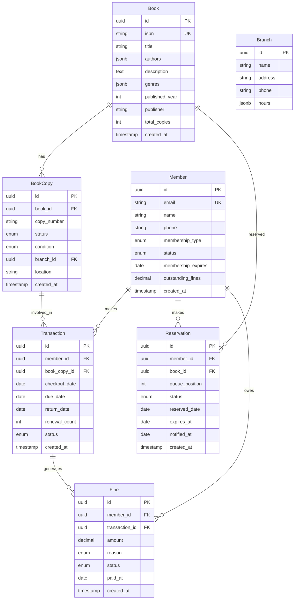
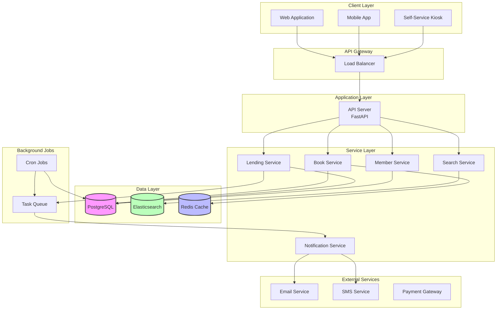

# Library Management System Design

A comprehensive guide to designing a scalable library management system for tracking books, members, and lending operations.

---

## Table of Contents

1. [Problem Statement](#1-problem-statement)
2. [Requirements](#2-requirements)
3. [Back-of-the-Envelope Estimation](#3-back-of-the-envelope-estimation)
4. [API Design](#4-api-design)
5. [Data Model & Database Schema](#5-data-model--database-schema)
6. [High-Level Design](#6-high-level-design)
7. [Detailed Component Design](#7-detailed-component-design)
8. [Identifying and Resolving Bottlenecks](#8-identifying-and-resolving-bottlenecks)
9. [Trade-offs and Alternatives](#9-trade-offs-and-alternatives)
10. [Monitoring, Metrics & Alerts](#10-monitoring-metrics--alerts)
11. [Follow-up Questions & Extensions](#11-follow-up-questions--extensions)
12. [Code Implementation](#12-code-implementation)
13. [References](#13-references)

---

## 1. Problem Statement

Design a library management system that can:
- Manage book inventory (add, update, search, delete)
- Track member registrations and subscriptions
- Handle book checkout and return operations
- Manage reservations and waitlists
- Calculate and track late fees
- Support multiple library branches
- Provide search functionality (by title, author, ISBN, genre)

**Real-world Examples:**
- Public library systems (Brooklyn Public Library, NYPL)
- University library management
- Digital library platforms

---

## 2. Requirements

### Functional Requirements

1. **Book Management**
   - Add/update/delete books
   - Multiple copies of same book
   - Track book status (available, checked out, reserved, maintenance)
   - Support different formats (physical, ebook, audiobook)

2. **Member Management**
   - Register new members
   - Membership types (student, adult, senior, premium)
   - Track borrowing history
   - Membership expiration and renewal

3. **Lending Operations**
   - Check out books (max 5 books per member)
   - Return books
   - Renew borrowed books (max 2 renewals)
   - Calculate due dates (2 weeks for regular, 1 week for new releases)

4. **Reservation System**
   - Reserve books that are currently checked out
   - Waitlist queue (FIFO)
   - Notification when book becomes available
   - 3-day hold period for reserved books

5. **Fine Management**
   - Calculate late fees ($0.50/day)
   - Track outstanding fines
   - Payment processing
   - Suspend members with fines > $10

6. **Search & Discovery**
   - Search by title, author, ISBN, genre
   - Browse by category
   - Recommendations based on history

### Non-Functional Requirements

1. **Scalability**
   - Support 100,000+ books
   - 50,000+ active members
   - 1,000+ daily transactions

2. **Availability**
   - 99.9% uptime
   - Read operations should always work
   - Graceful degradation during peak hours

3. **Consistency**
   - Strong consistency for checkout operations (no double-lending)
   - Eventually consistent for search indexes
   - ACID transactions for fine calculations

4. **Performance**
   - Search results: < 500ms
   - Checkout operation: < 2 seconds
   - Book return: < 1 second

5. **Security**
   - Member authentication
   - Librarian role-based access
   - Secure payment processing

### Out of Scope

- Physical book tracking (RFID, barcode scanning)
- Inter-library loans
- Event management (reading clubs, workshops)
- Digital content DRM

---

## 3. Back-of-the-Envelope Estimation

### Assumptions

**Library Size:**
- 100,000 books (total copies across all titles)
- 30,000 unique titles
- 50,000 active members
- 10 library branches

**Usage Patterns:**
- Daily checkouts: 500
- Daily returns: 500
- Average borrow duration: 14 days
- Books in circulation: ~7,000 (14% of inventory)
- Search queries: 2,000/day

### Traffic Estimates

**QPS (Queries Per Second):**
- Search: 2,000/day ÷ 86,400s ≈ 0.02 QPS (peak: ~0.5 QPS)
- Checkout: 500/day ÷ 86,400s ≈ 0.006 QPS (peak: ~0.2 QPS)
- Return: 500/day ÷ 86,400s ≈ 0.006 QPS
- **Total: < 1 QPS (very light load)**

**Peak Load (assuming 10x average):**
- Peak QPS: ~10 QPS (still very manageable)

### Storage Estimates

**Books Data:**
- Book record: 2 KB (title, author, ISBN, description, etc.)
- Total books: 100,000 × 2 KB = 200 MB
- Book covers: 100,000 × 50 KB = 5 GB

**Members Data:**
- Member record: 1 KB
- Total members: 50,000 × 1 KB = 50 MB

**Transactions:**
- Transaction record: 500 bytes (checkout/return details)
- Daily transactions: 1,000 × 500 bytes = 500 KB/day
- Annual transactions: 500 KB × 365 = 182 MB/year
- 5-year storage: ~1 GB

**Total Storage: ~6.5 GB (very small)**

### Bandwidth Estimates

**Data Transfer:**
- Search result (10 books): ~20 KB
- Daily searches: 2,000 × 20 KB = 40 MB/day
- Checkout/return: 1,000 × 2 KB = 2 MB/day
- **Total: ~50 MB/day (negligible bandwidth)**

### Cost Estimates (Annual)

- Database (PostgreSQL): $50/month = $600/year
- Application server (single instance): $25/month = $300/year
- Storage (10 GB): ~$1/month = $12/year
- **Total: ~$1,000/year (very cost-effective)**

**Conclusion:** This is a simple system with light load. A single database server and application instance can easily handle the traffic.

---

## 4. API Design

### 4.1 Book Management APIs

#### 1. Search Books

```http
GET /api/v1/books/search?q=harry+potter&type=title&limit=10&offset=0
```

**Response:**
```json
{
  "total": 45,
  "results": [
    {
      "id": "book-123",
      "title": "Harry Potter and the Philosopher's Stone",
      "authors": ["J.K. Rowling"],
      "isbn": "978-0439708180",
      "genre": ["Fantasy", "Young Adult"],
      "published_year": 1997,
      "total_copies": 10,
      "available_copies": 3,
      "cover_url": "/covers/book-123.jpg"
    }
  ]
}
```

#### 2. Get Book Details

```http
GET /api/v1/books/{book_id}
```

**Response:**
```json
{
  "id": "book-123",
  "title": "Harry Potter and the Philosopher's Stone",
  "authors": ["J.K. Rowling"],
  "isbn": "978-0439708180",
  "description": "The first book in the Harry Potter series...",
  "genre": ["Fantasy", "Young Adult"],
  "published_year": 1997,
  "publisher": "Scholastic",
  "language": "English",
  "pages": 309,
  "copies": [
    {
      "copy_id": "copy-001",
      "status": "available",
      "condition": "good",
      "location": "Branch A, Shelf 15-C"
    },
    {
      "copy_id": "copy-002",
      "status": "checked_out",
      "due_date": "2024-02-01",
      "borrower_id": "member-456"
    }
  ]
}
```

### 4.2 Lending Operations

#### 3. Checkout Book

```http
POST /api/v1/lending/checkout
```

**Request:**
```json
{
  "member_id": "member-456",
  "book_copy_id": "copy-001",
  "checkout_date": "2024-01-15"
}
```

**Response:**
```json
{
  "transaction_id": "txn-789",
  "book_title": "Harry Potter and the Philosopher's Stone",
  "copy_id": "copy-001",
  "checkout_date": "2024-01-15",
  "due_date": "2024-01-29",
  "renewals_remaining": 2,
  "member": {
    "id": "member-456",
    "name": "John Doe",
    "books_checked_out": 3,
    "max_books": 5
  }
}
```

**Error Response:**
```json
{
  "error": "CHECKOUT_LIMIT_EXCEEDED",
  "message": "Member has reached maximum checkout limit (5 books)",
  "current_checkouts": 5
}
```

#### 4. Return Book

```http
POST /api/v1/lending/return
```

**Request:**
```json
{
  "transaction_id": "txn-789",
  "return_date": "2024-01-30"
}
```

**Response:**
```json
{
  "transaction_id": "txn-789",
  "return_date": "2024-01-30",
  "due_date": "2024-01-29",
  "days_late": 1,
  "late_fee": 0.50,
  "total_outstanding_fines": 2.50,
  "next_reservation": {
    "member_id": "member-999",
    "notification_sent": true,
    "hold_until": "2024-02-02"
  }
}
```

#### 5. Reserve Book

```http
POST /api/v1/lending/reserve
```

**Request:**
```json
{
  "member_id": "member-456",
  "book_id": "book-123"
}
```

**Response:**
```json
{
  "reservation_id": "res-111",
  "book_title": "Harry Potter and the Philosopher's Stone",
  "queue_position": 3,
  "estimated_available_date": "2024-02-15",
  "expires_at": "2024-03-15"
}
```

### 4.3 Member Management

#### 6. Get Member Profile

```http
GET /api/v1/members/{member_id}
```

**Response:**
```json
{
  "id": "member-456",
  "name": "John Doe",
  "email": "john@example.com",
  "membership_type": "adult",
  "joined_date": "2020-01-15",
  "membership_expires": "2025-01-15",
  "status": "active",
  "current_checkouts": [
    {
      "transaction_id": "txn-789",
      "book_title": "Harry Potter",
      "due_date": "2024-01-29",
      "days_until_due": 5
    }
  ],
  "reservations": [
    {
      "reservation_id": "res-111",
      "book_title": "The Great Gatsby",
      "queue_position": 2
    }
  ],
  "outstanding_fines": 2.50,
  "borrowing_history_count": 47
}
```

---

## 5. Data Model & Database Schema

### 5.1 Entity Relationship Diagram



### 5.2 Database Schema (PostgreSQL)

```sql
-- Books
CREATE TABLE books (
    id UUID PRIMARY KEY DEFAULT gen_random_uuid(),
    isbn VARCHAR(17) UNIQUE NOT NULL,
    title VARCHAR(500) NOT NULL,
    authors JSONB NOT NULL,  -- ["Author 1", "Author 2"]
    description TEXT,
    genres JSONB,  -- ["Fiction", "Mystery"]
    published_year INT,
    publisher VARCHAR(255),
    language VARCHAR(50) DEFAULT 'English',
    pages INT,
    total_copies INT DEFAULT 0,
    cover_url VARCHAR(500),
    created_at TIMESTAMP DEFAULT CURRENT_TIMESTAMP,
    updated_at TIMESTAMP DEFAULT CURRENT_TIMESTAMP
);

CREATE INDEX idx_books_title ON books USING gin(to_tsvector('english', title));
CREATE INDEX idx_books_authors ON books USING gin(authors);
CREATE INDEX idx_books_isbn ON books(isbn);

-- Library Branches
CREATE TABLE branches (
    id UUID PRIMARY KEY DEFAULT gen_random_uuid(),
    name VARCHAR(255) NOT NULL,
    address TEXT NOT NULL,
    phone VARCHAR(20),
    operating_hours JSONB,
    created_at TIMESTAMP DEFAULT CURRENT_TIMESTAMP
);

-- Book Copies
CREATE TYPE copy_status_enum AS ENUM ('available', 'checked_out', 'reserved', 'maintenance', 'lost');
CREATE TYPE copy_condition_enum AS ENUM ('new', 'good', 'fair', 'poor');

CREATE TABLE book_copies (
    id UUID PRIMARY KEY DEFAULT gen_random_uuid(),
    book_id UUID NOT NULL REFERENCES books(id) ON DELETE CASCADE,
    copy_number VARCHAR(20) NOT NULL,
    status copy_status_enum DEFAULT 'available',
    condition copy_condition_enum DEFAULT 'good',
    branch_id UUID REFERENCES branches(id),
    location VARCHAR(100),  -- "Shelf 15-C"
    created_at TIMESTAMP DEFAULT CURRENT_TIMESTAMP,
    updated_at TIMESTAMP DEFAULT CURRENT_TIMESTAMP,
    UNIQUE(book_id, copy_number)
);

CREATE INDEX idx_copies_book ON book_copies(book_id);
CREATE INDEX idx_copies_status ON book_copies(status) WHERE status = 'available';
CREATE INDEX idx_copies_branch ON book_copies(branch_id);

-- Members
CREATE TYPE membership_type_enum AS ENUM ('student', 'adult', 'senior', 'premium');
CREATE TYPE member_status_enum AS ENUM ('active', 'suspended', 'expired', 'blocked');

CREATE TABLE members (
    id UUID PRIMARY KEY DEFAULT gen_random_uuid(),
    email VARCHAR(255) UNIQUE NOT NULL,
    name VARCHAR(255) NOT NULL,
    phone VARCHAR(20),
    membership_type membership_type_enum DEFAULT 'adult',
    status member_status_enum DEFAULT 'active',
    membership_expires DATE NOT NULL,
    outstanding_fines DECIMAL(10, 2) DEFAULT 0,
    max_books_allowed INT DEFAULT 5,
    created_at TIMESTAMP DEFAULT CURRENT_TIMESTAMP,
    updated_at TIMESTAMP DEFAULT CURRENT_TIMESTAMP
);

CREATE INDEX idx_members_email ON members(email);
CREATE INDEX idx_members_status ON members(status);

-- Transactions (Checkouts)
CREATE TYPE transaction_status_enum AS ENUM ('active', 'returned', 'overdue', 'lost');

CREATE TABLE transactions (
    id UUID PRIMARY KEY DEFAULT gen_random_uuid(),
    member_id UUID NOT NULL REFERENCES members(id),
    book_copy_id UUID NOT NULL REFERENCES book_copies(id),
    checkout_date DATE NOT NULL,
    due_date DATE NOT NULL,
    return_date DATE,
    renewal_count INT DEFAULT 0,
    status transaction_status_enum DEFAULT 'active',
    created_at TIMESTAMP DEFAULT CURRENT_TIMESTAMP,
    updated_at TIMESTAMP DEFAULT CURRENT_TIMESTAMP
);

CREATE INDEX idx_transactions_member ON transactions(member_id);
CREATE INDEX idx_transactions_copy ON transactions(book_copy_id);
CREATE INDEX idx_transactions_status ON transactions(status) WHERE status IN ('active', 'overdue');
CREATE INDEX idx_transactions_due_date ON transactions(due_date) WHERE status = 'active';

-- Reservations
CREATE TYPE reservation_status_enum AS ENUM ('pending', 'ready', 'fulfilled', 'expired', 'cancelled');

CREATE TABLE reservations (
    id UUID PRIMARY KEY DEFAULT gen_random_uuid(),
    member_id UUID NOT NULL REFERENCES members(id),
    book_id UUID NOT NULL REFERENCES books(id),
    queue_position INT NOT NULL,
    status reservation_status_enum DEFAULT 'pending',
    reserved_date DATE NOT NULL,
    expires_at DATE,
    notified_at TIMESTAMP,
    created_at TIMESTAMP DEFAULT CURRENT_TIMESTAMP,
    updated_at TIMESTAMP DEFAULT CURRENT_TIMESTAMP
);

CREATE INDEX idx_reservations_member ON reservations(member_id);
CREATE INDEX idx_reservations_book_status ON reservations(book_id, status);
CREATE INDEX idx_reservations_queue ON reservations(book_id, queue_position) WHERE status = 'pending';

-- Fines
CREATE TYPE fine_reason_enum AS ENUM ('late_return', 'lost_book', 'damaged_book');
CREATE TYPE fine_status_enum AS ENUM ('pending', 'paid', 'waived');

CREATE TABLE fines (
    id UUID PRIMARY KEY DEFAULT gen_random_uuid(),
    member_id UUID NOT NULL REFERENCES members(id),
    transaction_id UUID REFERENCES transactions(id),
    amount DECIMAL(10, 2) NOT NULL,
    reason fine_reason_enum NOT NULL,
    status fine_status_enum DEFAULT 'pending',
    paid_at TIMESTAMP,
    created_at TIMESTAMP DEFAULT CURRENT_TIMESTAMP
);

CREATE INDEX idx_fines_member ON fines(member_id);
CREATE INDEX idx_fines_status ON fines(status) WHERE status = 'pending';
```

---

## 6. High-Level Design

### 6.1 Architecture Diagram



### 6.2 Component Responsibilities

**1. Book Service:**
- CRUD operations for books
- Manage book copies
- Track inventory levels

**2. Lending Service:**
- Checkout/return operations
- Renewal logic
- Due date calculations
- Fine calculations

**3. Member Service:**
- Member registration
- Profile management
- Borrowing limits enforcement

**4. Search Service:**
- Full-text search (Elasticsearch)
- Faceted search (by genre, author, year)
- Recommendations

**5. Notification Service:**
- Due date reminders
- Overdue notices
- Reservation ready alerts

**6. Background Jobs:**
- Calculate overdue fines (daily)
- Update reservation queue (when books returned)
- Send due date reminders (3 days before)
- Expire old reservations

---

## 7. Detailed Component Design

### 7.1 Checkout Logic with Validations

```python
class LendingService:
    """Handle book checkout and return operations."""

    def checkout_book(self, member_id: str, copy_id: str) -> dict:
        """
        Checkout a book with all validations.

        Business Rules:
        - Member must be active (not suspended/expired)
        - Member must not have outstanding fines > $10
        - Member cannot exceed max books limit (5)
        - Book copy must be available
        - No concurrent checkouts of same copy
        """

        # Validate member
        member = self.validate_member(member_id)

        # Check outstanding fines
        if member['outstanding_fines'] > 10.00:
            raise ValueError(f"Outstanding fines (${member['outstanding_fines']}) exceed limit")

        # Check current checkouts
        current_checkouts = self.get_active_checkouts(member_id)
        if len(current_checkouts) >= member['max_books_allowed']:
            raise ValueError(f"Checkout limit ({member['max_books_allowed']}) reached")

        # Atomically reserve book copy
        book_copy = self.reserve_book_copy(copy_id)
        if not book_copy:
            raise ValueError("Book is not available")

        # Calculate due date
        checkout_date = date.today()
        due_date = self.calculate_due_date(book_copy['book_id'], checkout_date)

        # Create transaction
        transaction = {
            'id': str(uuid4()),
            'member_id': member_id,
            'book_copy_id': copy_id,
            'checkout_date': checkout_date,
            'due_date': due_date,
            'status': 'active',
            'renewal_count': 0
        }

        # Save to database
        self.db.insert('transactions', transaction)

        # Update copy status
        self.db.update('book_copies',
                      {'id': copy_id},
                      {'status': 'checked_out'})

        return transaction

    def calculate_due_date(self, book_id: str, checkout_date: date) -> date:
        """
        Calculate due date based on book type.

        Rules:
        - New releases: 1 week (7 days)
        - Regular books: 2 weeks (14 days)
        - Reference books: 3 days
        """
        book = self.db.get('books', book_id)

        # Check if new release (published within last 6 months)
        if book['published_year'] == date.today().year:
            months_since_pub = (date.today() - date(book['published_year'], 1, 1)).days / 30
            if months_since_pub < 6:
                return checkout_date + timedelta(days=7)

        # Check if reference book
        if 'Reference' in book.get('genres', []):
            return checkout_date + timedelta(days=3)

        # Default: 2 weeks
        return checkout_date + timedelta(days=14)

    def reserve_book_copy(self, copy_id: str) -> Optional[dict]:
        """
        Atomically reserve a book copy (prevent double-checkout).

        Uses database row-level locking.
        """
        query = """
            UPDATE book_copies
            SET status = 'checked_out', updated_at = NOW()
            WHERE id = $1 AND status = 'available'
            RETURNING id, book_id, copy_number
        """
        return self.db.execute(query, copy_id)
```

### 7.2 Return Logic with Fines

```python
def return_book(self, transaction_id: str, return_date: date) -> dict:
    """
    Process book return and calculate fines.
    """

    # Get transaction
    txn = self.db.get('transactions', transaction_id)
    if not txn or txn['status'] != 'active':
        raise ValueError("Invalid transaction")

    # Calculate late fee
    days_late = max(0, (return_date - txn['due_date']).days)
    late_fee = days_late * 0.50  # $0.50 per day

    # Update transaction
    self.db.update('transactions',
                  {'id': transaction_id},
                  {
                      'return_date': return_date,
                      'status': 'returned'
                  })

    # Create fine if late
    if late_fee > 0:
        fine = {
            'id': str(uuid4()),
            'member_id': txn['member_id'],
            'transaction_id': transaction_id,
            'amount': late_fee,
            'reason': 'late_return',
            'status': 'pending'
        }
        self.db.insert('fines', fine)

        # Update member's outstanding fines
        self.db.execute(
            "UPDATE members SET outstanding_fines = outstanding_fines + $1 WHERE id = $2",
            late_fee, txn['member_id']
        )

    # Update book copy status
    self.db.update('book_copies',
                  {'id': txn['book_copy_id']},
                  {'status': 'available'})

    # Check for reservations
    next_reservation = self.process_reservation_queue(txn['book_id'])

    return {
        'transaction_id': transaction_id,
        'return_date': return_date,
        'days_late': days_late,
        'late_fee': late_fee,
        'next_reservation': next_reservation
    }
```

### 7.3 Reservation Queue Management

```python
def reserve_book(self, member_id: str, book_id: str) -> dict:
    """
    Add member to reservation queue.

    Queue is FIFO (first-in-first-out).
    """

    # Check if member already has reservation
    existing = self.db.query(
        "SELECT id FROM reservations WHERE member_id = $1 AND book_id = $2 AND status = 'pending'",
        member_id, book_id
    )
    if existing:
        raise ValueError("You already have a reservation for this book")

    # Get current queue position
    queue_position = self.db.fetchval(
        "SELECT COALESCE(MAX(queue_position), 0) + 1 FROM reservations WHERE book_id = $1 AND status = 'pending'",
        book_id
    )

    # Create reservation
    reservation = {
        'id': str(uuid4()),
        'member_id': member_id,
        'book_id': book_id,
        'queue_position': queue_position,
        'status': 'pending',
        'reserved_date': date.today(),
        'expires_at': date.today() + timedelta(days=30)  # Expire after 30 days
    }

    self.db.insert('reservations', reservation)

    return {
        'reservation_id': reservation['id'],
        'queue_position': queue_position,
        'estimated_wait_days': queue_position * 14  # Rough estimate
    }

def process_reservation_queue(self, book_id: str) -> Optional[dict]:
    """
    Process reservation queue when book is returned.

    Notify first person in queue that book is ready.
    """

    # Find next person in queue
    reservation = self.db.fetchrow(
        """
        SELECT id, member_id, queue_position
        FROM reservations
        WHERE book_id = $1 AND status = 'pending'
        ORDER BY queue_position ASC
        LIMIT 1
        """,
        book_id
    )

    if not reservation:
        return None

    # Mark as ready
    self.db.update('reservations',
                  {'id': reservation['id']},
                  {
                      'status': 'ready',
                      'notified_at': datetime.now(),
                      'expires_at': date.today() + timedelta(days=3)  # 3-day hold
                  })

    # Reserve a copy for this member
    copy = self.db.fetchrow(
        "SELECT id FROM book_copies WHERE book_id = $1 AND status = 'available' LIMIT 1",
        book_id
    )

    if copy:
        self.db.update('book_copies',
                      {'id': copy['id']},
                      {'status': 'reserved'})

    # Send notification
    self.notification_service.send_reservation_ready(
        reservation['member_id'],
        book_id
    )

    return reservation
```

### 7.4 Search Implementation

```python
class SearchService:
    """Full-text search using Elasticsearch."""

    def search_books(self, query: str, search_type: str = 'all', limit: int = 10) -> list:
        """
        Search books with different strategies.

        search_type:
        - 'all': Search across all fields
        - 'title': Title only
        - 'author': Author only
        - 'isbn': Exact ISBN match
        """

        if search_type == 'isbn':
            # Exact match
            return self.es.search(
                index='books',
                body={
                    'query': {
                        'term': {'isbn': query}
                    }
                },
                size=limit
            )

        elif search_type == 'title':
            # Title search with fuzzy matching
            return self.es.search(
                index='books',
                body={
                    'query': {
                        'match': {
                            'title': {
                                'query': query,
                                'fuzziness': 'AUTO',
                                'operator': 'and'
                            }
                        }
                    }
                },
                size=limit
            )

        elif search_type == 'author':
            # Author search
            return self.es.search(
                index='books',
                body={
                    'query': {
                        'nested': {
                            'path': 'authors',
                            'query': {
                                'match': {'authors': query}
                            }
                        }
                    }
                },
                size=limit
            )

        else:
            # Multi-field search
            return self.es.search(
                index='books',
                body={
                    'query': {
                        'multi_match': {
                            'query': query,
                            'fields': ['title^3', 'authors^2', 'description', 'genres'],
                            'fuzziness': 'AUTO'
                        }
                    }
                },
                size=limit
            )

    def get_recommendations(self, member_id: str, limit: int = 10) -> list:
        """
        Get book recommendations based on borrowing history.

        Simple approach: Find similar books by genre.
        """

        # Get member's borrowing history
        history = self.db.query(
            """
            SELECT DISTINCT b.genres
            FROM transactions t
            JOIN book_copies bc ON t.book_copy_id = bc.id
            JOIN books b ON bc.book_id = b.id
            WHERE t.member_id = $1
            ORDER BY t.checkout_date DESC
            LIMIT 20
            """,
            member_id
        )

        # Extract most common genres
        genre_counts = {}
        for record in history:
            for genre in record['genres'] or []:
                genre_counts[genre] = genre_counts.get(genre, 0) + 1

        top_genres = sorted(genre_counts.items(), key=lambda x: x[1], reverse=True)[:3]
        top_genres = [g[0] for g in top_genres]

        # Find books in those genres that member hasn't read
        return self.es.search(
            index='books',
            body={
                'query': {
                    'bool': {
                        'must': [
                            {'terms': {'genres': top_genres}}
                        ],
                        'must_not': [
                            {'terms': {'id': [b['book_id'] for b in history]}}
                        ]
                    }
                },
                'sort': [{'rating': 'desc'}]
            },
            size=limit
        )
```

---

## 8. Identifying and Resolving Bottlenecks

### 8.1 Potential Bottlenecks

| Bottleneck | Impact | Solution |
|------------|--------|----------|
| **Concurrent Checkout** | Double-lending same book | Row-level locking, optimistic locking |
| **Search Performance** | Slow search on large catalog | Elasticsearch, caching popular queries |
| **Fine Calculation** | Slow daily batch processing | Incremental updates, indexed due dates |
| **Reservation Notifications** | Email delivery delays | Async queue (Celery), retry logic |

### 8.2 Concurrency Solutions

**Problem:** Two members trying to checkout the last available copy simultaneously.

**Solution 1: Pessimistic Locking (Row-Level Lock)**
```sql
BEGIN TRANSACTION;

-- Lock the row
SELECT * FROM book_copies
WHERE id = 'copy-123' AND status = 'available'
FOR UPDATE NOWAIT;

-- If successful, update
UPDATE book_copies
SET status = 'checked_out'
WHERE id = 'copy-123';

COMMIT;
```

**Solution 2: Optimistic Locking (Version Number)**
```sql
-- Include version check in UPDATE
UPDATE book_copies
SET status = 'checked_out', version = version + 1
WHERE id = 'copy-123' AND status = 'available' AND version = 5;

-- Check rows affected
-- If 0, someone else updated it (retry)
```

### 8.3 Scaling Strategies

**Database Scaling:**
1. **Read Replicas** for search queries
2. **Connection Pooling** (PgBouncer)
3. **Partitioning** transactions table by year

**Caching Strategy:**
```python
# Cache popular book details
cache_key = f"book:{book_id}"
cached = redis.get(cache_key)

if cached:
    return json.loads(cached)

book = db.get('books', book_id)
redis.setex(cache_key, 3600, json.dumps(book))  # 1 hour TTL
return book
```

**Search Scaling:**
- Elasticsearch for full-text search
- Sync DB → ES via change data capture (Debezium)
- Cache search results (5-minute TTL)

---

## 9. Trade-offs and Alternatives

### 9.1 Consistency vs. Availability

**Scenario:** What if database is temporarily unavailable?

| Approach | Pros | Cons | Decision |
|----------|------|------|----------|
| **Strong Consistency** | No double-lending | Checkout fails if DB down | ✅ **Choose this** |
| **Eventual Consistency** | Always available | Risk of double-lending | ❌ Too risky |

**Reasoning:** Library can tolerate temporary unavailability for checkouts, but cannot tolerate double-lending.

### 9.2 Search: SQL vs. Elasticsearch

| Option | Pros | Cons |
|--------|------|------|
| **PostgreSQL Full-Text** | Simple, no extra infrastructure | Limited features, slower for large datasets |
| **Elasticsearch** | Fast, powerful, faceted search | Extra complexity, sync overhead |

**Decision:** Start with PostgreSQL full-text search (< 100k books). Migrate to Elasticsearch if:
- Catalog grows > 500k books
- Need advanced features (fuzzy search, relevance tuning)
- Search performance degrades

### 9.3 Reservation Queue: FIFO vs. Priority

**Current:** FIFO (first-in-first-out)

**Alternative:** Priority queue (premium members first)

```python
# Priority queue
queue_score = (
    (reservation_date.timestamp() * 0.7) +  # 70% weight to time
    (membership_priority * 0.3)  # 30% weight to priority
)
```

**Trade-off:**
- FIFO: Fair, simple
- Priority: Revenue optimization, complex

**Decision:** FIFO for now (simpler, fairer)

---

## 10. Monitoring, Metrics & Alerts

### 10.1 Key Metrics

```python
# Business Metrics
metrics = {
    'books_checked_out_today': Counter(),
    'books_returned_today': Counter(),
    'active_checkouts': Gauge(),
    'overdue_books': Gauge(),
    'total_fines_pending': Gauge(),
    'reservations_pending': Gauge(),

    # Operational Metrics
    'checkout_duration_seconds': Histogram(),
    'search_duration_seconds': Histogram(),
    'api_requests_total': Counter(labels=['endpoint', 'status']),

    # System Health
    'database_connection_pool': Gauge(labels=['state']),
    'elasticsearch_lag_seconds': Gauge(),
}
```

### 10.2 Alerts

```yaml
# Critical Alerts
alerts:
  - name: HighOverdueRate
    condition: overdue_books > 500
    severity: warning
    message: "Overdue books exceed threshold"

  - name: DatabaseConnectionPoolExhausted
    condition: db_connection_pool{state="idle"} < 2
    severity: critical
    message: "Database connection pool nearly exhausted"

  - name: CheckoutFailureRate
    condition: checkout_errors / checkout_total > 0.05
    severity: critical
    message: "Checkout failure rate > 5%"
```

### 10.3 Background Jobs Monitoring

```python
# Daily cron jobs
jobs = {
    'calculate_overdue_fines': {
        'schedule': '0 1 * * *',  # 1 AM daily
        'timeout': 3600,
        'alerts': ['duration > 30 minutes', 'failure']
    },

    'send_due_date_reminders': {
        'schedule': '0 9 * * *',  # 9 AM daily
        'timeout': 1800,
        'alerts': ['failure']
    },

    'expire_old_reservations': {
        'schedule': '0 2 * * *',  # 2 AM daily
        'timeout': 600,
        'alerts': ['failure']
    }
}
```

---

## 11. Follow-up Questions & Extensions

### Q1: "How would you handle inter-library loans?"

**Answer:**
```python
class InterLibraryLoan:
    """Handle book transfers between branches."""

    def request_transfer(self, book_id: str, from_branch: str, to_branch: str) -> dict:
        """
        Request book transfer between branches.
        """

        # Create transfer request
        transfer = {
            'id': str(uuid4()),
            'book_id': book_id,
            'from_branch_id': from_branch,
            'to_branch_id': to_branch,
            'status': 'pending',
            'requested_at': datetime.now()
        }

        # Notify source branch staff
        self.notify_branch(from_branch, transfer)

        return transfer

    def complete_transfer(self, transfer_id: str, copy_id: str):
        """Update book copy location after physical transfer."""

        # Update book copy branch
        self.db.update('book_copies',
                      {'id': copy_id},
                      {'branch_id': transfer['to_branch_id']})

        # Update transfer status
        self.db.update('transfers',
                      {'id': transfer_id},
                      {'status': 'completed', 'completed_at': datetime.now()})
```

### Q2: "How would you implement a recommendation system?"

**Approaches:**

1. **Collaborative Filtering:**
```python
# Find members with similar reading history
similar_members = find_similar_readers(member_id)

# Recommend books they read but current member hasn't
recommendations = get_books_read_by(similar_members) - get_books_read_by(member_id)
```

2. **Content-Based:**
```python
# Analyze member's reading preferences
preferred_genres = extract_genres(member_borrowing_history)
preferred_authors = extract_authors(member_borrowing_history)

# Find similar books
recommendations = find_books(genres=preferred_genres, authors=preferred_authors)
```

3. **Hybrid:**
Combine both approaches with ML model.

### Q3: "How would you handle digital ebooks and audiobooks?"

**Changes:**

```sql
-- Add digital formats
CREATE TYPE book_format_enum AS ENUM ('physical', 'ebook', 'audiobook');

ALTER TABLE books ADD COLUMN format book_format_enum DEFAULT 'physical';

-- For digital books, no physical copy tracking needed
-- Instead, track concurrent licenses

CREATE TABLE digital_licenses (
    id UUID PRIMARY KEY,
    book_id UUID REFERENCES books(id),
    total_licenses INT,  -- Max concurrent users
    active_checkouts INT DEFAULT 0
);

-- Checkout logic for digital
UPDATE digital_licenses
SET active_checkouts = active_checkouts + 1
WHERE book_id = $1 AND active_checkouts < total_licenses;
```

### Q4: "How would you add a mobile app with offline reading?"

**Solution:**

1. **Download for Offline:**
```python
def download_for_offline(member_id: str, book_id: str) -> dict:
    """Allow member to download ebook for offline reading."""

    # Validate checkout
    if not has_active_checkout(member_id, book_id):
        raise ValueError("Book not checked out")

    # Generate time-limited download URL
    download_url = generate_signed_url(
        book_file_path,
        expiry=3600  # 1 hour
    )

    return {
        'download_url': download_url,
        'expires_at': datetime.now() + timedelta(hours=1),
        'due_date': get_due_date(member_id, book_id)
    }
```

2. **DRM (Digital Rights Management):**
- Encrypt ebook files
- Embed member ID in file
- Auto-expire after due date

---

## 12. Code Implementation

Simplified implementation showing core concepts:

```python
# lending_service.py
from datetime import date, timedelta, datetime
from typing import Optional, List
from uuid import uuid4
import asyncpg

class LendingService:
    """Core lending operations for library system."""

    LATE_FEE_PER_DAY = 0.50
    MAX_RENEWALS = 2
    DEFAULT_LOAN_PERIOD = 14  # days

    def __init__(self, db: asyncpg.Connection):
        self.db = db

    async def checkout_book(
        self,
        member_id: str,
        book_copy_id: str,
        checkout_date: date = None
    ) -> dict:
        """
        Checkout a book to a member.

        Validations:
        - Member must be active
        - Member must not exceed checkout limit
        - Book copy must be available
        - No outstanding fines > $10
        """

        checkout_date = checkout_date or date.today()

        async with self.db.transaction():
            # Validate member
            member = await self.db.fetchrow(
                """
                SELECT id, name, status, outstanding_fines, max_books_allowed
                FROM members
                WHERE id = $1 AND status = 'active'
                """,
                member_id
            )

            if not member:
                raise ValueError("Member not found or inactive")

            if member['outstanding_fines'] > 10.00:
                raise ValueError(
                    f"Outstanding fines (${member['outstanding_fines']}) exceed $10 limit"
                )

            # Check current checkouts
            active_count = await self.db.fetchval(
                "SELECT COUNT(*) FROM transactions WHERE member_id = $1 AND status = 'active'",
                member_id
            )

            if active_count >= member['max_books_allowed']:
                raise ValueError(f"Checkout limit ({member['max_books_allowed']}) reached")

            # Atomically reserve book copy
            book_copy = await self.db.fetchrow(
                """
                UPDATE book_copies
                SET status = 'checked_out', updated_at = NOW()
                WHERE id = $1 AND status = 'available'
                RETURNING id, book_id, copy_number
                """,
                book_copy_id
            )

            if not book_copy:
                raise ValueError("Book copy not available")

            # Calculate due date
            due_date = checkout_date + timedelta(days=self.DEFAULT_LOAN_PERIOD)

            # Create transaction
            transaction_id = uuid4()
            await self.db.execute(
                """
                INSERT INTO transactions
                (id, member_id, book_copy_id, checkout_date, due_date, status, renewal_count)
                VALUES ($1, $2, $3, $4, $5, 'active', 0)
                """,
                transaction_id, member_id, book_copy_id, checkout_date, due_date
            )

            # Get book title for response
            book = await self.db.fetchrow(
                "SELECT title, authors FROM books WHERE id = $1",
                book_copy['book_id']
            )

            return {
                'transaction_id': str(transaction_id),
                'book_title': book['title'],
                'checkout_date': checkout_date,
                'due_date': due_date,
                'renewals_remaining': self.MAX_RENEWALS
            }

    async def return_book(
        self,
        transaction_id: str,
        return_date: date = None
    ) -> dict:
        """
        Process book return and calculate fines.
        """

        return_date = return_date or date.today()

        async with self.db.transaction():
            # Get transaction
            txn = await self.db.fetchrow(
                """
                SELECT t.id, t.member_id, t.book_copy_id, t.checkout_date, t.due_date,
                       bc.book_id
                FROM transactions t
                JOIN book_copies bc ON t.book_copy_id = bc.id
                WHERE t.id = $1 AND t.status = 'active'
                """,
                transaction_id
            )

            if not txn:
                raise ValueError("Transaction not found or already returned")

            # Calculate late fee
            days_late = max(0, (return_date - txn['due_date']).days)
            late_fee = days_late * self.LATE_FEE_PER_DAY

            # Update transaction
            await self.db.execute(
                """
                UPDATE transactions
                SET return_date = $1, status = 'returned', updated_at = NOW()
                WHERE id = $2
                """,
                return_date, transaction_id
            )

            # Create fine if late
            if late_fee > 0:
                await self.db.execute(
                    """
                    INSERT INTO fines (id, member_id, transaction_id, amount, reason, status)
                    VALUES ($1, $2, $3, $4, 'late_return', 'pending')
                    """,
                    uuid4(), txn['member_id'], transaction_id, late_fee
                )

                # Update member's outstanding fines
                await self.db.execute(
                    "UPDATE members SET outstanding_fines = outstanding_fines + $1 WHERE id = $2",
                    late_fee, txn['member_id']
                )

            # Free book copy
            await self.db.execute(
                "UPDATE book_copies SET status = 'available', updated_at = NOW() WHERE id = $1",
                txn['book_copy_id']
            )

            # Process reservation queue
            next_reservation = await self._process_reservation_queue(txn['book_id'])

            return {
                'transaction_id': str(transaction_id),
                'return_date': return_date,
                'days_late': days_late,
                'late_fee': late_fee,
                'next_reservation': next_reservation
            }

    async def renew_book(self, transaction_id: str) -> dict:
        """
        Renew a book checkout.

        Rules:
        - Max 2 renewals
        - No renewals if book has reservations
        - Cannot renew if overdue
        """

        async with self.db.transaction():
            txn = await self.db.fetchrow(
                """
                SELECT t.id, t.due_date, t.renewal_count, bc.book_id
                FROM transactions t
                JOIN book_copies bc ON t.book_copy_id = bc.id
                WHERE t.id = $1 AND t.status = 'active'
                """,
                transaction_id
            )

            if not txn:
                raise ValueError("Transaction not found")

            # Check renewal limit
            if txn['renewal_count'] >= self.MAX_RENEWALS:
                raise ValueError(f"Maximum renewals ({self.MAX_RENEWALS}) reached")

            # Check if overdue
            if date.today() > txn['due_date']:
                raise ValueError("Cannot renew overdue book")

            # Check for reservations
            has_reservations = await self.db.fetchval(
                "SELECT EXISTS(SELECT 1 FROM reservations WHERE book_id = $1 AND status = 'pending')",
                txn['book_id']
            )

            if has_reservations:
                raise ValueError("Book has pending reservations, cannot renew")

            # Extend due date
            new_due_date = txn['due_date'] + timedelta(days=self.DEFAULT_LOAN_PERIOD)

            await self.db.execute(
                """
                UPDATE transactions
                SET due_date = $1, renewal_count = renewal_count + 1, updated_at = NOW()
                WHERE id = $2
                """,
                new_due_date, transaction_id
            )

            return {
                'transaction_id': str(transaction_id),
                'new_due_date': new_due_date,
                'renewals_remaining': self.MAX_RENEWALS - txn['renewal_count'] - 1
            }

    async def _process_reservation_queue(self, book_id: str) -> Optional[dict]:
        """Process next reservation in queue when book returned."""

        # Find next in queue
        reservation = await self.db.fetchrow(
            """
            SELECT id, member_id, queue_position
            FROM reservations
            WHERE book_id = $1 AND status = 'pending'
            ORDER BY queue_position ASC
            LIMIT 1
            """,
            book_id
        )

        if not reservation:
            return None

        # Mark as ready and set expiry
        await self.db.execute(
            """
            UPDATE reservations
            SET status = 'ready',
                notified_at = NOW(),
                expires_at = $1
            WHERE id = $2
            """,
            date.today() + timedelta(days=3),  # 3-day hold
            reservation['id']
        )

        # Reserve a copy
        await self.db.execute(
            """
            UPDATE book_copies
            SET status = 'reserved'
            WHERE id = (
                SELECT id FROM book_copies
                WHERE book_id = $1 AND status = 'available'
                LIMIT 1
            )
            """,
            book_id
        )

        # TODO: Send notification to member

        return {
            'reservation_id': str(reservation['id']),
            'member_id': str(reservation['member_id'])
        }

# reservation_service.py
class ReservationService:
    """Manage book reservations and waitlists."""

    def __init__(self, db: asyncpg.Connection):
        self.db = db

    async def create_reservation(self, member_id: str, book_id: str) -> dict:
        """Add member to reservation queue."""

        async with self.db.transaction():
            # Check if already reserved
            existing = await self.db.fetchval(
                """
                SELECT id FROM reservations
                WHERE member_id = $1 AND book_id = $2 AND status IN ('pending', 'ready')
                """,
                member_id, book_id
            )

            if existing:
                raise ValueError("You already have a reservation for this book")

            # Get next queue position
            queue_position = await self.db.fetchval(
                """
                SELECT COALESCE(MAX(queue_position), 0) + 1
                FROM reservations
                WHERE book_id = $1 AND status = 'pending'
                """,
                book_id
            )

            # Create reservation
            reservation_id = uuid4()
            await self.db.execute(
                """
                INSERT INTO reservations
                (id, member_id, book_id, queue_position, status, reserved_date, expires_at)
                VALUES ($1, $2, $3, $4, 'pending', $5, $6)
                """,
                reservation_id,
                member_id,
                book_id,
                queue_position,
                date.today(),
                date.today() + timedelta(days=30)  # Expires in 30 days
            )

            return {
                'reservation_id': str(reservation_id),
                'queue_position': queue_position,
                'status': 'pending'
            }

# Background jobs
class BackgroundJobs:
    """Scheduled background tasks."""

    @staticmethod
    async def calculate_overdue_fines(db: asyncpg.Connection):
        """
        Daily job to calculate fines for overdue books.

        Runs at 1 AM daily.
        """

        # Find all overdue transactions
        overdue_txns = await db.fetch(
            """
            SELECT id, member_id, due_date
            FROM transactions
            WHERE status = 'active' AND due_date < CURRENT_DATE
            """
        )

        for txn in overdue_txns:
            days_late = (date.today() - txn['due_date']).days
            fine_amount = days_late * 0.50

            # Create or update fine
            await db.execute(
                """
                INSERT INTO fines (id, member_id, transaction_id, amount, reason, status)
                VALUES ($1, $2, $3, $4, 'late_return', 'pending')
                ON CONFLICT (transaction_id)
                DO UPDATE SET amount = $4
                """,
                uuid4(), txn['member_id'], txn['id'], fine_amount
            )

        print(f"Processed {len(overdue_txns)} overdue transactions")

    @staticmethod
    async def send_due_date_reminders(db: asyncpg.Connection):
        """Send reminders 3 days before due date."""

        upcoming_due = await db.fetch(
            """
            SELECT t.id, t.due_date, m.email, m.name, b.title
            FROM transactions t
            JOIN members m ON t.member_id = m.id
            JOIN book_copies bc ON t.book_copy_id = bc.id
            JOIN books b ON bc.book_id = b.id
            WHERE t.status = 'active'
              AND t.due_date = CURRENT_DATE + INTERVAL '3 days'
            """
        )

        for txn in upcoming_due:
            # Send email reminder
            send_email(
                to=txn['email'],
                subject="Book Due Soon",
                body=f"Hi {txn['name']}, '{txn['title']}' is due on {txn['due_date']}"
            )

        print(f"Sent {len(upcoming_due)} due date reminders")
```

---

## 13. References

1. **"System Design Interview" by Alex Xu** - Library system design patterns
2. **"Database Internals" by Alex Petrov** - Transaction isolation levels
3. **PostgreSQL Documentation** - Full-text search: https://www.postgresql.org/docs/current/textsearch.html
4. **Elasticsearch Guide** - Search best practices: https://www.elastic.co/guide/

---

## Interview Tips

**Time Management (45 minutes):**
- 0-5 min: Requirements clarification
- 5-10 min: Estimation
- 10-25 min: High-level design + API + schema
- 25-40 min: Deep dive (checkout logic, concurrency)
- 40-45 min: Bottlenecks, extensions

**Key Discussion Points:**
1. **Concurrency:** How to prevent double-checkout
2. **Reservation Queue:** FIFO vs priority
3. **Search:** SQL vs Elasticsearch trade-offs
4. **Consistency:** Why strong consistency for checkouts

**Common Mistakes:**
- Forgetting to handle concurrent checkouts
- Not accounting for multiple copies of same book
- Overlooking fine calculation logic
- Missing reservation queue management

---

**Last Updated:** December 2024
**Difficulty:** Beginner
**Estimated Interview Time:** 45-60 minutes
