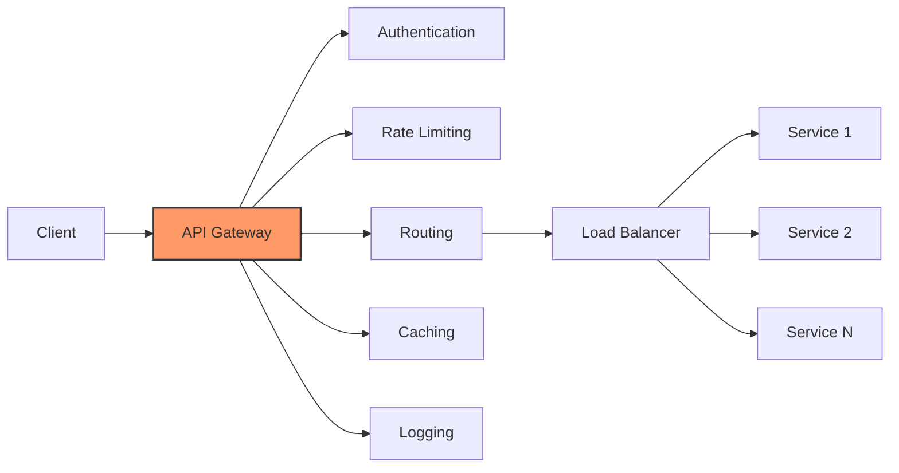
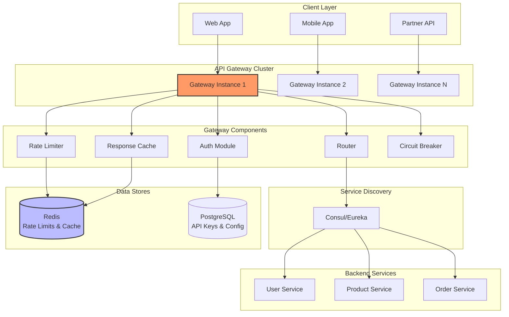

# API Gateway Design

A comprehensive guide to designing a scalable API Gateway for microservices architectures (like Kong, AWS API Gateway, or NGINX Plus).

---

## Table of Contents

1. [Problem Statement](#1-problem-statement)
2. [Requirements](#2-requirements)
3. [Core Responsibilities](#3-core-responsibilities)
4. [API Design](#4-api-design)
5. [High-Level Design](#5-high-level-design)
6. [Key Components](#6-key-components)
7. [Rate Limiting](#7-rate-limiting)
8. [Authentication & Authorization](#8-authentication--authorization)
9. [Code Implementation](#9-code-implementation)

---

## 1. Problem Statement

Design an API Gateway that serves as a single entry point for all client requests in a microservices architecture, providing:
- **Routing** to backend services
- **Authentication & Authorization**
- **Rate limiting**
- **Request/response transformation**
- **Caching**
- **Load balancing**
- **Monitoring & logging**
- **Circuit breaking**

**Real-world Examples:** Kong, AWS API Gateway, Azure API Management, NGINX Plus, Apigee

---

## 2. Requirements

### Functional Requirements

1. **Request Routing**
   - Route requests to appropriate backend services
   - Path-based routing (/users → User Service)
   - Header-based routing (API version)
   - Dynamic service discovery

2. **Authentication & Authorization**
   - JWT validation
   - API key management
   - OAuth 2.0 integration
   - RBAC (role-based access control)

3. **Rate Limiting**
   - Per-user limits (100 req/min)
   - Per-API limits (1000 req/sec)
   - Throttling strategies
   - Quota management

4. **Request/Response Transformation**
   - Protocol translation (REST → gRPC)
   - Request aggregation (BFF pattern)
   - Response filtering
   - Header manipulation

5. **Caching**
   - Response caching
   - Cache invalidation
   - Cache key generation

6. **Circuit Breaking**
   - Detect failing services
   - Fail fast
   - Gradual recovery

### Non-Functional Requirements

1. **Performance**
   - Latency overhead: < 10ms
   - Throughput: 100K req/sec
   - 99.9th percentile: < 100ms

2. **Scalability**
   - Horizontal scaling
   - Handle 1000+ backend services
   - Support 10K+ API routes

3. **Availability**
   - 99.99% uptime
   - No single point of failure
   - Graceful degradation

4. **Security**
   - DDoS protection
   - TLS termination
   - Input validation

---

## 3. Core Responsibilities



---

## 4. API Design

### Gateway Configuration API

```yaml
# Route Configuration
routes:
  - name: "user-service"
    path: "/api/users/*"
    methods: ["GET", "POST", "PUT", "DELETE"]
    backends:
      - url: "http://user-service:8001"
        weight: 1
    plugins:
      - name: "auth"
        config:
          type: "jwt"
      - name: "rate-limit"
        config:
          requests_per_minute: 100
      - name: "cache"
        config:
          ttl: 300

  - name: "product-service"
    path: "/api/products/*"
    methods: ["GET"]
    backends:
      - url: "http://product-service-1:8002"
        weight: 2
      - url: "http://product-service-2:8002"
        weight: 1
    plugins:
      - name: "cache"
        config:
          ttl: 600
```

### Request Flow

```
1. Client Request:
   GET /api/users/123
   Authorization: Bearer eyJhbGc...

2. Gateway Processing:
   - Authenticate JWT
   - Check rate limit
   - Check cache
   - Route to backend
   - Transform response
   - Cache response

3. Backend Request:
   GET http://user-service:8001/users/123
   X-User-ID: user-456

4. Response:
   200 OK
   Cache-Control: max-age=300
   {"id": 123, "name": "John"}
```

---

## 5. High-Level Design



---

## 6. Key Components

### 6.1 Request Router

```python
class Router:
    """Route requests to backend services."""

    def __init__(self):
        self.routes = {}  # path_pattern -> Route config

    def add_route(self, pattern: str, backend_urls: list, methods: list):
        """Add routing rule."""
        self.routes[pattern] = {
            'backends': backend_urls,
            'methods': methods,
            'load_balancer': LoadBalancer(backend_urls)
        }

    async def route_request(self, path: str, method: str) -> str:
        """
        Find matching route and select backend.

        Supports:
        - Exact match: /api/users
        - Prefix match: /api/users/*
        - Regex match: /api/users/[0-9]+
        """

        # Find matching route
        route_config = self._find_route(path)

        if not route_config:
            raise NotFoundException(f"No route for {path}")

        if method not in route_config['methods']:
            raise MethodNotAllowedException(f"{method} not allowed")

        # Load balance across backends
        backend_url = route_config['load_balancer'].get_next()

        return backend_url

    def _find_route(self, path: str):
        """Find matching route using longest prefix match."""
        # Simplified: In production, use Trie or regex patterns
        for pattern, config in self.routes.items():
            if path.startswith(pattern.rstrip('*')):
                return config
        return None
```

### 6.2 Load Balancer

```python
class LoadBalancer:
    """Distribute requests across backend instances."""

    def __init__(self, backends: list, strategy: str = 'round_robin'):
        self.backends = backends
        self.strategy = strategy
        self.current_index = 0
        self.health_status = {b: True for b in backends}  # All healthy initially

    def get_next(self) -> str:
        """Get next backend using selected strategy."""

        if self.strategy == 'round_robin':
            return self._round_robin()
        elif self.strategy == 'least_connections':
            return self._least_connections()
        elif self.strategy == 'weighted':
            return self._weighted_round_robin()
        else:
            return self._round_robin()

    def _round_robin(self) -> str:
        """Simple round-robin selection."""
        healthy_backends = [b for b in self.backends if self.health_status[b]]

        if not healthy_backends:
            raise ServiceUnavailableException("No healthy backends")

        backend = healthy_backends[self.current_index % len(healthy_backends)]
        self.current_index += 1

        return backend

    def mark_unhealthy(self, backend: str):
        """Mark backend as unhealthy after failures."""
        self.health_status[backend] = False

        # Schedule health check to recover
        asyncio.create_task(self._health_check_and_recover(backend))

    async def _health_check_and_recover(self, backend: str):
        """Periodically check if backend has recovered."""
        await asyncio.sleep(30)  # Wait 30 seconds

        try:
            # Send health check request
            response = await http_client.get(f"{backend}/health")
            if response.status == 200:
                self.health_status[backend] = True
                print(f"Backend {backend} recovered")
        except:
            # Still unhealthy, check again later
            await self._health_check_and_recover(backend)
```

---

## 7. Rate Limiting

### 7.1 Token Bucket Algorithm

```python
class RateLimiter:
    """Token bucket rate limiter using Redis."""

    def __init__(self, redis_client):
        self.redis = redis_client

    async def check_rate_limit(
        self,
        key: str,
        max_requests: int,
        window_seconds: int
    ) -> dict:
        """
        Check if request is within rate limit.

        Uses Redis for distributed rate limiting.

        Args:
            key: User ID or API key
            max_requests: Max requests allowed
            window_seconds: Time window

        Returns:
            {
                'allowed': bool,
                'remaining': int,
                'reset_at': timestamp
            }
        """

        current_time = time.time()
        window_key = f"rate_limit:{key}:{window_seconds}"

        # Lua script for atomic increment and check
        lua_script = """
        local key = KEYS[1]
        local max_requests = tonumber(ARGV[1])
        local window = tonumber(ARGV[2])
        local current_time = tonumber(ARGV[3])

        local current = redis.call('GET', key)

        if current and tonumber(current) >= max_requests then
            return {0, current}  -- Exceeded limit
        end

        local new_count = redis.call('INCR', key)

        if new_count == 1 then
            redis.call('EXPIRE', key, window)
        end

        return {1, max_requests - new_count}  -- Allowed, remaining
        """

        result = await self.redis.eval(
            lua_script,
            keys=[window_key],
            args=[max_requests, window_seconds, current_time]
        )

        allowed, remaining = result

        return {
            'allowed': bool(allowed),
            'remaining': remaining,
            'reset_at': current_time + window_seconds
        }
```

### 7.2 Sliding Window Log

```python
async def sliding_window_rate_limit(
    user_id: str,
    max_requests: int,
    window_seconds: int
) -> bool:
    """
    More accurate rate limiting using sliding window.

    Stores timestamps of requests in sorted set.
    """

    key = f"rate_limit:sliding:{user_id}"
    current_time = time.time()
    window_start = current_time - window_seconds

    # Remove old requests outside window
    await redis.zremrangebyscore(key, 0, window_start)

    # Count requests in window
    count = await redis.zcard(key)

    if count >= max_requests:
        return False  # Rate limit exceeded

    # Add current request
    await redis.zadd(key, {str(current_time): current_time})
    await redis.expire(key, window_seconds)

    return True  # Allowed
```

---

## 8. Authentication & Authorization

### 8.1 JWT Validation

```python
class AuthMiddleware:
    """Validate JWT tokens."""

    def __init__(self, secret_key: str):
        self.secret_key = secret_key

    async def authenticate(self, authorization_header: str) -> dict:
        """
        Validate JWT token from Authorization header.

        Returns user claims if valid, raises exception otherwise.
        """

        if not authorization_header:
            raise UnauthorizedException("Missing authorization header")

        # Extract token
        parts = authorization_header.split()
        if len(parts) != 2 or parts[0].lower() != 'bearer':
            raise UnauthorizedException("Invalid authorization header format")

        token = parts[1]

        try:
            # Decode and validate JWT
            import jwt
            claims = jwt.decode(
                token,
                self.secret_key,
                algorithms=['HS256']
            )

            # Check expiration
            if claims.get('exp') and claims['exp'] < time.time():
                raise UnauthorizedException("Token expired")

            return {
                'user_id': claims.get('sub'),
                'roles': claims.get('roles', []),
                'permissions': claims.get('permissions', [])
            }

        except jwt.InvalidTokenError as e:
            raise UnauthorizedException(f"Invalid token: {str(e)}")
```

### 8.2 API Key Management

```python
class APIKeyValidator:
    """Validate API keys for partner integrations."""

    async def validate_api_key(self, api_key: str) -> dict:
        """
        Validate API key and return associated metadata.

        API keys stored in database with:
        - key_hash (hashed for security)
        - rate_limits
        - allowed_endpoints
        - expiration
        """

        # Hash the provided key
        key_hash = hashlib.sha256(api_key.encode()).hexdigest()

        # Look up in database
        key_data = await db.fetchrow(
            """
            SELECT user_id, rate_limit_tier, allowed_paths, expires_at
            FROM api_keys
            WHERE key_hash = $1 AND is_active = TRUE
            """,
            key_hash
        )

        if not key_data:
            raise UnauthorizedException("Invalid API key")

        if key_data['expires_at'] and key_data['expires_at'] < datetime.utcnow():
            raise UnauthorizedException("API key expired")

        return {
            'user_id': key_data['user_id'],
            'rate_limit': key_data['rate_limit_tier'],
            'allowed_paths': key_data['allowed_paths']
        }
```

---

## 9. Code Implementation

```python
# Complete API Gateway implementation

from fastapi import FastAPI, Request, Response, HTTPException
from typing import Optional
import httpx
import time

app = FastAPI()

class APIGateway:
    """Production API Gateway."""

    def __init__(self):
        self.router = Router()
        self.rate_limiter = RateLimiter(redis_client)
        self.auth = AuthMiddleware(secret_key="your-secret")
        self.cache = ResponseCache(redis_client)
        self.circuit_breaker = CircuitBreaker()

    async def process_request(self, request: Request) -> Response:
        """
        Main request processing pipeline.

        Steps:
        1. Authenticate
        2. Authorize
        3. Rate limit
        4. Check cache
        5. Route to backend
        6. Transform response
        7. Cache response
        """

        start_time = time.time()

        try:
            # Step 1: Authentication
            auth_header = request.headers.get('Authorization')
            user = await self.auth.authenticate(auth_header)

            # Step 2: Rate Limiting
            rate_limit = await self.rate_limiter.check_rate_limit(
                key=user['user_id'],
                max_requests=100,
                window_seconds=60
            )

            if not rate_limit['allowed']:
                raise HTTPException(
                    status_code=429,
                    detail="Rate limit exceeded",
                    headers={
                        'X-RateLimit-Remaining': '0',
                        'X-RateLimit-Reset': str(rate_limit['reset_at'])
                    }
                )

            # Step 3: Check cache
            cache_key = self._generate_cache_key(request)
            cached_response = await self.cache.get(cache_key)

            if cached_response:
                return Response(
                    content=cached_response,
                    headers={'X-Cache': 'HIT'}
                )

            # Step 4: Route to backend
            backend_url = await self.router.route_request(
                request.url.path,
                request.method
            )

            # Step 5: Circuit breaker check
            if self.circuit_breaker.is_open(backend_url):
                raise HTTPException(
                    status_code=503,
                    detail="Service temporarily unavailable"
                )

            # Step 6: Forward request
            async with httpx.AsyncClient() as client:
                response = await client.request(
                    method=request.method,
                    url=f"{backend_url}{request.url.path}",
                    headers=dict(request.headers),
                    content=await request.body(),
                    timeout=5.0
                )

                # Circuit breaker success
                self.circuit_breaker.record_success(backend_url)

                # Step 7: Cache successful responses
                if response.status_code == 200:
                    await self.cache.set(cache_key, response.content, ttl=300)

                # Add gateway headers
                latency = (time.time() - start_time) * 1000
                response.headers['X-Gateway-Latency'] = f"{latency:.2f}ms"
                response.headers['X-Cache'] = 'MISS'

                return Response(
                    content=response.content,
                    status_code=response.status_code,
                    headers=dict(response.headers)
                )

        except httpx.TimeoutException:
            self.circuit_breaker.record_failure(backend_url)
            raise HTTPException(status_code=504, detail="Gateway timeout")

        except Exception as e:
            print(f"Gateway error: {e}")
            raise HTTPException(status_code=500, detail="Internal gateway error")

    def _generate_cache_key(self, request: Request) -> str:
        """Generate cache key from request."""
        import hashlib

        key_parts = [
            request.method,
            request.url.path,
            str(sorted(request.query_params.items()))
        ]

        key_string = '|'.join(key_parts)
        return hashlib.md5(key_string.encode()).hexdigest()

# FastAPI route
@app.api_route("/{path:path}", methods=["GET", "POST", "PUT", "DELETE", "PATCH"])
async def gateway_handler(request: Request, path: str):
    """Handle all requests through gateway."""
    gateway = APIGateway()
    return await gateway.process_request(request)

class CircuitBreaker:
    """Circuit breaker pattern for failing services."""

    def __init__(self, failure_threshold: int = 5, timeout: int = 60):
        self.failure_threshold = failure_threshold
        self.timeout = timeout
        self.failures = {}  # service_url -> failure_count
        self.last_failure = {}  # service_url -> timestamp
        self.state = {}  # service_url -> 'closed' | 'open' | 'half_open'

    def is_open(self, service_url: str) -> bool:
        """Check if circuit is open (blocking requests)."""

        if service_url not in self.state:
            self.state[service_url] = 'closed'
            return False

        if self.state[service_url] == 'open':
            # Check if timeout has passed (try recovery)
            if time.time() - self.last_failure[service_url] > self.timeout:
                self.state[service_url] = 'half_open'
                return False
            return True

        return False

    def record_failure(self, service_url: str):
        """Record a failure."""
        self.failures[service_url] = self.failures.get(service_url, 0) + 1
        self.last_failure[service_url] = time.time()

        if self.failures[service_url] >= self.failure_threshold:
            self.state[service_url] = 'open'
            print(f"Circuit breaker OPEN for {service_url}")

    def record_success(self, service_url: str):
        """Record a success."""
        if self.state.get(service_url) == 'half_open':
            # Recovery successful
            self.state[service_url] = 'closed'
            self.failures[service_url] = 0
            print(f"Circuit breaker CLOSED for {service_url}")
```

---

## 10. Key Takeaways

### Design Patterns

1. **Gateway Pattern:** Single entry point for all requests
2. **Circuit Breaker:** Prevent cascading failures
3. **Rate Limiting:** Protect backend services
4. **Caching:** Reduce backend load

### Trade-offs

| Decision | Pros | Cons |
|----------|------|------|
| **Centralized Gateway** | Single point of control | Single point of failure |
| **Stateless Gateway** | Easy to scale | Need Redis for rate limits |
| **Response Caching** | Lower latency | Cache invalidation complexity |

### Interview Tips

**Key Points to Discuss:**
1. How to handle gateway failures (redundancy)
2. Rate limiting algorithms (token bucket vs. sliding window)
3. Circuit breaker states and recovery
4. Caching strategies and invalidation
5. Security (DDoS protection, TLS termination)

**Common Follow-ups:**
- "How to version APIs?" - URL path `/v1/`, `/v2/` or header-based
- "How to A/B test?" - Route % of traffic to different backends
- "How to handle WebSockets?" - Pass through or dedicated gateway

---

**Last Updated:** December 2024
**Difficulty:** Intermediate
**Key Concepts:** Request routing, rate limiting, circuit breaker, authentication, caching

**Real-world:** Kong, AWS API Gateway, Azure APIM, NGINX
