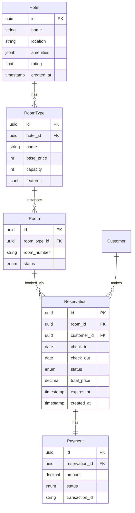
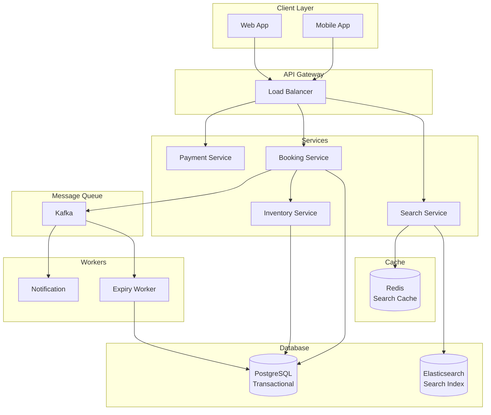

# Hotel/Flight Booking System Design

A comprehensive guide to designing a scalable booking system for hotels, flights, or event tickets (like Booking.com, Airbnb, Expedia).

---

## Table of Contents

1. [Problem Statement](#1-problem-statement)
2. [Requirements](#2-requirements)
3. [Back-of-the-Envelope Estimation](#3-back-of-the-envelope-estimation)
4. [API Design](#4-api-design)
5. [Data Model & Database Schema](#5-data-model--database-schema)
6. [High-Level Design](#6-high-level-design)
7. [Detailed Component Design](#7-detailed-component-design)
8. [Key Challenges & Solutions](#8-key-challenges--solutions)
9. [Trade-offs](#9-trade-offs)
10. [Code Implementation](#10-code-implementation)

---

## 1. Problem Statement

Design a booking system that handles:
- Real-time inventory management (rooms/seats)
- Concurrent booking prevention (no double-booking)
- Search and filtering
- Reservation holds (time-limited)
- Cancellations and refunds
- Pricing and availability calendar

**Real-world Examples:** Booking.com, Airbnb, Expedia, Ticketmaster

---

## 2. Requirements

### Functional Requirements

1. **Search & Discovery**
   - Search hotels by location, dates, guests
   - Filter by price, amenities, ratings
   - View availability calendar
   - Real-time price updates

2. **Booking Flow**
   - Reserve room/seat (hold for 10 minutes)
   - Complete payment
   - Confirm booking
   - Generate booking confirmation

3. **Inventory Management**
   - Track available rooms/seats
   - Handle overbooking strategy
   - Block dates for maintenance
   - Dynamic pricing

4. **Cancellation**
   - Cancel bookings
   - Process refunds
   - Update availability

### Non-Functional Requirements

1. **Consistency:** Prevent double-booking (critical)
2. **Performance:** Search < 500ms, booking < 2s
3. **Scalability:** Handle 100K concurrent bookings
4. **Availability:** 99.99% uptime
5. **Concurrency:** Handle race conditions

---

## 3. Back-of-the-Envelope Estimation

### Assumptions
- Hotels: 1M properties
- Average rooms per property: 50
- Total inventory: 50M rooms
- Daily bookings: 5M
- Search queries: 50M/day

### QPS
- Searches: 50M / 86,400 ≈ 580 QPS (peak: 3K QPS)
- Bookings: 5M / 86,400 ≈ 58 QPS (peak: 500 QPS)
- Total: ~4,000 QPS peak

### Storage
- Hotels: 1M × 10 KB = 10 GB
- Rooms: 50M × 2 KB = 100 GB
- Bookings: 5M/day × 365 × 1 KB = 1.8 TB/year
- **Total: ~2 TB/year**

---

## 4. API Design

### Search Hotels

```http
GET /api/v1/search?location=NYC&check_in=2024-02-01&check_out=2024-02-05&guests=2
```

**Response:**
```json
{
  "results": [
    {
      "hotel_id": "hotel-123",
      "name": "Grand Hotel NYC",
      "location": "Manhattan, NY",
      "price_per_night": 250,
      "available_rooms": 15,
      "rating": 4.5,
      "amenities": ["WiFi", "Pool", "Gym"],
      "images": ["url1", "url2"]
    }
  ],
  "total": 234,
  "filters": {
    "price_range": {"min": 50, "max": 1000},
    "ratings": [4, 4.5, 5]
  }
}
```

### Create Reservation (Hold)

```http
POST /api/v1/reservations/hold
```

**Request:**
```json
{
  "hotel_id": "hotel-123",
  "room_type_id": "deluxe-suite",
  "check_in": "2024-02-01",
  "check_out": "2024-02-05",
  "guests": 2
}
```

**Response:**
```json
{
  "reservation_id": "res-abc123",
  "status": "held",
  "expires_at": "2024-01-15T10:40:00Z",
  "total_price": 1000,
  "room_details": {
    "room_type": "Deluxe Suite",
    "bed_type": "King"
  }
}
```

### Confirm Booking

```http
POST /api/v1/reservations/{reservation_id}/confirm
```

**Request:**
```json
{
  "guest_details": {
    "name": "John Doe",
    "email": "john@example.com",
    "phone": "+1234567890"
  },
  "payment_method": "credit_card",
  "payment_token": "tok_visa_4242"
}
```

**Response:**
```json
{
  "booking_id": "book-xyz789",
  "status": "confirmed",
  "confirmation_code": "XYZ789ABC",
  "total_paid": 1000
}
```

---

## 5. Data Model & Database Schema



### Database Schema

```sql
-- Hotels
CREATE TABLE hotels (
    id UUID PRIMARY KEY,
    name VARCHAR(255) NOT NULL,
    location VARCHAR(255) NOT NULL,
    address TEXT,
    amenities JSONB,
    rating DECIMAL(2, 1),
    created_at TIMESTAMP DEFAULT NOW()
);

CREATE INDEX idx_hotels_location ON hotels(location);

-- Room Types
CREATE TABLE room_types (
    id UUID PRIMARY KEY,
    hotel_id UUID REFERENCES hotels(id),
    name VARCHAR(100),
    description TEXT,
    base_price INT NOT NULL,
    max_occupancy INT,
    features JSONB
);

-- Individual Rooms
CREATE TABLE rooms (
    id UUID PRIMARY KEY,
    room_type_id UUID REFERENCES room_types(id),
    room_number VARCHAR(20),
    status VARCHAR(20) DEFAULT 'available',
    UNIQUE(room_type_id, room_number)
);

-- Reservations
CREATE TYPE reservation_status AS ENUM ('held', 'confirmed', 'cancelled', 'completed');

CREATE TABLE reservations (
    id UUID PRIMARY KEY,
    room_id UUID REFERENCES rooms(id),
    customer_id UUID NOT NULL,
    check_in DATE NOT NULL,
    check_out DATE NOT NULL,
    status reservation_status DEFAULT 'held',
    total_price DECIMAL(10, 2),
    expires_at TIMESTAMP,  -- For hold expiry
    created_at TIMESTAMP DEFAULT NOW(),
    updated_at TIMESTAMP DEFAULT NOW()
);

CREATE INDEX idx_reservations_dates ON reservations(room_id, check_in, check_out);
CREATE INDEX idx_reservations_expires ON reservations(expires_at) WHERE status = 'held';

-- Availability (denormalized for performance)
CREATE TABLE room_availability (
    room_type_id UUID,
    date DATE,
    available_count INT,
    price INT,
    PRIMARY KEY (room_type_id, date)
);

CREATE INDEX idx_availability_date ON room_availability(date);
```

---

## 6. High-Level Design



---

## 7. Detailed Component Design

### 7.1 Availability Check (Critical)

```python
class AvailabilityService:
    """Check room availability with concurrency control."""

    async def check_availability(
        self,
        room_type_id: str,
        check_in: date,
        check_out: date,
        required_rooms: int = 1
    ) -> dict:
        """
        Check if rooms available for date range.

        Uses denormalized availability table for performance.
        """

        # Get availability for date range
        dates = self._get_date_range(check_in, check_out)

        availability = await self.db.fetch(
            """
            SELECT date, available_count, price
            FROM room_availability
            WHERE room_type_id = $1
              AND date >= $2
              AND date < $3
            ORDER BY date
            """,
            room_type_id, check_in, check_out
        )

        # Check if all dates have sufficient rooms
        min_available = min(row['available_count'] for row in availability)

        if min_available < required_rooms:
            return {
                'available': False,
                'min_available': min_available,
                'reason': f'Only {min_available} rooms available'
            }

        # Calculate total price
        total_price = sum(row['price'] for row in availability)

        return {
            'available': True,
            'total_price': total_price,
            'nights': len(availability),
            'avg_price_per_night': total_price / len(availability)
        }

    def _get_date_range(self, start: date, end: date) -> list:
        """Generate list of dates between start and end."""
        dates = []
        current = start
        while current < end:
            dates.append(current)
            current += timedelta(days=1)
        return dates
```

### 7.2 Reservation with Pessimistic Locking

```python
class BookingService:
    """Handle booking with concurrency control."""

    async def create_reservation(
        self,
        customer_id: str,
        room_type_id: str,
        check_in: date,
        check_out: date,
        hold_duration: int = 600  # 10 minutes
    ) -> dict:
        """
        Create reservation with pessimistic locking.

        CRITICAL: Must prevent double-booking!
        """

        async with self.db.transaction():
            # Lock availability rows (prevent concurrent bookings)
            dates = self._get_date_range(check_in, check_out)

            await self.db.execute(
                """
                SELECT * FROM room_availability
                WHERE room_type_id = $1
                  AND date = ANY($2)
                FOR UPDATE  -- Pessimistic lock
                """,
                room_type_id, dates
            )

            # Check availability (after lock acquired)
            available = await self.check_availability(
                room_type_id, check_in, check_out
            )

            if not available['available']:
                raise ValueError("No rooms available")

            # Find specific room to assign
            room = await self._find_available_room(
                room_type_id, check_in, check_out
            )

            # Create reservation
            reservation_id = uuid4()
            expires_at = datetime.utcnow() + timedelta(seconds=hold_duration)

            await self.db.execute(
                """
                INSERT INTO reservations
                (id, room_id, customer_id, check_in, check_out,
                 status, total_price, expires_at)
                VALUES ($1, $2, $3, $4, $5, 'held', $6, $7)
                """,
                reservation_id, room['id'], customer_id,
                check_in, check_out, available['total_price'], expires_at
            )

            # Decrement availability
            await self.db.execute(
                """
                UPDATE room_availability
                SET available_count = available_count - 1
                WHERE room_type_id = $1 AND date = ANY($2)
                """,
                room_type_id, dates
            )

            # Schedule expiry check
            await self.kafka.produce('reservation-expiry', {
                'reservation_id': str(reservation_id),
                'expires_at': expires_at.isoformat()
            })

            return {
                'reservation_id': str(reservation_id),
                'status': 'held',
                'expires_at': expires_at.isoformat(),
                'total_price': available['total_price']
            }

    async def _find_available_room(
        self,
        room_type_id: str,
        check_in: date,
        check_out: date
    ) -> dict:
        """
        Find specific room that's available for entire date range.

        Excludes rooms with overlapping reservations.
        """

        room = await self.db.fetchrow(
            """
            SELECT r.id, r.room_number
            FROM rooms r
            WHERE r.room_type_id = $1
              AND NOT EXISTS (
                  SELECT 1 FROM reservations res
                  WHERE res.room_id = r.id
                    AND res.status IN ('held', 'confirmed')
                    AND res.check_in < $3
                    AND res.check_out > $2
              )
            LIMIT 1
            FOR UPDATE SKIP LOCKED  -- Skip if another transaction locked it
            """,
            room_type_id, check_in, check_out
        )

        if not room:
            raise ValueError("No available rooms found")

        return room
```

### 7.3 Expiry Worker (Background Job)

```python
class ReservationExpiryWorker:
    """Release held reservations that expired."""

    async def process_expiry(self, message: dict):
        """
        Check and expire held reservations.

        Runs every minute or triggered by Kafka event.
        """

        reservation_id = message['reservation_id']

        async with self.db.transaction():
            # Check if still held and expired
            reservation = await self.db.fetchrow(
                """
                SELECT id, room_id, check_in, check_out, status
                FROM reservations
                WHERE id = $1
                  AND status = 'held'
                  AND expires_at < NOW()
                FOR UPDATE
                """,
                reservation_id
            )

            if not reservation:
                return  # Already confirmed or released

            # Mark as cancelled
            await self.db.execute(
                "UPDATE reservations SET status = 'cancelled' WHERE id = $1",
                reservation_id
            )

            # Return availability
            room_type = await self.db.fetchval(
                "SELECT room_type_id FROM rooms WHERE id = $1",
                reservation['room_id']
            )

            dates = self._get_date_range(
                reservation['check_in'],
                reservation['check_out']
            )

            await self.db.execute(
                """
                UPDATE room_availability
                SET available_count = available_count + 1
                WHERE room_type_id = $1 AND date = ANY($2)
                """,
                room_type, dates
            )

            print(f"Expired reservation {reservation_id}")
```

---

## 8. Key Challenges & Solutions

### Challenge 1: Double-Booking Prevention

**Problem:** Two users booking the last room simultaneously.

**Solutions:**

**Option 1: Pessimistic Locking (Chosen)**
```sql
BEGIN;
SELECT * FROM room_availability WHERE ... FOR UPDATE;
-- Check and book
COMMIT;
```
- ✅ Prevents double-booking
- ❌ Slower (locks held during transaction)

**Option 2: Optimistic Locking**
```sql
UPDATE room_availability
SET available_count = available_count - 1, version = version + 1
WHERE room_type_id = $1 AND version = $2;
-- Check rows affected, retry if 0
```
- ✅ Faster (no locks)
- ❌ Requires retry logic

**Decision:** Pessimistic locking for critical path (booking), optimistic for reads.

### Challenge 2: Overbooking Strategy

Airlines often overbook to account for no-shows.

```python
# Allow 5% overbooking
def get_bookable_capacity(total_capacity: int, overbooking_percent: float = 0.05) -> int:
    return int(total_capacity * (1 + overbooking_percent))

# When checking availability
bookable = get_bookable_capacity(100)  # 105 seats for 100-seat flight
available = bookable - current_bookings
```

**Trade-off:** Risk of having to deny boarding vs. higher revenue.

### Challenge 3: Search Performance

**Problem:** Searching 1M hotels with date-based availability is slow.

**Solution: Denormalized Availability Table**

```sql
-- Pre-compute availability for next 365 days
CREATE TABLE room_availability (
    room_type_id UUID,
    date DATE,
    available_count INT,
    price INT,
    PRIMARY KEY (room_type_id, date)
);

-- Update via trigger when reservation created/cancelled
CREATE TRIGGER update_availability
AFTER INSERT OR UPDATE OR DELETE ON reservations
FOR EACH ROW EXECUTE FUNCTION recalculate_availability();
```

**Benefits:**
- Search: O(1) lookup instead of complex join
- Trade-off: Storage (365 days × 50M rooms × 20 bytes = 365 GB)

---

## 9. Trade-offs

| Decision | Pros | Cons | Chosen |
|----------|------|------|--------|
| **Pessimistic Locking** | No double-booking | Slower, lock contention | ✅ Yes |
| **Denormalized Availability** | Fast search | Storage overhead, sync complexity | ✅ Yes |
| **Hold Duration (10 min)** | User has time to pay | Reduces availability | ✅ Yes |
| **Overbooking** | Higher revenue | Risk of denied service | Optional |

---

## 10. Code Implementation

```python
# Simplified booking system showing core concepts

class BookingSystem:
    """Core booking system operations."""

    async def search_hotels(
        self,
        location: str,
        check_in: date,
        check_out: date,
        guests: int
    ) -> list:
        """Search hotels with availability."""

        # Search hotels in location
        hotels = await self.db.fetch(
            """
            SELECT h.id, h.name, h.location, h.rating,
                   MIN(ra.price) as min_price,
                   MIN(ra.available_count) as available_rooms
            FROM hotels h
            JOIN room_types rt ON h.id = rt.hotel_id
            JOIN room_availability ra ON rt.id = ra.room_type_id
            WHERE h.location = $1
              AND ra.date >= $2 AND ra.date < $3
              AND ra.available_count > 0
              AND rt.max_occupancy >= $4
            GROUP BY h.id, h.name, h.location, h.rating
            HAVING COUNT(DISTINCT ra.date) = $5  -- All dates available
            ORDER BY h.rating DESC
            LIMIT 20
            """,
            location, check_in, check_out, guests,
            (check_out - check_in).days
        )

        return [dict(h) for h in hotels]

    async def book_room(
        self,
        customer_id: str,
        room_type_id: str,
        check_in: date,
        check_out: date
    ) -> dict:
        """Book room with transaction safety."""

        async with self.db.transaction():
            # Lock and check availability
            dates = list_dates(check_in, check_out)

            # Pessimistic lock
            await self.db.execute(
                "SELECT * FROM room_availability WHERE room_type_id = $1 AND date = ANY($2) FOR UPDATE",
                room_type_id, dates
            )

            # Find available room
            room = await self.db.fetchrow(
                """
                SELECT r.id FROM rooms r
                WHERE r.room_type_id = $1
                  AND NOT EXISTS (
                      SELECT 1 FROM reservations res
                      WHERE res.room_id = r.id
                        AND res.check_in < $3 AND res.check_out > $2
                        AND res.status IN ('held', 'confirmed')
                  )
                LIMIT 1
                """,
                room_type_id, check_in, check_out
            )

            if not room:
                raise ValueError("No rooms available")

            # Create reservation
            reservation_id = uuid4()
            await self.db.execute(
                """
                INSERT INTO reservations (id, room_id, customer_id, check_in, check_out, status)
                VALUES ($1, $2, $3, $4, $5, 'held')
                """,
                reservation_id, room['id'], customer_id, check_in, check_out
            )

            # Update availability
            await self.db.execute(
                "UPDATE room_availability SET available_count = available_count - 1 WHERE room_type_id = $1 AND date = ANY($2)",
                room_type_id, dates
            )

            return {'reservation_id': str(reservation_id), 'status': 'held'}

    async def confirm_booking(self, reservation_id: str, payment_token: str) -> dict:
        """Confirm reservation after successful payment."""

        async with self.db.transaction():
            # Process payment (simplified)
            payment_result = await self.payment_service.charge(payment_token)

            if payment_result['status'] != 'success':
                raise ValueError("Payment failed")

            # Confirm reservation
            await self.db.execute(
                "UPDATE reservations SET status = 'confirmed', updated_at = NOW() WHERE id = $1",
                reservation_id
            )

            return {'booking_id': str(reservation_id), 'status': 'confirmed'}
```

---

**Last Updated:** December 2024
**Difficulty:** Intermediate
**Key Concepts:** Pessimistic locking, double-booking prevention, denormalized availability, transaction safety

**Interview Focus:** Concurrency control, race condition handling, trade-offs in locking strategies
