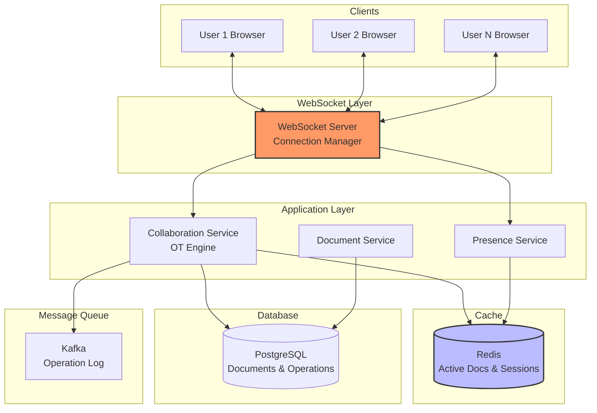

# Collaborative Document Editor Design (Google Docs)

A comprehensive guide to designing a real-time collaborative document editing system like Google Docs.

---

## Table of Contents

1. [Problem Statement](#1-problem-statement)
2. [Requirements](#2-requirements)
3. [Core Concepts](#3-core-concepts)
4. [API Design](#4-api-design)
5. [Data Model](#5-data-model)
6. [High-Level Design](#6-high-level-design)
7. [Operational Transformation (OT)](#7-operational-transformation-ot)
8. [Conflict Resolution](#8-conflict-resolution)
9. [Code Implementation](#9-code-implementation)

---

## 1. Problem Statement

Design a collaborative document editor that allows:
- **Multiple users editing simultaneously** in real-time
- **Conflict-free concurrent editing** (no lost changes)
- **Character-level granularity** (see cursor positions)
- **Offline editing** with sync when reconnected
- **Version history** and undo/redo
- **Presence awareness** (who's viewing/editing)

**Real-world Examples:** Google Docs, Microsoft Office 365, Notion, Figma

---

## 2. Requirements

### Functional Requirements

1. **Real-time Collaboration**
   - See others' cursors and selections
   - Changes appear within 100ms
   - Support 50+ concurrent editors

2. **Conflict Resolution**
   - Operational Transformation (OT) or CRDTs
   - Merge conflicting edits automatically
   - Preserve user intent

3. **Document Operations**
   - Insert, delete, format text
   - Copy, paste, undo, redo
   - Comments and suggestions

4. **Offline Support**
   - Edit offline, sync when online
   - Resolve conflicts on reconnect

5. **Version History**
   - Save snapshots periodically
   - Restore previous versions
   - Show who made what changes

### Non-Functional Requirements

1. **Latency:** < 100ms for local echo, < 200ms for remote updates
2. **Scalability:** Millions of documents, 50+ editors per doc
3. **Consistency:** Eventually consistent across all clients
4. **Availability:** 99.9% uptime

---

## 3. Core Concepts

### 3.1 Operational Transformation (OT)

**Problem:** Two users edit simultaneously

```
Initial state: "Hello"

User A: Insert "!" at position 5 → "Hello!"
User B: Insert " World" at position 5 → "Hello World"

If both operations applied as-is:
A's view: "Hello World!" ✓
B's view: "Hello! World" ✗ Wrong!
```

**Solution: Transform Operations**

```python
# User B's operation needs transformation
# Original: Insert " World" at position 5
# Transformed: Insert " World" at position 6 (account for A's insert)
# Result: "Hello! World" ✓
```

### 3.2 CRDT Alternative

**Conflict-free Replicated Data Types**
- Mathematical guarantee of convergence
- No central server needed
- More complex to implement

---

## 4. API Design

### WebSocket Messages

#### Client → Server: Edit Operation

```json
{
  "type": "operation",
  "doc_id": "doc-123",
  "operation": {
    "type": "insert",
    "position": 5,
    "text": "!",
    "user_id": "user-456",
    "version": 42
  }
}
```

#### Server → Clients: Broadcast Operation

```json
{
  "type": "operation",
  "operation": {
    "type": "insert",
    "position": 5,
    "text": "!",
    "user_id": "user-456",
    "version": 43
  },
  "transformed_for": ["user-789"]
}
```

#### Cursor Position Update

```json
{
  "type": "cursor",
  "doc_id": "doc-123",
  "user_id": "user-456",
  "cursor": {
    "position": 10,
    "selection": {"start": 5, "end": 10}
  }
}
```

---

## 5. Data Model

```sql
-- Documents
CREATE TABLE documents (
    id UUID PRIMARY KEY,
    title VARCHAR(255),
    content TEXT,  -- Latest snapshot
    version BIGINT DEFAULT 0,
    created_by UUID,
    created_at TIMESTAMP DEFAULT NOW(),
    updated_at TIMESTAMP DEFAULT NOW()
);

-- Operations (event sourcing)
CREATE TABLE operations (
    id BIGSERIAL PRIMARY KEY,
    doc_id UUID REFERENCES documents(id),
    user_id UUID NOT NULL,
    operation_type VARCHAR(20),  -- 'insert', 'delete', 'format'
    position INT,
    text TEXT,
    version BIGINT,
    timestamp TIMESTAMP DEFAULT NOW()
);

CREATE INDEX idx_operations_doc_version ON operations(doc_id, version);

-- Active Sessions (who's editing)
CREATE TABLE active_sessions (
    doc_id UUID,
    user_id UUID,
    cursor_position INT,
    last_seen TIMESTAMP DEFAULT NOW(),
    PRIMARY KEY (doc_id, user_id)
);

-- Version Snapshots (periodic checkpoints)
CREATE TABLE version_snapshots (
    id UUID PRIMARY KEY,
    doc_id UUID REFERENCES documents(id),
    version BIGINT,
    content TEXT,
    created_at TIMESTAMP DEFAULT NOW()
);
```

---

## 6. High-Level Design



---

## 7. Operational Transformation (OT)

### 7.1 Basic Operations

```python
class Operation:
    """Base operation class."""

    def __init__(self, op_type: str, position: int, text: str = None):
        self.type = op_type  # 'insert' or 'delete'
        self.position = position
        self.text = text
        self.length = len(text) if text else 1

class Insert(Operation):
    def __init__(self, position: int, text: str):
        super().__init__('insert', position, text)

class Delete(Operation):
    def __init__(self, position: int, length: int = 1):
        super().__init__('delete', position)
        self.length = length
```

### 7.2 Transformation Logic

```python
class OTEngine:
    """Operational Transformation engine."""

    def transform(self, op1: Operation, op2: Operation) -> tuple:
        """
        Transform two concurrent operations.

        Returns: (op1', op2') - transformed versions that can be applied in any order
        """

        if isinstance(op1, Insert) and isinstance(op2, Insert):
            return self._transform_insert_insert(op1, op2)
        elif isinstance(op1, Insert) and isinstance(op2, Delete):
            return self._transform_insert_delete(op1, op2)
        elif isinstance(op1, Delete) and isinstance(op2, Insert):
            op2_prime, op1_prime = self._transform_insert_delete(op2, op1)
            return op1_prime, op2_prime
        elif isinstance(op1, Delete) and isinstance(op2, Delete):
            return self._transform_delete_delete(op1, op2)

    def _transform_insert_insert(self, op1: Insert, op2: Insert) -> tuple:
        """
        Transform two insert operations.

        Example:
        op1: Insert "A" at position 5
        op2: Insert "B" at position 5

        Result:
        op1': Insert "A" at position 5
        op2': Insert "B" at position 6 (after A)
        """

        if op1.position < op2.position:
            # op1 before op2 - no change to op1, op2 shifts right
            return op1, Insert(op2.position + op1.length, op2.text)

        elif op1.position > op2.position:
            # op2 before op1 - op1 shifts right, no change to op2
            return Insert(op1.position + op2.length, op1.text), op2

        else:
            # Same position - tie-break by user ID or timestamp
            # Let's say op1 goes first
            return op1, Insert(op2.position + op1.length, op2.text)

    def _transform_insert_delete(self, insert_op: Insert, delete_op: Delete) -> tuple:
        """
        Transform insert vs delete.

        Example:
        insert: Insert "A" at position 5
        delete: Delete at position 5

        If delete is before insert position:
        - insert': Insert "A" at position 4 (shift left)
        - delete': Delete at position 5 (no change)
        """

        if insert_op.position <= delete_op.position:
            # Insert before delete - delete shifts right
            return insert_op, Delete(delete_op.position + insert_op.length, delete_op.length)

        else:
            # Delete before insert - insert shifts left
            new_pos = max(delete_op.position, insert_op.position - delete_op.length)
            return Insert(new_pos, insert_op.text), delete_op

    def _transform_delete_delete(self, op1: Delete, op2: Delete) -> tuple:
        """
        Transform two delete operations.

        Handle overlapping deletes.
        """

        # Simplified: if deletes overlap, adjust positions
        if op1.position < op2.position:
            return op1, Delete(max(op1.position, op2.position - op1.length), op2.length)
        else:
            return Delete(max(op2.position, op1.position - op2.length), op1.length), op2
```

### 7.3 Applying Operations

```python
class Document:
    """Document state with operation application."""

    def __init__(self, initial_content: str = ""):
        self.content = initial_content
        self.version = 0
        self.history = []  # List of operations

    def apply(self, operation: Operation) -> str:
        """Apply operation and return new content."""

        if isinstance(operation, Insert):
            self.content = (
                self.content[:operation.position] +
                operation.text +
                self.content[operation.position:]
            )

        elif isinstance(operation, Delete):
            end_pos = operation.position + operation.length
            self.content = (
                self.content[:operation.position] +
                self.content[end_pos:]
            )

        self.version += 1
        self.history.append(operation)

        return self.content
```

---

## 8. Conflict Resolution

### 8.1 Handling Concurrent Edits

```python
class CollaborationServer:
    """Server-side collaboration logic."""

    def __init__(self):
        self.documents = {}  # doc_id -> Document
        self.ot_engine = OTEngine()
        self.pending_ops = {}  # user_id -> list of pending operations

    async def handle_operation(
        self,
        doc_id: str,
        user_id: str,
        operation: Operation,
        client_version: int
    ) -> dict:
        """
        Handle incoming operation from client.

        Steps:
        1. Fetch current document version
        2. If client is behind, transform operation against missed ops
        3. Apply operation to document
        4. Broadcast to other clients
        """

        doc = self.documents.get(doc_id)

        # Get operations that happened after client's version
        missed_ops = await self.get_operations_after_version(doc_id, client_version)

        # Transform client's operation against missed operations
        transformed_op = operation
        for missed_op in missed_ops:
            transformed_op, _ = self.ot_engine.transform(transformed_op, missed_op)

        # Apply transformed operation
        new_content = doc.apply(transformed_op)

        # Save operation to database
        await self.save_operation(doc_id, user_id, transformed_op, doc.version)

        # Broadcast to all other connected clients
        await self.broadcast_operation(doc_id, user_id, transformed_op)

        return {
            'success': True,
            'new_version': doc.version,
            'new_content': new_content
        }

    async def broadcast_operation(
        self,
        doc_id: str,
        sender_user_id: str,
        operation: Operation
    ):
        """
        Broadcast operation to all connected users (except sender).
        """

        # Get all active WebSocket connections for this document
        sessions = await self.get_active_sessions(doc_id)

        for user_id, websocket in sessions.items():
            if user_id != sender_user_id:
                await websocket.send_json({
                    'type': 'operation',
                    'operation': operation.to_dict(),
                    'version': self.documents[doc_id].version
                })
```

### 8.2 Client-Side Operation Queue

```python
class CollaborativeEditor:
    """Client-side editor with operation buffering."""

    def __init__(self, doc_id: str, websocket):
        self.doc_id = doc_id
        self.ws = websocket
        self.local_version = 0
        self.pending_operations = []  # Not yet acknowledged by server
        self.buffer = []  # Operations while pending

    async def insert_text(self, position: int, text: str):
        """
        User inserts text locally.

        Optimistic update: Apply immediately + send to server.
        """

        operation = Insert(position, text)

        # Apply locally (optimistic)
        self.apply_local(operation)

        # Send to server
        await self.send_operation(operation)

        # Add to pending queue
        self.pending_operations.append(operation)

    async def send_operation(self, operation: Operation):
        """Send operation to server via WebSocket."""

        await self.ws.send_json({
            'type': 'operation',
            'doc_id': self.doc_id,
            'operation': operation.to_dict(),
            'version': self.local_version
        })

    async def on_server_operation(self, server_op: Operation):
        """
        Receive operation from server (another user's edit).

        Transform against pending operations.
        """

        # Transform against pending operations
        transformed_op = server_op
        for pending_op in self.pending_operations:
            _, transformed_op = OTEngine().transform(pending_op, transformed_op)

        # Apply to document
        self.apply_remote(transformed_op)

    async def on_server_ack(self, version: int):
        """
        Server acknowledged our operation.

        Remove from pending queue.
        """

        if self.pending_operations:
            self.pending_operations.pop(0)
            self.local_version = version
```

---

## 9. Code Implementation

```python
# Complete collaborative editing system

from fastapi import FastAPI, WebSocket
from typing import Dict, List
import asyncio

app = FastAPI()

class DocumentSession:
    """Manage active editing sessions for a document."""

    def __init__(self, doc_id: str):
        self.doc_id = doc_id
        self.content = ""
        self.version = 0
        self.users: Dict[str, WebSocket] = {}  # user_id -> websocket

    async def add_user(self, user_id: str, websocket: WebSocket):
        """User joins document."""
        self.users[user_id] = websocket

        # Send current state
        await websocket.send_json({
            'type': 'init',
            'content': self.content,
            'version': self.version,
            'active_users': list(self.users.keys())
        })

    async def remove_user(self, user_id: str):
        """User leaves document."""
        if user_id in self.users:
            del self.users[user_id]

    async def apply_operation(self, user_id: str, operation: dict):
        """Apply operation and broadcast."""

        # Apply operation to content (simplified)
        if operation['type'] == 'insert':
            pos = operation['position']
            text = operation['text']
            self.content = self.content[:pos] + text + self.content[pos:]

        elif operation['type'] == 'delete':
            pos = operation['position']
            length = operation.get('length', 1)
            self.content = self.content[:pos] + self.content[pos + length:]

        self.version += 1

        # Broadcast to all users except sender
        await self.broadcast(user_id, {
            'type': 'operation',
            'operation': operation,
            'version': self.version
        })

    async def broadcast(self, sender_id: str, message: dict):
        """Send message to all users except sender."""
        for user_id, ws in self.users.items():
            if user_id != sender_id:
                try:
                    await ws.send_json(message)
                except:
                    pass  # Handle disconnected users

# Global registry of active document sessions
active_documents: Dict[str, DocumentSession] = {}

@app.websocket("/ws/docs/{doc_id}/user/{user_id}")
async def websocket_endpoint(websocket: WebSocket, doc_id: str, user_id: str):
    """WebSocket endpoint for real-time collaboration."""

    await websocket.accept()

    # Get or create document session
    if doc_id not in active_documents:
        active_documents[doc_id] = DocumentSession(doc_id)

    session = active_documents[doc_id]
    await session.add_user(user_id, websocket)

    try:
        while True:
            # Receive operation from client
            data = await websocket.receive_json()

            if data['type'] == 'operation':
                await session.apply_operation(user_id, data['operation'])

            elif data['type'] == 'cursor':
                # Broadcast cursor position
                await session.broadcast(user_id, {
                    'type': 'cursor',
                    'user_id': user_id,
                    'cursor': data['cursor']
                })

    except Exception as e:
        print(f"Error: {e}")
    finally:
        await session.remove_user(user_id)

        # Clean up empty sessions
        if len(session.users) == 0:
            del active_documents[doc_id]
```

---

## 10. Key Takeaways

### Interview Tips

**What to Emphasize:**
1. **Operational Transformation** is the core challenge
2. **WebSocket** for real-time bidirectional communication
3. **Optimistic UI** - apply locally, sync with server
4. **Conflict resolution** - transform operations, not content
5. **Event sourcing** - store operations, not just final state

**Common Follow-ups:**
1. "How would you handle offline editing?"
   - Buffer operations locally
   - Send all on reconnect
   - Server transforms against missed operations

2. "What about large documents (100k+ characters)?"
   - Operation-based (OT) scales well (small messages)
   - Periodic snapshots to avoid replaying all ops
   - Lazy loading for very large docs

3. "OT vs. CRDT?"
   - **OT:** Central server, simpler to understand
   - **CRDT:** Decentralized, mathematically guaranteed convergence
   - **Google Docs uses OT**, **Figma uses CRDTs**

---

**Last Updated:** December 2024
**Difficulty:** Intermediate-Advanced
**Key Concepts:** Operational Transformation, conflict-free concurrent editing, WebSockets, optimistic UI

**Must Know:** OT transformation logic, why simple "last write wins" doesn't work
