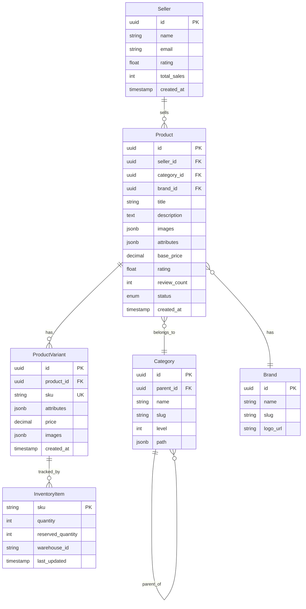

# E-commerce Product Catalog Design

A comprehensive guide to designing a scalable product catalog system for e-commerce platforms like Amazon, eBay, or Shopify.

---

## Table of Contents

1. [Problem Statement](#1-problem-statement)
2. [Requirements](#2-requirements)
3. [Back-of-the-Envelope Estimation](#3-back-of-the-envelope-estimation)
4. [API Design](#4-api-design)
5. [Data Model & Database Schema](#5-data-model--database-schema)
6. [High-Level Design](#6-high-level-design)
7. [Detailed Component Design](#7-detailed-component-design)
8. [Identifying and Resolving Bottlenecks](#8-identifying-and-resolving-bottlenecks)
9. [Trade-offs and Alternatives](#9-trade-offs-and-alternatives)
10. [Monitoring, Metrics & Alerts](#10-monitoring-metrics--alerts)
11. [Follow-up Questions & Extensions](#11-follow-up-questions--extensions)
12. [Code Implementation](#12-code-implementation)
13. [References](#13-references)

---

## 1. Problem Statement

Design a product catalog system for an e-commerce platform that supports:
- Product browsing and searching
- Product categories and hierarchies
- Product variants (size, color, etc.)
- Inventory management
- Product recommendations
- Faceted search and filtering
- Real-time stock updates
- Multi-seller support (marketplace)

**Real-world Examples:**
- Amazon Product Catalog
- eBay Listings
- Shopify Store Management
- Walmart Marketplace

---

## 2. Requirements

### Functional Requirements

1. **Product Management**
   - Create, update, delete products
   - Support product variants (SKU-level)
   - Product attributes (title, description, price, images)
   - Category hierarchy management
   - Brand management

2. **Search & Discovery**
   - Full-text search (product names, descriptions)
   - Faceted filtering (price range, brand, category, ratings)
   - Auto-complete suggestions
   - Search ranking by relevance
   - Sort by price, popularity, ratings

3. **Inventory Management**
   - Track stock levels per SKU
   - Reserve inventory during checkout
   - Low stock alerts
   - Multi-warehouse support

4. **Product Variants**
   - Color, size, material variations
   - Variant-specific pricing
   - Variant-specific images
   - Attribute combinations (e.g., Red + Large)

5. **Seller Management (Marketplace)**
   - Multi-seller support
   - Seller-specific inventory
   - Seller ratings and reviews

### Non-Functional Requirements

1. **Scalability**
   - Support 100M+ products
   - 10M+ daily active users
   - 1M+ concurrent users during sales
   - 100K products added daily

2. **Performance**
   - Search results: < 200ms
   - Product page load: < 300ms
   - Inventory update: < 100ms
   - 99.9th percentile: < 1s

3. **Availability**
   - 99.99% uptime
   - Read-heavy system (1000:1 read/write ratio)
   - Graceful degradation during peak load

4. **Consistency**
   - Strong consistency for inventory
   - Eventual consistency for search index
   - Optimistic concurrency for stock updates

5. **Search Quality**
   - Relevant results (precision > 80%)
   - Typo tolerance
   - Synonym matching
   - Multilingual support

### Out of Scope

- Shopping cart and checkout
- Payment processing
- Order management
- Shipping and logistics
- Customer reviews (can be added as extension)

---

## 3. Back-of-the-Envelope Estimation

### Assumptions

**Products:**
- Total products: 100M
- Active products: 80M (80%)
- Products added daily: 100K
- Average variants per product: 3
- Total SKUs: 300M

**Users:**
- Total users: 200M
- Daily active users (DAU): 10M
- Concurrent users (peak): 1M

**Daily Operations:**
- Product views: 500M/day
- Searches: 100M/day
- Product updates: 1M/day
- Inventory updates: 10M/day

### Traffic Estimates

**QPS (Queries Per Second):**
- Product views: 500M / 86,400s ≈ 5,787 QPS (peak: 30K QPS)
- Search queries: 100M / 86,400s ≈ 1,157 QPS (peak: 6K QPS)
- Inventory updates: 10M / 86,400s ≈ 116 QPS (peak: 1K QPS)
- **Total: ~7,000 QPS average, 40,000 QPS peak**

**Read/Write Ratio: ~500:1 (very read-heavy)**

### Storage Estimates

**Product Data:**
- Product metadata: 100M × 2 KB = 200 GB
- Variant data: 300M × 500 bytes = 150 GB
- Product images: 100M products × 5 images × 200 KB = 100 TB
- **Total: ~100 TB**

**Search Index (Elasticsearch):**
- 100M products × 5 KB/doc = 500 GB
- With replicas (3x): 1.5 TB

**Inventory Data:**
- 300M SKUs × 100 bytes = 30 GB

**Total Storage: ~102 TB (mostly images)**

### Bandwidth Estimates

**Image Delivery:**
- 500M page views × 5 images × 200 KB = 500 TB/day
- Per second: 5.8 GB/s = 46 Gbps
- **With CDN: 90% offload → 4.6 Gbps from origin**

**API Traffic:**
- Search + product data: ~100 MB/s
- **Total: ~5 Gbps peak**

### Cost Estimates (Annual)

- **Storage (S3):** 100 TB × $0.023/GB × 12 = $28K/year
- **Elasticsearch:** 1.5 TB × $0.15/GB × 12 = $2.7K/year
- **Database (RDS):** $100K/year
- **CDN:** 500 TB/day × 365 × $0.085/GB = $15.5M/year
- **Compute:** 500 servers × $150/month = $900K/year
- **Total: ~$17M/year**

---

## 4. API Design

### 4.1 Product Management APIs

#### 1. Create Product

```http
POST /api/v1/products
```

**Request:**
```json
{
  "seller_id": "seller-123",
  "title": "iPhone 15 Pro",
  "description": "Latest iPhone with advanced features",
  "category_id": "cat-electronics-phones",
  "brand": "Apple",
  "base_price": 999.99,
  "images": [
    "https://cdn.example.com/iphone15-1.jpg",
    "https://cdn.example.com/iphone15-2.jpg"
  ],
  "attributes": {
    "warranty": "1 year",
    "condition": "new"
  },
  "variants": [
    {
      "sku": "IPHONE15-BLK-256",
      "attributes": {
        "color": "Black",
        "storage": "256GB"
      },
      "price": 999.99,
      "stock": 100
    },
    {
      "sku": "IPHONE15-WHT-512",
      "attributes": {
        "color": "White",
        "storage": "512GB"
      },
      "price": 1199.99,
      "stock": 50
    }
  ]
}
```

**Response:**
```json
{
  "product_id": "prod-abc123",
  "status": "active",
  "created_at": "2024-01-15T10:30:00Z",
  "variants": [
    {
      "variant_id": "var-001",
      "sku": "IPHONE15-BLK-256"
    },
    {
      "variant_id": "var-002",
      "sku": "IPHONE15-WHT-512"
    }
  ]
}
```

#### 2. Get Product Details

```http
GET /api/v1/products/{product_id}
```

**Response:**
```json
{
  "product_id": "prod-abc123",
  "seller": {
    "seller_id": "seller-123",
    "name": "Apple Official Store",
    "rating": 4.8
  },
  "title": "iPhone 15 Pro",
  "description": "Latest iPhone...",
  "category": {
    "id": "cat-electronics-phones",
    "name": "Mobile Phones",
    "breadcrumb": ["Electronics", "Mobile Phones"]
  },
  "brand": "Apple",
  "images": ["..."],
  "variants": [
    {
      "variant_id": "var-001",
      "sku": "IPHONE15-BLK-256",
      "attributes": {"color": "Black", "storage": "256GB"},
      "price": 999.99,
      "stock": 100,
      "is_available": true
    }
  ],
  "rating": {
    "average": 4.5,
    "count": 1234
  }
}
```

### 4.2 Search APIs

#### 3. Search Products

```http
GET /api/v1/search?q=iphone&category=electronics&min_price=500&max_price=1500&sort=price_asc&page=1&limit=20
```

**Response:**
```json
{
  "query": "iphone",
  "total_results": 1523,
  "page": 1,
  "results": [
    {
      "product_id": "prod-abc123",
      "title": "iPhone 15 Pro",
      "price": 999.99,
      "image": "https://cdn.example.com/iphone15.jpg",
      "rating": 4.5,
      "seller": "Apple Official Store",
      "in_stock": true
    }
  ],
  "facets": {
    "brands": [
      {"name": "Apple", "count": 234},
      {"name": "Samsung", "count": 456}
    ],
    "price_ranges": [
      {"range": "0-500", "count": 123},
      {"range": "500-1000", "count": 567},
      {"range": "1000+", "count": 234}
    ]
  },
  "suggested_filters": {
    "color": ["Black", "White", "Blue"],
    "storage": ["128GB", "256GB", "512GB"]
  }
}
```

#### 4. Autocomplete

```http
GET /api/v1/search/autocomplete?q=ipho
```

**Response:**
```json
{
  "suggestions": [
    {
      "text": "iphone 15",
      "type": "product",
      "count": 234
    },
    {
      "text": "iphone 14",
      "type": "product",
      "count": 567
    },
    {
      "text": "iphone cases",
      "type": "category",
      "count": 1234
    }
  ]
}
```

### 4.3 Inventory APIs

#### 5. Update Stock

```http
PATCH /api/v1/inventory/{sku}
```

**Request:**
```json
{
  "quantity_delta": -5,
  "reason": "order_placed",
  "order_id": "order-xyz789"
}
```

**Response:**
```json
{
  "sku": "IPHONE15-BLK-256",
  "old_quantity": 100,
  "new_quantity": 95,
  "updated_at": "2024-01-15T11:00:00Z"
}
```

#### 6. Reserve Inventory

```http
POST /api/v1/inventory/reserve
```

**Request:**
```json
{
  "items": [
    {"sku": "IPHONE15-BLK-256", "quantity": 2}
  ],
  "reservation_ttl": 600
}
```

**Response:**
```json
{
  "reservation_id": "res-abc123",
  "expires_at": "2024-01-15T11:10:00Z",
  "items": [
    {
      "sku": "IPHONE15-BLK-256",
      "quantity": 2,
      "status": "reserved"
    }
  ]
}
```

---

## 5. Data Model & Database Schema

### 5.1 Entity Relationship Diagram



### 5.2 Database Schema (PostgreSQL + Sharding)

```sql
-- Sellers
CREATE TABLE sellers (
    id UUID PRIMARY KEY DEFAULT gen_random_uuid(),
    name VARCHAR(255) NOT NULL,
    email VARCHAR(255) UNIQUE NOT NULL,
    rating DECIMAL(3, 2) DEFAULT 0,
    total_sales BIGINT DEFAULT 0,
    status VARCHAR(20) DEFAULT 'active',
    created_at TIMESTAMP DEFAULT CURRENT_TIMESTAMP
);

CREATE INDEX idx_sellers_rating ON sellers(rating DESC);

-- Categories (hierarchical)
CREATE TABLE categories (
    id UUID PRIMARY KEY DEFAULT gen_random_uuid(),
    parent_id UUID REFERENCES categories(id),
    name VARCHAR(255) NOT NULL,
    slug VARCHAR(255) UNIQUE NOT NULL,
    level INT NOT NULL,
    path JSONB,  -- ["Electronics", "Mobile Phones"]
    created_at TIMESTAMP DEFAULT CURRENT_TIMESTAMP
);

CREATE INDEX idx_categories_parent ON categories(parent_id);
CREATE INDEX idx_categories_slug ON categories(slug);

-- Brands
CREATE TABLE brands (
    id UUID PRIMARY KEY DEFAULT gen_random_uuid(),
    name VARCHAR(255) UNIQUE NOT NULL,
    slug VARCHAR(255) UNIQUE NOT NULL,
    logo_url VARCHAR(500),
    created_at TIMESTAMP DEFAULT CURRENT_TIMESTAMP
);

-- Products (shard by product_id or seller_id)
CREATE TYPE product_status_enum AS ENUM ('draft', 'active', 'inactive', 'deleted');

CREATE TABLE products (
    id UUID PRIMARY KEY DEFAULT gen_random_uuid(),
    seller_id UUID NOT NULL REFERENCES sellers(id),
    category_id UUID NOT NULL REFERENCES categories(id),
    brand_id UUID REFERENCES brands(id),
    title VARCHAR(500) NOT NULL,
    description TEXT,
    images JSONB,  -- ["url1", "url2", ...]
    attributes JSONB,  -- {"warranty": "1 year", "condition": "new"}
    base_price DECIMAL(10, 2) NOT NULL,
    rating DECIMAL(3, 2) DEFAULT 0,
    review_count INT DEFAULT 0,
    status product_status_enum DEFAULT 'draft',
    created_at TIMESTAMP DEFAULT CURRENT_TIMESTAMP,
    updated_at TIMESTAMP DEFAULT CURRENT_TIMESTAMP
);

CREATE INDEX idx_products_seller ON products(seller_id);
CREATE INDEX idx_products_category ON products(category_id);
CREATE INDEX idx_products_brand ON products(brand_id);
CREATE INDEX idx_products_status ON products(status) WHERE status = 'active';
CREATE INDEX idx_products_rating ON products(rating DESC) WHERE status = 'active';

-- Product Variants (SKU level)
CREATE TABLE product_variants (
    id UUID PRIMARY KEY DEFAULT gen_random_uuid(),
    product_id UUID NOT NULL REFERENCES products(id) ON DELETE CASCADE,
    sku VARCHAR(100) UNIQUE NOT NULL,
    attributes JSONB NOT NULL,  -- {"color": "Black", "storage": "256GB"}
    price DECIMAL(10, 2) NOT NULL,
    images JSONB,  -- Variant-specific images
    created_at TIMESTAMP DEFAULT CURRENT_TIMESTAMP,
    updated_at TIMESTAMP DEFAULT CURRENT_TIMESTAMP
);

CREATE INDEX idx_variants_product ON product_variants(product_id);
CREATE INDEX idx_variants_sku ON product_variants(sku);

-- Inventory (separate database for high write throughput)
CREATE TABLE inventory (
    sku VARCHAR(100) PRIMARY KEY,
    quantity INT NOT NULL DEFAULT 0,
    reserved_quantity INT NOT NULL DEFAULT 0,
    available_quantity INT GENERATED ALWAYS AS (quantity - reserved_quantity) STORED,
    warehouse_id VARCHAR(50),
    last_updated TIMESTAMP DEFAULT CURRENT_TIMESTAMP,
    CONSTRAINT check_quantities CHECK (reserved_quantity >= 0 AND quantity >= reserved_quantity)
);

CREATE INDEX idx_inventory_available ON inventory(available_quantity) WHERE available_quantity > 0;

-- Inventory Reservations (for checkout flow)
CREATE TABLE inventory_reservations (
    id UUID PRIMARY KEY DEFAULT gen_random_uuid(),
    sku VARCHAR(100) NOT NULL,
    quantity INT NOT NULL,
    order_id VARCHAR(100),
    expires_at TIMESTAMP NOT NULL,
    created_at TIMESTAMP DEFAULT CURRENT_TIMESTAMP
);

CREATE INDEX idx_reservations_expiry ON inventory_reservations(expires_at);
CREATE INDEX idx_reservations_sku ON inventory_reservations(sku);
```

### 5.3 Elasticsearch Index Mapping

```json
{
  "mappings": {
    "properties": {
      "product_id": {"type": "keyword"},
      "title": {
        "type": "text",
        "analyzer": "standard",
        "fields": {
          "keyword": {"type": "keyword"},
          "suggest": {"type": "completion"}
        }
      },
      "description": {"type": "text"},
      "category": {
        "type": "nested",
        "properties": {
          "id": {"type": "keyword"},
          "name": {"type": "keyword"},
          "path": {"type": "keyword"}
        }
      },
      "brand": {"type": "keyword"},
      "price": {"type": "float"},
      "rating": {"type": "float"},
      "review_count": {"type": "integer"},
      "seller_id": {"type": "keyword"},
      "seller_name": {"type": "keyword"},
      "attributes": {"type": "object", "enabled": false},
      "tags": {"type": "keyword"},
      "in_stock": {"type": "boolean"},
      "created_at": {"type": "date"}
    }
  }
}
```

---

## 6. High-Level Design

### 6.1 Architecture Diagram

```mermaid
graph TB
    subgraph "Client Layer"
        WEB[Web App]
        MOBILE[Mobile App]
        ADMIN[Admin Portal]
    end

    subgraph "CDN"
        CDN[CloudFront<br/>Static Assets & Images]
    end

    subgraph "API Gateway"
        LB[Load Balancer]
        GW[API Gateway<br/>Rate Limiting, Auth]
    end

    subgraph "Service Layer"
        PROD[Product Service]
        SEARCH[Search Service]
        INV[Inventory Service]
        SELLER[Seller Service]
    end

    subgraph "Search Layer"
        ES[(Elasticsearch<br/>Product Index)]
    end

    subgraph "Cache Layer"
        REDIS[(Redis Cluster<br/>Product Cache)]
    end

    subgraph "Database Layer"
        PG[(PostgreSQL<br/>Sharded)]
        INV_DB[(Inventory DB)]
    end

    subgraph "Storage"
        S3[(S3<br/>Product Images)]
    end

    subgraph "Message Queue"
        KAFKA[Kafka]
    end

    subgraph "Background Workers"
        INDEX[Search Indexer]
        STOCK[Stock Monitor]
        ANALYTICS[Analytics]
    end

    WEB --> CDN
    MOBILE --> CDN
    WEB --> LB
    MOBILE --> LB
    ADMIN --> LB

    LB --> GW
    GW --> PROD
    GW --> SEARCH
    GW --> INV
    GW --> SELLER

    PROD --> REDIS
    PROD --> PG
    PROD --> S3
    SEARCH --> ES
    INV --> INV_DB
    INV --> REDIS

    PROD --> KAFKA
    INV --> KAFKA

    KAFKA --> INDEX
    KAFKA --> STOCK
    KAFKA --> ANALYTICS

    INDEX --> ES
    STOCK --> INV_DB

    style ES fill:#9f6,stroke:#333,stroke-width:2px
    style REDIS fill:#bbf,stroke:#333,stroke-width:2px
    style CDN fill:#f96,stroke:#333,stroke-width:2px
```

### 6.2 Key Components

**1. Product Service:**
- CRUD operations for products and variants
- Data validation
- Image upload coordination

**2. Search Service:**
- Query Elasticsearch
- Faceted filtering
- Autocomplete suggestions
- Ranking and scoring

**3. Inventory Service:**
- Stock tracking
- Reservation management
- Low stock alerts
- Multi-warehouse support

**4. Background Workers:**
- **Search Indexer:** Sync product changes to Elasticsearch
- **Stock Monitor:** Check reservations expiry, low stock alerts
- **Analytics:** Aggregate search metrics, popular products

---

## 7. Detailed Component Design

### 7.1 Product Search with Elasticsearch

```python
class SearchService:
    """Product search using Elasticsearch."""

    def __init__(self, es_client):
        self.es = es_client
        self.index = 'products'

    async def search_products(
        self,
        query: str,
        filters: dict = None,
        sort: str = 'relevance',
        page: int = 1,
        limit: int = 20
    ) -> dict:
        """
        Search products with filters and facets.

        Example filters:
        {
            "category": "electronics",
            "brand": ["Apple", "Samsung"],
            "price_min": 500,
            "price_max": 1500,
            "in_stock": true
        }
        """

        # Build query
        must_clauses = []

        # Text search
        if query:
            must_clauses.append({
                'multi_match': {
                    'query': query,
                    'fields': ['title^3', 'description', 'brand^2'],
                    'fuzziness': 'AUTO',  # Typo tolerance
                    'operator': 'and'
                }
            })

        # Filters
        filter_clauses = []

        if filters:
            if filters.get('category'):
                filter_clauses.append({
                    'term': {'category.id': filters['category']}
                })

            if filters.get('brand'):
                filter_clauses.append({
                    'terms': {'brand': filters['brand']}
                })

            if filters.get('price_min') or filters.get('price_max'):
                price_range = {}
                if filters.get('price_min'):
                    price_range['gte'] = filters['price_min']
                if filters.get('price_max'):
                    price_range['lte'] = filters['price_max']

                filter_clauses.append({
                    'range': {'price': price_range}
                })

            if filters.get('in_stock'):
                filter_clauses.append({
                    'term': {'in_stock': True}
                })

        # Sorting
        sort_options = {
            'relevance': '_score',
            'price_asc': {'price': 'asc'},
            'price_desc': {'price': 'desc'},
            'rating': {'rating': 'desc'},
            'popularity': {'review_count': 'desc'}
        }

        # Execute search
        response = await self.es.search(
            index=self.index,
            body={
                'query': {
                    'bool': {
                        'must': must_clauses,
                        'filter': filter_clauses
                    }
                },
                'sort': [sort_options.get(sort, '_score')],
                'from': (page - 1) * limit,
                'size': limit,
                'aggs': {
                    # Facets for filtering
                    'brands': {
                        'terms': {'field': 'brand', 'size': 20}
                    },
                    'categories': {
                        'terms': {'field': 'category.name', 'size': 10}
                    },
                    'price_ranges': {
                        'range': {
                            'field': 'price',
                            'ranges': [
                                {'to': 100},
                                {'from': 100, 'to': 500},
                                {'from': 500, 'to': 1000},
                                {'from': 1000}
                            ]
                        }
                    }
                }
            }
        )

        # Format results
        results = []
        for hit in response['hits']['hits']:
            source = hit['_source']
            results.append({
                'product_id': source['product_id'],
                'title': source['title'],
                'price': source['price'],
                'rating': source.get('rating', 0),
                'image': source.get('images', [None])[0],
                'in_stock': source.get('in_stock', False),
                'seller': source.get('seller_name'),
                'score': hit['_score']
            })

        # Extract facets
        facets = {}
        if 'aggregations' in response:
            aggs = response['aggregations']

            facets['brands'] = [
                {'name': b['key'], 'count': b['doc_count']}
                for b in aggs['brands']['buckets']
            ]

            facets['price_ranges'] = [
                {'range': f"{r.get('from', 0)}-{r.get('to', '+')}", 'count': r['doc_count']}
                for r in aggs['price_ranges']['buckets']
            ]

        return {
            'total': response['hits']['total']['value'],
            'results': results,
            'facets': facets,
            'page': page
        }

    async def autocomplete(self, prefix: str, limit: int = 10) -> list:
        """
        Autocomplete suggestions.

        Uses completion suggester for fast prefix matching.
        """

        response = await self.es.search(
            index=self.index,
            body={
                'suggest': {
                    'product-suggest': {
                        'prefix': prefix,
                        'completion': {
                            'field': 'title.suggest',
                            'size': limit,
                            'skip_duplicates': True
                        }
                    }
                }
            }
        )

        suggestions = []
        for option in response['suggest']['product-suggest'][0]['options']:
            suggestions.append({
                'text': option['text'],
                'score': option['_score']
            })

        return suggestions
```

### 7.2 Inventory Management with Optimistic Locking

```python
class InventoryService:
    """Manage product inventory with concurrency control."""

    async def reserve_inventory(
        self,
        sku: str,
        quantity: int,
        order_id: str,
        ttl: int = 600
    ) -> dict:
        """
        Reserve inventory for checkout (10-minute hold).

        Uses optimistic locking to prevent overselling.
        """

        async with self.db.transaction():
            # Lock inventory row
            inventory = await self.db.fetchrow(
                """
                SELECT quantity, reserved_quantity
                FROM inventory
                WHERE sku = $1
                FOR UPDATE
                """,
                sku
            )

            if not inventory:
                raise ValueError(f"SKU {sku} not found")

            available = inventory['quantity'] - inventory['reserved_quantity']

            if available < quantity:
                raise ValueError(
                    f"Insufficient stock. Available: {available}, Requested: {quantity}"
                )

            # Create reservation
            reservation_id = str(uuid4())
            expires_at = datetime.utcnow() + timedelta(seconds=ttl)

            await self.db.execute(
                """
                INSERT INTO inventory_reservations (id, sku, quantity, order_id, expires_at)
                VALUES ($1, $2, $3, $4, $5)
                """,
                reservation_id, sku, quantity, order_id, expires_at
            )

            # Update reserved quantity
            await self.db.execute(
                """
                UPDATE inventory
                SET reserved_quantity = reserved_quantity + $1,
                    last_updated = NOW()
                WHERE sku = $2
                """,
                quantity, sku
            )

            return {
                'reservation_id': reservation_id,
                'sku': sku,
                'quantity': quantity,
                'expires_at': expires_at.isoformat()
            }

    async def commit_reservation(self, reservation_id: str) -> dict:
        """
        Commit reservation (order placed successfully).

        Deduct from actual quantity.
        """

        async with self.db.transaction():
            reservation = await self.db.fetchrow(
                """
                SELECT sku, quantity
                FROM inventory_reservations
                WHERE id = $1 AND expires_at > NOW()
                """,
                reservation_id
            )

            if not reservation:
                raise ValueError("Reservation not found or expired")

            sku = reservation['sku']
            quantity = reservation['quantity']

            # Deduct from quantity and reserved
            await self.db.execute(
                """
                UPDATE inventory
                SET quantity = quantity - $1,
                    reserved_quantity = reserved_quantity - $1
                WHERE sku = $2
                """,
                quantity, sku
            )

            # Delete reservation
            await self.db.execute(
                "DELETE FROM inventory_reservations WHERE id = $1",
                reservation_id
            )

            # Invalidate cache
            await self.redis.delete(f"stock:{sku}")

            return {'status': 'committed', 'sku': sku}

    async def release_reservation(self, reservation_id: str) -> dict:
        """
        Release reservation (checkout abandoned).
        """

        async with self.db.transaction():
            reservation = await self.db.fetchrow(
                "SELECT sku, quantity FROM inventory_reservations WHERE id = $1",
                reservation_id
            )

            if not reservation:
                return {'status': 'not_found'}

            # Unreserve
            await self.db.execute(
                """
                UPDATE inventory
                SET reserved_quantity = reserved_quantity - $1
                WHERE sku = $2
                """,
                reservation['quantity'], reservation['sku']
            )

            await self.db.execute(
                "DELETE FROM inventory_reservations WHERE id = $1",
                reservation_id
            )

            return {'status': 'released'}
```

### 7.3 Product Caching Strategy

```python
class ProductCache:
    """Multi-layer caching for product data."""

    def __init__(self, redis, db):
        self.redis = redis
        self.db = db

    async def get_product(self, product_id: str) -> dict:
        """
        Get product with caching.

        Cache layers:
        1. Redis (hot data, 1-hour TTL)
        2. Database (source of truth)
        """

        # L1: Redis cache
        cache_key = f"product:{product_id}"
        cached = await self.redis.get(cache_key)

        if cached:
            return json.loads(cached)

        # L2: Database
        product = await self.db.fetchrow(
            """
            SELECT p.*, b.name as brand_name, c.name as category_name,
                   s.name as seller_name, s.rating as seller_rating
            FROM products p
            LEFT JOIN brands b ON p.brand_id = b.id
            LEFT JOIN categories c ON p.category_id = c.id
            LEFT JOIN sellers s ON p.seller_id = s.id
            WHERE p.id = $1 AND p.status = 'active'
            """,
            product_id
        )

        if not product:
            return None

        # Get variants with stock info
        variants = await self.db.fetch(
            """
            SELECT v.*, i.quantity, i.reserved_quantity,
                   (i.quantity - i.reserved_quantity) as available_quantity
            FROM product_variants v
            LEFT JOIN inventory i ON v.sku = i.sku
            WHERE v.product_id = $1
            """,
            product_id
        )

        product_data = {
            'product_id': str(product['id']),
            'title': product['title'],
            'description': product['description'],
            'price': float(product['base_price']),
            'rating': float(product['rating']) if product['rating'] else 0,
            'brand': product['brand_name'],
            'category': product['category_name'],
            'seller': {
                'name': product['seller_name'],
                'rating': float(product['seller_rating']) if product['seller_rating'] else 0
            },
            'images': product['images'],
            'variants': [
                {
                    'variant_id': str(v['id']),
                    'sku': v['sku'],
                    'attributes': v['attributes'],
                    'price': float(v['price']),
                    'stock': v['available_quantity'] or 0,
                    'in_stock': (v['available_quantity'] or 0) > 0
                }
                for v in variants
            ]
        }

        # Cache for 1 hour
        await self.redis.setex(
            cache_key,
            3600,
            json.dumps(product_data)
        )

        return product_data

    async def invalidate_product(self, product_id: str):
        """Invalidate cache when product updated."""
        await self.redis.delete(f"product:{product_id}")
```

### 7.4 Category Hierarchy Management

```python
class CategoryService:
    """Manage hierarchical product categories."""

    async def get_category_tree(self, root_id: str = None) -> dict:
        """
        Get category tree (nested structure).

        Example output:
        {
            "id": "electronics",
            "name": "Electronics",
            "children": [
                {
                    "id": "phones",
                    "name": "Mobile Phones",
                    "children": [...]
                }
            ]
        }
        """

        # Recursive CTE to build tree
        query = """
        WITH RECURSIVE cat_tree AS (
            -- Base case
            SELECT id, parent_id, name, slug, level, ARRAY[name] as path
            FROM categories
            WHERE parent_id IS NULL OR parent_id = $1

            UNION ALL

            -- Recursive case
            SELECT c.id, c.parent_id, c.name, c.slug, c.level,
                   ct.path || c.name
            FROM categories c
            JOIN cat_tree ct ON c.parent_id = ct.id
        )
        SELECT * FROM cat_tree
        ORDER BY level, name
        """

        rows = await self.db.fetch(query, root_id)

        # Build nested structure
        return self._build_tree(rows, root_id)

    def _build_tree(self, rows: list, parent_id: str = None) -> list:
        """Convert flat list to nested tree."""
        tree = []

        for row in rows:
            if row['parent_id'] == parent_id:
                node = {
                    'id': str(row['id']),
                    'name': row['name'],
                    'slug': row['slug'],
                    'children': self._build_tree(rows, row['id'])
                }
                tree.append(node)

        return tree

    async def get_category_path(self, category_id: str) -> list:
        """
        Get breadcrumb path for category.

        Example: ["Electronics", "Mobile Phones", "Smartphones"]
        """

        category = await self.db.fetchrow(
            "SELECT path FROM categories WHERE id = $1",
            category_id
        )

        return category['path'] if category else []
```

---

## 8. Identifying and Resolving Bottlenecks

### 8.1 Potential Bottlenecks

| Bottleneck | Impact | Solution |
|------------|--------|----------|
| **Search Query Load** | Elasticsearch overwhelmed | Read replicas, caching, query optimization |
| **Inventory Updates** | Database lock contention | Separate inventory DB, optimistic locking |
| **Product Page Load** | Slow with many variants | Redis caching, lazy-load variants |
| **Image Delivery** | High bandwidth costs | CDN, WebP format, responsive images |

### 8.2 Elasticsearch Scaling

**Problem:** 100M products → large index, slow queries

**Solutions:**

1. **Index Partitioning by Category:**
```python
# Use alias to search across shards
PUT /products-electronics
PUT /products-clothing
PUT /products-home

POST /_aliases
{
  "actions": [
    {"add": {"index": "products-*", "alias": "products"}}
  ]
}
```

2. **Query Optimization:**
```python
# Use filters instead of queries (cacheable)
{
  "query": {
    "bool": {
      "must": [{"match": {"title": "iphone"}}],
      "filter": [
        {"term": {"category": "electronics"}},  # Cached
        {"range": {"price": {"gte": 500}}}  # Cached
      ]
    }
  }
}
```

3. **Result Caching:**
```python
# Cache search results for popular queries
cache_key = f"search:{query_hash}"
if await redis.exists(cache_key):
    return json.loads(await redis.get(cache_key))

# Execute search and cache for 5 minutes
results = await es.search(...)
await redis.setex(cache_key, 300, json.dumps(results))
```

### 8.3 Database Sharding Strategy

**Shard by:** `product_id` (hash-based)

```python
def get_shard(product_id: str, num_shards: int = 16) -> int:
    return int(hashlib.md5(product_id.encode()).hexdigest(), 16) % num_shards
```

**Benefits:**
- Even distribution
- Product + variants co-located
- Horizontal scalability

**Challenges:**
- Cross-shard queries (category browsing)
- Use Elasticsearch for cross-shard searches

---

## 9. Trade-offs and Alternatives

### 9.1 Search: Elasticsearch vs. PostgreSQL

| Solution | Pros | Cons | Decision |
|----------|------|------|----------|
| **Elasticsearch** | Fast full-text, facets | Extra complexity, eventual consistency | ✅ Use for search |
| **PostgreSQL** | Simple, ACID | Slow for text search | Use for CRUD |

### 9.2 Inventory: Strong vs. Eventual Consistency

**Strong Consistency (Chosen):**
- Prevent overselling (critical)
- Use database transactions
- Trade-off: Slightly slower writes

**Eventual Consistency:**
- Faster writes
- Risk of overselling
- Not acceptable for inventory

### 9.3 Product Data: SQL vs. NoSQL

| Approach | Pros | Cons |
|----------|------|------|
| **PostgreSQL (JSONB)** | ACID, flexible schema | Limited scalability |
| **MongoDB** | Flexible, scalable | Weaker consistency |
| **Hybrid** | Best of both | Complexity |

**Decision:** PostgreSQL with JSONB for product attributes (flexible + ACID)

---

## 10. Monitoring, Metrics & Alerts

### 10.1 Key Metrics

```python
metrics = {
    # Search performance
    'search_latency_ms': Histogram(labels=['query_type']),
    'search_result_count': Histogram(),
    'autocomplete_latency_ms': Histogram(),

    # Inventory
    'inventory_reservations': Counter(labels=['status']),
    'stock_level': Gauge(labels=['sku']),
    'low_stock_alerts': Counter(),

    # Product catalog
    'product_views': Counter(labels=['product_id']),
    'cache_hit_rate': Gauge(labels=['cache_type']),

    # Database
    'db_query_duration': Histogram(labels=['query']),
    'es_index_lag_seconds': Gauge(),
}
```

### 10.2 Alerts

```yaml
alerts:
  - name: SearchLatencyHigh
    condition: p95(search_latency_ms) > 500
    severity: warning

  - name: InventoryOversold
    condition: stock_level < 0
    severity: critical

  - name: ESIndexLagHigh
    condition: es_index_lag_seconds > 60
    severity: warning

  - name: LowStockProducts
    condition: count(stock_level < 10) > 1000
    severity: info
```

---

## 11. Follow-up Questions & Extensions

### Q1: "How would you add product recommendations?"

**Answer: Collaborative Filtering**

```python
class RecommendationService:
    """Product recommendations using collaborative filtering."""

    async def get_recommendations(self, product_id: str, limit: int = 10) -> list:
        """
        Recommend products based on:
        1. Users who viewed this also viewed...
        2. Similar products (same category, brand)
        3. Trending products
        """

        # Frequently bought together
        co_viewed = await self.db.fetch(
            """
            SELECT p2.product_id, COUNT(*) as score
            FROM user_views v1
            JOIN user_views v2 ON v1.user_id = v2.user_id
            JOIN products p2 ON v2.product_id = p2.id
            WHERE v1.product_id = $1
              AND v2.product_id != $1
              AND v2.created_at > NOW() - INTERVAL '30 days'
            GROUP BY p2.product_id
            ORDER BY score DESC
            LIMIT $2
            """,
            product_id, limit
        )

        return [row['product_id'] for row in co_viewed]
```

### Q2: "How would you implement dynamic pricing?"

```python
# Price adjustment based on demand
async def calculate_dynamic_price(sku: str, base_price: float) -> float:
    """
    Adjust price based on:
    - Stock level (low stock → higher price)
    - Demand (view count, cart adds)
    - Competitor pricing
    """

    stock = await get_stock_level(sku)
    demand_score = await get_demand_score(sku)

    # Price multiplier
    if stock < 10:
        multiplier = 1.2  # 20% markup
    elif demand_score > 1000:
        multiplier = 1.1  # 10% markup
    else:
        multiplier = 1.0

    return base_price * multiplier
```

### Q3: "How would you handle flash sales (high concurrency)?"

**Answer: Queue System**

```python
# Use Redis queue for fairness
async def join_flash_sale(user_id: str, product_id: str) -> dict:
    """Add user to queue for flash sale."""

    queue_key = f"sale:{product_id}:queue"
    position = await redis.rpush(queue_key, user_id)

    return {
        'queue_position': position,
        'estimated_wait': position * 2  # seconds
    }

# Background worker processes queue
async def process_sale_queue(product_id: str):
    queue_key = f"sale:{product_id}:queue"

    while True:
        user_id = await redis.lpop(queue_key)
        if not user_id:
            break

        # Try to reserve inventory
        try:
            await reserve_inventory(product_id, user_id)
            notify_user(user_id, "Your item is reserved!")
        except InsufficientStockError:
            notify_user(user_id, "Sorry, sold out!")
            break
```

---

## 12. Code Implementation

```python
# Simplified implementation showing core concepts

class ProductService:
    """Core e-commerce catalog service."""

    def __init__(self, db, es, redis):
        self.db = db
        self.es = es
        self.redis = redis

    async def create_product(
        self,
        seller_id: str,
        title: str,
        category_id: str,
        price: float,
        variants: list
    ) -> dict:
        """Create product with variants."""

        async with self.db.transaction():
            # Create product
            product_id = uuid4()
            await self.db.execute(
                """
                INSERT INTO products (id, seller_id, category_id, title, base_price, status)
                VALUES ($1, $2, $3, $4, $5, 'active')
                """,
                product_id, seller_id, category_id, title, price
            )

            # Create variants
            for variant in variants:
                variant_id = uuid4()
                await self.db.execute(
                    """
                    INSERT INTO product_variants (id, product_id, sku, attributes, price)
                    VALUES ($1, $2, $3, $4, $5)
                    """,
                    variant_id, product_id, variant['sku'],
                    json.dumps(variant['attributes']), variant['price']
                )

                # Initialize inventory
                await self.db.execute(
                    """
                    INSERT INTO inventory (sku, quantity)
                    VALUES ($1, $2)
                    """,
                    variant['sku'], variant.get('stock', 0)
                )

        # Index in Elasticsearch (async)
        await self._index_product(product_id)

        return {'product_id': str(product_id)}

    async def _index_product(self, product_id: str):
        """Index product in Elasticsearch for search."""

        # Fetch product with all details
        product = await self.db.fetchrow(
            """
            SELECT p.*, b.name as brand, c.name as category,
                   s.name as seller_name
            FROM products p
            LEFT JOIN brands b ON p.brand_id = b.id
            LEFT JOIN categories c ON p.category_id = c.id
            LEFT JOIN sellers s ON p.seller_id = s.id
            WHERE p.id = $1
            """,
            product_id
        )

        # Index document
        await self.es.index(
            index='products',
            id=str(product_id),
            body={
                'product_id': str(product_id),
                'title': product['title'],
                'description': product['description'],
                'price': float(product['base_price']),
                'brand': product['brand'],
                'category': product['category'],
                'seller_name': product['seller_name'],
                'rating': float(product['rating'] or 0),
                'created_at': product['created_at'].isoformat()
            }
        )
```

---

## 13. References

1. **"Designing Data-Intensive Applications" by Martin Kleppmann** - Database design
2. **Elasticsearch Guide** - https://www.elastic.co/guide/
3. **Amazon Architecture** - Product catalog design patterns
4. **Shopify Engineering Blog** - E-commerce at scale

---

**Last Updated:** December 2024
**Difficulty:** Intermediate
**Estimated Interview Time:** 60 minutes
