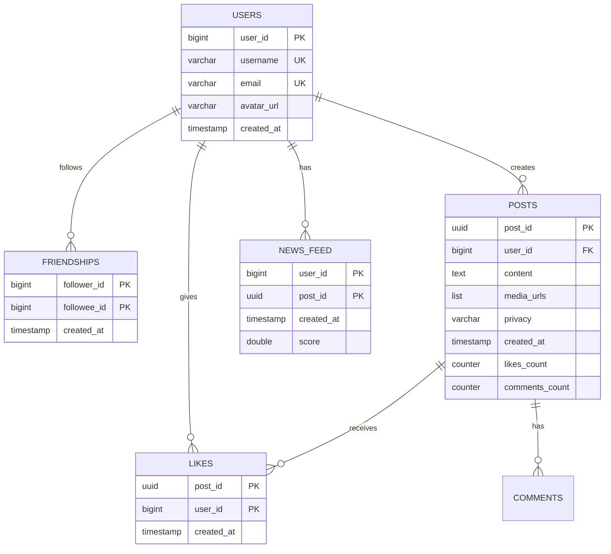
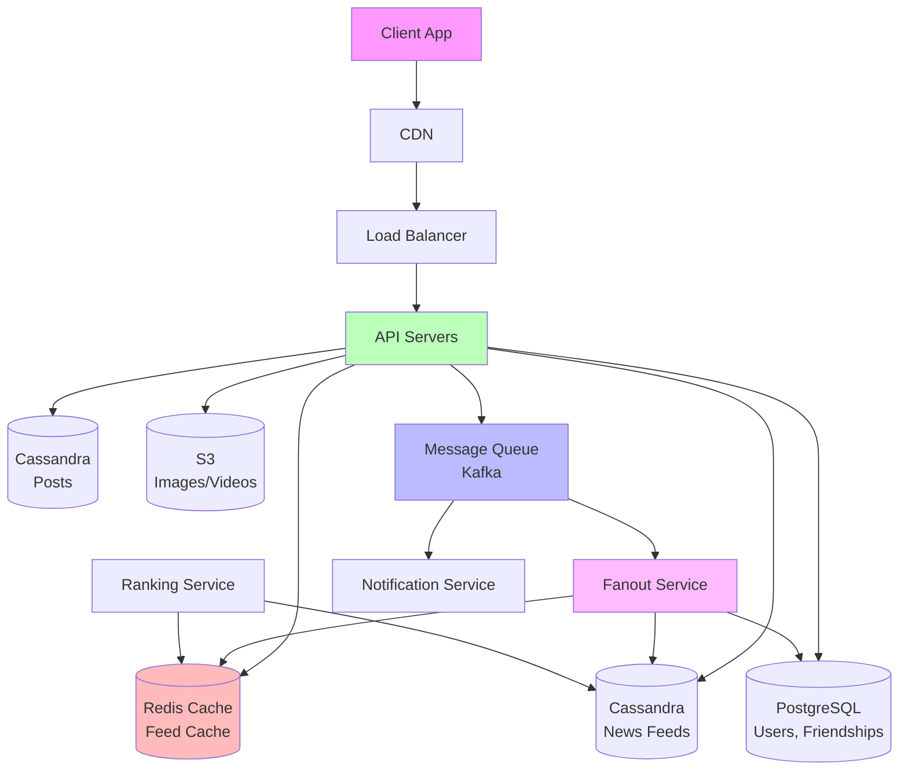
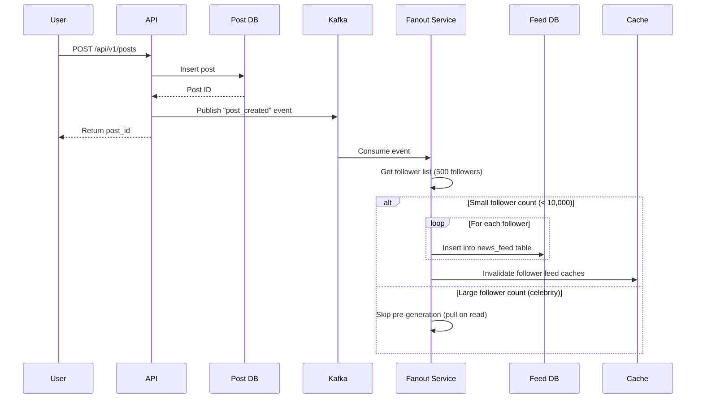
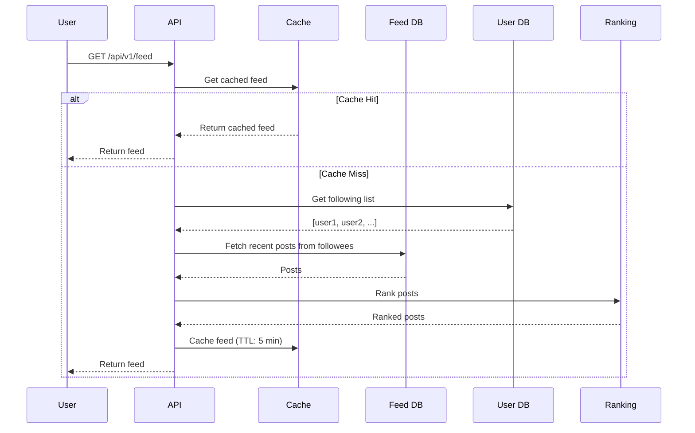

# News Feed System Design (Facebook, Twitter, Instagram)

> **Difficulty:** Intermediate
> **Interview Frequency:** Very High
> **Key Concepts:** Fan-out, Ranking algorithms, Graph database, Caching, Real-time updates

## Table of Contents
1. [Problem Statement & Requirements](#1-problem-statement--requirements)
2. [Back-of-the-Envelope Estimation](#2-back-of-the-envelope-estimation)
3. [API Design](#3-api-design)
4. [Data Model & Database Schema](#4-data-model--database-schema)
5. [High-Level Design](#5-high-level-design)
6. [Detailed Component Design](#6-detailed-component-design)
7. [Identifying and Resolving Bottlenecks](#7-identifying-and-resolving-bottlenecks)
8. [Trade-offs and Alternatives](#8-trade-offs-and-alternatives)
9. [Monitoring, Metrics & Alerts](#9-monitoring-metrics--alerts)
10. [Follow-up Questions & Extensions](#10-follow-up-questions--extensions)

---

## 1. Problem Statement & Requirements

### Problem Description
Design a news feed system like Facebook's News Feed, Twitter's Timeline, or Instagram's Feed. When users open the app, they should see a personalized feed of posts from people they follow, ordered by relevance/recency.

**Example:**
- Alice follows Bob, Charlie, and 100 others
- Bob posts a photo at 2 PM
- Charlie posts a status at 2:05 PM
- Alice opens app at 2:10 PM
- Alice sees Charlie's post first (most recent), then Bob's post

### Functional Requirements

**Core Features:**
- [x] **Post creation:** Users can create posts (text, images, videos)
- [x] **News feed generation:** Users see posts from people they follow
- [x] **Feed pagination:** Load more posts as user scrolls
- [x] **Follow/Unfollow:** Users can follow/unfollow others
- [x] **Engagement:** Like, comment, share posts

**Additional Features:**
- [x] **Media support:** Images, videos in posts
- [x] **Notifications:** Real-time notifications for likes/comments
- [x] **Ranking:** Posts ordered by relevance, not just recency
- [x] **Privacy:** Control who can see posts (public, friends, private)

### Non-Functional Requirements

**Scale:**
- **500 million** Daily Active Users (DAU)
- **1 billion** total users
- **100 million** posts created per day
- **5 billion** feed views per day
- **Average 200 friends** per user
- **Average 10 posts** viewed per session

**Performance:**
- Feed generation: < 200ms (p99)
- Post creation: < 500ms
- Real-time updates: < 5 seconds latency

**Other:**
- [x] **High availability:** 99.99% uptime
- [x] **Eventual consistency:** Slight delays acceptable
- [x] **Scalable:** Handle viral posts (millions of followers)
- [x] **Low latency:** Fast feed loading globally

### Out of Scope

- ❌ Stories/ephemeral content
- ❌ Direct messaging
- ❌ Advanced recommendation algorithms (ML models)
- ❌ Video streaming infrastructure
- ❌ Search functionality

### Constraints and Assumptions

**Assumptions:**
- **Read-heavy system:** 100:1 read/write ratio (5B views vs 100M posts)
- **Follow distribution:** Most users have < 500 friends, celebrities have millions
- **User behavior:** Users check feed multiple times per day
- **Content type:** 60% text, 30% images, 10% videos
- **Viral content:** 1% of posts get > 10,000 views

---

## 2. Back-of-the-Envelope Estimation

### Traffic Estimation

#### Write Operations (Post Creation)
```
Posts per day: 100 million
Posts per second (QPS): 100M / 100,000 ≈ 1,000 QPS
Peak write QPS: 1,000 × 3 = 3,000 QPS
```

#### Read Operations (Feed Views)
```
Feed views per day: 5 billion
Feed views per second: 5B / 100,000 = 50,000 QPS
Peak read QPS: 50,000 × 3 = 150,000 QPS

Posts viewed per day: 500M DAU × 10 posts/session × 2 sessions = 10 billion
Post view QPS: 10B / 100,000 = 100,000 QPS
```

### Storage Estimation

```
Data per post:
- Text content: 500 bytes (average)
- Media URL: 100 bytes
- Metadata (user_id, timestamp, likes, etc.): 200 bytes
- Total per post: ~800 bytes

Posts per day: 100 million
Posts per year: 100M × 365 = 36.5 billion

Storage for 1 year:
- 36.5B × 800 bytes = 29.2 TB

For 5 years:
- 29.2 TB × 5 = 146 TB

Media storage (images, videos):
- Average media size: 200 KB
- 30% of posts have images: 100M × 0.3 = 30M images/day
- Daily media: 30M × 200 KB = 6 TB/day
- Yearly media: 6 TB × 365 = 2,190 TB ≈ 2.2 PB

Total storage (5 years):
- Posts: 146 TB
- Media: 2.2 PB × 5 = 11 PB
- Total: ~11 PB (primarily media)

With replication (3x):
- 11 PB × 3 = 33 PB
```

### Feed Storage Estimation

```
Feed cache per user:
- Top 100 posts in feed
- Post metadata: 800 bytes × 100 = 80 KB per user

Active users needing cached feeds:
- 500M DAU

Total feed cache:
- 500M × 80 KB = 40 TB

For hot cache (20% of DAU):
- 100M × 80 KB = 8 TB
```

### Bandwidth Estimation

```
Write Bandwidth:
- Post creation: 1,000 QPS × 800 bytes = 800 KB/s
- Media uploads: (30% have media) 300 QPS × 200 KB = 60 MB/s
- Total write: ~60 MB/s

Read Bandwidth:
- Feed fetches: 50,000 QPS × 80 KB = 4 GB/s
- Post views: 100,000 QPS × 800 bytes = 80 MB/s
- Media downloads: 30,000 QPS × 200 KB = 6 GB/s
- Total read: ~10 GB/s
```

### Summary Table

| Metric | Estimate |
|--------|----------|
| **Write QPS (avg)** | 1,000 |
| **Write QPS (peak)** | 3,000 |
| **Read QPS (avg)** | 50,000 feeds + 100,000 posts |
| **Read QPS (peak)** | 450,000 |
| **Storage (5 years)** | 11 PB (33 PB with replication) |
| **Bandwidth (in)** | 60 MB/s |
| **Bandwidth (out)** | 10 GB/s |
| **Feed cache** | 8-40 TB |

---

## 3. API Design

### REST API Endpoints

#### 1. Create Post
```http
POST /api/v1/posts
Authorization: Bearer <token>
Content-Type: application/json

Request:
{
  "content": "Just finished reading Designing Data-Intensive Applications!",
  "media_urls": ["https://cdn.example.com/image1.jpg"],
  "privacy": "public"  // public, friends, private
}

Response (201 Created):
{
  "post_id": "123456789",
  "user_id": "alice",
  "content": "Just finished reading...",
  "media_urls": ["https://cdn.example.com/image1.jpg"],
  "created_at": "2024-01-15T10:30:00Z",
  "likes_count": 0,
  "comments_count": 0
}
```

#### 2. Get News Feed
```http
GET /api/v1/feed?cursor=abc123&limit=20
Authorization: Bearer <token>

Response (200 OK):
{
  "posts": [
    {
      "post_id": "123456789",
      "user": {
        "user_id": "bob",
        "username": "bob_smith",
        "avatar_url": "https://cdn.example.com/avatars/bob.jpg"
      },
      "content": "Great day at the park!",
      "media_urls": ["https://cdn.example.com/image1.jpg"],
      "created_at": "2024-01-15T10:25:00Z",
      "likes_count": 42,
      "comments_count": 5,
      "liked_by_me": false
    },
    ...
  ],
  "next_cursor": "xyz789",
  "has_more": true
}
```

#### 3. Like Post
```http
POST /api/v1/posts/{post_id}/like
Authorization: Bearer <token>

Response (200 OK):
{
  "post_id": "123456789",
  "likes_count": 43,
  "liked_by_me": true
}
```

#### 4. Comment on Post
```http
POST /api/v1/posts/{post_id}/comments
Authorization: Bearer <token>
Content-Type: application/json

Request:
{
  "content": "Great photo!"
}

Response (201 Created):
{
  "comment_id": "987654321",
  "post_id": "123456789",
  "user_id": "alice",
  "content": "Great photo!",
  "created_at": "2024-01-15T10:35:00Z"
}
```

#### 5. Follow User
```http
POST /api/v1/users/{user_id}/follow
Authorization: Bearer <token>

Response (200 OK):
{
  "following": true,
  "follower_count": 101
}
```

#### 6. Get User Timeline (Profile)
```http
GET /api/v1/users/{user_id}/posts?cursor=abc&limit=20

Response (200 OK):
{
  "posts": [...],  // Same format as feed
  "next_cursor": "xyz",
  "has_more": true
}
```

### API Design Considerations

- **Cursor-based pagination:** More efficient than offset for large datasets
- **Feed caching:** Aggressive caching with short TTL (5 minutes)
- **Rate limiting:** 300 feed requests/minute per user
- **Batch APIs:** Fetch multiple posts in one request
- **Real-time updates:** WebSocket for live notifications

---

## 4. Data Model & Database Schema

### Database Choice

**Multiple databases for different needs:**

1. **PostgreSQL/MySQL:** User profiles, friendships
2. **Cassandra/HBase:** Posts, timelines (high write throughput)
3. **Redis:** Feed cache, real-time counters
4. **Graph Database (Neo4j):** Social graph (optional)

### Schema Design

#### Table 1: Users (PostgreSQL)
```sql
CREATE TABLE users (
    user_id BIGSERIAL PRIMARY KEY,
    username VARCHAR(50) UNIQUE NOT NULL,
    email VARCHAR(255) UNIQUE NOT NULL,
    avatar_url VARCHAR(500),
    created_at TIMESTAMP DEFAULT CURRENT_TIMESTAMP,

    INDEX idx_username (username)
);
```

#### Table 2: Friendships/Follows (PostgreSQL)
```sql
CREATE TABLE friendships (
    follower_id BIGINT NOT NULL,
    followee_id BIGINT NOT NULL,
    created_at TIMESTAMP DEFAULT CURRENT_TIMESTAMP,

    PRIMARY KEY (follower_id, followee_id),
    INDEX idx_follower (follower_id),
    INDEX idx_followee (followee_id)
);
```

#### Table 3: Posts (Cassandra)
```sql
CREATE TABLE posts (
    post_id UUID PRIMARY KEY,
    user_id BIGINT,
    content TEXT,
    media_urls LIST<TEXT>,
    privacy VARCHAR(20),
    created_at TIMESTAMP,
    likes_count COUNTER,
    comments_count COUNTER
);

-- Partition by user_id for user timeline
CREATE TABLE user_posts (
    user_id BIGINT,
    post_id UUID,
    created_at TIMESTAMP,
    PRIMARY KEY (user_id, created_at, post_id)
) WITH CLUSTERING ORDER BY (created_at DESC);
```

#### Table 4: News Feed (Cassandra)
```sql
-- Materialized view of user's feed
CREATE TABLE news_feed (
    user_id BIGINT,
    post_id UUID,
    created_at TIMESTAMP,
    score DOUBLE,  -- Ranking score
    PRIMARY KEY (user_id, score, post_id)
) WITH CLUSTERING ORDER BY (score DESC, post_id DESC);
```

#### Table 5: Likes (Cassandra)
```sql
CREATE TABLE likes (
    post_id UUID,
    user_id BIGINT,
    created_at TIMESTAMP,
    PRIMARY KEY (post_id, user_id)
);

-- Check if user liked a post
CREATE TABLE user_likes (
    user_id BIGINT,
    post_id UUID,
    created_at TIMESTAMP,
    PRIMARY KEY (user_id, post_id)
);
```

### Data Model Diagram



---

## 5. High-Level Design

### Architecture Diagram



### Component Overview

1. **Client:** Mobile app or web browser
2. **CDN:** Serves static assets and media
3. **Load Balancer:** Distributes traffic
4. **API Servers:** Handle requests (Node.js/Go/Java)
5. **Fanout Service:** Distributes posts to followers' feeds
6. **Ranking Service:** Ranks posts by relevance
7. **Notification Service:** Real-time notifications
8. **Message Queue:** Async processing (Kafka)
9. **Databases:** Multiple databases for different needs
10. **Cache:** Redis for feed caching
11. **Object Storage:** S3 for media

### Data Flow

#### Post Creation Flow



#### Feed Generation Flow (Pull Model)



---

## 6. Detailed Component Design

### Component 1: Fan-out Strategies

**The core challenge:** When Bob posts, how do we update Alice's feed (and 1000 other followers)?

#### Strategy 1: Fan-out on Write (Push Model)

**How it works:**
```
1. Bob creates post
2. System immediately writes post to all followers' feeds
3. Alice's feed is pre-generated and cached
4. When Alice opens app, feed is ready instantly
```

**Pros:**
- ✅ Fast read (feed is pre-computed)
- ✅ Consistent feed across devices
- ✅ Good for normal users (< 5,000 followers)

**Cons:**
- ❌ Slow writes for celebrities (write to millions of feeds)
- ❌ Wasted work (many followers never see the post)
- ❌ Storage overhead (duplicate data in millions of feeds)

**Implementation:**
```python
async def fanout_on_write(post_id, author_id):
    """
    When post is created, immediately push to all followers' feeds
    """
    # Get follower list
    followers = await db.fetch(
        "SELECT follower_id FROM friendships WHERE followee_id = $1",
        author_id
    )

    # Batch insert into feed tables
    batch = []
    for follower in followers:
        batch.append({
            'user_id': follower['follower_id'],
            'post_id': post_id,
            'created_at': datetime.utcnow(),
            'score': calculate_score(post_id)
        })

        # Batch every 1000 inserts
        if len(batch) >= 1000:
            await feed_db.batch_insert('news_feed', batch)
            batch = []

    # Insert remaining
    if batch:
        await feed_db.batch_insert('news_feed', batch)

    # Invalidate caches
    for follower in followers:
        await cache.delete(f"feed:{follower['follower_id']}")
```

**Time Complexity:**
- Write: O(n) where n = number of followers
- Read: O(1) - just read from user's feed table

#### Strategy 2: Fan-out on Read (Pull Model)

**How it works:**
```
1. Bob creates post → stored in Bob's timeline
2. Nothing happens immediately
3. When Alice opens app → fetch posts from all people she follows
4. Merge and rank posts in real-time
```

**Pros:**
- ✅ Fast writes (just store the post)
- ✅ No wasted work (only generate feed when requested)
- ✅ Great for celebrities (don't fan out to millions)

**Cons:**
- ❌ Slow reads (must query multiple timelines and merge)
- ❌ Complex queries (fan-in from 200 friends)
- ❌ Hotspot issues (popular users' timelines get hammered)

**Implementation:**
```python
async def fanout_on_read(user_id, limit=20):
    """
    When user requests feed, pull from all followees' timelines
    """
    # Get list of people user follows
    following = await db.fetch(
        "SELECT followee_id FROM friendships WHERE follower_id = $1",
        user_id
    )

    followee_ids = [f['followee_id'] for f in following]

    # Fetch recent posts from each followee (in parallel)
    tasks = []
    for followee_id in followee_ids:
        task = db.fetch(
            """
            SELECT * FROM user_posts
            WHERE user_id = $1
            ORDER BY created_at DESC
            LIMIT 20
            """,
            followee_id
        )
        tasks.append(task)

    results = await asyncio.gather(*tasks)

    # Merge all posts
    all_posts = []
    for result in results:
        all_posts.extend(result)

    # Rank and sort
    ranked_posts = rank_posts(all_posts, user_id)

    return ranked_posts[:limit]
```

**Time Complexity:**
- Write: O(1) - just insert into author's timeline
- Read: O(n × log k) where n = following count, k = posts per user

#### Strategy 3: Hybrid Approach (Chosen)

**Best of both worlds:**

```python
async def hybrid_fanout(post_id, author_id):
    """
    - Fan-out on write for normal users
    - Fan-out on read for celebrities
    """
    # Get follower count
    follower_count = await db.fetchval(
        "SELECT COUNT(*) FROM friendships WHERE followee_id = $1",
        author_id
    )

    CELEBRITY_THRESHOLD = 10_000

    if follower_count < CELEBRITY_THRESHOLD:
        # Normal user → fan-out on write (push)
        await fanout_on_write(post_id, author_id)
    else:
        # Celebrity → fan-out on read (pull)
        # Just store in author's timeline
        await db.execute(
            "INSERT INTO user_posts (user_id, post_id, created_at) VALUES ($1, $2, $3)",
            author_id, post_id, datetime.utcnow()
        )

        # Mark author as celebrity for feed generation
        await cache.set(f"celebrity:{author_id}", True, ttl=86400)
```

**Feed Generation with Hybrid:**
```python
async def get_feed_hybrid(user_id, limit=20):
    """
    Generate feed considering celebrity status
    """
    # Check cache
    cached_feed = await cache.get(f"feed:{user_id}")
    if cached_feed:
        return cached_feed

    # Get following list
    following = await db.fetch(
        "SELECT followee_id FROM friendships WHERE follower_id = $1",
        user_id
    )

    # Separate celebrities from normal users
    normal_users = []
    celebrities = []

    for followee in following:
        is_celebrity = await cache.get(f"celebrity:{followee['followee_id']}")
        if is_celebrity:
            celebrities.append(followee['followee_id'])
        else:
            normal_users.append(followee['followee_id'])

    # For normal users: fetch from pre-generated feed
    pre_generated_posts = await db.fetch(
        """
        SELECT * FROM news_feed
        WHERE user_id = $1
        ORDER BY score DESC
        LIMIT 100
        """,
        user_id
    )

    # For celebrities: pull from their timelines
    celebrity_posts = []
    for celeb_id in celebrities:
        posts = await db.fetch(
            """
            SELECT * FROM user_posts
            WHERE user_id = $1
            ORDER BY created_at DESC
            LIMIT 20
            """,
            celeb_id
        )
        celebrity_posts.extend(posts)

    # Merge and rank
    all_posts = list(pre_generated_posts) + celebrity_posts
    ranked_posts = rank_posts(all_posts, user_id)

    # Cache for 5 minutes
    await cache.setex(f"feed:{user_id}", 300, ranked_posts[:limit])

    return ranked_posts[:limit]
```

### Component 2: Ranking Algorithm

**Simple Recency-Based (Twitter-like):**
```python
def rank_by_recency(posts):
    """Simple chronological ordering"""
    return sorted(posts, key=lambda p: p['created_at'], reverse=True)
```

**Engagement-Based (Facebook-like):**
```python
def calculate_engagement_score(post, current_user_id, current_time):
    """
    EdgeRank-inspired algorithm

    Score = Affinity × Weight × Time Decay
    """
    # Affinity: How close is user to post author?
    affinity = get_affinity_score(current_user_id, post['user_id'])
    # Range: 0.0 to 1.0 (based on interaction history)

    # Weight: How engaging is this content type?
    weights = {
        'text': 1.0,
        'photo': 1.5,
        'video': 2.0,
        'link': 0.8
    }
    content_weight = weights.get(post['media_type'], 1.0)

    # Engagement: Likes, comments, shares
    engagement_multiplier = (
        post['likes_count'] * 1 +
        post['comments_count'] * 2 +  # Comments worth more
        post['shares_count'] * 3      # Shares worth most
    )

    # Time decay: Recent posts rank higher
    hours_old = (current_time - post['created_at']).total_seconds() / 3600
    time_decay = 1 / (1 + hours_old / 24)  # Decay over 24 hours

    score = affinity * content_weight * (1 + engagement_multiplier) * time_decay

    return score

def rank_posts(posts, user_id):
    """Rank posts by engagement score"""
    current_time = datetime.utcnow()

    scored_posts = []
    for post in posts:
        score = calculate_engagement_score(post, user_id, current_time)
        post['score'] = score
        scored_posts.append(post)

    return sorted(scored_posts, key=lambda p: p['score'], reverse=True)
```

**Affinity Score Calculation:**
```python
def get_affinity_score(user_id, author_id):
    """
    Calculate how close user is to author
    Based on interaction history
    """
    # Get interaction counts from last 30 days
    interactions = cache.get(f"affinity:{user_id}:{author_id}")

    if not interactions:
        interactions = db.fetchrow(
            """
            SELECT
                COUNT(CASE WHEN action = 'like' THEN 1 END) as likes,
                COUNT(CASE WHEN action = 'comment' THEN 1 END) as comments,
                COUNT(CASE WHEN action = 'share' THEN 1 END) as shares,
                COUNT(CASE WHEN action = 'view' THEN 1 END) as views
            FROM user_interactions
            WHERE user_id = $1 AND target_user_id = $2
              AND created_at > NOW() - INTERVAL '30 days'
            """,
            user_id, author_id
        )

    # Calculate affinity (0.0 to 1.0)
    affinity = min(1.0,
        (interactions['views'] * 0.1 +
         interactions['likes'] * 0.3 +
         interactions['comments'] * 0.5 +
         interactions['shares'] * 1.0) / 100
    )

    return affinity
```

### Component 3: Real-Time Updates

**WebSocket for Live Feed:**
```python
import asyncio
from fastapi import WebSocket

class FeedWebSocket:
    def __init__(self):
        self.active_connections = {}  # user_id -> WebSocket

    async def connect(self, user_id: int, websocket: WebSocket):
        await websocket.accept()
        self.active_connections[user_id] = websocket

        # Subscribe to user's feed channel in Redis
        pubsub = redis.pubsub()
        await pubsub.subscribe(f"feed_updates:{user_id}")

        # Listen for updates
        async for message in pubsub.listen():
            if message['type'] == 'message':
                data = json.loads(message['data'])
                await websocket.send_json(data)

    async def disconnect(self, user_id: int):
        self.active_connections.pop(user_id, None)

    async def notify_new_post(self, author_id: int, post_data: dict):
        """Notify all followers of new post"""
        # Get followers
        followers = await db.fetch(
            "SELECT follower_id FROM friendships WHERE followee_id = $1",
            author_id
        )

        # Publish to each follower's channel
        for follower in followers:
            await redis.publish(
                f"feed_updates:{follower['follower_id']}",
                json.dumps({
                    'type': 'new_post',
                    'post': post_data
                })
            )

# Usage:
@app.websocket("/ws/feed")
async def websocket_feed(websocket: WebSocket, user_id: int):
    await feed_ws.connect(user_id, websocket)
    try:
        while True:
            # Keep connection alive
            await asyncio.sleep(30)
            await websocket.send_json({'type': 'ping'})
    except:
        await feed_ws.disconnect(user_id)
```

---

## 7. Identifying and Resolving Bottlenecks

### Potential Bottlenecks

#### 1. Celebrity Problem (Hot User)

**Problem:** Celebrities with millions of followers

**Fan-out on write:** Writing to 10M feeds takes too long
**Fan-out on read:** 10M users pulling from same timeline causes hotspot

**Solutions:**

**A. Hybrid Approach (implemented above)**
- Celebrities use pull model
- Normal users use push model

**B. Feed Sampling**
```python
# For celebrity posts, don't guarantee delivery to ALL followers
# Sample a subset of active users
if follower_count > 1_000_000:
    # Only fan out to recently active users
    active_followers = await db.fetch(
        """
        SELECT f.follower_id
        FROM friendships f
        JOIN users u ON f.follower_id = u.user_id
        WHERE f.followee_id = $1
          AND u.last_active > NOW() - INTERVAL '1 day'
        LIMIT 100000
        """,
        author_id
    )
    # Others will get it via pull on read
```

#### 2. Feed Generation Latency

**Problem:** Generating personalized feed is slow (query 200 users' posts)

**Solutions:**

**A. Aggressive Caching**
```python
# Cache feed for 5 minutes
# 80% cache hit ratio = 80% of reads are instant
await cache.setex(f"feed:{user_id}", 300, feed_data)
```

**B. Pre-generation**
```python
# Background job to pre-generate feeds for active users
async def pregenerate_feeds():
    """Run every 5 minutes"""
    active_users = await db.fetch(
        """
        SELECT user_id FROM users
        WHERE last_active > NOW() - INTERVAL '1 hour'
        """
    )

    for user in active_users:
        feed = await generate_feed(user['user_id'])
        await cache.setex(f"feed:{user['user_id']}", 600, feed)
```

**C. Partial Feed Loading**
```python
# Load top 20 posts immediately, lazy load rest
# Show loading indicator for posts 21-100
async def get_feed_fast(user_id):
    # Return cached top 20 instantly
    top_posts = await cache.get(f"feed:{user_id}:top20")
    if top_posts:
        return top_posts

    # If not cached, generate quickly (from pre-generated feed table)
    feed = await db.fetch(
        """
        SELECT * FROM news_feed
        WHERE user_id = $1
        ORDER BY score DESC
        LIMIT 20
        """,
        user_id
    )

    await cache.setex(f"feed:{user_id}:top20", 60, feed)
    return feed
```

#### 3. Database Write Bottleneck

**Problem:** 1,000 posts/second + engagement updates (likes, comments)

**Solutions:**

**A. Write-Behind Caching for Counters**
```python
# Don't update database immediately for likes
# Increment in cache, batch update DB later

async def like_post(post_id, user_id):
    # Increment in Redis (fast)
    new_count = await cache.incr(f"likes:{post_id}")

    # Record the like
    await cache.sadd(f"likers:{post_id}", user_id)

    # Queue for database update (async)
    await kafka.produce('post_likes', {
        'post_id': post_id,
        'user_id': user_id,
        'timestamp': datetime.utcnow()
    })

    return new_count

# Background worker: Batch update DB every 30 seconds
async def sync_likes_to_db():
    while True:
        # Get all posts with likes in cache
        post_ids = await cache.keys("likes:*")

        for post_id_key in post_ids:
            post_id = post_id_key.split(':')[1]
            likes_count = await cache.get(post_id_key)

            # Update database
            await db.execute(
                "UPDATE posts SET likes_count = $1 WHERE post_id = $2",
                likes_count, post_id
            )

        await asyncio.sleep(30)
```

**B. Database Sharding**
```
Shard posts by user_id:
- Shard 1: users 0-99M
- Shard 2: users 100M-199M
- Shard 3: users 200M-299M
- ...

Each shard handles 1/N of write traffic
```

#### 4. Media Storage and CDN

**Problem:** 6 TB/day of media uploads, 10 GB/s download bandwidth

**Solutions:**

**A. CDN for Reads**
```
- Upload to S3
- Serve via CloudFront CDN
- 95% cache hit ratio at edge
- Origin sees only 5% of traffic
```

**B. Image Optimization**
```python
# Generate multiple sizes on upload
async def upload_image(image_file):
    # Upload original to S3
    original_url = await s3.upload(image_file, 'originals/')

    # Generate thumbnails (async job)
    await queue.publish('image_processing', {
        'original_url': original_url,
        'sizes': [
            {'name': 'thumbnail', 'width': 150, 'height': 150},
            {'name': 'medium', 'width': 600, 'height': 600},
            {'name': 'large', 'width': 1200, 'height': 1200}
        ]
    })

    return {
        'original': original_url,
        'thumbnail': f"{original_url}_thumb.jpg",  # Generated async
        'medium': f"{original_url}_medium.jpg",
        'large': f"{original_url}_large.jpg"
    }
```

### Fault Tolerance

1. **Database Replication:** Master-slave for reads, automatic failover
2. **Cache Failures:** Serve stale feed if cache down (graceful degradation)
3. **Message Queue:** Kafka replication, at-least-once delivery
4. **API Servers:** Auto-scaling groups, health checks
5. **Multi-Region:** Deploy in multiple regions for disaster recovery

---

## 8. Trade-offs and Alternatives

### Design Decision 1: Fan-out Strategy

**Chosen:** Hybrid (push for normal, pull for celebrities)

| Aspect | Fan-out on Write | Fan-out on Read | Hybrid |
|--------|------------------|-----------------|--------|
| **Read Speed** | ⚡ Fast (pre-generated) | 🐌 Slow (compute on demand) | ⚡ Fast |
| **Write Speed** | 🐌 Slow (write to N feeds) | ⚡ Fast | ⚡ Fast |
| **Storage** | 📈 High (duplicate data) | 📉 Low | 📊 Medium |
| **Celebrity Support** | ❌ Poor (millions of writes) | ✅ Good | ✅ Good |
| **Consistency** | ✅ Eventual | ✅ Strong | ✅ Eventual |

**Chosen:** Hybrid for best overall performance

### Design Decision 2: Ranking Algorithm

**Chosen:** Engagement-based with affinity

**Rationale:**
- Better user engagement (see relevant posts first)
- Keeps users on platform longer
- Can be tuned over time

**Alternative: Pure Chronological**
- Pros: Simple, predictable, real-time
- Cons: Miss important posts from less active friends
- Used by: Twitter (mostly), Mastodon

### Design Decision 3: Database Choice

**Chosen:** Cassandra for posts/feeds, PostgreSQL for users

**Rationale:**
- Cassandra: High write throughput, scales horizontally
- PostgreSQL: ACID for critical user data

**Alternative: All PostgreSQL**
- Pros: Simpler, fewer systems
- Cons: Doesn't scale to billions of posts
- Only viable for small scale (< 100M posts)

---

## 9. Monitoring, Metrics & Alerts

### Key Metrics

#### Feed Performance
- **Feed Generation Time:** p50, p95, p99 latency
- **Cache Hit Ratio:** Target > 80%
- **Feed Freshness:** Time between post creation and appearance in feed
- **Feed Scroll Depth:** How far users scroll (engagement metric)

#### Engagement Metrics
- **Posts per day:** Total and per user
- **Likes per day:** Total and per post
- **Comments per day:** Total and per post
- **Feed views per day:** Total and per user
- **Time spent in feed:** Average session duration

#### System Health
- **API Latency:** p99 < 200ms for feed generation
- **Database Query Time:** Track slow queries
- **Fanout Queue Depth:** Kafka lag monitoring
- **WebSocket Connections:** Active connections count

### Alerts

| Alert | Condition | Severity |
|-------|-----------|----------|
| **Slow feed generation** | p99 > 1s for 5 min | Warning |
| **Low cache hit ratio** | < 60% for 10 min | Warning |
| **Fanout queue lag** | Kafka lag > 100k messages | Critical |
| **Database down** | DB unreachable | Critical |
| **High error rate** | 5xx > 1% | Critical |

---

## 10. Follow-up Questions & Extensions

### Q1: How would you handle video content in the feed?

**Answer:**

**Challenges:**
- Large file sizes (10-100 MB)
- Transcoding (multiple formats/resolutions)
- Streaming (progressive download, adaptive bitrate)

**Solutions:**
- Upload to S3, trigger transcoding job
- Generate multiple resolutions (360p, 720p, 1080p)
- Use HLS/DASH for adaptive streaming
- CDN for delivery (CloudFront)
- Preload thumbnails in feed, lazy load video

### Q2: How would you implement Stories (ephemeral 24-hour content)?

**Answer:**

**Different from Posts:**
- Temporary (auto-delete after 24h)
- Viewed sequentially (not ranked)
- View tracking (who viewed my story)

**Implementation:**
```python
CREATE TABLE stories (
    story_id UUID PRIMARY KEY,
    user_id BIGINT,
    media_url VARCHAR(500),
    created_at TIMESTAMP,
    expires_at TIMESTAMP DEFAULT NOW() + INTERVAL '24 hours',
    view_count INT DEFAULT 0
);

CREATE TABLE story_views (
    story_id UUID,
    viewer_id BIGINT,
    viewed_at TIMESTAMP,
    PRIMARY KEY (story_id, viewer_id)
);

# TTL in Cassandra auto-deletes after 24h
```

### Q3: How would you prevent abuse (spam, fake engagement)?

**Answer:**

**Rate Limiting:**
- Max 10 posts/hour per user
- Max 100 likes/minute per user
- CAPTCHA after suspicious activity

**ML-based Detection:**
- Detect bot accounts (abnormal posting patterns)
- Detect fake likes (like farms)
- Content moderation (NSFW, hate speech)

**User Reports:**
- Allow reporting spam/abuse
- Auto-hide after N reports
- Manual review queue

---

## Summary

News Feed is one of the most complex system design problems covering:

**Key Concepts:**
1. **Fan-out strategies** - Push vs Pull vs Hybrid
2. **Ranking algorithms** - Chronological vs Engagement-based
3. **Caching** - Multi-level caching for performance
4. **Celebrity problem** - Handling users with millions of followers
5. **Real-time updates** - WebSocket for live feed

**Interview Tips:**
- Start with clarifying questions (Twitter-like or Facebook-like?)
- Discuss fan-out trade-offs thoroughly
- Mention celebrity problem and solution
- Cover both write path and read path
- Don't forget caching and ranking

This design demonstrates understanding of distributed systems, databases, caching, and real-time systems - all critical for senior engineer roles.
