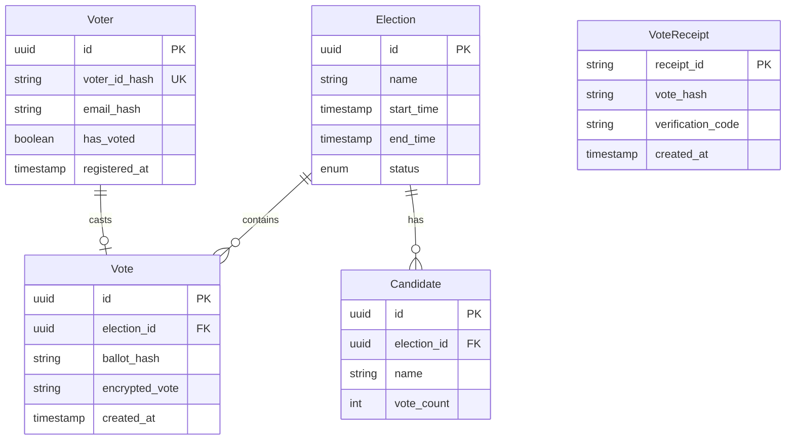
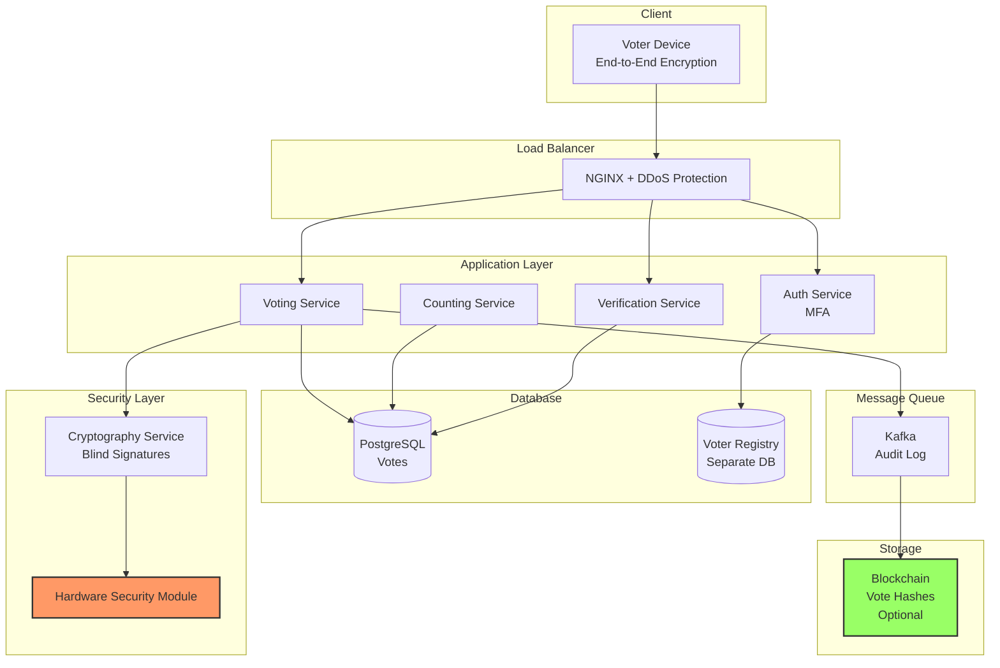

# Online Voting System Design

A comprehensive guide to designing a secure, scalable online voting system for elections, polls, and surveys.

---

## 1. Problem Statement

Design an online voting system that ensures:
- **One person, one vote** (no duplicate voting)
- **Vote anonymity** (cannot trace vote to voter)
- **Vote integrity** (cannot tamper with votes)
- **Auditability** (can verify vote was counted)
- **Scalability** (handle millions of concurrent voters)
- **Availability** (must work during voting window)

**Real-world Examples:** Government elections, shareholder voting, online polls, survey platforms

---

## 2. Requirements

### Functional Requirements

1. **Voter Registration & Authentication**
   - Verify voter eligibility
   - Prevent duplicate registrations
   - Multi-factor authentication

2. **Voting**
   - Cast vote for candidate/option
   - Change vote before deadline (optional)
   - Confirm vote was recorded

3. **Vote Counting**
   - Real-time or batch counting
   - Display results after voting closes
   - Handle ties

4. **Audit & Verification**
   - Voter can verify their vote was counted
   - Cannot see how others voted
   - Cryptographic proof of vote integrity

### Non-Functional Requirements

1. **Security**
   - End-to-end encryption
   - Prevent vote buying/coercion
   - DDoS protection
   - No single point of failure for tampering

2. **Anonymity**
   - Votes cannot be traced to voters
   - Use blind signatures or homomorphic encryption

3. **Integrity**
   - Votes cannot be modified
   - Use cryptographic hashing
   - Blockchain (optional)

4. **Scalability**
   - Handle 10M+ voters
   - 1M concurrent voters
   - Complete voting in 12-hour window

5. **Availability**
   - 99.99% uptime during voting period
   - Graceful degradation

---

## 3. Back-of-the-Envelope Estimation

### Assumptions
- Total voters: 10M
- Voting window: 12 hours
- Concurrent voters (peak): 1M
- Average time to vote: 2 minutes

### QPS
- Votes per second: 10M / (12 × 3600) ≈ 231 QPS
- Peak (assuming 50% vote in last 2 hours): 5M / 7200 ≈ 695 QPS
- **Total: ~1,000 QPS with safety margin**

### Storage
- Voter records: 10M × 500 bytes = 5 GB
- Votes (encrypted): 10M × 1 KB = 10 GB
- Audit log: 10M × 2 KB = 20 GB
- **Total: ~35 GB (very manageable)**

---

## 4. API Design

### Register Voter

```http
POST /api/v1/voters/register
```

**Request:**
```json
{
  "voter_id": "SSN-123-45-6789",
  "email": "voter@example.com",
  "verification_code": "ABC123",
  "mfa_phone": "+1234567890"
}
```

### Cast Vote

```http
POST /api/v1/votes/cast
```

**Request:**
```json
{
  "auth_token": "jwt_token",
  "election_id": "election-2024",
  "vote": {
    "candidate_id": "candidate-456",
    "encrypted_ballot": "base64_encrypted_data"
  }
}
```

**Response:**
```json
{
  "receipt_id": "receipt-xyz789",
  "confirmation": "Vote recorded successfully",
  "verification_code": "VER-123456",
  "timestamp": "2024-01-15T10:30:00Z"
}
```

### Verify Vote

```http
GET /api/v1/votes/verify?receipt_id=receipt-xyz789&code=VER-123456
```

**Response:**
```json
{
  "status": "verified",
  "vote_hash": "sha256:abc123...",
  "included_in_count": true,
  "timestamp": "2024-01-15T10:30:00Z"
}
```

---

## 5. Data Model & Database Schema



### Database Schema

```sql
-- Voters (anonymized)
CREATE TABLE voters (
    id UUID PRIMARY KEY,
    voter_id_hash VARCHAR(64) UNIQUE NOT NULL,  -- Hash of SSN/ID
    email_hash VARCHAR(64),
    has_voted BOOLEAN DEFAULT FALSE,
    voting_token_hash VARCHAR(64),  -- One-time token
    registered_at TIMESTAMP DEFAULT NOW()
);

CREATE INDEX idx_voters_hash ON voters(voter_id_hash);

-- Elections
CREATE TYPE election_status AS ENUM ('upcoming', 'active', 'closed');

CREATE TABLE elections (
    id UUID PRIMARY KEY,
    name VARCHAR(255) NOT NULL,
    description TEXT,
    start_time TIMESTAMP NOT NULL,
    end_time TIMESTAMP NOT NULL,
    status election_status DEFAULT 'upcoming',
    created_at TIMESTAMP DEFAULT NOW()
);

-- Candidates
CREATE TABLE candidates (
    id UUID PRIMARY KEY,
    election_id UUID REFERENCES elections(id),
    name VARCHAR(255) NOT NULL,
    party VARCHAR(100),
    vote_count INT DEFAULT 0,  -- Denormalized for performance
    created_at TIMESTAMP DEFAULT NOW()
);

-- Votes (anonymized, no link to voter)
CREATE TABLE votes (
    id UUID PRIMARY KEY,
    election_id UUID REFERENCES elections(id),
    ballot_hash VARCHAR(64) UNIQUE NOT NULL,  -- Prevents duplicates
    encrypted_vote TEXT NOT NULL,  -- Encrypted candidate_id
    signature TEXT,  -- Cryptographic signature
    created_at TIMESTAMP DEFAULT NOW()
);

CREATE INDEX idx_votes_election ON votes(election_id);
CREATE INDEX idx_votes_hash ON votes(ballot_hash);

-- Vote Receipts (for verification)
CREATE TABLE vote_receipts (
    receipt_id VARCHAR(100) PRIMARY KEY,
    vote_hash VARCHAR(64) NOT NULL,
    verification_code VARCHAR(20) NOT NULL,
    created_at TIMESTAMP DEFAULT NOW()
);

CREATE INDEX idx_receipts_code ON vote_receipts(verification_code);

-- Audit Log (immutable)
CREATE TABLE audit_log (
    id BIGSERIAL PRIMARY KEY,
    event_type VARCHAR(50) NOT NULL,
    event_data JSONB NOT NULL,
    timestamp TIMESTAMP DEFAULT NOW(),
    signature VARCHAR(256)  -- Chain signatures (blockchain-style)
);
```

---

## 6. High-Level Design



---

## 7. Detailed Component Design

### 7.1 Vote Anonymization (Blind Signatures)

```python
class VotingService:
    """Secure voting with anonymity."""

    async def cast_vote(
        self,
        voter_token: str,
        election_id: str,
        candidate_id: str
    ) -> dict:
        """
        Cast vote with blind signature for anonymity.

        Process:
        1. Verify voter is eligible
        2. Generate blind signature (voter can't be traced)
        3. Store encrypted vote
        4. Mark voter as voted (in separate DB)
        5. Return receipt for verification
        """

        # Step 1: Verify voter (separate from vote storage)
        voter = await self.verify_voter_token(voter_token)

        if voter['has_voted']:
            raise ValueError("Voter has already voted")

        # Step 2: Generate blind signature
        # Voter creates blinded message, we sign it,
        # voter unblinds to get signature without us knowing content
        ballot_hash = self.generate_ballot_hash()
        blind_signature = await self.crypto_service.blind_sign(ballot_hash)

        # Step 3: Encrypt vote (no link to voter)
        encrypted_vote = await self.crypto_service.encrypt(
            candidate_id,
            public_key=self.election_public_key
        )

        # Step 4: Store vote (anonymously)
        vote_id = uuid4()
        async with self.vote_db.transaction():
            await self.vote_db.execute(
                """
                INSERT INTO votes (id, election_id, ballot_hash, encrypted_vote, signature)
                VALUES ($1, $2, $3, $4, $5)
                """,
                vote_id, election_id, ballot_hash, encrypted_vote, blind_signature
            )

            # Increment candidate count (denormalized)
            await self.vote_db.execute(
                "UPDATE candidates SET vote_count = vote_count + 1 WHERE id = $1",
                candidate_id
            )

        # Step 5: Mark voter as voted (separate DB - air-gapped)
        async with self.voter_db.transaction():
            await self.voter_db.execute(
                "UPDATE voters SET has_voted = TRUE, voting_token_hash = NULL WHERE id = $1",
                voter['id']
            )

        # Step 6: Generate receipt for verification
        receipt_id = str(uuid4())
        verification_code = self.generate_verification_code()

        await self.vote_db.execute(
            """
            INSERT INTO vote_receipts (receipt_id, vote_hash, verification_code)
            VALUES ($1, $2, $3)
            """,
            receipt_id, ballot_hash, verification_code
        )

        # Audit log
        await self.audit_log(
            event='vote_cast',
            data={'receipt_id': receipt_id, 'timestamp': datetime.utcnow()}
        )

        return {
            'receipt_id': receipt_id,
            'verification_code': verification_code,
            'message': 'Vote recorded successfully'
        }

    def generate_ballot_hash(self) -> str:
        """Generate unique hash for ballot."""
        import hashlib
        random_data = os.urandom(32)
        return hashlib.sha256(random_data).hexdigest()

    def generate_verification_code(self) -> str:
        """Generate 6-digit verification code."""
        import random
        return f"{random.randint(100000, 999999)}"
```

### 7.2 Vote Verification (Without Revealing Vote)

```python
class VerificationService:
    """Allow voters to verify their vote was counted."""

    async def verify_vote(self, receipt_id: str, verification_code: str) -> dict:
        """
        Verify vote was counted without revealing how they voted.
        """

        # Look up receipt
        receipt = await self.db.fetchrow(
            """
            SELECT vote_hash, created_at
            FROM vote_receipts
            WHERE receipt_id = $1 AND verification_code = $2
            """,
            receipt_id, verification_code
        )

        if not receipt:
            return {'status': 'not_found', 'message': 'Invalid receipt or code'}

        # Verify vote exists with matching hash
        vote = await self.db.fetchrow(
            "SELECT id, created_at FROM votes WHERE ballot_hash = $1",
            receipt['vote_hash']
        )

        if not vote:
            return {'status': 'error', 'message': 'Vote not found in database'}

        return {
            'status': 'verified',
            'message': 'Your vote was successfully recorded and counted',
            'vote_hash': receipt['vote_hash'],
            'timestamp': vote['created_at'].isoformat(),
            'included_in_count': True
        }
```

### 7.3 Duplicate Vote Prevention

```python
async def prevent_duplicate_voting(voter_id: str) -> None:
    """
    Ensure one person, one vote.

    Strategy:
    1. Hash voter ID (cannot reverse to find identity)
    2. Check if hash already voted
    3. Use database constraint to prevent race conditions
    """

    # Hash voter ID
    import hashlib
    voter_hash = hashlib.sha256(voter_id.encode()).hexdigest()

    # Atomic check-and-set
    result = await db.execute(
        """
        UPDATE voters
        SET has_voted = TRUE
        WHERE voter_id_hash = $1 AND has_voted = FALSE
        RETURNING id
        """,
        voter_hash
    )

    if result == "UPDATE 0":
        raise ValueError("Voter has already voted or is not registered")
```

### 7.4 Vote Counting (After Election Closes)

```python
class CountingService:
    """Count votes after election closes."""

    async def count_votes(self, election_id: str) -> dict:
        """
        Count votes using homomorphic encryption or decryption.

        Two approaches:
        1. Decrypt all votes and count (simple)
        2. Homomorphic encryption (count without decrypting)
        """

        # Verify election is closed
        election = await self.db.fetchrow(
            "SELECT status, end_time FROM elections WHERE id = $1",
            election_id
        )

        if election['status'] != 'closed':
            raise ValueError("Election is still active")

        # Option 1: Decrypt and count (simpler)
        votes = await self.db.fetch(
            "SELECT encrypted_vote FROM votes WHERE election_id = $1",
            election_id
        )

        # Decrypt votes (requires private key from HSM)
        candidate_votes = {}
        for vote in votes:
            decrypted = await self.crypto_service.decrypt(
                vote['encrypted_vote'],
                private_key=self.election_private_key
            )

            candidate_id = decrypted
            candidate_votes[candidate_id] = candidate_votes.get(candidate_id, 0) + 1

        # Update official counts
        for candidate_id, count in candidate_votes.items():
            await self.db.execute(
                "UPDATE candidates SET vote_count = $1 WHERE id = $2",
                count, candidate_id
            )

        return candidate_votes
```

---

## 8. Key Challenges & Solutions

### Challenge 1: Anonymity vs. Accountability

**Problem:** How to ensure votes are anonymous but also prevent fraud?

**Solution: Blind Signatures**
```python
# Voter creates blinded message
blinded_ballot = voter.blind(ballot_data)

# Server signs without knowing content
blind_signature = server.sign(blinded_ballot)

# Voter unblinds to get valid signature
signature = voter.unblind(blind_signature)

# Voter submits signed ballot (server can't link to voter)
```

### Challenge 2: Preventing DDoS During Voting

**Solutions:**
1. **Rate Limiting:** Max 1 vote per voter, throttle by IP
2. **CAPTCHA:** Prevent bot voting
3. **CDN:** CloudFlare DDoS protection
4. **Queue System:** Handle burst traffic

### Challenge 3: End-to-End Verifiability

**Solution: Cryptographic Receipts**
```python
# Give voter a receipt that proves:
# 1. Their vote was recorded
# 2. Their vote was included in final count
# 3. Without revealing how they voted

receipt = {
    'vote_hash': sha256(encrypted_ballot),
    'merkle_proof': generate_merkle_proof(vote_hash),  # Proves inclusion
    'verification_code': random_code
}
```

---

## 9. Trade-offs

| Decision | Pros | Cons | Chosen |
|----------|------|------|--------|
| **Air-gapped Voter DB** | Prevents vote tracing | Complexity | ✅ Yes |
| **Blockchain for Audit** | Immutability | Complexity, cost | Optional |
| **Homomorphic Encryption** | Count without decrypting | Computationally expensive | No |
| **Allow Vote Changes** | User flexibility | Complexity | Optional |

---

## 10. Code Implementation

```python
# Simplified implementation showing core concepts

class SecureVotingSystem:
    """Production-grade voting system."""

    async def register_voter(self, voter_id: str, email: str) -> dict:
        """Register voter with anonymization."""

        # Hash voter ID (one-way)
        voter_hash = hashlib.sha256(voter_id.encode()).hexdigest()
        email_hash = hashlib.sha256(email.encode()).hexdigest()

        # Generate one-time voting token
        voting_token = secrets.token_urlsafe(32)
        token_hash = hashlib.sha256(voting_token.encode()).hexdigest()

        # Store in voter DB
        voter_uuid = uuid4()
        await self.voter_db.execute(
            """
            INSERT INTO voters (id, voter_id_hash, email_hash, voting_token_hash)
            VALUES ($1, $2, $3, $4)
            ON CONFLICT (voter_id_hash) DO NOTHING
            """,
            voter_uuid, voter_hash, email_hash, token_hash
        )

        # Send token via secure channel
        await self.send_voting_token(email, voting_token)

        return {'status': 'registered', 'message': 'Check your email for voting token'}

    async def cast_anonymous_vote(
        self,
        voting_token: str,
        election_id: str,
        candidate_id: str
    ) -> dict:
        """Cast vote with full anonymity."""

        # Verify token (one-time use)
        token_hash = hashlib.sha256(voting_token.encode()).hexdigest()

        voter = await self.voter_db.fetchrow(
            """
            SELECT id, has_voted FROM voters
            WHERE voting_token_hash = $1
            FOR UPDATE
            """,
            token_hash
        )

        if not voter:
            raise ValueError("Invalid voting token")

        if voter['has_voted']:
            raise ValueError("This token has already been used")

        # Encrypt vote (no link to voter)
        encrypted_vote = self.encrypt_vote(candidate_id)
        ballot_hash = hashlib.sha256(encrypted_vote.encode()).hexdigest()

        # Store vote (separate transaction, separate DB)
        vote_id = uuid4()
        await self.vote_db.execute(
            """
            INSERT INTO votes (id, election_id, ballot_hash, encrypted_vote)
            VALUES ($1, $2, $3, $4)
            """,
            vote_id, election_id, ballot_hash, encrypted_vote
        )

        # Mark token as used (no connection to vote_id)
        await self.voter_db.execute(
            "UPDATE voters SET has_voted = TRUE, voting_token_hash = NULL WHERE id = $1",
            voter['id']
        )

        # Generate verification receipt
        receipt = {
            'receipt_id': str(uuid4()),
            'vote_hash': ballot_hash,
            'verification_code': f"{random.randint(100000, 999999)}"
        }

        await self.vote_db.execute(
            "INSERT INTO vote_receipts (receipt_id, vote_hash, verification_code) VALUES ($1, $2, $3)",
            receipt['receipt_id'], receipt['vote_hash'], receipt['verification_code']
        )

        return receipt

    def encrypt_vote(self, candidate_id: str) -> str:
        """Encrypt vote using election public key."""
        from cryptography.fernet import Fernet

        # In production, use proper asymmetric encryption
        cipher = Fernet(self.election_key)
        encrypted = cipher.encrypt(candidate_id.encode())
        return encrypted.decode()
```

---

**Last Updated:** December 2024
**Difficulty:** Intermediate
**Key Concepts:** Anonymity, blind signatures, end-to-end verifiability, duplicate prevention

**Interview Focus:** Security vs. usability trade-offs, cryptographic protocols, auditability
