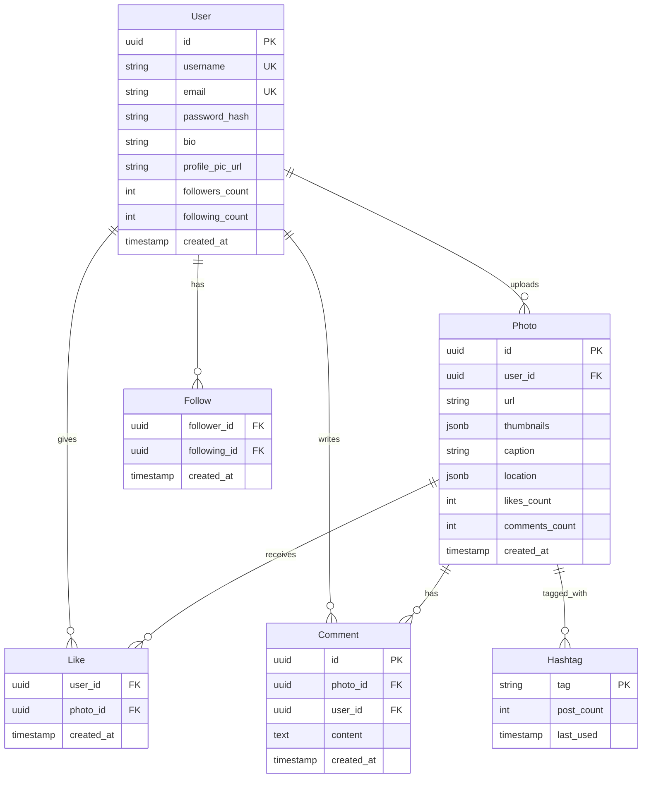

# Photo Sharing Service Design (Instagram)

A comprehensive guide to designing a scalable photo sharing platform like Instagram.

---

## Table of Contents

1. [Problem Statement](#1-problem-statement)
2. [Requirements](#2-requirements)
3. [Back-of-the-Envelope Estimation](#3-back-of-the-envelope-estimation)
4. [API Design](#4-api-design)
5. [Data Model & Database Schema](#5-data-model--database-schema)
6. [High-Level Design](#6-high-level-design)
7. [Detailed Component Design](#7-detailed-component-design)
8. [Identifying and Resolving Bottlenecks](#8-identifying-and-resolving-bottlenecks)
9. [Trade-offs and Alternatives](#9-trade-offs-and-alternatives)
10. [Monitoring, Metrics & Alerts](#10-monitoring-metrics--alerts)
11. [Follow-up Questions & Extensions](#11-follow-up-questions--extensions)
12. [Code Implementation](#12-code-implementation)
13. [References](#13-references)

---

## 1. Problem Statement

Design a photo sharing service like Instagram that allows users to:
- Upload and share photos/videos
- Follow other users
- View personalized feed of followed users' posts
- Like and comment on posts
- Search for users and hashtags
- Generate and display photo thumbnails
- Support high volume of uploads and reads

**Real-world Examples:**
- Instagram
- Pinterest
- Flickr
- 500px

---

## 2. Requirements

### Functional Requirements

1. **User Management**
   - User registration and authentication
   - User profiles (bio, profile picture, followers/following count)
   - Follow/unfollow users

2. **Photo/Video Upload**
   - Upload photos (up to 10 MB) and videos (up to 100 MB)
   - Add captions and hashtags
   - Tag location
   - Apply filters (optional)

3. **Feed Generation**
   - Home feed (posts from followed users)
   - Chronological ordering (newest first)
   - Infinite scroll/pagination
   - Feed refresh

4. **Interactions**
   - Like/unlike posts
   - Comment on posts
   - Share posts
   - Save posts to collections

5. **Discovery**
   - Search users by username
   - Search posts by hashtags
   - Explore feed (trending posts)

### Non-Functional Requirements

1. **Scalability**
   - Support 500M users
   - 100M daily active users (DAU)
   - 100M photos uploaded daily
   - 5 billion daily feed views

2. **Performance**
   - Upload latency: < 3 seconds
   - Feed load time: < 500ms
   - Image load time: < 200ms (with CDN)
   - 99th percentile latency: < 1s

3. **Availability**
   - 99.99% uptime
   - Multi-region deployment
   - Read-heavy system (100:1 read/write ratio)

4. **Storage**
   - Store original images
   - Generate multiple thumbnail sizes
   - Video transcoding for different resolutions

5. **Consistency**
   - Eventual consistency acceptable for feeds
   - Strong consistency for likes/follows
   - No duplicate posts

### Out of Scope

- Direct messaging
- Stories/ephemeral content
- Live streaming
- Advanced video editing
- Monetization (ads, sponsored posts)

---

## 3. Back-of-the-Envelope Estimation

### Assumptions

**Users:**
- Total users: 500M
- Daily active users (DAU): 100M (20%)
- Average posts per user: 50
- Average follows per user: 200

**Daily Activity:**
- Photo uploads: 100M/day
- Feed views: 5B/day (50 per DAU)
- Likes: 500M/day
- Comments: 100M/day

### Traffic Estimates

**QPS (Queries Per Second):**
- Photo uploads: 100M / 86,400s ≈ 1,160 QPS (peak: 5,000 QPS)
- Feed requests: 5B / 86,400s ≈ 57,870 QPS (peak: 200,000 QPS)
- Likes: 500M / 86,400s ≈ 5,787 QPS
- **Total: ~70,000 QPS average, 250,000 QPS peak**

**Read-Heavy System:**
- Read: 5B feed views + image loads
- Write: 100M uploads + 500M likes
- **Read/Write Ratio: ~100:1**

### Storage Estimates

**Photos:**
- Average photo size: 2 MB
- Daily uploads: 100M × 2 MB = 200 TB/day
- Annual storage: 200 TB × 365 = 73 PB/year

**Thumbnails:**
- 3 sizes: Small (50 KB), Medium (200 KB), Large (500 KB)
- Total per photo: 750 KB
- Daily thumbnails: 100M × 750 KB = 75 TB/day
- Annual: 27 PB/year

**Total Storage: ~100 PB/year**

With 3x replication: **300 PB/year**

**Metadata (Database):**
- User records: 500M × 1 KB = 500 GB
- Photo metadata: 500M users × 50 photos × 500 bytes = 12.5 TB
- Likes: ~5B records × 50 bytes = 250 GB
- **Total metadata: ~15 TB**

### Bandwidth Estimates

**Upload Bandwidth:**
- 100M photos/day × 2 MB = 200 TB/day
- Per second: 200 TB / 86,400s ≈ 2.3 GB/s = 18.4 Gbps
- Peak (5x): 92 Gbps

**Download Bandwidth:**
- 5B feed views × 10 photos/feed × 200 KB (medium thumbnail) = 10 PB/day
- Per second: 10 PB / 86,400s ≈ 115 GB/s = 920 Gbps
- **With CDN: 90% offloaded**

**Total Bandwidth: ~100 Gbps peak (without CDN offload)**

### Cost Estimates (Annual)

**Storage (S3):**
- 300 PB × $0.023/GB/month = $6.9M/month × 12 = $82.8M/year

**Bandwidth (CDN):**
- 10 PB/day × 365 × $0.085/GB = $310M/year

**Compute:**
- 1,000 API servers × $200/month = $200K/month = $2.4M/year

**Database:**
- Sharded PostgreSQL + Redis: ~$500K/year

**Total: ~$400M/year**

---

## 4. API Design

### 4.1 User APIs

#### 1. Register User

```http
POST /api/v1/users/register
```

**Request:**
```json
{
  "username": "johndoe",
  "email": "john@example.com",
  "password": "hashed_password",
  "full_name": "John Doe"
}
```

**Response:**
```json
{
  "user_id": "user-123",
  "username": "johndoe",
  "auth_token": "jwt_token_here"
}
```

#### 2. Follow User

```http
POST /api/v1/users/{user_id}/follow
```

**Response:**
```json
{
  "follower_id": "user-123",
  "following_id": "user-456",
  "followed_at": "2024-01-15T10:30:00Z"
}
```

### 4.2 Photo Upload APIs

#### 3. Upload Photo

```http
POST /api/v1/photos/upload
Content-Type: multipart/form-data
```

**Request:**
```
photo: <binary>
caption: "Beautiful sunset!"
hashtags: ["sunset", "nature", "photography"]
location: {lat: 37.7749, lng: -122.4194}
```

**Response:**
```json
{
  "photo_id": "photo-abc123",
  "user_id": "user-123",
  "url": "https://cdn.example.com/photos/abc123.jpg",
  "thumbnails": {
    "small": "https://cdn.example.com/photos/abc123-sm.jpg",
    "medium": "https://cdn.example.com/photos/abc123-md.jpg",
    "large": "https://cdn.example.com/photos/abc123-lg.jpg"
  },
  "uploaded_at": "2024-01-15T10:30:00Z"
}
```

### 4.3 Feed APIs

#### 4. Get Home Feed

```http
GET /api/v1/feed/home?cursor=abc123&limit=20
```

**Response:**
```json
{
  "cursor": "xyz789",
  "has_more": true,
  "posts": [
    {
      "photo_id": "photo-abc123",
      "user": {
        "user_id": "user-456",
        "username": "jane_doe",
        "profile_pic": "https://cdn.example.com/users/456.jpg"
      },
      "image_url": "https://cdn.example.com/photos/abc123-md.jpg",
      "caption": "Beautiful sunset!",
      "hashtags": ["sunset", "nature"],
      "likes_count": 1523,
      "comments_count": 42,
      "is_liked": false,
      "posted_at": "2024-01-15T10:30:00Z"
    }
  ]
}
```

### 4.4 Interaction APIs

#### 5. Like Photo

```http
POST /api/v1/photos/{photo_id}/like
```

**Response:**
```json
{
  "photo_id": "photo-abc123",
  "user_id": "user-123",
  "likes_count": 1524,
  "liked_at": "2024-01-15T11:00:00Z"
}
```

#### 6. Comment on Photo

```http
POST /api/v1/photos/{photo_id}/comments
```

**Request:**
```json
{
  "text": "Amazing photo!",
  "mentioned_users": ["user-789"]
}
```

**Response:**
```json
{
  "comment_id": "comment-xyz",
  "photo_id": "photo-abc123",
  "user_id": "user-123",
  "text": "Amazing photo!",
  "created_at": "2024-01-15T11:05:00Z"
}
```

---

## 5. Data Model & Database Schema

### 5.1 Entity Relationship Diagram



### 5.2 Database Schema (PostgreSQL + Sharding)

```sql
-- Users table (shard by user_id)
CREATE TABLE users (
    id UUID PRIMARY KEY DEFAULT gen_random_uuid(),
    username VARCHAR(50) UNIQUE NOT NULL,
    email VARCHAR(255) UNIQUE NOT NULL,
    password_hash VARCHAR(255) NOT NULL,
    full_name VARCHAR(255),
    bio TEXT,
    profile_pic_url VARCHAR(500),
    followers_count INT DEFAULT 0,
    following_count INT DEFAULT 0,
    created_at TIMESTAMP DEFAULT CURRENT_TIMESTAMP,
    updated_at TIMESTAMP DEFAULT CURRENT_TIMESTAMP
);

CREATE INDEX idx_users_username ON users(username);
CREATE INDEX idx_users_email ON users(email);

-- Photos table (shard by user_id for colocation)
CREATE TABLE photos (
    id UUID PRIMARY KEY DEFAULT gen_random_uuid(),
    user_id UUID NOT NULL,
    url VARCHAR(500) NOT NULL,
    thumbnails JSONB,  -- {"small": "url", "medium": "url", "large": "url"}
    caption TEXT,
    location JSONB,  -- {"lat": 37.7749, "lng": -122.4194, "name": "San Francisco"}
    likes_count INT DEFAULT 0,
    comments_count INT DEFAULT 0,
    created_at TIMESTAMP DEFAULT CURRENT_TIMESTAMP
);

CREATE INDEX idx_photos_user ON photos(user_id, created_at DESC);
CREATE INDEX idx_photos_created ON photos(created_at DESC);

-- Follows table (denormalized for fan-out-on-write)
CREATE TABLE follows (
    follower_id UUID NOT NULL,
    following_id UUID NOT NULL,
    created_at TIMESTAMP DEFAULT CURRENT_TIMESTAMP,
    PRIMARY KEY (follower_id, following_id)
);

CREATE INDEX idx_follows_follower ON follows(follower_id);
CREATE INDEX idx_follows_following ON follows(following_id);

-- Likes table (shard by photo_id)
CREATE TABLE likes (
    user_id UUID NOT NULL,
    photo_id UUID NOT NULL,
    created_at TIMESTAMP DEFAULT CURRENT_TIMESTAMP,
    PRIMARY KEY (user_id, photo_id)
);

CREATE INDEX idx_likes_photo ON likes(photo_id, created_at DESC);
CREATE INDEX idx_likes_user ON likes(user_id);

-- Comments table
CREATE TABLE comments (
    id UUID PRIMARY KEY DEFAULT gen_random_uuid(),
    photo_id UUID NOT NULL,
    user_id UUID NOT NULL,
    content TEXT NOT NULL,
    created_at TIMESTAMP DEFAULT CURRENT_TIMESTAMP
);

CREATE INDEX idx_comments_photo ON comments(photo_id, created_at DESC);
CREATE INDEX idx_comments_user ON comments(user_id);

-- Hashtags table
CREATE TABLE hashtags (
    tag VARCHAR(100) PRIMARY KEY,
    post_count INT DEFAULT 0,
    last_used TIMESTAMP DEFAULT CURRENT_TIMESTAMP
);

-- Photo-Hashtag mapping
CREATE TABLE photo_hashtags (
    photo_id UUID NOT NULL,
    hashtag VARCHAR(100) NOT NULL,
    PRIMARY KEY (photo_id, hashtag)
);

CREATE INDEX idx_photo_hashtags_tag ON photo_hashtags(hashtag);
```

### 5.3 Redis Caching Strategy

```
# User session cache
SET user:session:{user_id} {auth_token} EX 3600

# Feed cache (pre-generated)
LPUSH feed:{user_id} photo-abc123 photo-def456 ...
EXPIRE feed:{user_id} 300  # 5 minutes

# Photo metadata cache
HSET photo:{photo_id} url "..." likes_count 1523 comments_count 42
EXPIRE photo:{photo_id} 3600

# Hot photos (trending)
ZADD trending:photos {score} photo-abc123
```

---

## 6. High-Level Design

### 6.1 Architecture Diagram

```mermaid
graph TB
    subgraph "Client Layer"
        MOBILE[Mobile App]
        WEB[Web App]
    end

    subgraph "CDN"
        CDN[CloudFront/CloudFlare<br/>Image Delivery]
    end

    subgraph "Load Balancer"
        LB[Application LB]
    end

    subgraph "API Layer"
        API[API Servers<br/>Stateless]
    end

    subgraph "Service Layer"
        UPLOAD[Upload Service]
        FEED[Feed Service]
        USER[User Service]
        INTERACT[Interaction Service]
    end

    subgraph "Cache Layer"
        REDIS[(Redis Cluster)]
    end

    subgraph "Database Layer"
        PG[(PostgreSQL Shards)]
    end

    subgraph "Object Storage"
        S3[(Amazon S3<br/>Photos Storage)]
    end

    subgraph "Message Queue"
        KAFKA[Kafka/SQS]
    end

    subgraph "Background Workers"
        THUMBNAIL[Thumbnail Generator]
        FANOUT[Feed Fanout Worker]
        ANALYTICS[Analytics Worker]
    end

    MOBILE --> CDN
    WEB --> CDN
    MOBILE --> LB
    WEB --> LB

    LB --> API
    API --> UPLOAD
    API --> FEED
    API --> USER
    API --> INTERACT

    UPLOAD --> S3
    UPLOAD --> KAFKA
    FEED --> REDIS
    FEED --> PG
    USER --> PG
    INTERACT --> PG
    INTERACT --> REDIS

    KAFKA --> THUMBNAIL
    KAFKA --> FANOUT
    KAFKA --> ANALYTICS

    THUMBNAIL --> S3
    FANOUT --> REDIS
    ANALYTICS --> PG

    style S3 fill:#f96,stroke:#333,stroke-width:2px
    style CDN fill:#9f6,stroke:#333,stroke-width:2px
    style REDIS fill:#bbf,stroke:#333,stroke-width:2px
```

### 6.2 Key Design Decisions

**1. Read-Heavy Optimization:**
- CDN for image delivery (90% cache hit rate)
- Redis for hot data (feed, user profiles)
- Database read replicas

**2. Feed Generation Strategy:**
- **Fan-out-on-write** (precompute feeds)
- Async processing with message queue
- Trade-off: Write amplification for read performance

**3. Sharding Strategy:**
- Shard users and photos by `user_id`
- Consistent hashing for even distribution
- Keeps user's photos co-located

**4. Storage:**
- S3 for object storage (photos, videos)
- Multiple thumbnail sizes for responsive design
- Lazy thumbnail generation for less popular photos

---

## 7. Detailed Component Design

### 7.1 Photo Upload Flow

```python
class UploadService:
    """Handle photo uploads with thumbnail generation."""

    async def upload_photo(
        self,
        user_id: str,
        photo_data: bytes,
        caption: str,
        hashtags: List[str]
    ) -> dict:
        """
        Upload photo workflow:
        1. Upload original to S3
        2. Publish thumbnail generation job
        3. Create database record
        4. Fanout to followers' feeds
        """

        # Generate unique photo ID
        photo_id = str(uuid4())

        # Upload original photo to S3
        s3_key = f"photos/{user_id}/{photo_id}.jpg"
        await self.s3.put_object(
            Bucket='instagram-photos',
            Key=s3_key,
            Body=photo_data,
            ContentType='image/jpeg'
        )

        photo_url = f"https://cdn.example.com/{s3_key}"

        # Publish thumbnail generation job (async)
        await self.kafka.produce('thumbnail-jobs', {
            'photo_id': photo_id,
            's3_key': s3_key,
            'sizes': ['small', 'medium', 'large']
        })

        # Create database record
        await self.db.execute(
            """
            INSERT INTO photos (id, user_id, url, caption, created_at)
            VALUES ($1, $2, $3, $4, NOW())
            """,
            photo_id, user_id, photo_url, caption
        )

        # Store hashtags
        for tag in hashtags:
            await self.db.execute(
                "INSERT INTO photo_hashtags (photo_id, hashtag) VALUES ($1, $2)",
                photo_id, tag
            )

        # Fanout to followers' feeds (async)
        await self.kafka.produce('feed-fanout-jobs', {
            'photo_id': photo_id,
            'user_id': user_id
        })

        return {
            'photo_id': photo_id,
            'url': photo_url,
            'status': 'processing'  # Thumbnails being generated
        }
```

### 7.2 Thumbnail Generation (Background Worker)

```python
class ThumbnailGenerator:
    """Background worker for generating photo thumbnails."""

    SIZES = {
        'small': (150, 150),
        'medium': (640, 640),
        'large': (1080, 1080)
    }

    async def process_job(self, job: dict):
        """
        Generate thumbnails for uploaded photo.

        Uses PIL/Pillow for image processing.
        """

        photo_id = job['photo_id']
        s3_key = job['s3_key']

        # Download original from S3
        original = await self.s3.get_object(Bucket='instagram-photos', Key=s3_key)
        image_data = await original['Body'].read()

        # Open with PIL
        from PIL import Image
        from io import BytesIO

        img = Image.open(BytesIO(image_data))

        thumbnails = {}

        # Generate each size
        for size_name, dimensions in self.SIZES.items():
            # Resize maintaining aspect ratio
            img_copy = img.copy()
            img_copy.thumbnail(dimensions, Image.LANCZOS)

            # Save to buffer
            buffer = BytesIO()
            img_copy.save(buffer, format='JPEG', quality=85)
            buffer.seek(0)

            # Upload thumbnail to S3
            thumb_key = f"thumbnails/{photo_id}-{size_name}.jpg"
            await self.s3.put_object(
                Bucket='instagram-photos',
                Key=thumb_key,
                Body=buffer,
                ContentType='image/jpeg'
            )

            thumbnails[size_name] = f"https://cdn.example.com/{thumb_key}"

        # Update database with thumbnail URLs
        await self.db.execute(
            "UPDATE photos SET thumbnails = $1 WHERE id = $2",
            json.dumps(thumbnails), photo_id
        )

        print(f"Generated thumbnails for {photo_id}")
```

### 7.3 Feed Generation (Fan-out-on-Write)

```python
class FeedFanoutWorker:
    """Precompute feeds by fanning out to followers."""

    async def fanout_photo(self, job: dict):
        """
        When user posts a photo, add to all followers' feeds.

        Fan-out-on-write strategy:
        - Pro: Fast reads (feed already computed)
        - Con: Slow writes (must update many feeds)
        - Best for: Users with < 100K followers
        """

        photo_id = job['photo_id']
        user_id = job['user_id']

        # Get all followers
        followers = await self.db.fetch(
            "SELECT follower_id FROM follows WHERE following_id = $1",
            user_id
        )

        # Add photo to each follower's feed (Redis)
        pipe = self.redis.pipeline()
        for follower in followers:
            follower_id = str(follower['follower_id'])

            # Prepend to feed (newest first)
            pipe.lpush(f"feed:{follower_id}", photo_id)

            # Keep only latest 1000 posts
            pipe.ltrim(f"feed:{follower_id}", 0, 999)

            # Set expiry (5 minutes - refresh on next access)
            pipe.expire(f"feed:{follower_id}", 300)

        await pipe.execute()

        print(f"Fanned out photo {photo_id} to {len(followers)} followers")
```

### 7.4 Feed Retrieval

```python
class FeedService:
    """Serve personalized home feed."""

    async def get_home_feed(
        self,
        user_id: str,
        cursor: Optional[str] = None,
        limit: int = 20
    ) -> dict:
        """
        Get user's home feed with cursor-based pagination.

        Two approaches:
        1. Pre-generated (fan-out-on-write) - for regular users
        2. On-demand (fan-out-on-read) - for celebrity users
        """

        # Try precomputed feed from Redis
        feed_key = f"feed:{user_id}"
        photo_ids = await self.redis.lrange(feed_key, 0, limit - 1)

        if not photo_ids or len(photo_ids) < limit:
            # Feed not in cache or incomplete - regenerate
            photo_ids = await self._generate_feed_on_read(user_id, limit)

        # Fetch photo details (batch query)
        photos = await self.db.fetch(
            """
            SELECT p.id, p.url, p.caption, p.likes_count, p.comments_count,
                   p.created_at, u.username, u.profile_pic_url
            FROM photos p
            JOIN users u ON p.user_id = u.id
            WHERE p.id = ANY($1)
            ORDER BY p.created_at DESC
            """,
            photo_ids
        )

        # Enrich with user's like status
        liked_photos = await self._get_user_likes(user_id, photo_ids)

        posts = []
        for photo in photos:
            posts.append({
                'photo_id': str(photo['id']),
                'url': photo['url'],
                'caption': photo['caption'],
                'likes_count': photo['likes_count'],
                'comments_count': photo['comments_count'],
                'is_liked': str(photo['id']) in liked_photos,
                'user': {
                    'username': photo['username'],
                    'profile_pic': photo['profile_pic_url']
                },
                'posted_at': photo['created_at'].isoformat()
            })

        return {
            'posts': posts,
            'cursor': str(posts[-1]['photo_id']) if posts else None,
            'has_more': len(posts) == limit
        }

    async def _generate_feed_on_read(self, user_id: str, limit: int) -> List[str]:
        """
        Generate feed on-demand (fan-out-on-read).

        Used for celebrity users or cache miss.
        """

        # Get users that this user follows
        following = await self.db.fetch(
            "SELECT following_id FROM follows WHERE follower_id = $1",
            user_id
        )

        following_ids = [str(f['following_id']) for f in following]

        # Get recent photos from followed users
        photos = await self.db.fetch(
            """
            SELECT id FROM photos
            WHERE user_id = ANY($1)
            ORDER BY created_at DESC
            LIMIT $2
            """,
            following_ids, limit
        )

        photo_ids = [str(p['id']) for p in photos]

        # Cache for next time
        if photo_ids:
            await self.redis.delete(f"feed:{user_id}")
            await self.redis.lpush(f"feed:{user_id}", *photo_ids)
            await self.redis.expire(f"feed:{user_id}", 300)

        return photo_ids

    async def _get_user_likes(self, user_id: str, photo_ids: List[str]) -> Set[str]:
        """Check which photos user has liked."""
        likes = await self.db.fetch(
            "SELECT photo_id FROM likes WHERE user_id = $1 AND photo_id = ANY($2)",
            user_id, photo_ids
        )
        return set(str(like['photo_id']) for like in likes)
```

### 7.5 Like Service with Counter Cache

```python
class LikeService:
    """Handle likes with denormalized counts."""

    async def like_photo(self, user_id: str, photo_id: str) -> dict:
        """
        Like a photo with optimistic concurrency.

        Steps:
        1. Insert like record (idempotent)
        2. Increment denormalized counter
        3. Invalidate cache
        """

        # Insert like (ON CONFLICT DO NOTHING for idempotency)
        result = await self.db.execute(
            """
            INSERT INTO likes (user_id, photo_id, created_at)
            VALUES ($1, $2, NOW())
            ON CONFLICT (user_id, photo_id) DO NOTHING
            """,
            user_id, photo_id
        )

        if result == "INSERT 0 0":
            # Already liked
            return {'error': 'Already liked'}

        # Increment counter
        new_count = await self.db.fetchval(
            """
            UPDATE photos
            SET likes_count = likes_count + 1
            WHERE id = $1
            RETURNING likes_count
            """,
            photo_id
        )

        # Invalidate cache
        await self.redis.delete(f"photo:{photo_id}")

        return {
            'photo_id': photo_id,
            'likes_count': new_count,
            'liked_at': datetime.utcnow().isoformat()
        }

    async def unlike_photo(self, user_id: str, photo_id: str) -> dict:
        """Unlike a photo."""

        result = await self.db.execute(
            "DELETE FROM likes WHERE user_id = $1 AND photo_id = $2",
            user_id, photo_id
        )

        if result == "DELETE 0":
            return {'error': 'Not liked'}

        # Decrement counter
        new_count = await self.db.fetchval(
            """
            UPDATE photos
            SET likes_count = likes_count - 1
            WHERE id = $1
            RETURNING likes_count
            """,
            photo_id
        )

        await self.redis.delete(f"photo:{photo_id}")

        return {'photo_id': photo_id, 'likes_count': new_count}
```

---

## 8. Identifying and Resolving Bottlenecks

### 8.1 Potential Bottlenecks

| Bottleneck | Impact | Solution |
|------------|--------|----------|
| **Database Writes (Likes)** | 5,000 writes/sec overwhelming | Write-through cache, batching |
| **Feed Generation (Celebrities)** | Fan-out to millions slow | Hybrid: fan-out-on-read for >100K followers |
| **Image Delivery** | Bandwidth costs | CDN with edge caching |
| **Hot Photos (Viral)** | Cache stampede | Cache warming, negative caching |

### 8.2 Celebrity User Problem

**Problem:** User with 100M followers posts photo → must update 100M feeds (fan-out-on-write fails)

**Solution: Hybrid Approach**

```python
CELEBRITY_THRESHOLD = 100000  # 100K followers

async def fanout_photo_hybrid(photo_id: str, user_id: str):
    """
    Hybrid fanout strategy.

    - Regular users (< 100K followers): Fan-out-on-write
    - Celebrities (> 100K followers): Fan-out-on-read
    """

    follower_count = await get_follower_count(user_id)

    if follower_count < CELEBRITY_THRESHOLD:
        # Precompute feeds (fan-out-on-write)
        await fanout_to_all_followers(photo_id, user_id)
    else:
        # Mark as celebrity - feeds generated on-demand
        await redis.sadd('celebrity:users', user_id)
        # Don't fanout - let feed service pull when requested
```

### 8.3 Database Sharding

**Shard Key: `user_id`**

```python
def get_shard(user_id: str, num_shards: int = 16) -> int:
    """Hash-based sharding."""
    return int(hashlib.md5(user_id.encode()).hexdigest(), 16) % num_shards

# Route queries to correct shard
shard_id = get_shard(user_id)
db = database_shards[shard_id]
```

**Benefits:**
- Even distribution
- User's photos co-located (efficient queries)
- Horizontal scalability

**Challenges:**
- Cross-shard queries (hashtag search)
- Resharding complexity

---

## 9. Trade-offs and Alternatives

### 9.1 Feed Generation Strategies

| Strategy | Pros | Cons | Use Case |
|----------|------|------|----------|
| **Fan-out-on-write** | Fast reads | Slow writes, storage cost | Regular users |
| **Fan-out-on-read** | Fast writes, no storage | Slow reads | Celebrity users |
| **Hybrid** | Best of both | Complexity | Production ✅ |

### 9.2 Consistency Models

**Eventual Consistency for Feeds:**
- User posts photo → may take 1-2 seconds to appear in followers' feeds
- Acceptable trade-off for better performance

**Strong Consistency for Likes:**
- Like count must be accurate
- Use database transactions

### 9.3 Storage Optimization

**1. Lazy Thumbnail Generation:**
```python
# Generate only when first accessed
if not photo.thumbnails:
    generate_thumbnails_sync(photo_id)
```

**2. Intelligent Tiering (S3):**
- Recent photos (< 30 days): Standard
- Old photos (> 30 days, rarely accessed): Glacier

**3. Image Compression:**
- WebP format (30% smaller than JPEG)
- Progressive JPEG for faster perceived load

---

## 10. Monitoring, Metrics & Alerts

### 10.1 Key Metrics

```python
metrics = {
    # Upload metrics
    'photo_uploads_total': Counter(labels=['status']),
    'upload_duration_seconds': Histogram(),
    'thumbnail_gen_duration_seconds': Histogram(),

    # Feed metrics
    'feed_requests_total': Counter(),
    'feed_latency_seconds': Histogram(),
    'feed_cache_hit_rate': Gauge(),

    # Engagement
    'likes_per_second': Counter(),
    'comments_per_second': Counter(),

    # Infrastructure
    'cdn_cache_hit_rate': Gauge(),
    'database_query_duration': Histogram(labels=['query_type']),
    's3_storage_bytes': Gauge(),
}
```

### 10.2 Alerts

```yaml
alerts:
  - name: HighUploadFailureRate
    condition: failed_uploads / total_uploads > 0.05
    severity: critical

  - name: FeedLatencyHigh
    condition: p95(feed_latency_seconds) > 1.0
    severity: warning

  - name: CDNCacheHitRateLow
    condition: cdn_cache_hit_rate < 0.80
    severity: warning

  - name: DatabaseShardUnbalanced
    condition: max(shard_size) / min(shard_size) > 1.5
    severity: warning
```

---

## 11. Follow-up Questions & Extensions

### Q1: "How would you add Stories (24-hour ephemeral content)?"

**Answer:**
```python
# Store in Redis with TTL
async def post_story(user_id: str, media_url: str) -> dict:
    story_id = str(uuid4())

    # Store in Redis (auto-delete after 24h)
    await redis.hset(f"story:{story_id}", mapping={
        'user_id': user_id,
        'media_url': media_url,
        'created_at': time.time()
    })
    await redis.expire(f"story:{story_id}", 86400)  # 24 hours

    # Add to user's story list
    await redis.zadd(f"user:{user_id}:stories", {story_id: time.time()})

    return {'story_id': story_id}
```

### Q2: "How would you implement hashtag trending?"

**Answer:**
```python
# Use Redis sorted set with time decay
def update_trending_hashtags(hashtag: str):
    # Score = usage_count * time_decay_factor
    current_time = time.time()

    # Increment usage
    redis.zincrby('trending:hashtags', 1, hashtag)

    # Store timestamp
    redis.hset('hashtag:timestamps', hashtag, current_time)

# Background job to decay scores
def decay_trending_scores():
    hashtags = redis.zrange('trending:hashtags', 0, -1, withscores=True)

    for tag, score in hashtags:
        last_used = redis.hget('hashtag:timestamps', tag)
        hours_since = (time.time() - float(last_used)) / 3600

        # Decay factor: 0.5^(hours/24)
        decay = 0.5 ** (hours_since / 24)
        new_score = score * decay

        redis.zadd('trending:hashtags', {tag: new_score})
```

### Q3: "How would you handle video uploads?"

**Answer:**
- Upload to S3 with multipart upload
- Transcode to multiple resolutions (480p, 720p, 1080p)
- Use AWS MediaConvert or FFmpeg
- Generate thumbnail from first frame
- HLS/DASH for adaptive streaming

---

## 12. Code Implementation

```python
# Simplified implementation showing core concepts

from fastapi import FastAPI, UploadFile, Depends
from typing import List, Optional
import asyncpg
import redis.asyncio as redis
from uuid import uuid4

app = FastAPI()

class PhotoService:
    """Core photo sharing service."""

    def __init__(self, db: asyncpg.Pool, redis: redis.Redis, s3):
        self.db = db
        self.redis = redis
        self.s3 = s3

    async def upload_photo(
        self,
        user_id: str,
        photo: bytes,
        caption: str,
        hashtags: List[str]
    ) -> dict:
        """Upload photo and trigger async processing."""

        photo_id = str(uuid4())

        # Upload to S3
        s3_key = f"photos/{user_id}/{photo_id}.jpg"
        await self.s3.put_object(
            Bucket='photos',
            Key=s3_key,
            Body=photo,
            ContentType='image/jpeg'
        )

        # Save metadata
        await self.db.execute(
            """
            INSERT INTO photos (id, user_id, url, caption)
            VALUES ($1, $2, $3, $4)
            """,
            photo_id, user_id, f"https://cdn.example.com/{s3_key}", caption
        )

        # Save hashtags
        for tag in hashtags:
            await self.db.execute(
                "INSERT INTO photo_hashtags (photo_id, hashtag) VALUES ($1, $2)",
                photo_id, tag
            )

        # Trigger fanout (message queue in production)
        await self._fanout_to_followers(user_id, photo_id)

        return {'photo_id': photo_id, 'url': f"https://cdn.example.com/{s3_key}"}

    async def get_feed(self, user_id: str, limit: int = 20) -> List[dict]:
        """Get user's home feed."""

        # Try Redis cache
        feed_key = f"feed:{user_id}"
        photo_ids = await self.redis.lrange(feed_key, 0, limit - 1)

        if not photo_ids:
            # Generate on-demand
            following = await self.db.fetch(
                "SELECT following_id FROM follows WHERE follower_id = $1",
                user_id
            )

            following_ids = [str(f['following_id']) for f in following]

            photos = await self.db.fetch(
                """
                SELECT id FROM photos
                WHERE user_id = ANY($1)
                ORDER BY created_at DESC
                LIMIT $2
                """,
                following_ids, limit
            )

            photo_ids = [str(p['id']) for p in photos]

        # Fetch details
        photos = await self.db.fetch(
            """
            SELECT p.*, u.username
            FROM photos p
            JOIN users u ON p.user_id = u.id
            WHERE p.id = ANY($1)
            """,
            photo_ids
        )

        return [dict(p) for p in photos]

    async def _fanout_to_followers(self, user_id: str, photo_id: str):
        """Add photo to all followers' feeds."""

        followers = await self.db.fetch(
            "SELECT follower_id FROM follows WHERE following_id = $1",
            user_id
        )

        pipe = self.redis.pipeline()
        for follower in followers:
            pipe.lpush(f"feed:{follower['follower_id']}", photo_id)
            pipe.ltrim(f"feed:{follower['follower_id']}", 0, 999)
            pipe.expire(f"feed:{follower['follower_id']}", 300)

        await pipe.execute()
```

---

## 13. References

1. **Instagram Engineering Blog** - https://instagram-engineering.com/
2. **"System Design Interview" by Alex Xu** - News Feed design
3. **AWS Architecture Blog** - Photo sharing at scale
4. **Redis Documentation** - List and sorted set data structures

---

**Last Updated:** December 2024
**Difficulty:** Intermediate
**Estimated Interview Time:** 60 minutes
