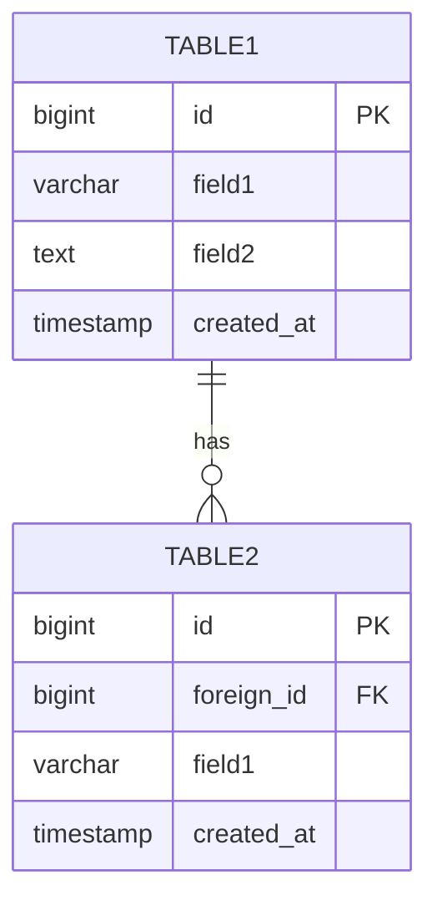
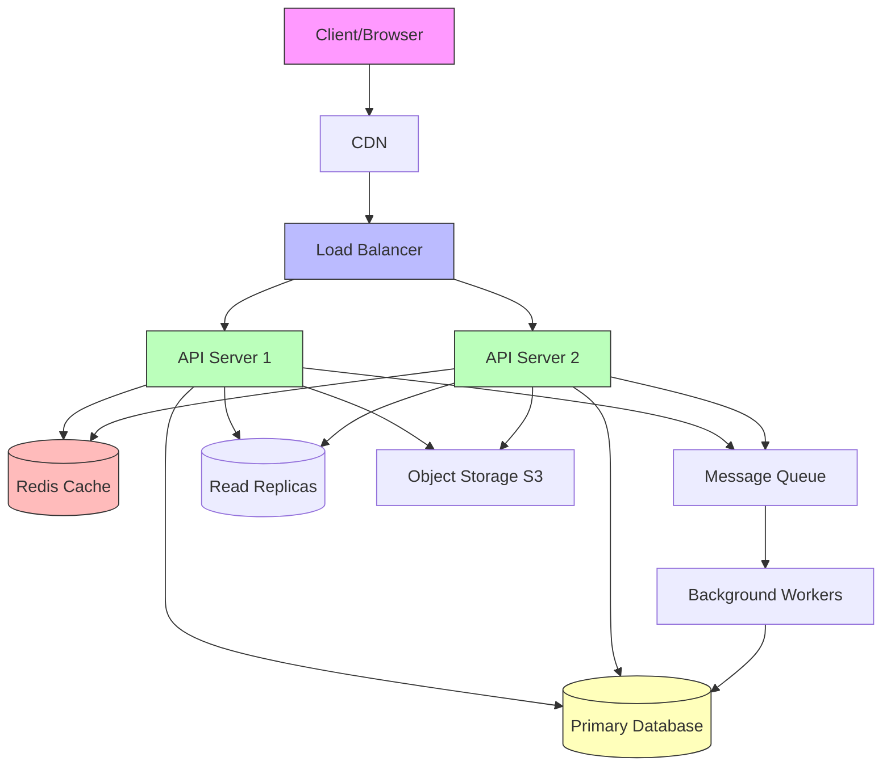
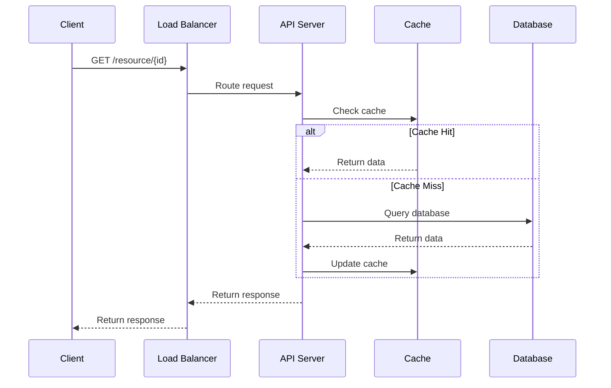
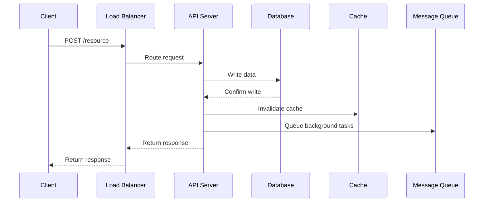

# [System Name] Design

> **Difficulty:** [Beginner/Intermediate/Advanced]
> **Interview Frequency:** [High/Medium/Low]
> **Key Concepts:** [List 3-5 key concepts this design covers]

## Table of Contents
1. [Problem Statement & Requirements](#1-problem-statement--requirements)
2. [Back-of-the-Envelope Estimation](#2-back-of-the-envelope-estimation)
3. [API Design](#3-api-design)
4. [Data Model & Database Schema](#4-data-model--database-schema)
5. [High-Level Design](#5-high-level-design)
6. [Detailed Component Design](#6-detailed-component-design)
7. [Identifying and Resolving Bottlenecks](#7-identifying-and-resolving-bottlenecks)
8. [Trade-offs and Alternatives](#8-trade-offs-and-alternatives)
9. [Monitoring, Metrics & Alerts](#9-monitoring-metrics--alerts)
10. [Follow-up Questions & Extensions](#10-follow-up-questions--extensions)

---

## 1. Problem Statement & Requirements

### Problem Description
[Brief description of what the system does and why it's needed]

### Functional Requirements
[What the system MUST do]

**Core Features:**
- [ ] Feature 1 (e.g., Users can create short URLs)
- [ ] Feature 2 (e.g., Short URLs redirect to original URLs)
- [ ] Feature 3 (e.g., URLs expire after a certain time)

**Additional Features:**
- [ ] Feature 4 (optional but discussed)
- [ ] Feature 5 (optional but discussed)

### Non-Functional Requirements
[Quality attributes and constraints]

**Scale:**
- Daily Active Users (DAU): [e.g., 100 million]
- Total Users: [e.g., 500 million]
- Requests per second: [e.g., 10,000 QPS]

**Performance:**
- Latency: [e.g., < 200ms for 99th percentile]
- Throughput: [e.g., handle X requests/second]

**Availability & Reliability:**
- Availability: [e.g., 99.99% uptime]
- Durability: [e.g., no data loss]

**Other:**
- [ ] Scalability - Must scale to X users
- [ ] Consistency vs Availability trade-off
- [ ] Security requirements
- [ ] Cost constraints

### Out of Scope
[What we're NOT building in this design]

- ❌ [Feature we're excluding]
- ❌ [Feature we're excluding]
- ❌ [Feature we're excluding]

### Constraints and Assumptions
[Specific constraints and assumptions]

**Assumptions:**
- [Assumption 1, e.g., Read-heavy system (100:1 read/write ratio)]
- [Assumption 2, e.g., Average URL length: 100 characters]
- [Assumption 3, e.g., Data retention: 5 years]

---

## 2. Back-of-the-Envelope Estimation

### Traffic Estimation

#### Write Operations
```
[Calculation for writes]
Example:
- URLs created per month: 100 million
- URLs created per day: 100M / 30 ≈ 3.3 million
- Write QPS: 3.3M / 100,000 ≈ 33 QPS
- Peak write QPS: 33 × 2 ≈ 66 QPS
```

#### Read Operations
```
[Calculation for reads]
Example:
- Read/write ratio: 100:1
- Read QPS: 33 × 100 = 3,300 QPS
- Peak read QPS: 3,300 × 2 ≈ 6,600 QPS
```

### Storage Estimation

```
[Calculation for storage]
Example:
Data per record:
- Field 1: X bytes
- Field 2: Y bytes
- Total per record: Z bytes

Total records over [timeframe]:
- Per day: N records
- Over [timeframe]: N × days = M records

Total storage:
- M records × Z bytes = X GB

With overhead (indexes, replication):
- X GB × 3 = Y TB
```

### Bandwidth Estimation

```
[Calculation for bandwidth]
Example:
- Incoming data: Write QPS × Record size
- Outgoing data: Read QPS × Record size
- Total bandwidth: X MB/s
```

### Memory/Cache Estimation

```
[Calculation for cache size]
Example:
Using 80/20 rule (80% of traffic from 20% of data):
- Daily requests: X million
- Unique items (20%): X × 0.2 = Y million
- Cache size: Y million × record size = Z GB
```

### Summary Table

| Metric | Estimate |
|--------|----------|
| **Write QPS (avg)** | X |
| **Write QPS (peak)** | Y |
| **Read QPS (avg)** | X |
| **Read QPS (peak)** | Y |
| **Storage (5 years)** | X TB |
| **Bandwidth (in)** | X MB/s |
| **Bandwidth (out)** | Y MB/s |
| **Cache size** | Z GB |

---

## 3. API Design

### REST API Endpoints

#### Endpoint 1: [Operation Name]
```http
POST /api/v1/resource
Content-Type: application/json

Request:
{
  "field1": "value1",
  "field2": "value2"
}

Response (201 Created):
{
  "id": "unique_id",
  "field1": "value1",
  "created_at": "2024-01-15T10:30:00Z"
}

Error Response (400 Bad Request):
{
  "error": "error_code",
  "message": "Human-readable error message"
}
```

#### Endpoint 2: [Operation Name]
```http
GET /api/v1/resource/{id}

Response (200 OK):
{
  "id": "unique_id",
  "field1": "value1",
  "field2": "value2",
  "created_at": "2024-01-15T10:30:00Z"
}

Error Response (404 Not Found):
{
  "error": "not_found",
  "message": "Resource not found"
}
```

#### Endpoint 3: [Operation Name]
```http
PUT /api/v1/resource/{id}
Content-Type: application/json

Request:
{
  "field1": "new_value"
}

Response (200 OK):
{
  "id": "unique_id",
  "field1": "new_value",
  "updated_at": "2024-01-15T11:00:00Z"
}
```

#### Endpoint 4: [Operation Name]
```http
DELETE /api/v1/resource/{id}

Response (204 No Content)

Error Response (404 Not Found)
```

### API Design Considerations

- **Versioning:** Use `/api/v1/` for versioning
- **Authentication:** JWT tokens in Authorization header
- **Rate Limiting:** X requests per minute per user
- **Pagination:** For list endpoints, use `?page=1&limit=20`
- **Filtering:** Use query parameters `?filter=value`

---

## 4. Data Model & Database Schema

### Database Choice

**Selected Database:** [PostgreSQL/MySQL/MongoDB/Cassandra/etc.]

**Justification:**
- [Reason 1, e.g., Need ACID guarantees for transactions]
- [Reason 2, e.g., Relational data with complex queries]
- [Reason 3, e.g., Strong consistency requirements]

### Schema Design

#### Table 1: [table_name]
```sql
CREATE TABLE table_name (
    id BIGINT PRIMARY KEY AUTO_INCREMENT,
    field1 VARCHAR(255) NOT NULL,
    field2 TEXT,
    field3 TIMESTAMP DEFAULT CURRENT_TIMESTAMP,
    INDEX idx_field1 (field1),
    INDEX idx_field3 (field3)
);
```

**Columns:**
- `id` - Primary key, auto-incrementing
- `field1` - Description of field
- `field2` - Description of field
- `field3` - Description of field

**Indexes:**
- Primary index on `id` for fast lookups
- Index on `field1` for common queries
- Index on `field3` for time-based queries

#### Table 2: [table_name]
```sql
CREATE TABLE table_name (
    id BIGINT PRIMARY KEY,
    foreign_id BIGINT NOT NULL,
    field1 VARCHAR(100),
    created_at TIMESTAMP DEFAULT CURRENT_TIMESTAMP,
    FOREIGN KEY (foreign_id) REFERENCES other_table(id),
    INDEX idx_foreign_id (foreign_id)
);
```

### Data Model Diagram



### Partitioning Strategy

[If applicable, describe how data is partitioned]
- **Sharding Key:** [field used for sharding]
- **Partitioning Method:** [Range/Hash/Geo-based]
- **Number of Shards:** [Initial and growth plan]

---

## 5. High-Level Design

### Architecture Diagram



### Component Overview

1. **Client:** Web/mobile application
2. **CDN:** Caches static content, reduces latency
3. **Load Balancer:** Distributes traffic across API servers
4. **API Servers:** Stateless application servers
5. **Cache (Redis):** Caches frequently accessed data
6. **Message Queue:** Asynchronous task processing
7. **Database:** Persistent data storage
8. **Object Storage:** Store large files (images, videos)

### Data Flow

#### Read Path


#### Write Path


---

## 6. Detailed Component Design

### Component 1: [Component Name]

**Purpose:** [What this component does]

**Implementation Details:**
[Detailed explanation of how this component works]

**Algorithm/Data Structure:**
```
[Pseudocode or description of algorithm]
Example:
function generateShortURL(longURL):
    hash = MD5(longURL)
    shortURL = base62Encode(hash[:6])
    return shortURL
```

**Code Sample (Python):**
```python
# Example implementation
class ComponentName:
    def __init__(self):
        self.field = value

    def method_name(self, param):
        """
        Description of what this method does

        Args:
            param: Description

        Returns:
            Description of return value
        """
        # Implementation
        pass
```

### Component 2: [Component Name]

[Similar structure as Component 1]

### Component 3: [Component Name]

[Similar structure as Component 1]

---

## 7. Identifying and Resolving Bottlenecks

### Potential Bottlenecks

#### 1. Single Point of Failure (SPOF)

**Problem:**
- [Describe the SPOF, e.g., Single database instance]

**Solution:**
- [Solution, e.g., Database replication (master-slave)]
- [Additional solution, e.g., Automatic failover]

**Implementation:**
```
[Brief description of implementation]
- Primary database for writes
- Multiple read replicas for reads
- Load balancer to route read traffic
```

#### 2. Database Performance

**Problem:**
- [Describe the issue, e.g., Slow queries on large tables]

**Solution:**
- **Indexing:** Create indexes on frequently queried columns
- **Caching:** Cache hot data in Redis
- **Sharding:** Partition data across multiple databases

#### 3. Network Bandwidth

**Problem:**
- [Describe the issue]

**Solution:**
- [Solution approaches]

#### 4. Scalability Limits

**Problem:**
- [Describe scaling challenges]

**Solution:**
- Horizontal scaling of application servers
- Database sharding for write scaling
- CDN for global distribution

### Fault Tolerance

**Strategies:**
- **Replication:** 3x replication of critical data
- **Health Checks:** Monitor service health, auto-restart failed services
- **Circuit Breakers:** Prevent cascading failures
- **Graceful Degradation:** Degrade non-critical features under load

---

## 8. Trade-offs and Alternatives

### Design Decision 1: [Decision Name]

**Chosen Approach:** [What we chose]

**Rationale:**
- [Reason 1]
- [Reason 2]

**Alternatives Considered:**
1. **Alternative 1**
   - Pros: [List pros]
   - Cons: [List cons]
   - Why not chosen: [Explanation]

2. **Alternative 2**
   - Pros: [List pros]
   - Cons: [List cons]
   - Why not chosen: [Explanation]

### Design Decision 2: [Decision Name]

[Similar structure as Decision 1]

### CAP Theorem Considerations

**Our Choice:** [Consistency/Availability/Partition Tolerance - pick 2]

**Justification:**
[Explain why this choice makes sense for this system]

---

## 9. Monitoring, Metrics & Alerts

### Key Metrics

#### Application Metrics
- **Request Rate:** Requests per second
- **Error Rate:** Errors per second, % error rate
- **Latency:** p50, p95, p99 latency
- **Availability:** Uptime percentage

#### Infrastructure Metrics
- **CPU Utilization:** % CPU usage per server
- **Memory Usage:** % memory used
- **Disk I/O:** Read/write IOPS
- **Network:** Bandwidth in/out

#### Business Metrics
- **Daily Active Users:** Count of DAU
- **Conversion Rate:** % of successful operations
- **Feature Usage:** Which features are used most

### Logging Strategy

**What to Log:**
- All API requests/responses
- Errors and exceptions
- Slow queries (> 100ms)
- Authentication events
- Business-critical events

**Log Format:**
```json
{
  "timestamp": "2024-01-15T10:30:00Z",
  "level": "ERROR",
  "service": "api-server-1",
  "message": "Database connection failed",
  "trace_id": "abc123",
  "user_id": "user_456"
}
```

### Alerts

| Alert | Condition | Severity | Action |
|-------|-----------|----------|--------|
| High error rate | Error rate > 5% | Critical | Page on-call engineer |
| High latency | p99 > 1s | Warning | Investigate performance |
| Database down | DB unreachable | Critical | Failover to replica |
| High CPU | CPU > 80% for 5 min | Warning | Auto-scale or investigate |

### Monitoring Tools
- **Metrics:** Prometheus + Grafana
- **Logging:** ELK Stack (Elasticsearch, Logstash, Kibana)
- **Tracing:** Jaeger for distributed tracing
- **Alerts:** PagerDuty for on-call management

---

## 10. Follow-up Questions & Extensions

### Common Interview Follow-ups

#### Q1: How would you scale this to 10x the current load?
**Answer:**
[Your approach to scaling 10x]
- [Strategy 1]
- [Strategy 2]
- [Strategy 3]

#### Q2: How would you handle failures in [component X]?
**Answer:**
[Your fault tolerance strategy]

#### Q3: How would you add [new feature]?
**Answer:**
[How you'd extend the design]

#### Q4: How would you optimize costs?
**Answer:**
[Cost optimization strategies]

### Possible Extensions

1. **Feature Extension 1**
   - Description: [What it is]
   - Implementation: [How to add it]
   - Challenges: [What's difficult]

2. **Feature Extension 2**
   - Description: [What it is]
   - Implementation: [How to add it]
   - Challenges: [What's difficult]

### Advanced Considerations

- **Multi-Region Deployment:** How to handle global users
- **Data Migration:** Strategy for schema changes
- **Disaster Recovery:** Backup and recovery plan
- **Security:** Authentication, authorization, encryption
- **Compliance:** GDPR, data privacy, data retention

---

## References

### Papers & Articles
- [Link to relevant paper/article]
- [Link to relevant paper/article]

### Real-World Implementations
- [Company blog post about similar system]
- [Open-source project reference]

### Related Designs
- [Link to related system design in this repo]
- [Link to related system design in this repo]

---

**Interview Tips for This Design:**
1. [Tip 1]
2. [Tip 2]
3. [Tip 3]

**Key Takeaways:**
- [Key point 1]
- [Key point 2]
- [Key point 3]
