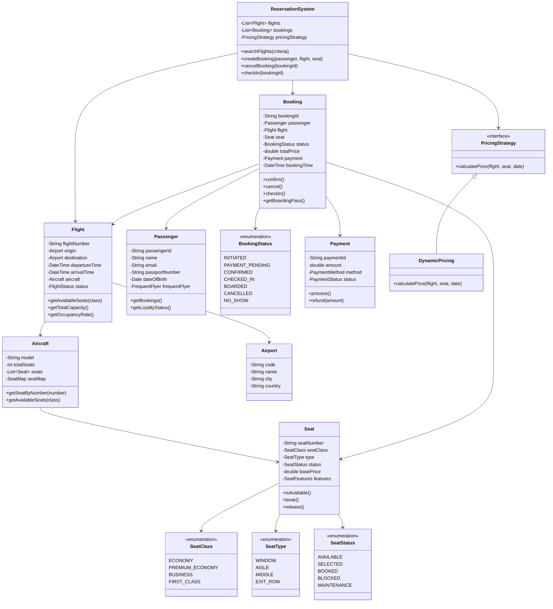

# Airline Reservation System - Object-Oriented Design

**Difficulty:** Intermediate
**Interview Frequency:** High
**Key Concepts:** Seat Assignment, Pricing Strategy, Booking Management, Inventory Control
**Companies:** Airlines, Expedia, Google Flights, Skyscanner, Kayak
**Estimated Interview Time:** 40-45 minutes

---

## Problem Statement

Design an airline reservation system that supports:
- Flight search by route, date, and class
- Seat selection and assignment
- Booking creation and cancellation
- Multiple fare classes (Economy, Business, First)
- Dynamic pricing based on demand
- Passenger management
- Check-in and boarding processes
- Overbooking strategies

**Interview Context:** Tests understanding of inventory management, seat allocation algorithms, pricing strategies, and handling real-world constraints like overbooking and cancellations.

---

## Requirements

### Functional Requirements
1. **Flight Management:** Create flights with routes, schedules, aircraft
2. **Search:** Find flights by origin, destination, date, class
3. **Booking:** Reserve seats, assign passengers, process payment
4. **Seat Selection:** Choose specific seats, handle preferences
5. **Pricing:** Dynamic pricing, fare classes, discounts
6. **Check-in:** Online/airport check-in, boarding pass
7. **Cancellation:** Cancel bookings, process refunds

### Non-Functional Requirements
1. **Concurrency:** Handle simultaneous bookings
2. **Availability:** Real-time seat availability
3. **Performance:** Search < 1s, booking < 2s
4. **Scalability:** Millions of flights, passengers

---

## Core Concepts

### 1. Seat Classes and Pricing

| Class | Price Multiplier | Amenities | Refundable |
|-------|-----------------|-----------|------------|
| **Economy** | 1.0x | Basic | No |
| **Premium Economy** | 1.5x | Extra legroom | Partial |
| **Business** | 3.0x | Lie-flat, lounge | Yes |
| **First Class** | 5.0x | Suite, premium meals | Yes |

### 2. Booking States

```
INITIATED → PAYMENT_PENDING → CONFIRMED → CHECKED_IN → BOARDED
    ↓              ↓              ↓
CANCELLED      CANCELLED      CANCELLED
```

### 3. Overbooking Strategy

Airlines typically overbook by 5-15% because:
- Historical no-show rates (5-10%)
- Last-minute cancellations
- Revenue optimization

**Risk Management:**
- Offer compensation (upgrades, vouchers)
- Book on next available flight
- Track patterns per route

---

## Class Diagram



---

## Key Components

### 1. Seat Assignment Algorithm

**Simple First-Available:**
```
Find first available seat in requested class
```

**Preference-Based:**
```
1. Filter by class
2. Apply preferences (window/aisle, exit row)
3. Optimize for groups (keep together)
4. Return best match
```

**Revenue Optimization:**
```
Reserve premium seats (exit row, front) for higher-paying passengers
```

### 2. Dynamic Pricing

**Factors:**
- Days until departure (expensive close to date)
- Current occupancy (expensive when >70% full)
- Historical demand for route
- Competitor pricing
- Day of week, seasonality

**Formula:**
```
finalPrice = basePrice × demandMultiplier × timeMultiplier × classMultiplier
```

### 3. Overbooking Management

**Algorithm:**
```
maxBookings = capacity × (1 + overbookingRate)
if bookings < maxBookings:
    allow booking
else:
    add to waitlist
```

**When overbooked:**
1. Request volunteers (offer compensation)
2. Deny boarding to last-booked passengers
3. Rebook on next flight + compensation

---

## Design Patterns

### 1. Strategy Pattern (Pricing)
- Different pricing algorithms (fixed, dynamic, auction)
- Switchable at runtime

### 2. Factory Pattern (Seat Creation)
- Create seats based on aircraft configuration
- Standard layouts (Boeing 737, A320)

### 3. State Pattern (Booking States)
- INITIATED → CONFIRMED → CHECKED_IN → BOARDED
- State-specific operations

### 4. Observer Pattern (Notifications)
- Email confirmations
- SMS reminders
- Flight status updates

### 5. Composite Pattern (Multi-leg Flights)
- Connecting flights as composite
- Single booking for multiple segments

---

## Implementation Approach

### Phase 1: Core Structure (10 min)
1. Flight, Seat, Passenger, Booking classes
2. Enums: SeatClass, SeatStatus, BookingStatus
3. Basic search and book

### Phase 2: Seat Management (10 min)
1. Seat selection logic
2. Availability checking
3. Prevent double booking

### Phase 3: Pricing (10 min)
1. Base pricing by class
2. Dynamic pricing strategy
3. Calculate total with taxes

### Phase 4: Advanced Features (10 min)
1. Check-in process
2. Cancellation with refunds
3. Overbooking handling

---

## Trade-offs & Considerations

### 1. Seat Assignment Strategy

| Approach | Pros | Cons |
|----------|------|------|
| **Auto-assign** | Fast, optimized | Less customer control |
| **Manual select** | Customer choice | May be inefficient |
| **Hybrid** | Balanced | More complex |

### 2. Pricing Model

| Model | Description | Use Case |
|-------|-------------|----------|
| **Fixed** | Same price always | Budget airlines |
| **Dynamic** | Demand-based | Legacy carriers |
| **Auction** | Bid for seats | Upgrades |

### 3. Overbooking Rate

- **Low (2-5%):** Safe, less revenue
- **Medium (5-10%):** Balanced
- **High (10-15%):** Risky, max revenue

---

## Common Pitfalls

### 1. Not Handling Concurrent Bookings
❌ Check availability, then book (race condition)
✅ Use database transactions with locks

### 2. Ignoring Seat Preferences
❌ Assign any available seat
✅ Consider passenger preferences (window/aisle)

### 3. Forgetting Group Bookings
❌ Scatter family across plane
✅ Keep groups together when possible

### 4. Not Implementing Cancellation Policy
❌ Full refund anytime
✅ Apply cancellation fees based on time and class

### 5. Missing Check-in Window
❌ Allow check-in anytime
✅ Enforce 24hr before to 1hr before departure

---

## Follow-up Questions

### Easy
1. **Q:** How would you add baggage allowance?
   - **A:** Add Baggage class, link to fare class, track weight

2. **Q:** How would you implement meal preferences?
   - **A:** MealPreference enum, store with passenger profile

3. **Q:** How would you generate boarding passes?
   - **A:** BoardingPass class with QR code, gate info, boarding time

### Medium
4. **Q:** How would you handle connecting flights?
   - **A:** MultiSegmentBooking class, composite pattern, ensure connection times

5. **Q:** How would you implement a waitlist?
   - **A:** WaitList queue, automatically book when seat available, time-limited

6. **Q:** How would you add frequent flyer miles?
   - **A:** LoyaltyProgram class, calculate miles based on distance × class multiplier

7. **Q:** How would you handle flight delays/cancellations?
   - **A:** FlightStatus updates, notify passengers, automatic rebooking options

### Hard
8. **Q:** How would you optimize seat assignment for revenue?
   - **A:** Hold premium seats (exit, front) for last-minute bookings at premium

9. **Q:** How would you implement group discounts?
   - **A:** GroupBooking class, volume-based pricing, keep seats together

10. **Q:** How would you handle involuntary denied boarding?
    - **A:** Algorithm: last booked, lowest fare, no status passengers first, compensation scale

11. **Q:** How would you implement a bidding system for upgrades?
    - **A:** UpgradeBid class, auction before departure, highest bidders get upgrades

12. **Q:** How would you design for global distribution systems (GDS)?
    - **A:** API layer, inventory sync, real-time updates, standard formats (EDIFACT)

---

## Key Takeaways

### ✅ What Interviewers Look For
1. Seat inventory management
2. Concurrency handling (double booking prevention)
3. Pricing strategies
4. Real-world constraints (overbooking, cancellations)

### 📋 Interview Strategy
1. **Clarify (5 min):** Single vs multiple flights? Seat selection? Pricing?
2. **Design (10 min):** Core classes, relationships
3. **Implement (20 min):** Search, book, seat assignment
4. **Discuss (10 min):** Overbooking, pricing, edge cases

### 🎯 Time Management

| Time | Focus | Priority |
|------|-------|----------|
| 0-5 min | Requirements | Critical |
| 5-15 min | Class design | Critical |
| 15-30 min | Booking logic | Critical |
| 30-40 min | Pricing, edge cases | High |

---

**Pro Tip:** Focus on seat inventory management and preventing double bookings. Mention overbooking as a real-world consideration. Discuss trade-offs between auto-assign (efficient) vs manual selection (customer preference).
