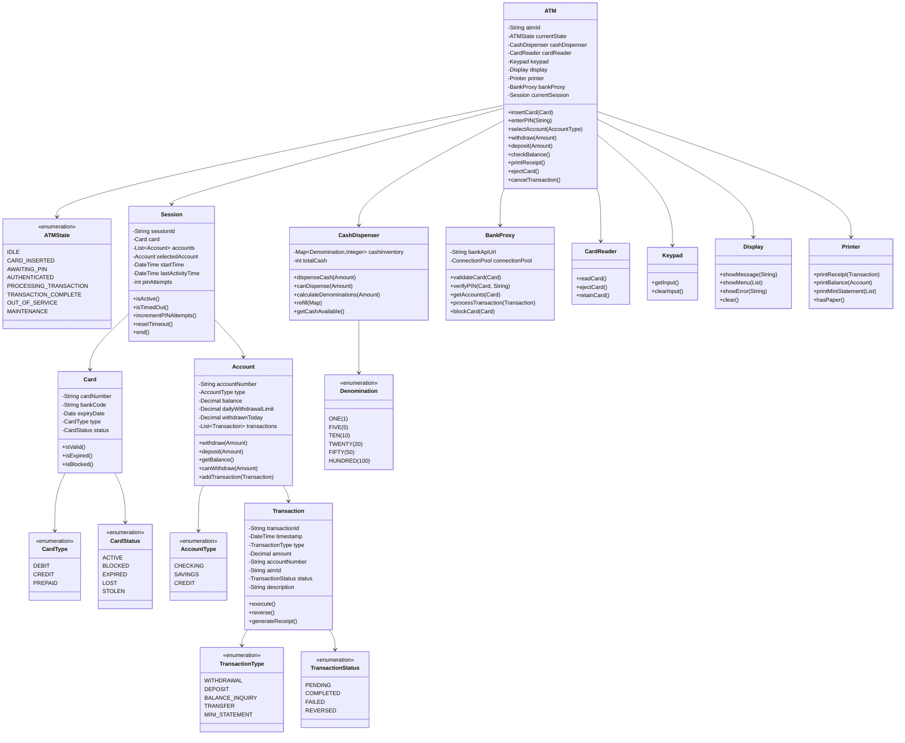

# ATM Machine - Object-Oriented Design

**Difficulty:** Intermediate
**Interview Frequency:** High
**Key Concepts:** State Pattern, Transaction Management, Security, Concurrency
**Companies:** Banks, Financial Services, Amazon, Google, PayPal, Stripe
**Estimated Interview Time:** 40-50 minutes

---

## Table of Contents
1. [Problem Statement](#problem-statement)
2. [Requirements](#requirements)
3. [Core Concepts](#core-concepts)
4. [Class Diagram](#class-diagram)
5. [Key Components](#key-components)
6. [Design Patterns](#design-patterns)
7. [Implementation Approach](#implementation-approach)
8. [Advanced Features](#advanced-features)
9. [Trade-offs & Considerations](#trade-offs--considerations)
10. [Interview Discussion Points](#interview-discussion-points)
11. [Common Pitfalls](#common-pitfalls)
12. [Follow-up Questions](#follow-up-questions)

---

## Problem Statement

Design an ATM (Automated Teller Machine) system that supports:
- Card insertion and ejection
- PIN verification with security measures
- Cash withdrawals with denomination management
- Cash deposits
- Balance inquiry
- Mini statement/transaction history
- Multi-account support (checking, savings)
- State management and proper transitions
- Security and fraud detection

**Interview Context:** This problem tests your understanding of state machines, transaction management, security considerations, and real-world constraints like cash availability and concurrent access. It's frequently asked at financial institutions and companies with payment systems.

---

## Requirements

### Functional Requirements

1. **Card Operations**
   - Insert card (read card number)
   - Validate card status (not expired, not blocked)
   - Eject card (return to user)
   - Retain card (if blocked or suspicious activity)

2. **Authentication**
   - PIN entry and validation
   - Maximum PIN attempts (typically 3)
   - Card blocking after failed attempts
   - Timeout after period of inactivity

3. **Account Operations**
   - Select account type (checking, savings, credit)
   - Check balance
   - View mini statement (last N transactions)

4. **Cash Withdrawal**
   - Enter withdrawal amount
   - Validate sufficient account balance
   - Validate sufficient ATM cash
   - Dispense correct denominations
   - Update account balance
   - Print receipt

5. **Cash Deposit**
   - Accept cash/check deposit
   - Count deposited amount
   - Update account balance immediately or with delay
   - Print receipt

6. **Transaction Management**
   - Generate unique transaction IDs
   - Record all transactions
   - Handle failed transactions
   - Support transaction reversal

### Non-Functional Requirements

1. **Security**
   - Encrypt PIN transmission
   - No sensitive data in logs
   - Session timeout
   - Fraud detection
   - Secure cash storage

2. **Reliability**
   - Handle network failures gracefully
   - Atomic transactions (all-or-nothing)
   - Data consistency with bank backend

3. **Availability**
   - 99.9% uptime
   - Operate during network outages (limited)
   - Queue management for multiple users

4. **Usability**
   - Clear user interface
   - Helpful error messages
   - Timeout warnings
   - Multiple language support

5. **Performance**
   - Transaction completion < 30 seconds
   - PIN validation < 2 seconds
   - Receipt printing < 5 seconds

---

## Core Concepts

### 1. ATM State Machine

The ATM operates as a finite state machine with clear transitions:

```
┌─────────────────────────────────────────────────┐
│                    IDLE                         │
│         (Waiting for card insertion)            │
└──────────────┬──────────────────────────────────┘
               │ Insert Card
               ↓
┌─────────────────────────────────────────────────┐
│              CARD_INSERTED                      │
│        (Reading card, checking status)          │
└──────────────┬──────────────────────────────────┘
               │ Request PIN
               ↓
┌─────────────────────────────────────────────────┐
│              AWAITING_PIN                       │
│        (User entering PIN, max 3 attempts)      │
└──────────────┬──────────────────────────────────┘
               │ PIN Verified
               ↓
┌─────────────────────────────────────────────────┐
│             AUTHENTICATED                       │
│    (Show menu: withdraw, deposit, balance)      │
└──────────────┬──────────────────────────────────┘
               │ Select Operation
               ↓
┌─────────────────────────────────────────────────┐
│            PROCESSING_TRANSACTION               │
│  (Execute transaction, communicate with bank)   │
└──────────────┬──────────────────────────────────┘
               │ Transaction Complete
               ↓
┌─────────────────────────────────────────────────┐
│             TRANSACTION_COMPLETE                │
│        (Print receipt, ask for another)         │
└──────────────┬──────────────────────────────────┘
               │ Eject Card / Another Transaction
               ↓
             IDLE / AUTHENTICATED
```

### 2. Cash Denomination Management

ATMs must dispense cash using available bills:

**Example:** Withdraw $340
- **Bills Available:** $100, $50, $20, $10, $5, $1
- **Optimal Distribution:** 3×$100 + 2×$20 = $340
- **Algorithm:** Greedy (largest bills first) or Dynamic Programming

**Constraints:**
- Limited quantity of each denomination
- Prefer larger denominations (less bills)
- Some amounts may be impossible (e.g., $7 with only $20 bills)

### 3. Transaction Types

| Type | Description | Account Impact | ATM Cash Impact |
|------|-------------|----------------|-----------------|
| **Withdrawal** | Dispense cash | Debit | Decrease |
| **Deposit** | Accept cash/check | Credit | Increase |
| **Balance Inquiry** | Display balance | None | None |
| **Transfer** | Move between accounts | Debit/Credit | None |
| **Mini Statement** | Show recent transactions | None | None |

### 4. Security Measures

1. **PIN Protection**
   - Hash PINs (never store plaintext)
   - Limit attempts (block after 3 failures)
   - No display of entered digits (show ***)

2. **Card Retention**
   - Retain card if blocked
   - Retain card if suspicious activity
   - Notify bank immediately

3. **Session Management**
   - Auto-timeout after 30-60 seconds inactivity
   - Clear session data on completion
   - Prevent session hijacking

4. **Fraud Detection**
   - Unusual withdrawal amounts
   - Multiple rapid transactions
   - Withdrawals from unusual locations
   - Card skimming detection

---

## Class Diagram



---

## Key Components

### 1. ATM (Main Controller)

**Purpose:** Orchestrate all ATM operations and manage state transitions.

**Key Responsibilities:**
- Coordinate between hardware components
- Manage ATM state machine
- Handle user interactions
- Delegate transactions to appropriate handlers

**Design Decision:** Central controller pattern - single point of coordination.

### 2. State Machine

**Purpose:** Manage ATM operational states and valid transitions.

**States:**
- **IDLE:** No active session, waiting for card
- **CARD_INSERTED:** Card read, validating status
- **AWAITING_PIN:** Prompting for PIN entry
- **AUTHENTICATED:** PIN verified, showing menu
- **PROCESSING_TRANSACTION:** Executing operation
- **TRANSACTION_COMPLETE:** Operation done, printing receipt
- **OUT_OF_SERVICE:** ATM unavailable (out of cash, error)
- **MAINTENANCE:** Being serviced

**Why State Pattern?**
- Clear separation of behavior per state
- Easy to add new states
- Prevents invalid operations (can't withdraw in IDLE state)
- Makes testing easier

### 3. Cash Dispenser

**Purpose:** Manage physical cash inventory and dispensing logic.

**Key Responsibilities:**
- Track cash denominations and quantities
- Calculate optimal bill distribution
- Validate if amount can be dispensed
- Handle low cash warnings

**Algorithm Choice:**
```
Greedy Algorithm (Simple, works for standard denominations):
1. Start with largest denomination
2. Use as many bills as possible
3. Move to next smaller denomination
4. Repeat until amount reached or impossible

Time Complexity: O(n) where n = number of denominations
```

### 4. Bank Proxy

**Purpose:** Abstract communication with bank's backend systems.

**Key Responsibilities:**
- API calls to bank servers
- Handle network failures and retries
- Cache responses when appropriate
- Implement circuit breaker pattern

**Why Proxy Pattern?**
- Isolates external dependency
- Can mock for testing
- Add caching/retry logic without changing ATM code
- Switch between different banks easily

### 5. Session Management

**Purpose:** Track user session from card insertion to ejection.

**Key Responsibilities:**
- Store temporary session data
- Track PIN attempts
- Implement timeout logic
- Clear sensitive data on session end

**Security Considerations:**
- Never log PIN
- Encrypt session data in memory
- Auto-timeout after inactivity
- Clear session on any error

---

## Design Patterns

### 1. State Pattern (ATM States)

**Problem:** ATM behavior changes based on current state. Different operations are valid in different states.

**Solution:** Encapsulate state-specific behavior in separate state classes.

**Benefits:**
- Clear state transitions
- Prevents invalid operations
- Easy to add new states
- Reduces complex conditionals

**Implementation Approach:**
```
ATMState (Interface)
├── IdleState
├── AuthenticatedState
├── ProcessingState
└── OutOfServiceState

Each state implements:
- insertCard()
- enterPIN()
- selectTransaction()
- ejectCard()
```

### 2. Command Pattern (Transactions)

**Problem:** Different transaction types need to be executed, logged, and potentially reversed.

**Solution:** Encapsulate each transaction as a command object.

**Benefits:**
- Easy to add new transaction types
- Support undo/reversal
- Transaction history automatically maintained
- Queueing and logging built-in

### 3. Proxy Pattern (Bank Communication)

**Problem:** ATM needs to communicate with remote bank systems.

**Solution:** BankProxy handles all external communication.

**Benefits:**
- Abstracts network complexity
- Can cache responses
- Implements retry logic
- Easy to mock for testing

### 4. Strategy Pattern (Cash Dispensing)

**Problem:** Different algorithms for dispensing cash (greedy, optimal, etc.)

**Solution:** Encapsulate dispensing algorithms as strategies.

**Benefits:**
- Switch algorithms based on cash availability
- Add new strategies easily
- Test algorithms independently

### 5. Singleton Pattern (ATM Instance)

**Problem:** Only one ATM controller should exist per machine.

**Solution:** Implement ATM as singleton (with caution).

**Benefits:**
- Global access point
- Ensures single instance

**Drawback:** Can make testing harder (prefer dependency injection instead).

---

## Implementation Approach

### Phase 1: Core Structure (10 minutes)

1. **Define enums:** ATMState, TransactionType, AccountType, CardStatus
2. **Create Card class:** Card number, expiry, status validation
3. **Create Account class:** Balance, withdrawal limits, basic operations
4. **Create ATM class:** State tracking, card/account references

**Interview Tip:** Start with the happy path - card insertion to successful withdrawal.

### Phase 2: Basic Transaction Flow (15 minutes)

1. **Card insertion:** Read card, validate status
2. **PIN verification:** Hash comparison, attempt tracking
3. **Balance inquiry:** Simplest transaction to implement
4. **Withdrawal:** Account balance check, dispense cash

### Phase 3: Cash Dispensing (10 minutes)

1. **CashDispenser class:** Track denominations
2. **Greedy algorithm:** Calculate bills needed
3. **Validation:** Check if amount can be dispensed
4. **Update inventory:** Deduct dispensed bills

### Phase 4: State Management (10 minutes)

1. **Implement state transitions:** IDLE → CARD_INSERTED → AUTHENTICATED
2. **State validation:** Prevent invalid operations
3. **Timeout handling:** Return to IDLE after inactivity

### Phase 5: Advanced Features (If Time)

1. **Multiple accounts:** Let user select checking/savings
2. **Transaction history:** Store and display mini statement
3. **Receipt printing:** Format transaction details
4. **Error handling:** Network failures, insufficient cash

---

## Advanced Features

### 1. Cash Denomination Optimization

**Simple Greedy Approach:**
```
For amount = $340 with denominations [100, 50, 20, 10, 5, 1]:
- 3 × $100 = $300 (remaining: $40)
- 0 × $50 (would exceed)
- 2 × $20 = $40 (remaining: $0)
Result: 5 bills total
```

**Dynamic Programming Approach (Optimal):**
```
When greedy fails:
Amount = $30 with [25, 20, 1]
Greedy: 1×$25 + 5×$1 = 6 bills
Optimal: 1×$20 + 1×$10 = ... wait, no $10!
Optimal: 1×$25 + 5×$1 = 6 bills (same)

Better example:
Amount = $6 with [4, 3, 1]
Greedy: 1×$4 + 2×$1 = 3 bills
Optimal: 2×$3 = 2 bills (better!)
```

**Trade-off:** DP is O(amount × denominations), greedy is O(denominations).
**Recommendation:** Use greedy for standard denominations, it works fine.

### 2. Multi-Account Support

**Design:**
```
Card → Customer → Multiple Accounts
                ├── Checking (primary)
                ├── Savings
                └── Credit Card
```

**Flow:**
1. After PIN verification, fetch all linked accounts
2. Display account selection menu
3. Allow transfers between accounts
4. Track daily limits per account

### 3. Daily Withdrawal Limits

**Requirements:**
- Each account has daily withdrawal limit (e.g., $1,000)
- Track withdrawals per calendar day (reset at midnight)
- Enforce limit across all ATMs

**Implementation:**
```
Account:
- dailyLimit: $1,000
- withdrawnToday: $300
- lastWithdrawalDate: 2024-01-05

On withdrawal:
1. Check if date changed (reset withdrawnToday if yes)
2. Check if (withdrawnToday + amount) <= dailyLimit
3. Update withdrawnToday
```

### 4. Network Failure Handling

**Scenarios:**
1. **Cannot reach bank:** Show error, retain card
2. **Timeout during transaction:** Transaction uncertain state
3. **Partial failure:** Money dispensed but account not debited

**Strategy:**
- **Timeouts:** Wait 10s max, then abort
- **Retries:** Try 3 times with exponential backoff
- **Idempotency:** Use transaction IDs to prevent double-debit
- **Compensation:** Manual reconciliation for failures

### 5. Fraud Detection

**Red Flags:**
- Multiple PIN failures
- Rapid consecutive withdrawals
- Withdrawals in unusual locations
- Withdrawals after card reported stolen

**Actions:**
- Retain card
- Notify bank immediately
- Block account temporarily
- Alert security

---

## Trade-offs & Considerations

### 1. Immediate vs. Delayed Deposit Credit

| Approach | Pros | Cons | When to Use |
|----------|------|------|-------------|
| **Immediate** | User sees balance right away | Risk if deposit verification fails | For checks with camera verification |
| **Delayed** | Safer, verify first | Poor UX, user unhappy | For cash deposits, large amounts |
| **Hybrid** | Credit portion immediately | More complex logic | Credit $200 immediate, rest after verify |

**Recommendation:** Immediate for cash (counted by machine), delayed for checks.

### 2. PIN Storage

| Approach | Security | Complexity | Performance |
|----------|----------|------------|-------------|
| **Plaintext** | ❌ Terrible | Simple | Fast |
| **Hashed (SHA-256)** | ✅ Good | Moderate | Fast |
| **Salted + Hashed** | ✅ Better | Moderate | Fast |
| **PBKDF2/bcrypt** | ✅ Best | Higher | Slower |

**Recommendation:** Minimum salted hash (bcrypt), verify server-side not in ATM.

### 3. State Management Approach

| Approach | Pros | Cons |
|----------|------|------|
| **Enum + Switch** | Simple, performant | Hard to extend |
| **State Classes** | Clean, extensible | More classes |
| **State Machine Library** | Robust, tested | External dependency |

**Recommendation:** State pattern with classes for interview (shows OOD knowledge).

### 4. Cash Dispensing Strategy

| Strategy | Optimal Bills? | Performance | When to Use |
|----------|---------------|-------------|-------------|
| **Greedy** | Usually | O(d) | Standard denominations |
| **Dynamic Programming** | Always | O(amount × d) | Custom denominations |
| **Least Bills First** | No | O(d) | Preserve small bills |

**Recommendation:** Greedy for interviews, mention DP as optimization.

---

## Interview Discussion Points

### 1. Design Decisions

**Q: Why use State pattern instead of simple if-else checks?**
- Cleaner code organization
- Each state encapsulates its behavior
- Easy to add new states
- Prevents invalid state transitions
- More testable

**Q: How do you handle concurrent ATM access?**
- ATM hardware typically handles one user at a time
- If shared backend: use optimistic locking with version numbers
- Transaction atomicity: all-or-nothing

**Q: How do you ensure transaction atomicity?**
- Two-phase commit: reserve funds, then debit
- Generate transaction ID before processing
- Idempotent operations (safe to retry)
- Rollback on failures

### 2. Scalability Considerations

**Q: How would you handle ATM network management?**
- Central monitoring system
- Each ATM reports status (cash level, errors)
- Prioritize restocking based on usage
- Load balancing (direct users to nearby ATMs)

**Q: How would you scale the bank backend?**
- Database replication for reads
- Sharding by account number
- Caching for frequent queries (balance)
- Async processing for non-critical operations

### 3. Security

**Q: How do you prevent card skimming?**
- Encrypted card readers
- Tamper detection sensors
- Regular hardware inspections
- EMV chip technology (more secure than magnetic stripe)

**Q: How do you handle stolen cards?**
- Real-time card status checks
- Block card after 3 failed PINs
- Retain card if flagged stolen
- Alert bank security

### 4. Reliability

**Q: What happens if ATM loses network connection?**
- **Limited offline mode:** Allow balance inquiry (cached)
- **No withdrawals:** Cannot verify with bank
- **Queue transactions:** Process when online
- **Clear communication:** Tell user why unavailable

**Q: How do you handle power failures?**
- UPS backup power (5-10 minutes)
- Graceful shutdown protocol
- Save session state to persistent storage
- Return card if mid-transaction

### 5. Extensibility

**Q: How would you add biometric authentication?**
- Abstract authentication interface
- Implementations: PIN, fingerprint, face recognition
- Strategy pattern for auth methods
- Combine multiple factors for high security

**Q: How would you support cryptocurrency withdrawals?**
- New account type: CRYPTO
- Currency conversion service
- Real-time exchange rates
- Higher transaction fees

---

## Common Pitfalls

### 1. Not Handling State Transitions Properly

❌ **Wrong:** Allow withdrawal before PIN verification
```
if state == IDLE:
    allow_withdrawal()  # Should require AUTHENTICATED
```

✅ **Right:** Validate state before operations
```
if state != AUTHENTICATED:
    return Error("Please authenticate first")
```

### 2. Ignoring Daily Withdrawal Limits

❌ **Wrong:** Only check account balance
```
if amount <= account.balance:
    dispense_cash()
```

✅ **Right:** Check both balance and daily limit
```
if amount <= account.balance and amount <= account.remaining_daily_limit:
    dispense_cash()
```

### 3. Not Handling Insufficient ATM Cash

❌ **Wrong:** Assume ATM has unlimited cash
```
account.withdraw(amount)  # Debit account even if ATM empty
```

✅ **Right:** Check ATM cash before debiting
```
if atm.can_dispense(amount) and account.has_balance(amount):
    account.withdraw(amount)
    atm.dispense(amount)
else:
    return Error("Transaction failed")
```

### 4. Forgetting Transaction Atomicity

❌ **Wrong:** Debit account but fail to dispense cash
```
account.debit(amount)
if not atm.dispense(amount):  # What if this fails?
    # Account debited, cash not dispensed!
```

✅ **Right:** Use two-phase approach
```
if atm.can_dispense(amount) and account.can_withdraw(amount):
    account.debit(amount)
    try:
        atm.dispense(amount)
    except:
        account.credit(amount)  # Rollback
        raise
```

### 5. Storing PIN in Plaintext

❌ **Wrong:** Store/compare PINs directly
```
class Card:
    self.pin = "1234"  # Plaintext!

def verify(entered_pin):
    return self.pin == entered_pin
```

✅ **Right:** Hash PINs
```
class Card:
    self.pin_hash = hash("1234")

def verify(entered_pin):
    return self.pin_hash == hash(entered_pin)
```

### 6. Not Implementing Session Timeout

❌ **Wrong:** Session stays active forever
```
# User walks away, session still active
# Next person can use their session!
```

✅ **Right:** Auto-timeout after inactivity
```
if time_since_last_activity > TIMEOUT_SECONDS:
    eject_card()
    clear_session()
    transition_to(IDLE)
```

---

## Follow-up Questions

### Easy
1. **Q:** How would you add support for multiple languages?
   - **A:** Internationalization (i18n) - store messages in resource files, load based on user selection

2. **Q:** How would you print a receipt?
   - **A:** Printer class with methods `printReceipt(transaction)`, format transaction details as text

3. **Q:** How would you handle "Out of Paper" errors?
   - **A:** Check `printer.hasPaper()` before printing, show error to user, still allow transaction

### Medium
4. **Q:** How would you implement mini statement (last 10 transactions)?
   - **A:** Store transaction list in Account, return slice of last N, format and display

5. **Q:** How would you handle denomination shortage (e.g., no $20 bills)?
   - **A:** Dynamic programming to find valid combination, inform user if amount impossible

6. **Q:** How would you add transfer between accounts?
   - **A:** New transaction type TRANSFER, debit source account, credit destination, atomic

7. **Q:** How would you detect and handle card skimming devices?
   - **A:** Hardware sensors, anti-tampering seals, regular inspections, encrypted card readers

### Hard
8. **Q:** How would you implement a distributed ATM network?
   - **A:** Central database for accounts, replicas for reads, consistent hashing for sharding, eventual consistency

9. **Q:** How would you handle the scenario where money is dispensed but the transaction fails to update the bank?
   - **A:** Idempotent transaction IDs, store local log, reconciliation job to match ATM logs with bank records

10. **Q:** How would you optimize cash replenishment strategy for a network of ATMs?
    - **A:** Predict usage patterns (ML), prioritize high-traffic ATMs, optimize refill routes, alert before empty

11. **Q:** How would you implement a queue system for multiple users?
    - **A:** Physical queue (one ATM per user), virtual queue for online reservation, estimated wait time

12. **Q:** How would you add support for cardless transactions (mobile phone)?
    - **A:** QR code / NFC authentication, pre-authorized withdrawal code, link to mobile app account

---

## Key Takeaways

### ✅ What Interviewers Look For

1. **State Machine Design**
   - Clear understanding of ATM states
   - Proper state transitions
   - Handling invalid state operations

2. **Security Awareness**
   - PIN protection
   - Session management
   - Fraud detection
   - Data encryption

3. **Real-World Constraints**
   - Cash availability
   - Network failures
   - Transaction atomicity
   - Hardware limitations

4. **Error Handling**
   - Insufficient funds
   - Network timeout
   - Hardware failures
   - User errors

### 📋 Interview Strategy

1. **Clarify Requirements (5 min)**
   - Which operations are required? (Withdrawal, deposit, inquiry?)
   - Need to handle multiple accounts?
   - Security requirements? (PIN attempts, timeout?)
   - Cash denomination management needed?

2. **Design Core Classes (10 min)**
   - ATM, Card, Account, Transaction
   - State machine diagram
   - Key relationships

3. **Implement Core Flow (20 min)**
   - Card insertion → PIN entry → Withdrawal
   - State transitions
   - Basic validation

4. **Discuss Advanced Topics (15 min)**
   - Cash dispensing algorithm
   - Security measures
   - Network failures
   - Concurrent access

### 🎯 Time Management

| Time | Focus | Priority |
|------|-------|----------|
| 0-5 min | Requirements, clarifications | Critical |
| 5-15 min | Class design, state diagram | Critical |
| 15-30 min | Core implementation (card, PIN, withdrawal) | Critical |
| 30-40 min | Cash dispenser, error handling | High |
| 40-50 min | Security, advanced features discussion | Medium |

---

## Additional Resources

### Standards & Regulations
- PCI DSS (Payment Card Industry Data Security Standard)
- EMV chip card specifications
- ISO 8583 (Financial transaction messaging)

### Related Topics
- Cryptography (PIN encryption, secure communication)
- Distributed systems (ATM networks)
- Database transactions (ACID properties)
- Hardware interfaces (card readers, cash dispensers)

### Similar Problems
- **Parking Meter:** Similar state machine, payment processing
- **Vending Machine:** Product selection, change dispensing
- **Ticket Booking:** Reservation, payment, confirmation
- **Pos Terminal:** Payment processing, receipt printing

---

**Pro Tip for Interviews:** Focus on the state machine and security aspects - these are what differentiate ATM design from simpler transaction systems. Always mention atomicity when discussing withdrawals (money must be dispensed if account is debited). Interviewers love when candidates think about real-world constraints like network failures and cash shortages!
