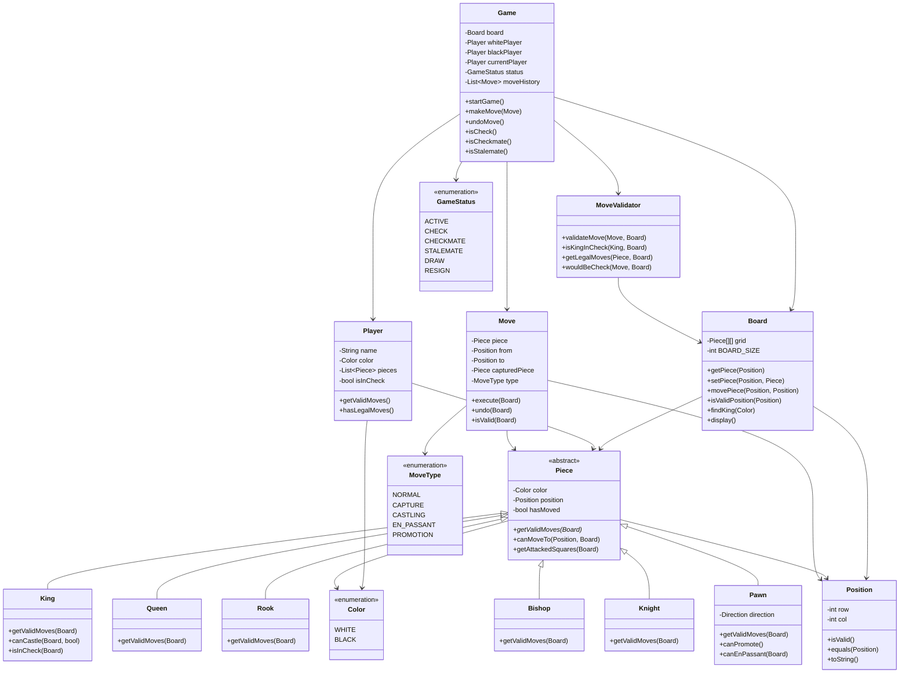

# Chess Game - Object-Oriented Design

**Difficulty:** Intermediate-Advanced
**Interview Frequency:** Medium
**Key Concepts:** Complex Inheritance, Move Validation, Game State Management, Strategy Pattern
**Companies:** Game companies, Google, Microsoft, Amazon
**Estimated Interview Time:** 45-60 minutes

---

## Table of Contents
1. [Problem Statement](#problem-statement)
2. [Requirements](#requirements)
3. [Core Concepts](#core-concepts)
4. [Class Diagram](#class-diagram)
5. [Key Components](#key-components)
6. [Design Patterns](#design-patterns)
7. [Implementation Approach](#implementation-approach)
8. [Advanced Features](#advanced-features)
9. [Trade-offs & Considerations](#trade-offs--considerations)
10. [Interview Discussion Points](#interview-discussion-points)
11. [Common Pitfalls](#common-pitfalls)
12. [Follow-up Questions](#follow-up-questions)

---

## Problem Statement

Design an object-oriented chess game that supports:
- Standard chess rules with all six piece types
- Move validation for each piece type
- Check and checkmate detection
- Turn management
- Special moves (castling, en passant, pawn promotion)
- Game state tracking (playing, check, checkmate, stalemate)

**Interview Context:** This is a classic OOD problem that tests your understanding of inheritance hierarchies, polymorphism, game state management, and complex rule validation. Interviewers want to see how you model different piece behaviors and handle edge cases.

---

## Requirements

### Functional Requirements

1. **Board Management**
   - 8x8 chess board representation
   - Initial piece placement
   - Position validation
   - Board state display

2. **Piece Movement**
   - Each piece type has unique movement rules
   - Validate moves based on piece type and board state
   - Capture opponent pieces
   - Track if pieces have moved (for castling)

3. **Game Rules**
   - Alternating turns (White moves first)
   - Cannot move into check
   - Must move out of check when in check
   - Detect checkmate and stalemate

4. **Special Moves**
   - **Castling:** King and rook special move
   - **En Passant:** Special pawn capture
   - **Pawn Promotion:** Pawn reaches opposite end

5. **Game State**
   - Track current turn
   - Detect check, checkmate, stalemate
   - Maintain move history
   - Support undo/redo

### Non-Functional Requirements

1. **Extensibility:** Easy to add new piece types or variants
2. **Maintainability:** Clear separation of concerns
3. **Testability:** Each component can be tested independently
4. **Performance:** Fast move validation and state checking

---

## Core Concepts

### 1. Chess Terminology

- **Piece:** One of six types (King, Queen, Rook, Bishop, Knight, Pawn)
- **Position:** A square on the board (row, column)
- **Move:** Transfer of a piece from one position to another
- **Capture:** Moving to a square occupied by opponent's piece
- **Check:** King is under threat of capture
- **Checkmate:** King is in check with no legal moves to escape
- **Stalemate:** No legal moves but not in check (draw)

### 2. Movement Patterns

| Piece | Movement | Special Rules |
|-------|----------|---------------|
| **King** | One square in any direction | Cannot move into check, castling |
| **Queen** | Any number of squares in any direction | Most powerful piece |
| **Rook** | Any number of squares horizontally/vertically | Used in castling |
| **Bishop** | Any number of squares diagonally | Stays on same color |
| **Knight** | L-shape: 2+1 squares | Can jump over pieces |
| **Pawn** | Forward 1 (or 2 on first move) | Captures diagonally, en passant, promotion |

### 3. Game States

```
SETUP → PLAYING ⇄ CHECK → CHECKMATE → END
                      ↓
                  STALEMATE → END
```

---

## Class Diagram



---

## Key Components

### 1. Piece Hierarchy (Abstract Base Class)

**Purpose:** Define common interface for all chess pieces

**Key Responsibilities:**
- Store piece color and position
- Define abstract method for move generation
- Track if piece has moved (for castling/pawn logic)

**Design Decision:** Use abstract base class rather than interface to share common attributes.

```
Piece (Abstract)
├── King (moves 1 square, castling)
├── Queen (diagonal + straight)
├── Rook (horizontal + vertical)
├── Bishop (diagonal only)
├── Knight (L-shape, jumps)
└── Pawn (forward, diagonal capture)
```

### 2. Board Class

**Purpose:** Manage the 8x8 grid and piece positions

**Key Responsibilities:**
- Maintain 2D array of pieces
- Validate positions
- Execute moves
- Find pieces by type/color

**Data Structure Choice:**
- **2D Array:** Fast O(1) access by position
- **Alternative:** Dictionary with position keys (more memory overhead)

### 3. Move Validation Strategy

**Approach:** Multi-layered validation

1. **Piece-level:** Can this piece type reach this square?
2. **Board-level:** Is the path clear? Is target square valid?
3. **Game-level:** Does this move put/leave king in check?

**Why Separate?** Different concerns, easier to test, clearer code.

### 4. Game State Manager

**Purpose:** Track overall game state and enforce rules

**Key Responsibilities:**
- Turn management
- Check/checkmate detection
- Move history
- Game status tracking

---

## Design Patterns

### 1. Strategy Pattern (Piece Movement)

**Problem:** Each piece type has different movement rules.

**Solution:** Each piece class implements its own `getValidMoves()` method.

**Benefits:**
- Easy to add new piece types
- Each piece encapsulates its own logic
- Polymorphic behavior through base class

### 2. Command Pattern (Move Execution)

**Problem:** Need to support undo/redo of moves.

**Solution:** Encapsulate each move as a Command object with `execute()` and `undo()`.

**Benefits:**
- Move history management
- Undo/redo functionality
- Store additional move metadata

### 3. State Pattern (Game Status)

**Problem:** Game behaves differently based on state (playing, check, checkmate).

**Solution:** Represent game state with enum and conditional logic.

**Benefits:**
- Clear state transitions
- Easy to add new states
- Validation based on current state

### 4. Template Method Pattern (Move Validation)

**Problem:** Common validation steps with piece-specific variations.

**Solution:** Base validation in parent class, specific logic in subclasses.

```
validateMove():
1. Check basic position validity (common)
2. Check piece-specific movement rules (subclass)
3. Check path is clear (common for sliding pieces)
4. Check doesn't leave king in check (common)
```

### 5. Factory Pattern (Piece Creation)

**Problem:** Need to create different piece types dynamically.

**Solution:** PieceFactory can create pieces based on type enum.

**Benefits:**
- Centralized piece creation
- Easy to modify initialization logic
- Support for different chess variants

---

## Implementation Approach

### Phase 1: Core Structure (15 minutes)

1. **Define enums:** Color, PieceType, GameStatus, MoveType
2. **Create Position class:** Row/column with validation
3. **Create Piece abstract class:** Common attributes and interface
4. **Create Board class:** 8x8 grid with basic operations

**Interview Tip:** Start with the simplest structure. Don't try to implement all pieces at once.

### Phase 2: Basic Pieces (10 minutes)

1. **Implement King:** One square in any direction
2. **Implement Rook:** Straight lines
3. **Implement Knight:** L-shape movement

**Why These Three?** They demonstrate three different movement patterns: limited (King), sliding (Rook), jumping (Knight).

### Phase 3: Move Validation (10 minutes)

1. **Basic validation:** Is move on board? Is target square valid?
2. **Piece-specific validation:** Each piece checks if move matches its pattern
3. **Path validation:** For sliding pieces, ensure path is clear

### Phase 4: Game Logic (10 minutes)

1. **Game class:** Initialize board, manage turns
2. **Move execution:** Validate and execute moves
3. **Basic check detection:** Is king under attack?

### Phase 5: Advanced Features (If Time)

1. **Remaining pieces:** Bishop, Pawn, Queen
2. **Special moves:** Castling, en passant
3. **Checkmate detection**
4. **Move history and undo**

---

## Advanced Features

### 1. Check Detection

**Algorithm:**
1. Find the king of the current player
2. For each opponent piece, get its valid moves
3. If any move attacks the king's position → Check

**Optimization:** Cache attacked squares rather than recalculating for each validation.

### 2. Checkmate Detection

**Algorithm:**
1. Confirm king is in check
2. For each friendly piece:
   - For each possible move:
     - Simulate the move
     - Check if king is still in check
     - If not → Not checkmate (legal move exists)
3. If no legal moves → Checkmate

**Time Complexity:** O(pieces × moves × validation) ≈ O(n³) worst case

### 3. Castling Rules

**Requirements:**
- King and rook haven't moved
- No pieces between king and rook
- King is not in check
- King doesn't pass through check
- King doesn't end in check

**Implementation:** Special validation in King class.

### 4. En Passant

**Rules:**
- Opponent pawn just moved 2 squares forward
- Your pawn is beside it
- Can capture as if it moved only 1 square
- Must be done immediately (next move)

**Implementation:** Track last move in Game class, check in Pawn validation.

### 5. Pawn Promotion

**Rules:**
- Pawn reaches opposite end of board
- Must be promoted to Queen, Rook, Bishop, or Knight
- Usually choose Queen (most powerful)

**Implementation:** Return special move type, prompt for piece selection.

---

## Trade-offs & Considerations

### 1. Board Representation

| Approach | Pros | Cons | Best For |
|----------|------|------|----------|
| **2D Array** | Fast access O(1), Simple | Fixed size, wastes memory | Standard chess |
| **Dictionary** | Flexible, sparse efficient | Slower lookup | Chess variants |
| **Bitboards** | Ultra-fast, compact | Complex, language-specific | Chess engines |

**Recommendation:** 2D array for interviews (simple, clear).

### 2. Move Validation Strategy

| Approach | Pros | Cons |
|----------|------|------|
| **Eager (pre-compute)** | Fast lookup | Memory overhead, stale data |
| **Lazy (on-demand)** | No memory waste | Slower, repeated computation |
| **Cached with invalidation** | Balanced | Complex cache management |

**Recommendation:** Lazy for interviews (simpler code, no premature optimization).

### 3. Check Detection

| Approach | Pros | Cons |
|----------|------|------|
| **Full board scan** | Simple, correct | Slow O(n²) |
| **Attacked squares** | Faster | More complex |
| **Incremental update** | Very fast | Complex state management |

**Recommendation:** Full scan for basic version, attacked squares if time permits.

### 4. Code Organization

**Option A: Monolithic Board Class**
- ✅ Simple
- ❌ Violates Single Responsibility Principle
- ❌ Hard to test

**Option B: Separated Concerns**
- ✅ Clear responsibilities
- ✅ Easy to test
- ✅ Extensible
- ❌ More classes to manage

**Recommendation:** Separated concerns (Board, Game, MoveValidator, Player).

---

## Interview Discussion Points

### 1. Design Decisions

**Q: Why use inheritance for pieces?**
- All pieces share common attributes (color, position)
- Each has unique movement logic → polymorphism
- Strategy pattern through subclass implementations

**Q: Why separate Board and Game classes?**
- **Board:** Data structure and low-level operations
- **Game:** Business logic and rule enforcement
- Single Responsibility Principle

**Q: How would you handle move validation?**
- Multi-level approach: piece → board → game
- Each level checks different constraints
- Fail fast: check cheapest constraints first

### 2. Scalability Considerations

**Q: How would this scale to multiple concurrent games?**
- Each Game instance is independent
- No global state (thread-safe)
- Consider connection pooling for database persistence

**Q: How would you support chess variants (e.g., Chess960)?**
- Factory pattern for piece creation
- Configuration-based initial setup
- Extend validation rules without modifying core classes

### 3. Performance Optimization

**Q: What are the performance bottlenecks?**
- Check detection (requires scanning all opponent moves)
- Checkmate detection (simulate many moves)
- Move generation for queens (many squares to check)

**Q: How would you optimize?**
- **Cache:** Store valid moves, invalidate on board changes
- **Bitboards:** Represent board as 64-bit integers
- **Alpha-beta pruning:** For AI move evaluation
- **Lazy evaluation:** Only compute when needed

### 4. Testing Strategy

**Q: How would you test this system?**
- **Unit tests:** Each piece movement in isolation
- **Integration tests:** Complete games, special scenarios
- **Edge cases:** Stalemate, en passant, castling through check
- **Regression tests:** Known chess puzzles (e.g., Scholar's Mate)

### 5. Extensibility

**Q: How would you add an AI opponent?**
- Create Player interface with human/AI implementations
- AI uses minimax algorithm with position evaluation
- Strategy pattern for different difficulty levels

**Q: How would you add online multiplayer?**
- Serialize game state (board, moves, players)
- Send moves over network (WebSocket/REST)
- Handle disconnections and reconnections
- Validate moves server-side (prevent cheating)

---

## Common Pitfalls

### 1. Forgetting Check Constraints

❌ **Wrong:** Allow any piece move without checking if it leaves king in check
```
Allow king to move into attacked square
Allow piece to move when it pins the king
```

✅ **Right:** Always validate that move doesn't put/leave king in check
```
Simulate move → Check king safety → Revert if unsafe
```

### 2. Hardcoding Movement Logic

❌ **Wrong:** Put all movement logic in Board class
```python
def move_piece(piece_type, from, to):
    if piece_type == "KING":
        # King logic
    elif piece_type == "QUEEN":
        # Queen logic
    # ... long if-else chain
```

✅ **Right:** Use polymorphism
```python
# Each piece implements its own logic
piece.getValidMoves(board)
```

### 3. Not Tracking Move History

❌ **Wrong:** Just update board state
- Cannot undo moves
- Cannot detect en passant
- Cannot determine if pieces have moved (castling)

✅ **Right:** Store move history with metadata
```python
class Move:
    piece, from, to, captured, type, timestamp
```

### 4. Inefficient Check Detection

❌ **Wrong:** Generate all possible moves to see if king is attacked
```python
for all opponent pieces:
    for all possible moves:
        if move attacks king: return True
```

✅ **Better:** Check only pieces that could attack king
```python
# From king's position, check in each direction
# Stop at first piece encountered
```

### 5. Ignoring Special Move Edge Cases

**Castling:**
- ❌ Only checking if pieces haven't moved
- ✅ Also checking king doesn't pass through check

**En Passant:**
- ❌ Allowing it any time pawns are adjacent
- ✅ Only allowing it immediately after opponent's pawn double-move

**Pawn Promotion:**
- ❌ Automatically promoting to queen
- ✅ Prompting for player choice (could want knight for check)

### 6. Mutable State Issues

❌ **Wrong:** Reusing Position objects
```python
position.row = new_row  # Mutates original!
```

✅ **Right:** Create new Position objects
```python
new_position = Position(new_row, new_col)
```

---

## Follow-up Questions

### Easy
1. **Q:** How would you add a timer for each player?
   - **A:** Add `timeRemaining` to Player, decrement on their turn, end game if runs out

2. **Q:** How would you display captured pieces?
   - **A:** Store captured pieces in Game class, render alongside board

3. **Q:** How would you implement resignation?
   - **A:** Add `resign()` method to Game, set status to `GameStatus.RESIGN`

### Medium
4. **Q:** How would you implement move notation (e.g., "e4", "Nf3")?
   - **A:** Parser class to convert algebraic notation → Position objects, reverse for display

5. **Q:** How would you save and load games?
   - **A:** Serialize game state (board, moves, players) to JSON/PGN format, deserialize to restore

6. **Q:** How would you implement draw by repetition?
   - **A:** Hash board states, store in map with count, draw if same state occurs 3 times

7. **Q:** How would you add support for Fischer Random Chess (Chess960)?
   - **A:** Randomize back-rank piece positions at start, adjust castling rules

### Hard
8. **Q:** How would you implement a chess AI with difficulty levels?
   - **A:** Minimax algorithm with alpha-beta pruning, vary depth and evaluation function complexity

9. **Q:** How would you optimize for chess engine performance?
   - **A:** Bitboards, move ordering, transposition tables, iterative deepening, null-move pruning

10. **Q:** How would you handle disconnection in online chess?
    - **A:** Persist game state to database, implement reconnection logic, add timer penalties

11. **Q:** How would you detect stalemate efficiently?
    - **A:** Check if player has any legal moves but is not in check, optimize by checking king first

12. **Q:** How would you implement a chess puzzle system?
    - **A:** Store puzzle FEN (board state), expected move sequence, track user progress, validate solution

---

## Key Takeaways

### ✅ What Interviewers Look For

1. **OOD Fundamentals**
   - Proper use of inheritance and polymorphism
   - Clean separation of concerns
   - Appropriate design patterns

2. **Problem Solving**
   - Breaking complex problem into manageable pieces
   - Prioritizing core features vs. nice-to-haves
   - Handling edge cases systematically

3. **Code Quality**
   - Readable and maintainable code
   - Consistent naming conventions
   - Clear method responsibilities

4. **Communication**
   - Explaining design decisions
   - Discussing trade-offs
   - Asking clarifying questions

### 📋 Interview Strategy

1. **Clarify Requirements (5 min)**
   - Which features are essential vs. nice-to-have?
   - Need to support AI? Online play? Move history?
   - Focus on 2-player local game initially

2. **Design Core Classes (10 min)**
   - Draw class diagram on whiteboard
   - Define key interfaces and relationships
   - Get interviewer agreement on approach

3. **Implement Core Features (25 min)**
   - Start with 2-3 piece types
   - Basic move validation
   - Turn management
   - Check detection (if time)

4. **Discuss Extensions (10 min)**
   - How to add remaining pieces
   - Special moves implementation
   - Checkmate detection
   - Testing strategy

### 🎯 Time Management

| Time | Focus | Priority |
|------|-------|----------|
| 0-5 min | Requirements clarification | Critical |
| 5-15 min | Class design and diagram | Critical |
| 15-30 min | Core implementation (3 pieces, basic moves) | Critical |
| 30-40 min | Check detection, turn management | High |
| 40-50 min | Additional pieces, special moves | Medium |
| 50-60 min | Testing discussion, trade-offs | Medium |

---

## Additional Resources

### Chess Rules
- Official FIDE Chess Rules
- Chess move notation (Algebraic notation)
- Special move rules (castling, en passant)

### Implementation Examples
- Open source chess engines (Stockfish, Komodo)
- Online chess platforms (Chess.com, Lichess)
- Python chess libraries (python-chess)

### Related Problems
- **Tic-Tac-Toe:** Simpler game state management
- **Checkers:** Similar board game with different rules
- **Go:** More complex board game
- **Card Games:** Different state management patterns

---

**Pro Tip for Interviews:** Don't try to implement all features perfectly. Focus on demonstrating strong OOD principles with 2-3 piece types and basic gameplay. Interviewers care more about your design approach and communication than complete implementation. Always discuss trade-offs and ask clarifying questions!
