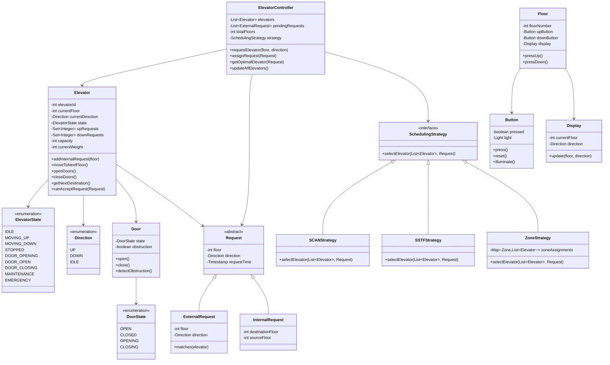

# Elevator System - Object-Oriented Design

**Difficulty:** Intermediate
**Interview Frequency:** Very High
**Key Concepts:** State Pattern, Strategy Pattern, Scheduling Algorithms, Request Optimization
**Companies:** Google, Microsoft, Amazon, Uber, LinkedIn, Oracle
**Estimated Interview Time:** 45-50 minutes

---

## Table of Contents
1. [Problem Statement](#problem-statement)
2. [Requirements](#requirements)
3. [Core Concepts](#core-concepts)
4. [Class Diagram](#class-diagram)
5. [Key Components](#key-components)
6. [Design Patterns](#design-patterns)
7. [Implementation Approach](#implementation-approach)
8. [Scheduling Algorithms](#scheduling-algorithms)
9. [Trade-offs & Considerations](#trade-offs--considerations)
10. [Interview Discussion Points](#interview-discussion-points)
11. [Common Pitfalls](#common-pitfalls)
12. [Follow-up Questions](#follow-up-questions)

---

## Problem Statement

Design an elevator control system for a multi-story building that supports:
- Multiple elevators operating independently
- External requests (hall buttons - up/down)
- Internal requests (car buttons - specific floors)
- Efficient elevator assignment and scheduling
- State management (idle, moving, door operations)
- Safety features (weight limits, emergency stops)
- Optimization for wait time and energy efficiency

**Interview Context:** This is one of the most common OOD questions. It tests your understanding of state machines, scheduling algorithms, optimization strategies, and system coordination. Interviewers want to see how you model real-world constraints and handle concurrent requests.

---

## Requirements

### Functional Requirements

1. **Elevator Operations**
   - Move up and down between floors
   - Stop at requested floors
   - Open and close doors
   - Handle floor buttons inside elevator
   - Display current floor and direction

2. **Request Handling**
   - **External requests:** Up/down buttons on each floor
   - **Internal requests:** Floor buttons inside elevator
   - Queue and prioritize requests
   - Serve requests efficiently

3. **Multiple Elevators**
   - Support N elevators in a building
   - Coordinate between elevators
   - Assign incoming requests to best elevator
   - Load balancing

4. **State Management**
   - Track elevator state (Idle, Moving Up, Moving Down, Door Opening, Door Closing)
   - Track current floor and direction
   - Maintain request queue per elevator

5. **Safety Features**
   - Weight limit enforcement
   - Emergency stop button
   - Door obstruction detection
   - Prevent movement with doors open

### Non-Functional Requirements

1. **Efficiency:** Minimize average wait time and travel time
2. **Fairness:** Avoid request starvation
3. **Energy:** Optimize for minimal movement
4. **Reliability:** Handle failures gracefully
5. **Scalability:** Support buildings with 50+ floors, 10+ elevators

---

## Core Concepts

### 1. Elevator States

```
┌──────────┐
│   IDLE   │ ← Initial state, no requests
└────┬─────┘
     │ Request arrives
     ↓
┌──────────┐
│ MOVING_UP│ ← Traveling upward
└────┬─────┘
     │ Reaches destination
     ↓
┌──────────┐
│  STOPPED │ ← At a floor
└────┬─────┘
     │ Open doors
     ↓
┌──────────┐
│DOOR_OPEN │ ← Passengers enter/exit
└────┬─────┘
     │ Close doors
     ↓
┌──────────┐
│MOVING_DOWN│ ← Traveling downward
└──────────┘
```

### 2. Request Types

| Type | Source | Example | Priority |
|------|--------|---------|----------|
| **External Up** | Hall button | Floor 5 → Up | Medium |
| **External Down** | Hall button | Floor 8 → Down | Medium |
| **Internal** | Car button | Go to Floor 10 | High |
| **Emergency** | Emergency button | Return to ground | Critical |

### 3. Direction vs. Destination

**Common Confusion:**
- **Direction:** Where elevator is heading (UP/DOWN/IDLE)
- **Destination:** Specific floor(s) to visit

**Example:**
```
Elevator at Floor 3, Direction: UP
Internal requests: [5, 7, 9]
External requests: Floor 6 UP, Floor 4 DOWN

Next stops: 5, 6, 7, 9 (serve UP direction first)
Then: 4 (reverse to serve DOWN request)
```

### 4. Scheduling Strategies

| Algorithm | Description | Pros | Cons |
|-----------|-------------|------|------|
| **FCFS** | First-Come-First-Served | Simple, fair | Inefficient |
| **SSTF** | Shortest Seek Time First | Efficient | Starvation risk |
| **SCAN** | Sweep up then down | Efficient, no starvation | Longer wait times |
| **LOOK** | Like SCAN but reverses at last request | Better than SCAN | More complex |
| **Zoning** | Assign elevators to floor zones | Good for tall buildings | Less flexible |

---

## Class Diagram



---

## Key Components

### 1. Elevator (Core Entity)

**Purpose:** Represents a single elevator car with its state and behavior.

**Key Responsibilities:**
- Track current floor and direction
- Maintain separate request queues for UP and DOWN
- Execute movement between floors
- Manage door operations
- Enforce weight and capacity limits

**State Transitions:**
```
IDLE → MOVING_UP/DOWN → STOPPED → DOOR_OPENING →
DOOR_OPEN → DOOR_CLOSING → MOVING_UP/DOWN or IDLE
```

### 2. ElevatorController (Coordinator)

**Purpose:** Manage all elevators and assign requests optimally.

**Key Responsibilities:**
- Receive external requests from floors
- Select best elevator for each request
- Coordinate multiple elevators to avoid conflicts
- Implement load balancing
- Handle edge cases (all elevators busy)

**Decision Logic:**
- Which elevator is closest?
- Which elevator is already moving in that direction?
- Which elevator has least requests queued?
- Load balancing considerations

### 3. Request Management

**Two Types of Requests:**

**External (Hall) Requests:**
- Floor + Direction (UP or DOWN)
- Don't specify destination floor
- Must be matched with elevator going that direction

**Internal (Car) Requests:**
- Specific destination floor
- Higher priority (person already in elevator)
- Added to elevator's request queue

### 4. Scheduling Strategy

**Purpose:** Algorithm for selecting which elevator serves which request.

**Strategy Pattern:** Allows switching algorithms without changing core logic.

**Common Strategies:**
1. **Nearest Car:** Closest idle elevator
2. **SCAN/LOOK:** Continue in same direction, serve all requests
3. **Zone-based:** Assign elevators to specific floor ranges

---

## Design Patterns

### 1. State Pattern (Elevator States)

**Problem:** Elevator behavior changes based on current state.

**Solution:** Encapsulate state-specific behavior in state classes.

**States:**
- **IDLE:** Waiting for requests
- **MOVING_UP/DOWN:** In motion between floors
- **STOPPED:** At a floor
- **DOOR_OPENING/OPEN/CLOSING:** Door operations

**Benefits:**
- Clear state transitions
- State-specific validation
- Easy to add new states

### 2. Strategy Pattern (Scheduling Algorithms)

**Problem:** Different buildings need different scheduling strategies.

**Solution:** Encapsulate scheduling algorithm as a strategy.

**Benefits:**
- Switch algorithms at runtime
- Test different strategies independently
- Easy to add new algorithms

### 3. Singleton Pattern (ElevatorController)

**Problem:** Only one controller should manage all elevators.

**Solution:** Implement controller as singleton.

**Benefits:**
- Centralized coordination
- Global access point

**Alternative:** Dependency injection (better for testing)

### 4. Command Pattern (Requests)

**Problem:** Need to queue, prioritize, and process requests uniformly.

**Solution:** Encapsulate each request as a command object.

**Benefits:**
- Uniform request handling
- Easy to add request metadata
- Support for request logging

### 5. Observer Pattern (Floor Displays)

**Problem:** Floor displays need to update when elevator positions change.

**Solution:** Displays observe elevators and update automatically.

**Benefits:**
- Decoupled display logic
- Multiple displays per elevator
- Easy to add new observers

---

## Implementation Approach

### Phase 1: Core Structure (10 minutes)

1. **Define enums:** ElevatorState, Direction
2. **Create Elevator class:** Current floor, direction, request queues
3. **Create Request classes:** External and Internal
4. **Basic movement:** moveUp(), moveDown(), stop()

### Phase 2: Request Handling (15 minutes)

1. **Add internal requests:** Floor buttons inside elevator
2. **Queue management:** Separate UP and DOWN queues
3. **Next destination logic:** Serve requests in current direction
4. **Direction reversal:** Change direction when queue empty

### Phase 3: Multiple Elevators (10 minutes)

1. **ElevatorController class:** Manage multiple elevators
2. **Request assignment:** Simple strategy (nearest idle)
3. **External requests:** Hall button presses

### Phase 4: Scheduling Algorithm (10 minutes)

1. **Implement SCAN/LOOK:** Continue in direction, serve all requests
2. **Optimize selection:** Consider distance, direction, load
3. **Handle edge cases:** No available elevators, same floor requests

### Phase 5: Advanced Features (If Time)

1. **Door operations:** Open, close, obstruction detection
2. **Weight limits:** Prevent overloading
3. **Emergency handling:** Priority requests
4. **Energy optimization:** Idle elevators to ground floor

---

## Scheduling Algorithms

### 1. FCFS (First-Come-First-Served)

**Algorithm:**
```
For each request in order received:
    Assign to first available elevator
    Elevator serves immediately
```

**Pros:** Simple, fair
**Cons:** Very inefficient, lots of back-and-forth
**Use Case:** Never use in practice

### 2. SSTF (Shortest Seek Time First)

**Algorithm:**
```
For each elevator:
    Find closest unserved request
    Move to that request
    Repeat
```

**Pros:** Minimizes travel time
**Cons:** Requests far away may starve
**Use Case:** Low traffic scenarios

### 3. SCAN (Elevator Algorithm)

**Algorithm:**
```
Move in one direction (e.g., UP)
Serve all requests in that direction
At top floor, reverse direction
Move DOWN and serve all requests
At bottom floor, reverse again
Repeat
```

**Example:**
```
Elevator at Floor 5, going UP
Requests: 3, 6, 8, 4, 7

Serve: 6, 7, 8 (UP)
Reverse at top
Serve: 4, 3 (DOWN)
```

**Pros:** No starvation, efficient
**Cons:** Long wait for requests in opposite direction
**Use Case:** Most common, good general-purpose

### 4. LOOK (Smart SCAN)

**Algorithm:**
```
Like SCAN, but reverse at last request, not at end
Don't go all the way to top/bottom if no requests
```

**Example:**
```
Elevator at Floor 5, going UP
Requests: 6, 8

Serve: 6, 8 (UP)
Reverse immediately (don't go to floor 20)
```

**Pros:** More efficient than SCAN
**Cons:** Slightly more complex
**Use Case:** Preferred over SCAN in modern systems

### 5. Zoning Strategy

**Algorithm:**
```
Assign elevators to zones:
- Elevator 1: Floors 1-10
- Elevator 2: Floors 11-20
- Elevator 3: Floors 21-30

Each elevator primarily serves its zone
```

**Pros:** Predictable, reduces conflicts
**Cons:** Inflexible, poor load balancing
**Use Case:** Very tall buildings (50+ floors)

### 6. Destination Dispatch (Advanced)

**Algorithm:**
```
At hall, user enters destination floor (not just UP/DOWN)
System assigns specific elevator
All passengers going to similar floors board same elevator
```

**Pros:** Most efficient, minimizes stops
**Cons:** Requires different UI, more complex
**Use Case:** Modern high-rise buildings

---

## Trade-offs & Considerations

### 1. Request Queue Structure

| Approach | Pros | Cons |
|----------|------|------|
| **Single queue (FIFO)** | Simple | Inefficient |
| **Two queues (UP/DOWN)** | Efficient | More complex |
| **Priority queue** | Flexible | Most complex |

**Recommendation:** Two queues (UP/DOWN) for interviews.

### 2. Elevator Selection Criteria

**Factors to Consider:**
- Distance to request floor
- Current direction (match request direction)
- Number of queued requests
- Capacity (avoid overloaded elevators)
- Energy efficiency (prefer moving elevators)

**Optimization Goals:**
- Minimize wait time (primary)
- Minimize travel time
- Maximize throughput
- Energy efficiency

### 3. Direction Handling

**Option A: Always Finish Current Direction**
- Pro: Simple, predictable
- Con: Longer wait for opposite direction

**Option B: Switch if No Requests Ahead**
- Pro: More responsive
- Con: More complex logic

**Recommendation:** Option A (finish current direction) for interviews.

### 4. Data Structures

| Component | Data Structure | Why |
|-----------|----------------|-----|
| **Request queues** | TreeSet/SortedSet | O(log n) insert, automatic sorting |
| **Elevator list** | ArrayList | Random access, fixed size |
| **Pending requests** | Queue | FIFO processing |

---

## Interview Discussion Points

### 1. Design Decisions

**Q: Why separate UP and DOWN request queues?**
- Efficient: serve all requests in one direction
- Prevents thrashing (back-and-forth)
- Matches real elevator behavior

**Q: How do you handle requests to the same floor from different directions?**
- Separate tracking: Floor 5 UP vs Floor 5 DOWN
- Serve based on elevator's current direction
- Don't serve Floor 5 DOWN if going UP

**Q: What if all elevators are busy?**
- Queue external request
- Assign to first elevator that becomes available
- Consider re-assigning based on new positions

### 2. Optimization

**Q: How would you minimize wait time?**
- Use LOOK algorithm (efficient direction-based)
- Assign requests to nearest appropriate elevator
- Consider current load and destination
- Destination dispatch for advance planning

**Q: How would you optimize for energy efficiency?**
- Return idle elevators to lobby/middle floors
- Consolidate passengers going to nearby floors
- Predictive positioning during rush hours
- Reduce unnecessary movements

### 3. Edge Cases

**Q: What if elevator is at capacity?**
- Don't serve external requests (skip floor)
- Display "Full" on floor displays
- Assign request to next available elevator
- Log overweight events (safety)

**Q: How do you handle emergency stops?**
- Priority request to return to nearest floor
- Open doors
- Disable normal operation
- Alert building management

**Q: What if person holds door open?**
- Detect obstruction with sensors
- Sound alarm after threshold (10 seconds)
- Don't move with door obstruction
- Eventually close with gentle force

### 4. Scalability

**Q: How would you scale to 100 floors?**
- Zone-based allocation
- Express elevators (skip floors)
- Local elevators (within zones)
- Double-deck elevators

**Q: How would you handle 20+ elevators?**
- Divide into groups (banks)
- Each group serves subset of floors
- Load balancing within groups
- Centralized coordinator

---

## Common Pitfalls

### 1. Not Separating UP and DOWN Requests

❌ **Wrong:** Single queue, serve any request
```
Queue: [3, 7, 5, 9, 2]
Elevator zigzags: 3 → 7 → 5 → 9 → 2 (inefficient!)
```

✅ **Right:** Separate queues, serve in direction
```
UP Queue: [3, 5, 7, 9]
DOWN Queue: [2]
Elevator: 3 → 5 → 7 → 9 → 2 (efficient!)
```

### 2. Forgetting to Check Elevator Direction

❌ **Wrong:** Assign any elevator to request
```
Elevator at Floor 5, going DOWN, Requests: [4, 3, 2]
Assign Floor 8 UP request → Wrong! Elevator going down.
```

✅ **Right:** Match direction or use idle elevator
```
Only assign Floor 8 UP to:
- Idle elevators
- Elevators going UP below Floor 8
```

### 3. Not Handling Request Conflicts

❌ **Wrong:** Treat Floor 5 UP and Floor 5 DOWN as same
```
Elevator at Floor 3, going UP
Serves Floor 5 UP request
Also serves Floor 5 DOWN → Wrong! They want opposite directions.
```

✅ **Right:** Track direction with floor
```
Floor 5 UP: Serve when moving UP
Floor 5 DOWN: Serve when moving DOWN (separate trip)
```

### 4. Ignoring Weight Limits

❌ **Wrong:** Accept all passengers
```
10 people in elevator (capacity: 8)
Continue to serve requests → Overload!
```

✅ **Right:** Enforce capacity
```
if currentWeight > maxWeight:
    sound_alarm()
    don't_close_doors()
    skip_external_requests()
```

### 5. Not Considering Wait Time Fairness

❌ **Wrong:** Always serve closest request
```
Elevator always stays near lobby
Top floor requests starve
```

✅ **Right:** Use SCAN/LOOK algorithm
```
Complete full sweep UP and DOWN
Ensures all requests eventually served
```

---

## Follow-up Questions

### Easy
1. **Q:** How would you add a display showing current floor?
   - **A:** Observer pattern - display observes elevator, updates on floor change

2. **Q:** How would you implement door open/close buttons?
   - **A:** Add door control methods, timer for auto-close, obstruction detection

3. **Q:** How would you prioritize an emergency request?
   - **A:** Clear all queues, add emergency floor to front, set emergency state

### Medium
4. **Q:** How would you implement express elevators (skip certain floors)?
   - **A:** Add skipFloors set to Elevator, check before stopping at floor

5. **Q:** How would you handle peak hours (morning rush to offices)?
   - **A:** Predictive positioning - send idle elevators to lobby in morning

6. **Q:** How would you implement a freight elevator with different rules?
   - **A:** Subclass FreightElevator, override scheduling logic, different capacity

7. **Q:** How would you log all elevator movements for analysis?
   - **A:** Observer pattern, logger observes state changes, writes to database

### Hard
8. **Q:** How would you implement destination dispatch system?
   - **A:** Request includes destination floor, group passengers by destination, optimize to minimize total stops

9. **Q:** How would you optimize for multiple banks of elevators?
   - **A:** Each bank serves floor subset, inter-bank coordinator for cross-zone requests

10. **Q:** How would you handle elevator maintenance scheduling?
    - **A:** Mark elevator as MAINTENANCE state, exclude from assignment, redirect active requests

11. **Q:** How would you implement AI-based predictive positioning?
    - **A:** Machine learning model trained on historical patterns, predict future requests, pre-position elevators

12. **Q:** How would you design a system for earthquake-prone buildings?
    - **A:** Seismic sensors, immediate stop at nearest floor, open doors, disable operation until cleared

---

## Key Takeaways

### ✅ What Interviewers Look For

1. **State Machine Understanding**
   - Clear elevator states
   - Valid state transitions
   - State-specific behavior

2. **Algorithm Knowledge**
   - Understanding of SCAN/LOOK
   - Trade-offs between strategies
   - Optimization considerations

3. **System Coordination**
   - Multiple elevator management
   - Request distribution
   - Load balancing

4. **Real-World Constraints**
   - Weight limits
   - Door operations
   - Emergency handling
   - Energy efficiency

### 📋 Interview Strategy

1. **Clarify Requirements (5 min)**
   - Single vs. multiple elevators?
   - Number of floors?
   - Need scheduling algorithm details?
   - Safety features required?

2. **Design Core Classes (10 min)**
   - Elevator, ElevatorController, Request
   - State and Direction enums
   - Class relationships

3. **Implement Basic Logic (15 min)**
   - Single elevator movement
   - Request queuing (UP/DOWN)
   - Next destination selection

4. **Add Multiple Elevators (10 min)**
   - Controller for assignment
   - Simple selection strategy
   - External requests

5. **Discuss Optimization (10 min)**
   - SCAN/LOOK algorithm
   - Edge cases
   - Scalability

### 🎯 Time Management

| Time | Focus | Priority |
|------|-------|----------|
| 0-5 min | Requirements clarification | Critical |
| 5-15 min | Class design, states | Critical |
| 15-30 min | Single elevator logic | Critical |
| 30-40 min | Multiple elevators, assignment | High |
| 40-50 min | Scheduling algorithm, optimization | Medium |

---

## Additional Resources

### Elevator Algorithms
- SCAN (Elevator) algorithm
- LOOK optimization
- Destination dispatch systems

### Related Problems
- **Disk Scheduling:** Similar to elevator (SCAN, C-SCAN algorithms)
- **Task Scheduling:** Priority queues, optimization
- **Traffic Light System:** State machines, coordination

### Real-World Systems
- Otis destination dispatch
- Schindler PORT technology
- ThyssenKrupp MULTI (ropeless elevators)

---

**Pro Tip for Interviews:** Master the SCAN/LOOK algorithm - it's the most commonly expected solution. Be ready to discuss why you separate UP and DOWN requests. Interviewers love when candidates think about real-world constraints like weight limits, emergency stops, and energy efficiency. Always mention that you're treating external requests (hall buttons) differently from internal requests (car buttons)!
