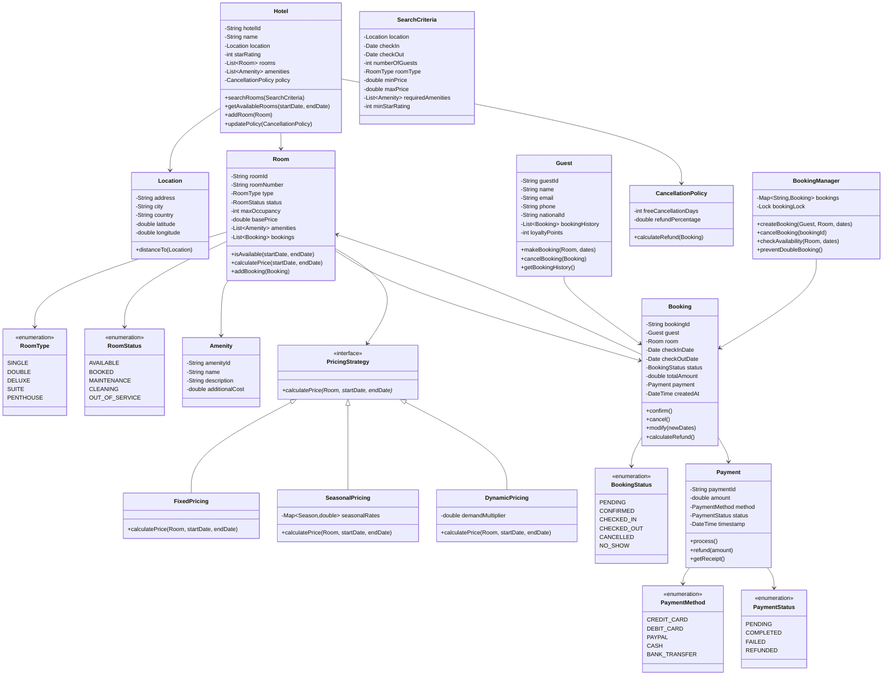

# Hotel Booking System - Object-Oriented Design

**Difficulty:** Intermediate
**Interview Frequency:** High
**Key Concepts:** Booking Management, Availability Checking, Pricing Strategy, Concurrency
**Companies:** Booking.com, Airbnb, Expedia, Hotels.com, Google Travel
**Estimated Interview Time:** 45-50 minutes

---

## Table of Contents
1. [Problem Statement](#problem-statement)
2. [Requirements](#requirements)
3. [Core Concepts](#core-concepts)
4. [Class Diagram](#class-diagram)
5. [Key Components](#key-components)
6. [Design Patterns](#design-patterns)
7. [Implementation Approach](#implementation-approach)
8. [Advanced Features](#advanced-features)
9. [Trade-offs & Considerations](#trade-offs--considerations)
10. [Interview Discussion Points](#interview-discussion-points)
11. [Common Pitfalls](#common-pitfalls)
12. [Follow-up Questions](#follow-up-questions)

---

## Problem Statement

Design a hotel booking system that supports:
- Multiple hotels with multiple rooms
- Room search by date range, type, price, and amenities
- Booking creation and cancellation
- Availability checking with date conflicts
- Dynamic pricing based on seasonality and demand
- Payment processing and refunds
- Guest management and booking history
- Concurrent booking handling (prevent double bookings)

**Interview Context:** This problem tests your understanding of availability checking, date range overlaps, concurrent transactions, pricing strategies, and scalability. It's commonly asked at travel tech companies and platforms dealing with reservations.

---

## Requirements

### Functional Requirements

1. **Hotel Management**
   - Create/update hotels with location, amenities, ratings
   - Manage multiple properties (hotel chains)
   - Set hotel policies (cancellation, check-in times)

2. **Room Management**
   - Multiple room types (Single, Double, Suite, Deluxe)
   - Room status (Available, Booked, Maintenance, Cleaning)
   - Room amenities (WiFi, AC, TV, Mini-bar)
   - Price per night for each room

3. **Search & Filtering**
   - Search by location, dates, number of guests
   - Filter by price range, star rating, amenities
   - Sort by price, rating, distance
   - Show availability in real-time

4. **Booking Management**
   - Create booking for date range
   - Check room availability (no double booking)
   - Calculate total price (with taxes, fees)
   - Generate booking confirmation
   - Modify booking (dates, room type)
   - Cancel booking with refund policy

5. **Guest Management**
   - Guest profiles with contact info
   - Booking history
   - Loyalty points/rewards
   - Saved preferences

6. **Payment Processing**
   - Reserve room with deposit
   - Full payment at check-in or online
   - Refund on cancellation (based on policy)
   - Handle payment failures

### Non-Functional Requirements

1. **Consistency:** Prevent double bookings (atomic operations)
2. **Availability:** 99.9% uptime for search and booking
3. **Performance:** Search results < 1 second, booking < 2 seconds
4. **Scalability:** Handle thousands of concurrent searches/bookings
5. **Data Integrity:** Accurate availability at all times

---

## Core Concepts

### 1. Date Range Overlap Detection

**Problem:** Determine if two date ranges overlap (booking conflict).

**Overlap Conditions:**
```
Booking 1: [start1, end1]
Booking 2: [start2, end2]

Overlap if: start1 < end2 AND start2 < end1

Visual Examples:
1. Overlap:
   Booking 1: |-----|
   Booking 2:    |-----|

2. No Overlap (before):
   Booking 1: |-----|
   Booking 2:          |-----|

3. No Overlap (after):
   Booking 1:          |-----|
   Booking 2: |-----|
```

### 2. Room Availability Algorithm

**Naive Approach (O(n)):**
```
For each existing booking:
    If date ranges overlap:
        Room is NOT available
Return available
```

**Optimized Approach (Interval Tree - O(log n)):**
- Store bookings in interval tree
- Query for overlapping intervals
- Much faster for hotels with many bookings

### 3. Pricing Strategies

| Strategy | Description | Example |
|----------|-------------|---------|
| **Fixed** | Same price always | $100/night year-round |
| **Seasonal** | Varies by season | $150 summer, $100 winter |
| **Dynamic** | Based on demand | $200 (90% booked), $120 (30% booked) |
| **Day-of-week** | Weekends more expensive | $150 Fri-Sat, $100 Sun-Thu |
| **Length-of-stay** | Discounts for longer stays | 10% off for 7+ nights |

### 4. Booking States

```
PENDING → CONFIRMED → CHECKED_IN → CHECKED_OUT
    ↓          ↓            ↓
CANCELLED  CANCELLED   (NO SHOW)
```

- **PENDING:** Created but payment not confirmed
- **CONFIRMED:** Payment received, booking guaranteed
- **CHECKED_IN:** Guest arrived and checked in
- **CHECKED_OUT:** Guest left, room ready for cleaning
- **CANCELLED:** Booking cancelled by guest or hotel
- **NO_SHOW:** Guest didn't arrive

---

## Class Diagram



---

## Key Components

### 1. Room Availability Checker

**Purpose:** Determine if a room is available for given dates.

**Algorithm:**
```
function isAvailable(room, startDate, endDate):
    if room.status != AVAILABLE:
        return false

    for booking in room.bookings:
        if booking.status in [CONFIRMED, CHECKED_IN]:
            if datesOverlap(startDate, endDate, booking.checkIn, booking.checkOut):
                return false

    return true

function datesOverlap(start1, end1, start2, end2):
    return start1 < end2 AND start2 < end1
```

**Optimization:** Use interval tree for O(log n) queries instead of O(n) linear search.

### 2. Booking Manager (Concurrency Control)

**Purpose:** Prevent double bookings when multiple users book simultaneously.

**Problem:**
```
User A: Check availability (room free)
User B: Check availability (room free)
User A: Create booking (success)
User B: Create booking (success)  ← Double booking!
```

**Solution 1: Pessimistic Locking**
```
Lock room
Check availability
Create booking
Unlock room
```

**Solution 2: Optimistic Locking (Version Numbers)**
```
Read room with version number
Check availability
Try to book with expected version
If version changed: retry
```

**Solution 3: Database Constraints**
```sql
UNIQUE constraint on (room_id, date_range)
Transaction with SERIALIZABLE isolation
```

### 3. Pricing Calculator

**Purpose:** Calculate total price based on various factors.

**Factors:**
- Base room price
- Number of nights
- Seasonal adjustments
- Demand-based pricing
- Taxes and fees
- Discounts (loyalty, promo codes)

**Strategy Pattern:** Different pricing algorithms interchangeable.

### 4. Search Engine

**Purpose:** Find hotels/rooms matching criteria.

**Filters:**
- Location (city, radius from coordinates)
- Dates (availability check)
- Price range
- Star rating
- Amenities
- Room type
- Guest count

**Optimization:**
- Index by location (geospatial index)
- Cache popular searches
- Pre-compute availability calendar

---

## Design Patterns

### 1. Strategy Pattern (Pricing)

**Problem:** Different pricing strategies based on hotel policy.

**Solution:** Encapsulate each pricing algorithm as a strategy.

**Benefits:**
- Easy to add new pricing models
- Switch pricing at runtime
- Test pricing strategies independently

### 2. Factory Pattern (Room Creation)

**Problem:** Creating different room types with specific configurations.

**Solution:** RoomFactory creates rooms based on type.

**Benefits:**
- Centralized room creation logic
- Consistent room initialization
- Easy to add new room types

### 3. Observer Pattern (Booking Notifications)

**Problem:** Notify multiple systems when booking is created/cancelled.

**Solution:** Observers subscribe to booking events.

**Observers:**
- Email service (send confirmation)
- SMS service (send notifications)
- Analytics service (track metrics)
- Inventory service (update availability)

### 4. Command Pattern (Booking Operations)

**Problem:** Need to execute, log, and potentially undo booking operations.

**Solution:** Encapsulate operations as command objects.

**Commands:**
- CreateBookingCommand
- CancelBookingCommand
- ModifyBookingCommand

### 5. Repository Pattern (Data Access)

**Problem:** Abstract database operations from business logic.

**Solution:** Repositories handle all data persistence.

**Repositories:**
- HotelRepository
- RoomRepository
- BookingRepository
- GuestRepository

---

## Implementation Approach

### Phase 1: Core Structure (10 minutes)

1. **Define enums:** RoomType, RoomStatus, BookingStatus
2. **Create basic classes:** Hotel, Room, Guest, Booking
3. **Implement availability check:** Date overlap detection

### Phase 2: Booking Flow (15 minutes)

1. **Search available rooms:** Filter by dates and type
2. **Create booking:** Validate availability, generate ID
3. **Cancel booking:** Update status, calculate refund

### Phase 3: Pricing (10 minutes)

1. **Calculate price:** Nights × room price
2. **Add taxes/fees:** 10-15% on top
3. **Apply discounts:** Promo codes, loyalty points

### Phase 4: Concurrency (10 minutes)

1. **Add locking mechanism:** Prevent double bookings
2. **Transaction management:** Atomic operations
3. **Handle race conditions:** Optimistic locking

### Phase 5: Advanced Features (If Time)

1. **Multiple hotels:** Search across properties
2. **Payment integration:** Process payments
3. **Cancellation policy:** Flexible refund rules
4. **Room amenities:** Filter by features

---

## Advanced Features

### 1. Dynamic Pricing

**Factors:**
- **Occupancy rate:** Higher price when 80%+ booked
- **Time to arrival:** Lower price far in advance
- **Competitor prices:** Match or beat nearby hotels
- **Historical data:** Peak seasons, events

**Algorithm:**
```
basePrice = room.basePrice
demandMultiplier = calculateDemand(occupancy)
seasonalMultiplier = getSeasonalRate(date)
finalPrice = basePrice × demandMultiplier × seasonalMultiplier
```

### 2. Overbooking Strategy

**Why Hotels Overbook:**
- 10-15% of bookings typically cancel
- Maximize revenue by booking > capacity
- Statistical prediction of show-up rate

**Risk Management:**
- Book guest at partner hotel if overbooked
- Offer compensation (upgrade, discount, voucher)
- Track no-show patterns per guest

### 3. Room Allocation Optimization

**Problem:** Assign specific rooms to bookings.

**Strategies:**
- **First Available:** Simple, fast
- **Best Fit:** Match guest preferences
- **Revenue Optimization:** Save premium rooms for longer stays

### 4. Multi-Property Search

**Challenges:**
- Query multiple databases
- Merge and sort results
- Handle different inventory systems

**Solution:**
- Aggregator service
- Parallel queries
- Result caching

---

## Trade-offs & Considerations

### 1. Availability Checking Strategy

| Approach | Pros | Cons | Best For |
|----------|------|------|----------|
| **Real-time DB query** | Always accurate | Slow for high traffic | Small hotels |
| **Cached availability** | Very fast | May have stale data | Large platforms |
| **Eventual consistency** | Scalable | Complex conflict resolution | Distributed systems |

**Recommendation:** Cache with TTL + invalidation on booking.

### 2. Locking Granularity

| Level | Pros | Cons |
|-------|------|------|
| **Hotel-level lock** | Simple | Low concurrency |
| **Room-level lock** | Better concurrency | More complex |
| **Date-range lock** | Optimal concurrency | Most complex |

**Recommendation:** Room-level locking for interviews.

### 3. Payment Timing

| Approach | Pros | Cons |
|----------|------|------|
| **Full payment upfront** | Guaranteed revenue | High abandonment rate |
| **Deposit + balance later** | Balanced | More complexity |
| **Payment at check-in** | Higher conversion | Revenue risk |

**Recommendation:** Deposit upfront, balance 24hrs before check-in.

### 4. Database Schema Design

**Option A: Booking Table with Date Range**
```
Bookings(id, room_id, guest_id, check_in, check_out, status)
```
- ✅ Simple schema
- ❌ Complex availability queries

**Option B: Daily Reservation Table**
```
RoomDays(room_id, date, booking_id, status)
```
- ✅ Simple availability queries
- ❌ More storage, more rows

**Recommendation:** Option A for interviews (simpler to explain).

---

## Interview Discussion Points

### 1. Concurrency & Race Conditions

**Q: How do you prevent double bookings?**
- Pessimistic locking (row-level locks)
- Optimistic locking (version numbers)
- Database constraints (unique indexes)
- Transaction isolation levels

**Q: What if two users try to book the last available room simultaneously?**
- One succeeds, one fails
- Use atomic compare-and-swap operations
- Return clear error message to losing user
- Suggest alternative rooms

### 2. Scalability

**Q: How would you scale to millions of hotels?**
- **Database sharding:** By geographic region
- **Caching:** Redis for availability, search results
- **Read replicas:** Distribute query load
- **CDN:** Cache static content (images, hotel info)

**Q: How would you handle peak booking times (Black Friday)?**
- Auto-scaling servers
- Queue system for bookings
- Rate limiting per user
- Graceful degradation (disable non-critical features)

### 3. Data Consistency

**Q: What if booking succeeds but payment fails?**
- Hold booking for 15 minutes
- Retry payment
- If still fails: auto-cancel and send notification
- Use distributed transactions (saga pattern)

**Q: How do you handle partial failures?**
- Idempotent operations (safe to retry)
- Compensation transactions (reverse booking)
- Event sourcing (replay events)

### 4. Search Optimization

**Q: How would you optimize hotel search by location?**
- Geospatial indexes (PostGIS, MongoDB)
- Elasticsearch for full-text and geo queries
- Cache popular city searches
- Pre-compute distances to landmarks

**Q: How would you implement autocomplete for city search?**
- Trie data structure
- Prefix matching with ranking
- Cache popular queries
- Elasticsearch with completion suggester

---

## Common Pitfalls

### 1. Incorrect Date Overlap Logic

❌ **Wrong:** Only checking exact date matches
```
if booking.checkIn == newCheckIn OR booking.checkOut == newCheckOut:
    conflict = True
```

✅ **Right:** Check any overlap
```
if newCheckIn < booking.checkOut AND newCheckOut > booking.checkIn:
    conflict = True
```

### 2. Ignoring Time Zones

❌ **Wrong:** Store dates without timezone
```
checkIn = "2024-01-15"  # What timezone?
```

✅ **Right:** Always use UTC with timezone info
```
checkIn = "2024-01-15T14:00:00Z"
checkOut = "2024-01-18T11:00:00Z"
```

### 3. Not Handling Edge Cases

❌ **Wrong:** Assume check-in and check-out are different days
```
nights = checkOut.day - checkIn.day  # Fails for same-day!
```

✅ **Right:** Handle same-day bookings, month boundaries
```
nights = (checkOut - checkIn).days
if nights < 1:
    raise ValueError("Check-out must be after check-in")
```

### 4. Forgetting Cancellation Deadlines

❌ **Wrong:** Allow full refund anytime
```
def cancel():
    refund_amount = total_amount
```

✅ **Right:** Apply cancellation policy
```
def cancel():
    days_until_checkin = (checkIn - today).days
    if days_until_checkin >= policy.freeCancellationDays:
        refund = total_amount
    else:
        refund = total_amount * policy.refundPercentage
```

### 5. Not Validating Guest Count

❌ **Wrong:** Allow any number of guests
```
booking = create(room, guests=10)  # Room capacity = 2!
```

✅ **Right:** Validate against room capacity
```
if numberOfGuests > room.maxOccupancy:
    raise ValueError(f"Room only accommodates {room.maxOccupancy} guests")
```

---

## Follow-up Questions

### Easy
1. **Q:** How would you add breakfast as an optional add-on?
   - **A:** RoomAddOns class, many-to-many relationship with Booking, add price to total

2. **Q:** How would you implement check-in/check-out times?
   - **A:** Add time component to dates, default 3PM check-in / 11AM check-out

3. **Q:** How would you handle early check-in requests?
   - **A:** Check if previous booking ended early, charge additional fee if available

### Medium
4. **Q:** How would you implement a waiting list for fully booked dates?
   - **A:** WaitList class, notify in order when cancellations occur, time-limited offers

5. **Q:** How would you support group bookings (multiple rooms)?
   - **A:** GroupBooking parent class, multiple child bookings, all-or-nothing atomicity

6. **Q:** How would you implement loyalty tiers (Gold, Platinum)?
   - **A:** LoyaltyTier enum, benefits (free upgrades, late checkout), points accumulation

7. **Q:** How would you handle currency conversion for international hotels?
   - **A:** Store prices in local currency, convert at search time using exchange rate API

### Hard
8. **Q:** How would you implement a recommendation system for hotels?
   - **A:** Collaborative filtering (users who booked X also booked Y), content-based (similar amenities/location), hybrid approach

9. **Q:** How would you handle booking modifications (change dates/room)?
   - **A:** Check availability for new dates, calculate price difference, apply change fees, create new booking + cancel old or modify in-place

10. **Q:** How would you design the system to handle last-minute flash sales?
    - **A:** Event-driven architecture, message queue for bookings, rate limiting, inventory reservation system

11. **Q:** How would you implement a bidding system (like Priceline)?
    - **A:** Bid class with expiration, match bids with available inventory, accept best bid within timeframe

12. **Q:** How would you detect and prevent fraudulent bookings?
    - **A:** Rate limiting, payment verification, IP/device fingerprinting, ML models for fraud detection, require ID verification

---

## Key Takeaways

### ✅ What Interviewers Look For

1. **Date Handling**
   - Correct overlap detection
   - Timezone awareness
   - Edge cases (same-day, month boundaries)

2. **Concurrency Control**
   - Understanding race conditions
   - Locking mechanisms
   - Transaction management

3. **Scalability Thinking**
   - Caching strategies
   - Database optimization
   - Search performance

4. **Business Logic**
   - Cancellation policies
   - Dynamic pricing
   - Payment flows

### 📋 Interview Strategy

1. **Clarify Requirements (5 min)**
   - Single hotel or multiple?
   - Payment processing needed?
   - Need to handle concurrency?
   - Search requirements?

2. **Design Core Classes (10 min)**
   - Hotel, Room, Guest, Booking
   - Focus on relationships
   - Draw class diagram

3. **Implement Availability Check (15 min)**
   - Date overlap logic
   - Search available rooms
   - Create booking

4. **Discuss Advanced Topics (20 min)**
   - Concurrency control
   - Pricing strategies
   - Scalability
   - Edge cases

### 🎯 Time Management

| Time | Focus | Priority |
|------|-------|----------|
| 0-5 min | Requirements clarification | Critical |
| 5-15 min | Class design, relationships | Critical |
| 15-30 min | Availability + booking logic | Critical |
| 30-40 min | Concurrency, pricing | High |
| 40-50 min | Scalability, edge cases | Medium |

---

**Pro Tip for Interviews:** Master the date overlap logic - it's the heart of any booking system. Be prepared to discuss how you'd prevent double bookings in a concurrent environment. Interviewers love candidates who think about edge cases like timezone handling, same-day bookings, and cancellation policies!
