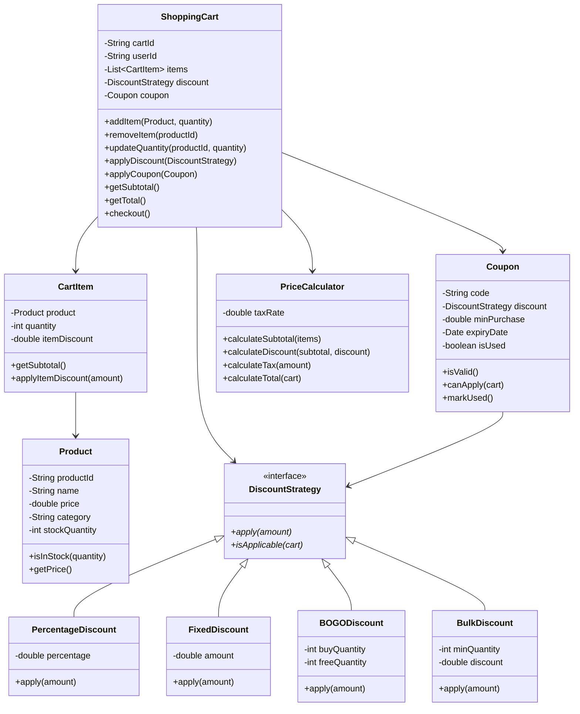

# Shopping Cart System - Object-Oriented Design

**Difficulty:** Intermediate
**Interview Frequency:** Very High
**Key Concepts:** Cart Management, Pricing, Discounts, Strategy Pattern
**Companies:** Amazon, E-commerce platforms, Stripe, Shopify
**Estimated Interview Time:** 35-40 minutes

---

## Problem Statement

Design a shopping cart system supporting:
- Add/remove/update items
- Multiple discount strategies (percentage, fixed, buy-one-get-one)
- Tax calculation
- Coupon codes
- Inventory checking
- Price calculation with promotions

**Interview Context:** Tests understanding of pricing logic, discount strategies, and the Strategy pattern. Common warm-up for e-commerce companies.

---

## Requirements

### Functional
1. **Cart Operations:** Add, remove, update quantity
2. **Pricing:** Calculate subtotal, discounts, tax, total
3. **Discounts:** Percentage, fixed amount, BOGO, bulk
4. **Coupons:** Apply promo codes with restrictions
5. **Inventory:** Check stock before adding
6. **Persistence:** Save/load cart

### Non-Functional
1. **Performance:** Recalculate prices in < 100ms
2. **Extensibility:** Easy to add new discount types
3. **Validation:** Prevent negative quantities, invalid products

---

## Core Concepts

### 1. Discount Types

| Type | Example | Application |
|------|---------|-------------|
| **Percentage** | 20% off | % × subtotal |
| **Fixed Amount** | $10 off | Flat deduction |
| **BOGO** | Buy 2 get 1 free | Buy X get Y |
| **Bulk** | 3+ items = 15% off | Quantity-based |
| **Category** | 25% off electronics | Applies to specific items |

### 2. Price Calculation Order

```
1. Calculate subtotal (sum of item prices × quantities)
2. Apply item-level discounts
3. Apply cart-level discounts (coupons)
4. Calculate tax on discounted amount
5. Add shipping (if applicable)
6. Final total
```

### 3. Coupon Restrictions

- **Minimum purchase:** $50 minimum for coupon
- **Expiration:** Valid until date
- **Single use:** One per customer
- **Category-specific:** Only on certain products
- **Maximum discount:** Cap at $100

---

## Class Diagram



---

## Design Patterns

### 1. Strategy Pattern (Discounts)
- Multiple discount algorithms interchangeable
- Easy to add new types without modifying cart

### 2. Decorator Pattern (Add-ons)
- Wrap cart with gift wrap, insurance, express shipping
- Stack multiple decorators

### 3. Observer Pattern (Updates)
- Notify UI when cart changes
- Update inventory when items added

### 4. Factory Pattern (Discount Creation)
- Create discounts from configuration
- `DiscountFactory.create("SAVE20", "percentage", 20)`

---

## Implementation Approach

### Phase 1: Basic Cart (10 min)
1. Product, CartItem, ShoppingCart classes
2. Add/remove/update operations
3. Simple price calculation

### Phase 2: Discounts (10 min)
1. DiscountStrategy interface
2. Percentage and Fixed implementations
3. Apply to cart

### Phase 3: Advanced Pricing (10 min)
1. Tax calculation
2. Coupon validation
3. Order of operations

### Phase 4: Enhancements (10 min)
1. BOGO and bulk discounts
2. Category-specific discounts
3. Minimum purchase validation

---

## Common Pitfalls

### 1. Wrong Calculation Order
❌ Tax before discount
✅ Tax after discount

### 2. Not Handling Item Updates
❌ Add same item twice = two entries
✅ Update quantity of existing item

### 3. Forgetting Validation
❌ Allow negative quantities
✅ Validate quantity > 0, stock available

### 4. Hardcoded Tax/Shipping
❌ `total = subtotal * 1.08`
✅ `total = subtotal * (1 + taxRate)`

### 5. Mutating Original Prices
❌ `product.price -= discount`
✅ Keep original price, apply discount separately

---

## Follow-up Questions

### Easy
1. **Q:** How would you add gift wrapping?
   - **A:** Decorator pattern, wrap cart with GiftWrapDecorator, adds fee

2. **Q:** How would you save cart for later?
   - **A:** Serialize cart to database/localStorage with userId

3. **Q:** How would you show estimated delivery date?
   - **A:** ShippingEstimator service based on location, items

### Medium
4. **Q:** How would you implement flash sales (time-limited)?
   - **A:** TimedDiscount with start/end dates, scheduler to activate/deactivate

5. **Q:** How would you handle international currencies?
   - **A:** Money class with currency, converter service, display in user's locale

6. **Q:** How would you implement abandoned cart recovery?
   - **A:** Save cart, scheduled job to email after 24hrs, discount coupon to incentivize

7. **Q:** How would you add product recommendations in cart?
   - **A:** RecommendationEngine, "frequently bought together", collaborative filtering

### Hard
8. **Q:** How would you handle concurrent cart modifications?
   - **A:** Optimistic locking with version numbers, last-write-wins or merge strategies

9. **Q:** How would you implement dynamic pricing (personalized)?
   - **A:** PricingEngine with user segments, A/B testing, ML-based price optimization

10. **Q:** How would you support subscription products?
    - **A:** SubscriptionItem subclass, recurring billing, manage billing cycles

11. **Q:** How would you implement complex promotions (spend $50 on electronics, get 20% off clothing)?
    - **A:** RuleEngine with conditions, actions, chain of responsibility pattern

---

## Key Takeaways

### ✅ What Interviewers Look For
1. Strategy pattern for discounts
2. Proper price calculation order
3. Input validation
4. Extensibility for new discount types

### 📋 Interview Strategy
1. **Clarify (5 min):** Which discount types? Tax? Shipping?
2. **Design (10 min):** Core classes, Strategy pattern
3. **Implement (20 min):** Cart operations, pricing
4. **Discuss (5 min):** Edge cases, extensions

---

**Pro Tip:** Master the Strategy pattern - it's the key to this problem. Discuss the order of price calculations (discount before tax). Mention real-world concerns like inventory checking and coupon validation.
