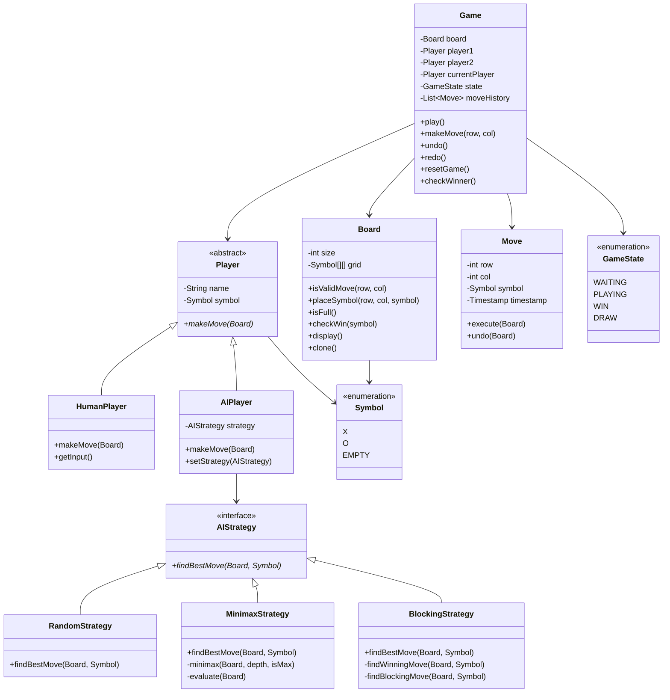

# Tic-Tac-Toe Game - Object-Oriented Design

**Difficulty:** Beginner-Intermediate
**Interview Frequency:** Very High
**Key Concepts:** Game State, Win Detection, Strategy Pattern, Minimax Algorithm
**Companies:** Common warm-up question at Google, Microsoft, Amazon, Meta
**Estimated Interview Time:** 30-40 minutes

---

## Problem Statement

Design a Tic-Tac-Toe game supporting:
- 2-player mode (human vs human)
- AI player with difficulty levels
- Win/draw detection
- Move validation
- Undo/redo functionality
- Different board sizes (3x3, 4x4, 5x5)
- Game state management

**Interview Context:** Classic warm-up problem testing basic OOD principles, game state management, and algorithm knowledge (minimax for AI). Often used to assess coding fundamentals before harder questions.

---

## Requirements

### Functional
1. **Board:** NxN grid (default 3x3)
2. **Players:** Two players (X and O)
3. **Moves:** Place symbol on empty cell
4. **Win Detection:** Check rows, columns, diagonals
5. **Draw Detection:** Board full with no winner
6. **AI Player:** Computer opponent with strategy
7. **Undo/Redo:** Reverse and replay moves

### Non-Functional
1. **Validation:** Prevent invalid moves
2. **Extensibility:** Easy to add board sizes, AI strategies
3. **Performance:** AI move in < 1 second

---

## Core Concepts

### 1. Win Conditions

For 3x3 board, win requires 3 in a row:
- **Rows:** [0,1,2], [3,4,5], [6,7,8]
- **Columns:** [0,3,6], [1,4,7], [2,5,8]
- **Diagonals:** [0,4,8], [2,4,6]

For NxN board:
- N symbols in any row, column, or diagonal

### 2. Game States

```
WAITING → PLAYING → GAME_OVER
          ↓
        (CHECK AFTER EACH MOVE)
          ↓
    WIN or DRAW → GAME_OVER
```

### 3. AI Strategies

| Strategy | Description | Difficulty | Algorithm |
|----------|-------------|------------|-----------|
| **Random** | Random valid move | Easy | O(1) |
| **Blocking** | Block opponent wins | Medium | O(n²) scan |
| **Minimax** | Optimal play | Hard | O(b^d) game tree |
| **Alpha-Beta** | Optimized minimax | Expert | O(b^(d/2)) pruning |

---

## Class Diagram



---

## Key Components

### 1. Win Detection Algorithm

**Approach 1: Brute Force (Simple)**
```
For each row: check if all cells same
For each column: check if all cells same
For both diagonals: check if all cells same
```
Time: O(n²), Space: O(1)

**Approach 2: Optimized (Track Counts)**
```
Maintain counters for each row, column, diagonal
Update counter on each move
Win if any counter reaches n
```
Time: O(1) per move, Space: O(n)

**Approach 3: Last Move Check**
```
Only check row, column, diagonals containing last move
```
Time: O(n) per move, Space: O(1)

**Recommendation:** Approach 3 for interviews (efficient, clear)

### 2. Minimax Algorithm (AI)

**Concept:** Maximize own score, minimize opponent's

**Pseudocode:**
```
function minimax(board, depth, isMaximizing):
    if board has winner:
        return score

    if isMaximizing:
        bestScore = -infinity
        for each empty cell:
            place symbol
            score = minimax(board, depth+1, false)
            undo move
            bestScore = max(bestScore, score)
        return bestScore
    else:
        bestScore = +infinity
        for each empty cell:
            place opponent symbol
            score = minimax(board, depth+1, true)
            undo move
            bestScore = min(bestScore, score)
        return bestScore
```

**Scoring:**
- Win: +10
- Loss: -10
- Draw: 0

**Optimization:** Alpha-beta pruning cuts search space by 50%

---

## Design Patterns

### 1. Strategy Pattern (AI)
Different AI difficulty levels as strategies
Easy to switch between random, blocking, minimax

### 2. Command Pattern (Moves)
Encapsulate moves as commands
Enables undo/redo functionality

### 3. State Pattern (Game State)
Different behavior based on game state
Transitions: waiting → playing → game over

### 4. Template Method (Player)
Abstract Player class with makeMove() template
HumanPlayer and AIPlayer implement specifics

### 5. Memento Pattern (Save State)
Save/restore game state for undo
Store board snapshots

---

## Implementation Approach

### Phase 1: Basic Game (10 min)
1. Board with 3x3 grid
2. Symbol enum (X, O, EMPTY)
3. Place moves, validate positions
4. Display board

### Phase 2: Win Detection (10 min)
1. Check rows, columns, diagonals
2. Detect draw (board full)
3. Game state transitions

### Phase 3: Two Players (5 min)
1. Player abstraction
2. Turn management
3. Human player input

### Phase 4: AI Player (10 min)
1. Random move strategy
2. Minimax algorithm (if time)
3. Difficulty levels

### Phase 5: Enhancements (5 min)
1. Undo/redo moves
2. Different board sizes
3. Move history

---

## Trade-offs & Considerations

### 1. Board Representation

| Approach | Pros | Cons |
|----------|------|------|
| **2D Array** | Intuitive, direct access | Fixed size |
| **1D Array** | Compact, easy math | Less intuitive |
| **HashMap** | Flexible | Slower access |

**Recommendation:** 2D array for clarity

### 2. Win Check Frequency

| Approach | When | Performance |
|----------|------|-------------|
| **After each move** | Immediate | O(n) per move |
| **On request** | Lazy | O(n) when checked |
| **Track incrementally** | Real-time | O(1) per move |

**Recommendation:** Check after each move (simple, responsive)

### 3. AI Complexity

| Level | Algorithm | Time | Quality |
|-------|-----------|------|---------|
| **Easy** | Random | O(1) | Poor |
| **Medium** | Blocking | O(n²) | Decent |
| **Hard** | Minimax | O(9!) | Perfect |
| **Expert** | Alpha-beta | O(9!/2) | Perfect, faster |

**Recommendation:** Minimax with depth limit for interviews

---

## Common Pitfalls

### 1. Not Checking Win After Each Move
❌ Only check at end
✅ Check after every move

### 2. Wrong Win Detection
❌ Only check rows/columns
✅ Check rows, columns, AND diagonals

### 3. Not Validating Moves
❌ Allow overwriting cells
✅ Check cell is empty

### 4. Infinite AI Thinking
❌ Minimax on large boards = slow
✅ Limit depth or use alpha-beta

### 5. Forgetting Draw Condition
❌ Game continues when board full
✅ Check if board full with no winner = draw

---

## Follow-up Questions

### Easy
1. **Q:** How would you support larger boards (4x4, 5x5)?
   - **A:** Parameterize board size, adjust win condition to N in a row

2. **Q:** How would you display the board in UI?
   - **A:** Observer pattern, UI observes board changes, updates display

3. **Q:** How would you track game statistics?
   - **A:** GameStats class, track wins/losses/draws per player

### Medium
4. **Q:** How would you implement undo/redo?
   - **A:** Command pattern, maintain history stack, undo pops and reverses

5. **Q:** How would you add time limits per move?
   - **A:** Timer class, async timeout, forfeit if time expires

6. **Q:** How would you support 3+ players?
   - **A:** List of players, cycle through, check win for each

7. **Q:** How would you add different win conditions (4 corners, etc.)?
   - **A:** WinCondition interface, strategy pattern for different rules

### Hard
8. **Q:** How would you optimize minimax for large boards?
   - **A:** Alpha-beta pruning, iterative deepening, transposition table, depth limit

9. **Q:** How would you implement online multiplayer?
   - **A:** Serialize moves, WebSocket for real-time, server validates, broadcast updates

10. **Q:** How would you create an unbeatable AI?
    - **A:** Full minimax for 3x3 (always optimal), opening book for efficiency

11. **Q:** How would you handle connect-4 or other variants?
    - **A:** Abstract Board interface, ConnectFourBoard implementation, gravity for pieces

12. **Q:** How would you implement Monte Carlo Tree Search?
    - **A:** Build game tree, simulate random playouts, select best move by win rate

---

## Key Takeaways

### ✅ What Interviewers Look For
1. Clean OOD (separation of concerns)
2. Correct win detection (rows, cols, diagonals)
3. Move validation
4. Understanding of minimax (for AI)
5. Extensibility (easy to add features)

### 📋 Interview Strategy
1. **Clarify (3 min):** Board size? AI? Undo?
2. **Design (7 min):** Board, Player, Game classes
3. **Implement (15 min):** Basic gameplay, win detection
4. **AI (10 min):** Minimax if time, else random
5. **Discuss (5 min):** Extensions, optimizations

### 🎯 Time Management

| Time | Focus | Priority |
|------|-------|----------|
| 0-3 min | Requirements | Critical |
| 3-10 min | Class design | Critical |
| 10-25 min | Gameplay + win detection | Critical |
| 25-35 min | AI strategy | High |
| 35-40 min | Extensions, edge cases | Medium |

---

## Additional Resources

### Algorithms
- Minimax algorithm
- Alpha-beta pruning
- Monte Carlo Tree Search

### Related Problems
- **Connect Four:** Similar game tree search
- **Chess:** More complex, same concepts
- **Gomoku:** Larger board, same win detection
- **Othello/Reversi:** Different rules, similar structure

---

**Pro Tip:** This is often a warm-up question before harder problems. Implement it quickly and correctly to make a good first impression. Focus on clean code and proper win detection. If you have time, implement minimax to show algorithm knowledge. Always validate moves and check for win/draw after each turn!
