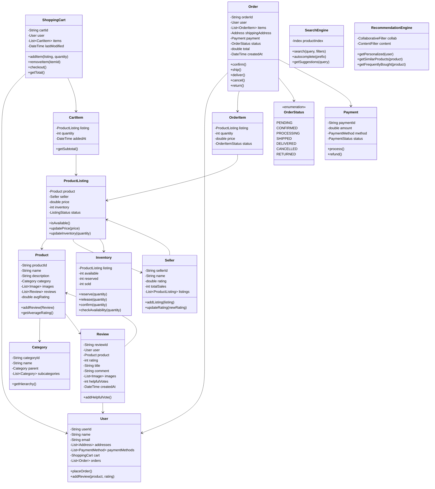

# Amazon E-Commerce Platform - Object-Oriented Design

**Difficulty:** Advanced
**Interview Frequency:** Very High
**Key Concepts:** E-commerce, Inventory, Search, Recommendations, Reviews
**Companies:** Amazon, eBay, Shopify, Walmart, Target
**Estimated Interview Time:** 50-60 minutes

---

## Problem Statement

Design a comprehensive e-commerce platform supporting:
- Product catalog and search
- Shopping cart and checkout
- Order management
- Inventory tracking
- Reviews and ratings
- Recommendations
- Seller management
- Payment processing

**Interview Context:** Tests understanding of complex business workflows, inventory management, search optimization, and recommendation systems.

---

## Requirements

### Functional
1. **Catalog:** Browse products, categories, search
2. **Cart:** Add/remove items, save for later
3. **Checkout:** Multiple addresses, payment methods
4. **Orders:** Track status, returns, refunds
5. **Inventory:** Real-time stock, reservations
6. **Reviews:** Rate products, helpful votes
7. **Recommendations:** Personalized suggestions
8. **Sellers:** Multiple sellers per product

### Non-Functional
1. **Search:** Results < 500ms
2. **Inventory:** Prevent overselling
3. **Scalability:** Millions of products, users
4. **Availability:** 99.99% uptime

---

## Core Concepts

### 1. Order States

```
CART → PENDING → CONFIRMED → PROCESSING → SHIPPED → DELIVERED
  ↓        ↓          ↓            ↓           ↓
ABANDONED CANCELLED CANCELLED  CANCELLED  RETURNED
```

### 2. Inventory Management

**Challenges:**
- Multiple users buying last item
- Cart reservation timeouts
- Distributed inventory (warehouses)

**Solution:**
```
1. Check availability
2. Reserve inventory (15 min timeout)
3. Process payment
4. Confirm order
5. Deduct from inventory
6. Release if payment fails/timeout
```

### 3. Search Ranking

**Factors:**
- Relevance (text match)
- Popularity (sales, views)
- Rating (avg customer rating)
- Price (sort option)
- Availability (in stock)
- Seller rating

**Algorithm:**
```
score = relevance_weight × text_match
      + popularity_weight × sales_count
      + rating_weight × avg_rating
      - out_of_stock_penalty
```

---

## Class Diagram



---

## Design Patterns

### 1. Strategy Pattern (Pricing)
- Regular, sale, bundle, dynamic pricing
- Different pricing strategies per product type

### 2. Observer Pattern (Inventory)
- Notify when back in stock
- Alert on low inventory
- Update search index

### 3. Factory Pattern (Orders)
- Create different order types (regular, subscription, pre-order)
- Payment processing

### 4. Facade Pattern (Checkout)
- Simplify complex checkout process
- Coordinate inventory, payment, shipping

### 5. Decorator Pattern (Product Features)
- Add features: gift wrap, expedited shipping, insurance
- Stack multiple options

---

## Key Components

### 1. Search Implementation

**Elasticsearch Schema:**
```
{
  "product_id": "123",
  "name": "Wireless Mouse",
  "description": "...",
  "category": ["Electronics", "Computer Accessories"],
  "price": 29.99,
  "rating": 4.5,
  "sales_count": 1500,
  "in_stock": true,
  "seller_rating": 4.8
}
```

**Query:**
```
GET /products/_search
{
  "query": {
    "multi_match": {
      "query": "wireless mouse",
      "fields": ["name^3", "description"]
    }
  },
  "filter": {
    "range": { "price": { "lte": 50 } }
  },
  "sort": [
    { "_score": "desc" },
    { "rating": "desc" }
  ]
}
```

### 2. Recommendation Algorithms

**Collaborative Filtering:**
```
Users who bought X also bought Y
- Track user-product interactions
- Find similar users
- Recommend what similar users bought
```

**Content-Based:**
```
Products similar to X
- Extract product features (category, attributes)
- Calculate similarity (cosine, Jaccard)
- Recommend similar items
```

**Hybrid:**
```
Combine both approaches
Weight by confidence, recency
```

### 3. Inventory Reservation

**Problem:** Prevent overselling

**Solution:**
```
BEGIN TRANSACTION
  available = inventory.available
  IF available >= quantity:
    inventory.available -= quantity
    inventory.reserved += quantity
    reservation = createReservation(15 min timeout)
  COMMIT
ELSE:
  ROLLBACK
  return "Out of stock"
```

**Timeout Handler:**
```
After 15 minutes:
  IF order not confirmed:
    inventory.reserved -= quantity
    inventory.available += quantity
    delete reservation
```

---

## Implementation Approach

### Phase 1: Core Catalog (10 min)
1. Product, Category classes
2. ProductListing with sellers
3. Basic search

### Phase 2: Shopping Flow (15 min)
1. ShoppingCart with items
2. Add/remove/update
3. Price calculation

### Phase 3: Orders (15 min)
1. Order creation
2. Order states
3. Inventory reservation

### Phase 4: Advanced (20 min)
1. Reviews and ratings
2. Search implementation
3. Recommendations
4. Payment processing

---

## Common Pitfalls

### 1. Not Handling Concurrent Purchases
❌ Check inventory, then buy (race condition)
✅ Atomic reserve-and-buy with transactions

### 2. Ignoring Inventory Reservations
❌ Deduct immediately when added to cart
✅ Reserve temporarily, confirm on payment

### 3. Poor Search Performance
❌ SQL LIKE queries on millions of products
✅ Elasticsearch with proper indexing

### 4. Not Handling Returns
❌ Only forward order flow
✅ Support returns, refunds, inventory restoration

### 5. Hardcoded Business Logic
❌ Tax, shipping in code
✅ Configurable rules engine

---

## Follow-up Questions

### Easy
1. **Q:** How would you add wishlist?
   - **A:** Wishlist class similar to cart, no checkout, add to cart option

2. **Q:** How would you implement "Compare Products"?
   - **A:** ComparisonList, display attributes side-by-side

3. **Q:** How would you add product bundles?
   - **A:** Bundle class with multiple products, discounted price

### Medium
4. **Q:** How would you handle flash sales?
   - **A:** TimedDiscount, inventory cap, queue system for high demand

5. **Q:** How would you implement "Subscribe & Save"?
   - **A:** Subscription class, recurring orders, discount, manage billing cycles

6. **Q:** How would you add product variations (sizes, colors)?
   - **A:** Variant class, shared Product, separate inventory per variant

7. **Q:** How would you implement price tracking/alerts?
   - **A:** PriceAlert class, cron job checks prices, notify if drops

### Hard
8. **Q:** How would you scale search to billions of products?
   - **A:** Elasticsearch cluster, sharding by category, caching, CDN

9. **Q:** How would you prevent review manipulation?
   - **A:** Verify purchase, ML fraud detection, review moderation, helpful votes

10. **Q:** How would you implement real-time inventory across warehouses?
    - **A:** Distributed inventory service, event sourcing, eventual consistency

11. **Q:** How would you design a recommendation system?
    - **A:** Collaborative filtering + content-based, ML models, A/B testing

12. **Q:** How would you handle international expansion?
    - **A:** Multi-currency, localization, region-specific catalogs, local warehouses

---

## System Design Considerations

### Scalability
- **Database:** Sharding by product_id, read replicas
- **Cache:** Redis for hot products, sessions
- **CDN:** Product images, static content
- **Search:** Elasticsearch cluster

### Consistency
- **Inventory:** Strong consistency required
- **Recommendations:** Eventual consistency acceptable
- **Search index:** Near real-time updates

### Availability
- **Circuit breakers:** For external services
- **Graceful degradation:** Show cached data if search down
- **Multi-region:** For disaster recovery

---

## Key Takeaways

### ✅ What Interviewers Look For
1. Inventory management (prevent overselling)
2. Search optimization (Elasticsearch)
3. Order workflow (state machine)
4. Scalability (sharding, caching)
5. Recommendations (algorithms)

### 📋 Interview Strategy
1. **Clarify (5 min):** Core features? Scale? Search?
2. **Design (15 min):** Product catalog, cart, orders
3. **Implement (25 min):** Shopping flow, inventory
4. **Advanced (15 min):** Search, recommendations, scale

---

**Pro Tip:** Focus on inventory management—it's the trickiest part. Discuss how to prevent overselling with reservations and timeouts. Mention Elasticsearch for search (not SQL LIKE). For recommendations, at least mention collaborative filtering. This problem often leads to system design discussions about scaling and distributed systems.
