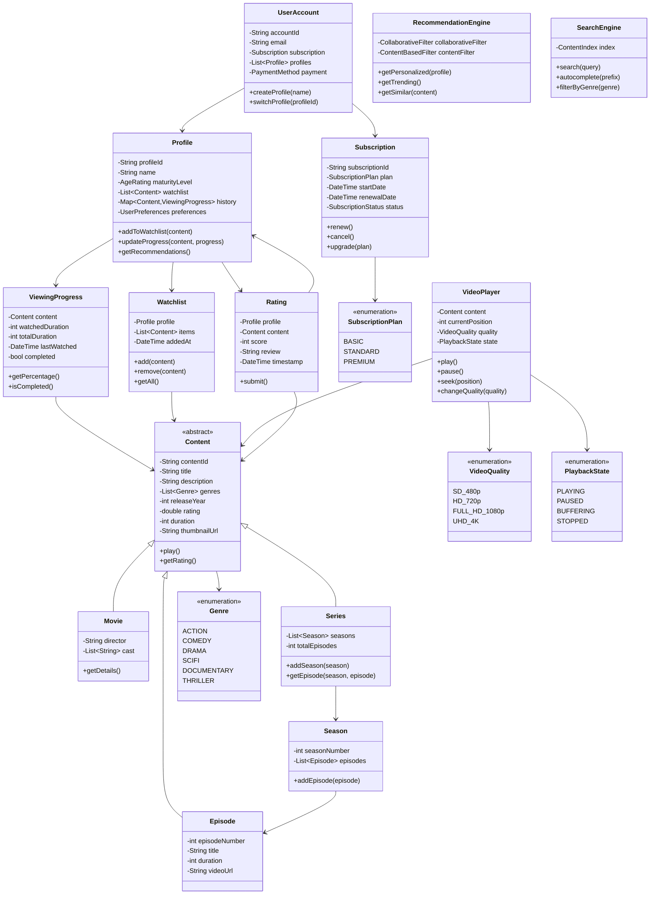

# Netflix Streaming Platform - Object-Oriented Design

**Difficulty:** Advanced
**Interview Frequency:** High
**Key Concepts:** Content Management, Streaming, Recommendations, User Profiles
**Companies:** Netflix, Hulu, Disney+, Amazon Prime, YouTube
**Estimated Interview Time:** 45-55 minutes

---

## Problem Statement

Design a video streaming platform supporting:
- Content library (movies, series, documentaries)
- User profiles with personalized experience
- Watchlists and viewing history
- Content recommendations
- Video playback with quality adaptation
- Subscription management
- Content ratings and reviews
- Continue watching functionality

**Interview Context:** Tests understanding of content delivery, personalization, recommendation systems, and managing large media libraries.

---

## Requirements

### Functional
1. **Content:** Movies, series (seasons/episodes), documentaries
2. **Profiles:** Multiple profiles per account, preferences
3. **Playback:** Stream video, resume, quality selection
4. **Discovery:** Search, browse by genre, recommendations
5. **Watchlist:** Save content to watch later
6. **History:** Track viewing progress, completion
7. **Ratings:** User ratings, reviews
8. **Subscriptions:** Plans, billing

### Non-Functional
1. **Streaming:** Low latency, adaptive bitrate
2. **Scalability:** Millions of concurrent streams
3. **Personalization:** Relevant recommendations
4. **Availability:** 99.95% uptime

---

## Core Concepts

### 1. Content Hierarchy

```
Content (abstract)
├── Movie (single video)
├── Series
│   ├── Season 1
│   │   ├── Episode 1
│   │   ├── Episode 2
│   │   └── ...
│   └── Season 2
│       └── ...
└── Documentary
```

### 2. Viewing States

```
NOT_STARTED → WATCHING → PAUSED → COMPLETED
     ↓           ↓          ↓
  ADDED TO   CONTINUE   RESUME
  WATCHLIST  WATCHING   LATER
```

### 3. Recommendation Types

| Type | Description | Algorithm |
|------|-------------|-----------|
| **Personalized** | Based on watch history | Collaborative filtering |
| **Trending** | Popular now | View count, recency |
| **Because You Watched** | Similar content | Content-based |
| **Top 10** | Most viewed | Aggregated views |
| **New Releases** | Recently added | Sort by date |

---

## Class Diagram



---

## Design Patterns

### 1. Composite Pattern (Content Hierarchy)
- Series contains Seasons contains Episodes
- Treat individual and composite uniformly

### 2. Strategy Pattern (Recommendations)
- Different recommendation algorithms
- Collaborative, content-based, hybrid
- A/B testing different strategies

### 3. Observer Pattern (Viewing Events)
- Track playback events
- Update watch history
- Trigger recommendations refresh

### 4. Proxy Pattern (Video Streaming)
- CDN proxy for video delivery
- Caching, buffering
- Adaptive bitrate streaming

### 5. State Pattern (Playback)
- Playing, Paused, Buffering states
- State-specific behavior

---

## Key Components

### 1. Recommendation System

**Collaborative Filtering:**
```
User A watched: [Movie1, Movie2, Movie3]
User B watched: [Movie1, Movie2, Movie4]
Recommendation for A: Movie4 (watched by similar user B)
```

**Content-Based:**
```
User watched: Action movie with Tom Hanks
Recommend: Other action movies or Tom Hanks movies
Features: Genre, actors, director, keywords
```

**Matrix Factorization:**
```
User-Content matrix → Latent factors
Predict rating for unseen content
Recommend top-rated predictions
```

### 2. Adaptive Bitrate Streaming

**Algorithm:**
```
Measure available bandwidth
If bandwidth > 5 Mbps: Stream 1080p
If bandwidth 2-5 Mbps: Stream 720p
If bandwidth < 2 Mbps: Stream 480p

Continuously monitor and adapt
```

**Technologies:**
- HLS (HTTP Live Streaming)
- MPEG-DASH
- Segment-based delivery

### 3. Continue Watching Logic

**Algorithm:**
```
For each content in viewing history:
  if watchedPercentage >= 90%:
    mark as completed
  elif watchedPercentage >= 5% and < 90%:
    add to "Continue Watching"
  else:
    don't show (barely started)

Sort by lastWatched (most recent first)
```

---

## Implementation Approach

### Phase 1: Content Model (10 min)
1. Content hierarchy (Movie, Series, Episode)
2. Genre classification
3. Basic metadata

### Phase 2: User System (10 min)
1. UserAccount, Profile classes
2. Watchlist, viewing history
3. Subscription plans

### Phase 3: Playback (10 min)
1. VideoPlayer with state
2. Progress tracking
3. Resume functionality

### Phase 4: Recommendations (15 min)
1. Viewing history analysis
2. Simple recommendation (genre-based)
3. Trending content

### Phase 5: Advanced (10 min)
1. Search functionality
2. Ratings and reviews
3. Subscription management

---

## Common Pitfalls

### 1. Not Handling Series Complexity
❌ Treat series as single video
✅ Model seasons and episodes properly

### 2. Ignoring Multiple Profiles
❌ One watch history per account
✅ Separate history, watchlist per profile

### 3. Poor Recommendation Quality
❌ Random content suggestions
✅ Personalized based on watch history

### 4. Not Tracking Progress
❌ Start from beginning every time
✅ Resume from last position

### 5. Hardcoded Video URLs
❌ Direct video file paths
✅ CDN URLs, adaptive streaming

---

## Follow-up Questions

### Easy
1. **Q:** How would you add parental controls?
   - **A:** AgeRating per content, maturityLevel per profile, filter content

2. **Q:** How would you implement download for offline viewing?
   - **A:** DownloadManager, store locally, DRM protection, expire after period

3. **Q:** How would you add subtitle support?
   - **A:** Subtitle class with language, file URL, sync with video timeline

### Medium
4. **Q:** How would you implement "Skip Intro" feature?
   - **A:** Store intro timestamp ranges, detect when playing, show skip button

5. **Q:** How would you handle content expiration (licensing)?
   - **A:** ExpiryDate on content, cron job to check, hide expired, notify users

6. **Q:** How would you add social features (watch parties)?
   - **A:** WatchParty class, sync playback, chat, invite system

7. **Q:** How would you implement content caching at edge?
   - **A:** CDN integration, cache popular content, geographic distribution

### Hard
8. **Q:** How would you scale to 100M concurrent viewers?
   - **A:** CDN (Akamai, CloudFlare), microservices, database sharding, caching

9. **Q:** How would you design the recommendation system?
   - **A:** Collaborative filtering, deep learning models, feature engineering, A/B testing

10. **Q:** How would you handle peak traffic (new season release)?
    - **A:** Pre-cache content, auto-scaling, rate limiting, queue system

11. **Q:** How would you implement real-time analytics (who's watching what)?
    - **A:** Event streaming (Kafka), stream processing, real-time dashboards

12. **Q:** How would you add live streaming (sports, events)?
    - **A:** Live HLS/DASH streams, different architecture, lower latency, real-time chat

---

## System Design Considerations

### Content Delivery
- **CDN:** Global distribution, reduce latency
- **Encoding:** Multiple bitrates, formats
- **Storage:** S3 for videos, distributed storage

### Recommendations
- **Batch processing:** Nightly model training
- **Real-time:** Update on each interaction
- **A/B testing:** Compare algorithms

### Scalability
- **Microservices:** Catalog, streaming, recommendations
- **Caching:** Redis for metadata, hot content
- **Database:** Cassandra for viewing history

---

## Key Takeaways

### ✅ What Interviewers Look For
1. Content hierarchy (series/episodes)
2. Personalization (profiles, recommendations)
3. Streaming concepts (adaptive bitrate)
4. Scalability (CDN, caching)

### 📋 Interview Strategy
1. **Clarify (5 min):** Content types? Profiles? Recommendations?
2. **Design (15 min):** Content model, user profiles
3. **Implement (20 min):** Playback, history, watchlist
4. **Advanced (15 min):** Recommendations, streaming, scale

---

**Pro Tip:** Focus on the content hierarchy (especially series/seasons/episodes) and how to model it. Discuss recommendations at a high level—mention collaborative filtering and content-based. For streaming, mention CDN and adaptive bitrate. This often transitions to system design discussions about scaling video delivery and building recommendation engines.
