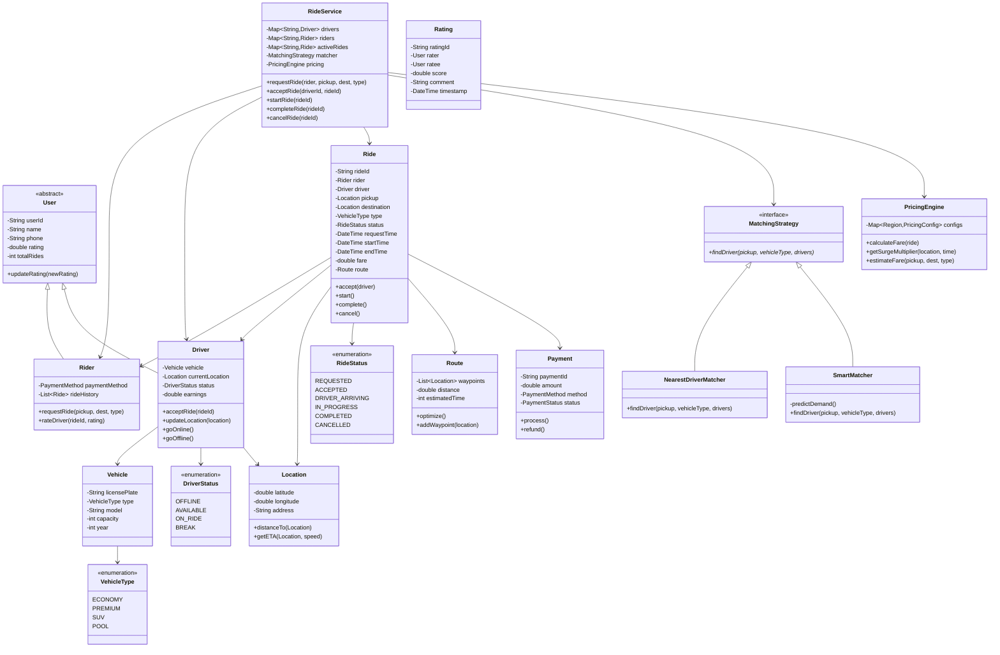

# Uber/Ride-Sharing App - Object-Oriented Design

**Difficulty:** Advanced
**Interview Frequency:** Very High
**Key Concepts:** Real-time Matching, Geolocation, Pricing, State Management
**Companies:** Uber, Lyft, Ola, Grab, DoorDash, Instacart
**Estimated Interview Time:** 50-60 minutes

---

## Problem Statement

Design a ride-sharing platform supporting:
- Rider and driver management
- Real-time driver-rider matching
- Location tracking and routing
- Dynamic pricing (surge)
- Multiple ride types (UberX, Pool, XL)
- Ride lifecycle management
- Rating system
- Payment processing

**Interview Context:** This bridges OOD and system design. Tests understanding of real-time systems, geospatial algorithms, state machines, and pricing strategies.

---

## Requirements

### Functional
1. **User Management:** Riders and drivers with profiles
2. **Ride Request:** Request ride with pickup/destination
3. **Matching:** Find nearest available driver
4. **Tracking:** Real-time location updates
5. **Pricing:** Calculate fare, surge pricing
6. **Ride States:** Requested → Accepted → Started → Completed
7. **Ratings:** Riders rate drivers, drivers rate riders
8. **Payment:** Process payments, split fares

### Non-Functional
1. **Low Latency:** Match driver in < 5 seconds
2. **Scalability:** Millions of concurrent users
3. **Availability:** 99.99% uptime
4. **Accuracy:** Precise location tracking
5. **Security:** Secure payments, user data

---

## Core Concepts

### 1. Ride States

```
REQUESTED → ACCEPTED → DRIVER_ARRIVING → IN_PROGRESS → COMPLETED
    ↓           ↓              ↓                ↓
CANCELLED   CANCELLED      CANCELLED        CANCELLED
```

### 2. Driver Matching Algorithm

**Factors:**
- Distance to rider (primary)
- Driver rating
- Vehicle type match
- Driver acceptance rate
- Estimated time of arrival (ETA)

**Algorithm:**
```
1. Get rider location
2. Query drivers within radius (e.g., 5km)
3. Filter by vehicle type, availability
4. Sort by distance ascending
5. Send request to closest driver
6. If declined, try next driver
7. Expand radius if no drivers found
```

### 3. Pricing Components

| Component | Formula | Example |
|-----------|---------|---------|
| **Base Fare** | Fixed | $2.50 |
| **Per Mile** | distance × rate | 10mi × $1.50 = $15 |
| **Per Minute** | time × rate | 20min × $0.30 = $6 |
| **Surge Multiplier** | subtotal × surge | $23.50 × 1.5 = $35.25 |
| **Booking Fee** | Fixed | $2.00 |
| **Total** | Sum | $37.25 |

**Surge Pricing Triggers:**
- High demand / low supply ratio
- Special events, peak hours
- Weather conditions

---

## Class Diagram



---

## Design Patterns

### 1. State Pattern (Ride Lifecycle)
- Different behavior for each ride state
- Clear state transitions
- Prevent invalid operations

### 2. Strategy Pattern (Matching & Pricing)
- Different matching algorithms (nearest, predictive)
- Different pricing models (fixed, surge, pool)
- Switchable at runtime

### 3. Observer Pattern (Location Updates)
- Riders observe driver location
- Backend observes all driver locations
- Real-time notifications

### 4. Factory Pattern (Ride Types)
- Create different ride types (Economy, Premium, Pool)
- Each with specific pricing and matching

### 5. Command Pattern (Ride Actions)
- Encapsulate ride operations (accept, start, complete)
- Support undo (cancellation)
- Audit trail

---

## Key Components

### 1. Geospatial Matching

**Naive Approach (O(n)):**
```
For each available driver:
    Calculate distance to rider
Return closest driver
```

**Optimized Approach (Geohash/QuadTree):**
```
1. Partition map into grid cells
2. Index drivers by geohash
3. Query nearby cells
4. Calculate distance only for nearby drivers
Time: O(log n) query + O(k) distance calculations
```

**Geohash Example:**
- Rider at (37.7749, -122.4194) → geohash "9q8yy"
- Query drivers with prefix "9q8" (nearby area)
- Much faster than scanning all drivers

### 2. Dynamic Pricing

**Surge Multiplier Calculation:**
```
demand = active ride requests
supply = available drivers
ratio = demand / supply

if ratio > 2.0:
    surge = 2.0
elif ratio > 1.5:
    surge = 1.5
elif ratio > 1.2:
    surge = 1.3
else:
    surge = 1.0
```

**Factors:**
- Demand/supply ratio
- Time of day (peak hours)
- Events (concerts, sports)
- Weather (rain, snow)
- Historical patterns

### 3. ETA Calculation

**Simple:**
```
distance = calculateDistance(driver, rider)
speed = averageSpeed (e.g., 30 mph in city)
ETA = distance / speed
```

**Advanced:**
```
Route = getOptimalRoute(driver, rider) // Google Maps API
ETA = route.duration // Considers traffic, road conditions
```

---

## Implementation Approach

### Phase 1: Core Entities (10 min)
1. User, Rider, Driver classes
2. Location, Vehicle classes
3. Ride with basic states

### Phase 2: Matching (15 min)
1. Find nearest driver algorithm
2. MatchingStrategy interface
3. Filter by vehicle type, availability

### Phase 3: Ride Lifecycle (15 min)
1. State transitions (requested → completed)
2. Accept, start, complete methods
3. Cancellation handling

### Phase 4: Pricing (10 min)
1. Base fare calculation
2. Surge pricing logic
3. Estimate vs actual fare

### Phase 5: Advanced (10 min)
1. Rating system
2. Payment processing
3. Real-time location updates

---

## Trade-offs & Considerations

### 1. Matching Algorithm

| Approach | Pros | Cons | Best For |
|----------|------|------|----------|
| **Nearest driver** | Simple, fast | May not be optimal | Low density |
| **Predictive** | Optimizes for future | Complex, ML needed | High density |
| **Auction-based** | Market-driven | Slower, complex | Peak times |

### 2. Location Updates

| Frequency | Pros | Cons |
|-----------|------|------|
| **Every second** | Very accurate | High bandwidth |
| **Every 5 seconds** | Balanced | Acceptable |
| **Every 10 seconds** | Low bandwidth | Less accurate |

**Recommendation:** Adaptive - more frequent during ride, less when idle

### 3. Surge Pricing

| Strategy | Description | User Impact |
|----------|-------------|-------------|
| **Transparent** | Show multiplier | May deter riders |
| **Hidden** | Just show price | Better conversion |
| **Capped** | Max 3x surge | Limits revenue |

---

## Common Pitfalls

### 1. Not Handling Driver Rejection
❌ Assume first driver accepts
✅ Loop through drivers, handle rejection timeout

### 2. Ignoring Concurrent Requests
❌ Assign same driver to multiple riders
✅ Atomic driver status updates, optimistic locking

### 3. Hardcoded Pricing
❌ `fare = distance * 1.5`
✅ Configurable pricing by region, vehicle type

### 4. Not Validating Location Updates
❌ Accept any location from driver
✅ Validate reasonable movement (prevent spoofing)

### 5. Forgetting Edge Cases
❌ Don't handle no drivers available
✅ Queue request, notify when driver available, suggest alternatives

---

## Follow-up Questions

### Easy
1. **Q:** How would you add ride scheduling (book for future)?
   - **A:** ScheduledRide with futureTime, cron job to activate at scheduled time

2. **Q:** How would you implement ride sharing (UberPool)?
   - **A:** PoolRide with multiple riders, optimize route for all pickups/dropoffs

3. **Q:** How would you add favorite locations?
   - **A:** SavedLocation list in Rider profile, quick selection

### Medium
4. **Q:** How would you implement driver heat maps?
   - **A:** Aggregate demand/supply by geohash, visualize high-demand areas, incentivize drivers

5. **Q:** How would you handle split payments?
   - **A:** RideSplit class, multiple payers, divide fare by proportion or equally

6. **Q:** How would you add tipping?
   - **A:** Tip class, optional after ride, percentage or fixed amount, goes to driver earnings

7. **Q:** How would you implement referral system?
   - **A:** ReferralCode class, track referrer/referee, credit both accounts after conditions met

### Hard
8. **Q:** How would you scale to millions of concurrent users?
   - **A:** Microservices (matching, pricing, tracking), sharding by geography, caching, load balancing

9. **Q:** How would you optimize driver positioning (send drivers to predicted demand)?
   - **A:** ML model predicts demand by location/time, incentivize drivers to move to high-demand areas

10. **Q:** How would you handle fraud detection?
    - **A:** Anomaly detection (unusual routes, fake GPS), driver verification, payment validation, ML models

11. **Q:** How would you implement real-time ETAs that update during the ride?
    - **A:** Integrate traffic APIs (Google Maps, Waze), recalculate ETA every minute, notify if significant change

12. **Q:** How would you design for multi-city operation?
    - **A:** City/Region entity, partition data by city, city-specific pricing, regulatory compliance per region

---

## System Design Considerations

### Scalability
- **Horizontal scaling:** Partition by geography
- **Database:** Sharding by city/region
- **Caching:** Redis for active rides, driver locations
- **Message queues:** Kafka for location updates

### Real-Time Requirements
- **WebSockets:** For live location tracking
- **Geospatial index:** PostGIS, MongoDB geospatial
- **Stream processing:** Kafka Streams for location events

### Data Consistency
- **Eventual consistency:** For driver locations (acceptable)
- **Strong consistency:** For ride status, payments (critical)
- **Distributed transactions:** Saga pattern for multi-step operations

---

## Key Takeaways

### ✅ What Interviewers Look For
1. **Geospatial matching** - understand proximity algorithms
2. **State management** - clear ride lifecycle
3. **Real-time updates** - location tracking approach
4. **Pricing logic** - surge pricing factors
5. **Scalability** - handle millions of users

### 📋 Interview Strategy
1. **Clarify (5 min):** Core features? Scale? Real-time tracking?
2. **Design (15 min):** Core classes, state machine, matching
3. **Implement (25 min):** Ride flow, matching, pricing
4. **System Design (15 min):** Scalability, geospatial, real-time

### 🎯 Time Management

| Time | Focus | Priority |
|------|-------|----------|
| 0-5 min | Requirements | Critical |
| 5-20 min | OOD (classes, patterns) | Critical |
| 20-45 min | Implementation (matching, pricing) | Critical |
| 45-60 min | System design, scalability | High |

---

**Pro Tip:** This problem tests both OOD and system design. Start with clean OOD (classes, state machine), then discuss system design aspects (geospatial indexing, real-time updates, scaling). Mention real-world concerns like fraud detection, driver safety, and regulatory compliance. Always discuss the trade-off between matching speed and optimality!
